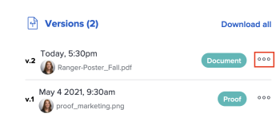

# Ver versiones de revisión

Puede ver las versiones anteriores de una prueba.

## Requisitos de acceso

+++ Expanda para ver los requisitos de acceso para la funcionalidad en este artículo.

<table style="table-layout:auto"> 
 <col> 
 <col> 
 <tbody> 
  <tr> 
   <td role="rowheader">paquete de Adobe Workfront</td> 
   <td> 
Cualquiera
 </td> 
  </tr> 
  <tr> 
   <td role="rowheader">Licencia de Adobe Workfront</td> 
   <td> 
   
Estándar

   
Trabajo o plan

   </td> 
  </tr> 
  <tr> 
   <td role="rowheader">Perfil de permiso de prueba </td> 
   <td>Administrador o superior</td> 
  </tr> 
  <tr> 
   <td role="rowheader">Configuraciones de nivel de acceso</td> 
   <td> 
Acceso de edición a documentos
 </td> 
  </tr> 
 </tbody> 
</table>

Para obtener más información, consulte [Requisitos de acceso en la documentación de Workfront](/help/quicksilver/administration-and-setup/add-users/access-levels-and-object-permissions/access-level-requirements-in-documentation.md).

+++

## Ver una lista de todas las versiones de prueba

1. Vaya a la lista Documento y seleccione la prueba.
1. En el resumen, desplácese hasta la sección **Todas las versiones**. Aquí puede ver todas las versiones de la prueba.

   

## Previsualizar una versión anterior de la revisión

Los archivos que no se pueden previsualizar (como XLSX y DOC) se descargan.

1. Vaya a la lista de documentos y seleccione una prueba.
1. En el resumen, desplácese hacia abajo hasta **Versiones**, haga clic en el menú **Más** y, a continuación, seleccione **Vista previa**.

   

## Ver una versión anterior de la revisión

Cualquier usuario de Workfront con acceso de visualización del documento puede ver las versiones anteriores de un documento revisado. No es necesario que el usuario tenga una licencia de revisión.

1. Vaya al proyecto, tarea o problema que contiene el documento y, a continuación, seleccione **Documentos**.
1. Encuentre la prueba que necesita.
1. En el resumen, desplácese hacia abajo hasta **Versiones**, haga clic en el menú **Más** y, a continuación, seleccione **Abrir revisión**.

   
