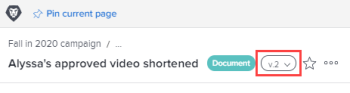

# Ver y administrar detalles de la versión de prueba

Puede ver y administrar los detalles de la prueba.

## Requisitos de acceso

+++ Expanda para ver los requisitos de acceso para la funcionalidad en este artículo.

<table style="table-layout:auto"> 
 <col> 
 <col> 
 <tbody> 
  <tr> 
   <td role="rowheader">Paquete de Adobe Workfront</td> 
   <td> 
Cualquiera
 </td> 
  </tr> 
  <tr> 
   <td role="rowheader">Licencia de Adobe Workfront</td> 
   <td> 
   
Estándar

   
Trabajo o plan
 
   </td> 
  </tr> 
  <tr> 
   <td role="rowheader">Perfil de permiso de prueba </td> 
   <td>Administrador o superior</td> 
  </tr> 
  <tr> 
   <td role="rowheader">Configuraciones de nivel de acceso</td> 
   <td> 
Acceso de edición a documentos
 </td> 
  </tr> 
 </tbody> 
</table>

Para obtener más información, consulte [Requisitos de acceso en la documentación de Workfront](/help/quicksilver/administration-and-setup/add-users/access-levels-and-object-permissions/access-level-requirements-in-documentation.md).

+++

## Ver y administrar detalles de una versión de prueba anterior

1. En una lista de documentos, pase el puntero por encima de la fila que contiene la prueba y haga clic en **Detalles del documento**.
1. Cerca de la parte superior de la página Detalles del documento, haga clic en el menú desplegable situado junto al nombre y, a continuación, haga clic en el nombre de la versión que desee ver y administrar.

   

   Además de ver los detalles de la versión, puede realizar cambios en la versión, como el nombre, los metadatos y la configuración de la revisión (si es una revisión de documento).

## Ver los detalles de revisión de una versión anterior

Los usuarios deben tener una licencia de revisión para poder ver los detalles de revisión de una versión anterior de un documento revisado.

1. Vaya al proyecto, tarea o problema que contiene el documento y, a continuación, seleccione **Documentos**.
1. Encuentre la prueba que necesita.
1. En el área **Versión** del resumen, haga clic en la versión y, a continuación, haga clic en **Detalles** en la lista desplegable que aparece.

1. En la página Detalles del documento, haga clic en **Flujo de trabajo de la corrección** en el panel izquierdo para realizar una de las siguientes acciones:

   * Añada un flujo de trabajo automatizado. Para obtener más información, consulte la sección en el artículo .
   * Comparta la URL pública de la prueba. Para obtener más información, consulte [Compartir un vínculo de prueba](../../../../review-and-approve-work/proofing/managing-proofs-within-workfront/share-a-proof-in-workfront.md#share) en [Compartir una prueba en Adobe Workfront](../../../../review-and-approve-work/proofing/managing-proofs-within-workfront/share-a-proof-in-workfront.md).
   * Vea toda la actividad que se ha producido en la prueba.
   * Envíe mensajes de recordatorio a los revisores de la prueba.

1. Haga clic en **Listo**.
