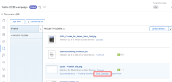

# Imprimir un resumen de la prueba en Adobe Workfront

Puede imprimir un resumen de la prueba, guardarlo como PDF o exportarlo como archivo XLS o archivo PDF optimizado para Adobe Reader.

## Requisitos de acceso

Debe tener el siguiente acceso para realizar los pasos de este artículo:

<table style="table-layout:auto"> 
 <col> 
 <col> 
 <tbody> 
  <tr> 
   <td role="rowheader">plan de Adobe Workfront*</td> 
   <td> 
Plan actual: Pro o superior
 
o
 
Plan heredado: Select o Premium
 
Para obtener más información sobre la prueba de acceso con los diferentes planes, consulte <a href="/help/quicksilver/administration-and-setup/manage-workfront/configure-proofing/access-to-proofing-functionality.md" class="MCXref xref">Acceso a la funcionalidad de pruebas en Workfront</a>.
 </td> 
  </tr> 
  <tr> 
   <td role="rowheader">Licencia de Adobe Workfront*</td> 
   <td> 
Plan actual: Trabajo o plan
 
Plan heredado: Cualquiera (debe tener las pruebas habilitadas para el usuario)
 </td> 
  </tr> 
  <tr> 
   <td role="rowheader">Perfil de permiso de revisión </td> 
   <td>Administrador o superior</td> 
  </tr> 
  <tr> 
   <td role="rowheader">Configuraciones de nivel de acceso*</td> 
   <td> 
Editar acceso a documentos
 
Nota: Si todavía no tiene acceso, pregunte a su administrador de Workfront si establece restricciones adicionales en su nivel de acceso. Para obtener información sobre cómo un administrador de Workfront puede modificar su nivel de acceso, consulte <a href="../../../administration-and-setup/add-users/configure-and-grant-access/create-modify-access-levels.md" class="MCXref xref">Crear o modificar niveles de acceso personalizados</a>.
 </td> 
  </tr> 
 </tbody> 
</table>

&#42;Para averiguar qué plan, función o perfil de permiso de prueba tiene, póngase en contacto con el administrador de Workfront o Workfront Proof.

## Imprima un resumen de la prueba o guárdelo como un archivo PDF

Puede imprimir un resumen de la prueba directamente desde la lista de documentos.

>[!NOTE]
>
>No se pueden imprimir varios resúmenes de prueba de la lista de documentos al mismo tiempo.

1. En la lista del documento que contiene la prueba, pase el ratón sobre la fila que contiene el documento y haga clic en **Imprimir resumen**.

   

   O

   Mientras visualiza la prueba en el visor de pruebas, haga clic en el botón **Imprimir** icono  en la barra de herramientas izquierda. (Si la barra de herramientas izquierda no está visible, haga clic en el icono Menú .  en la esquina superior izquierda del visor de pruebas).

1. Utilice cualquiera de las siguientes opciones:

   <table style="table-layout:auto"> 
    <col> 
    <col> 
    <tbody> 
     <tr> 
      <td role="rowheader">Mostrar</td> 
      <td> 
Especifique lo que desea imprimir:
 
       <ul> 
        <li>La variable <strong>Versión actual</strong> o <strong>Todas las versiones</strong> de la prueba</li> 
        <li>Solo el <strong>Páginas con comentarios</strong> o <strong>Todas las páginas</strong></li> 
        <li>Solo el <strong>Miniaturas de página</strong> (una pequeña renderización de cada página) o <strong>Páginas completas</strong> (una presentación completa de la prueba) </li> 
        
Nota: Para ver los números de pin en el marcado de la salida impresa, debe seleccionar Páginas completas, no Miniaturas de página. 
 
       </ul> </td> 
     </tr> 
     <tr> 
      <td role="rowheader">Ordenar comentarios por</td> 
      <td> 
(Disponible solo si seleccionó Miniaturas de página arriba) Especifique el orden en que desea que se impriman los comentarios de la prueba:
 
       <ul> 
        <li><strong>Oldest</strong>: Desde el primer comentario realizado hasta el último</li> 
        <li><strong>Última</strong>: Desde el último comentario realizado al principio</li> 
        <li><strong>Página</strong>: Por página, de la primera página a la última o de la última página a la primera</li> 
        <li><strong>Creador</strong>: Por los nombres de los usuarios que los agregaron, de A-Z o de Z-A</li> 
       </ul> 
Estas opciones no afectan a la salida que exporta como archivo XLS o PDF.
 </td> 
     </tr> 
     <tr> 
      <td role="rowheader">Filtre comentarios por</td> 
      <td> 
Puede utilizar cualquier combinación de estas opciones para incluir solo ciertos comentarios en la salida que imprima o exporte como archivo XLS o PDF:
 
       <ul> 
        <li>Autores que seleccione (predeterminado)</li> 
        <li>Acciones que seleccione</li> 
        <li><strong>Sin resolver</strong> status</li> 
       </ul> </td> 
     </tr> 
     <tr> 
      <td role="rowheader">Flujo de trabajo</td> 
      <td> 
(Disponible solo si la prueba tiene un flujo de trabajo automatizado) Puede hacer clic en <strong>Mostrar diagrama</strong> para incluir un diagrama en la salida impresa que muestre las fases de la prueba y las decisiones tomadas en cada fase. En el diagrama que aparece, los colores representan las decisiones tomadas en un escenario:
 
<strong>Verde</strong>: Aprobado
 
<strong>Azul</strong>: Pendiente de decisión
 
<strong>Rojo</strong>: Cambios necesarios para la decisión
 
<strong>Gris</strong>: Aún no se ha iniciado
 
<strong>Amarillo</strong>: Aprobado con cambios
 </td> 
     </tr> 
    </tbody> 
   </table>

1. Haga clic en **Imprimir**.
1. En el panel derecho de la ventana que aparece, si desea imprimir el resumen, haga clic en el botón **Destino** a continuación, haga clic en **Más información**. Haga clic en la impresora que desee utilizar en la lista que aparece y, a continuación, haga clic en **Imprimir**.

   O

   Si desea guardar el resumen como un archivo de PDF, haga clic en la **Destino** , haga clic en **Guardar como PDF** y haga clic en **Guardar**.

## Exportar un resumen de la prueba como un XLS o un PDF

Puede exportar un resumen de la prueba para contenido estático como archivo XLS o como archivo PDF. Las exportaciones de prueba incluyen solo el contenido de la prueba.

1. En la lista del documento que contiene la prueba, pase el ratón sobre la fila que contiene el documento y haga clic en **Imprimir resumen**.

   

1. Haga clic en el icono XLS o en el PDF situado cerca de la esquina superior derecha de la página.

   

Cuando el archivo exportado esté listo, recibirá un correo electrónico desde el que podrá descargar el archivo.

Si ha exportado el resumen como archivo de PDF, los comentarios de la prueba aparecen en el lector de PDF. Si un comentario tiene varias marcas asociadas, el comentario aparecerá varias veces en la lista de comentarios (una vez por cada marcado).
