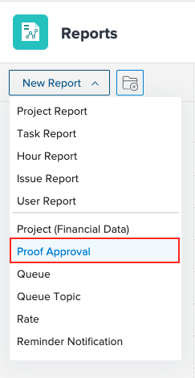

# Usar el informe de aprobación de revisión

Puede utilizar el informe de aprobación de revisión para ver información sobre las pruebas en su entorno.

## Requisitos de acceso

+++ Expanda para ver los requisitos de acceso para la funcionalidad en este artículo.

<table style="table-layout:auto"> 
 <col> 
 <col> 
 <tbody> 
  <tr> 
   <td role="rowheader"> 
paquete de Workfront
 </td> 
   <td>Cualquiera</td> 
  </tr> 
  <tr> 
   <td role="rowheader"> 
Licencia de Adobe Workfront
 </td> 
   <td> 
   
Estándar

   
Plan

   </td> 
  </tr> 
  <tr data-mc-conditions=""> 
   <td role="rowheader"><strong>Configuración del nivel de acceso</strong> </td> 
   <td> 
Acceso de edición a:
 
    <ul> 
     <li> 
Creación de informes, paneles de control y calendarios
 </li> 
     <li> 
Creación de filtros, vistas y agrupaciones
 </li> 
    </ul> </td> 
  </tr> 
 </tbody> 
</table>

Para obtener más información, consulte [Requisitos de acceso en la documentación de Workfront](/help/quicksilver/administration-and-setup/add-users/access-levels-and-object-permissions/access-level-requirements-in-documentation.md).

+++

## Usar el informe de aprobación de revisión

{{step1-to-reports}}

1. Haga clic en **Nuevo informe** y desplácese hasta seleccionar **Aprobación de revisión**.

   

1. (Opcional) Añada cualquier campo adicional.
1. Haga clic en **Guardar + Cerrar**.

## Campos adicionales

Puede añadir los siguientes campos al informe de aprobación de revisión:

* **Fecha de decisión**: muestra la fecha en la que un aprobador toma una decisión sobre una prueba. También puede encontrar esta fecha en el Resumen de impresión de la prueba.
* **Fase de aprobación**: muestra la información de la fase actual.
* **Plantilla de flujo de trabajo**: muestra todas las plantillas de flujo de trabajo adjuntas a la prueba. Si no hay ninguna plantilla adjunta, la columna está en blanco.
* **Esperando decisión**: muestra true para indicar que no se ha cumplido una decisión en la última versión cuando se cumplen los siguientes criterios:

   * No se ha archivado la prueba
   * La fase en la que se encuentra el aprobador está activa
   * La prueba está pendiente de aprobación

* **Fecha límite de la revisión**: muestra la fecha límite de la revisión. Cada etapa debe tener una fecha límite asignada para que se rellene este campo. El campo muestra la fecha límite de la etapa activada más recientemente.

 
