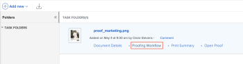

# Envío de mensajes de correo electrónico a los revisores como prueba

Durante el proceso de revisión y aprobación, puede enviar un mensaje a uno o a todos los revisores de una prueba. Los mensajes son una forma sencilla de recordar a los revisores que completen su revisión de una prueba o que proporcionen otra información relacionada con ella.

Puede elegir entre enviar un correo electrónico recordatorio genérico o enviar un mensaje personalizado a uno o todos los usuarios asociados a un escenario determinado.

## Requisitos de acceso

Debe tener el siguiente acceso para realizar los pasos de este artículo:

<table style="table-layout:auto"> 
 <col> 
 <col> 
 <tbody> 
  <tr> 
   <td role="rowheader">plan de Adobe Workfront*</td> 
   <td> 
Plan actual: Pro o superior
 
o
 
Plan heredado: Select o Premium
 
Para obtener más información sobre la prueba de acceso con los diferentes planes, consulte <a href="/help/quicksilver/administration-and-setup/manage-workfront/configure-proofing/access-to-proofing-functionality.md" class="MCXref xref">Acceso a la funcionalidad de pruebas en Workfront</a>.
 </td> 
  </tr> 
  <tr> 
   <td role="rowheader">Licencia de Adobe Workfront*</td> 
   <td> 
Plan actual: Trabajo o plan
 
Plan heredado: Cualquiera (debe tener las pruebas habilitadas para el usuario)
 </td> 
  </tr> 
  <tr> 
   <td role="rowheader">Perfil de permiso de revisión </td> 
   <td>Administrador o superior</td> 
  </tr> 
  <tr> 
   <td role="rowheader">Función de prueba</td> 
   <td>Autor o moderador</td> 
  </tr> 
  <tr> 
   <td role="rowheader">Configuraciones de nivel de acceso*</td> 
   <td> 
Editar acceso a documentos
 
Nota: Si todavía no tiene acceso, pregunte a su administrador de Workfront si establece restricciones adicionales en su nivel de acceso. Para obtener información sobre cómo un administrador de Workfront puede modificar su nivel de acceso, consulte <a href="../../../administration-and-setup/add-users/configure-and-grant-access/create-modify-access-levels.md" class="MCXref xref">Crear o modificar niveles de acceso personalizados</a>.
 </td> 
  </tr> 
 </tbody> 
</table>

&#42;Para averiguar qué plan, función o perfil de permiso de prueba tiene, póngase en contacto con el administrador de Workfront o Workfront Proof.

## Envío de mensajes de correo electrónico a los usuarios mediante una prueba

1. Busque el documento para la prueba que contiene los usuarios a los que desea enviar el mensaje.
1. Pase el ratón sobre el documento y haga clic en **Flujo de trabajo de prueba**.

   

1. Para enviar un mensaje a todos los usuarios del escenario, haga clic en el botón **Más** en el escenario y seleccione **Mensaje todo**.

   

1. Para enviar un mensaje a un usuario individual, haga clic en el botón **Más** junto al usuario y seleccione **Mensaje**.

   

1. En el **Detalles del mensaje** especifique la siguiente información:

   <table style="table-layout:auto"> 
    <col> 
    <col> 
    <tbody> 
     <tr> 
      <td role="rowheader">Notificar a las personas por correo electrónico</td> 
      <td>No se puede anular la selección de esta opción. Todos los usuarios reciben el mensaje por correo electrónico.</td> 
     </tr> 
     <tr> 
      <td role="rowheader">Descartar mensaje personalizado</td> 
      <td> 
Haga clic en <strong>Descartar mensaje personalizado</strong> si desea incluir solo el contenido de correo electrónico predeterminado.
 
El correo electrónico del recordatorio predeterminado incluye la siguiente información:
 
       <ul> 
        <li>Enlace personal a la prueba Miniatura de la imagen de prueba </li> 
        <li>Los siguientes detalles de la prueba: Nombre de la prueba, número de versión, nombre de la carpeta (si corresponde) y una lista de los revisores y su progreso en la prueba.</li> 
       </ul> </td> 
     </tr> 
     <tr> 
      <td role="rowheader">Asunto</td> 
      <td>Escriba el asunto del mensaje.</td> 
     </tr> 
     <tr> 
      <td role="rowheader">Mensaje</td> 
      <td>Escriba el contenido del mensaje.</td> 
     </tr> 
    </tbody> 
   </table>

1. Haga clic en **Enviar.**
