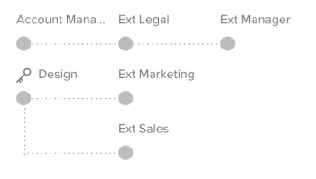
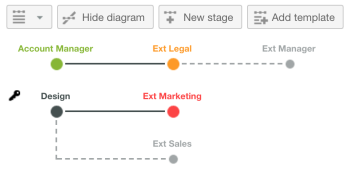

# Información general sobre flujos de trabajo automatizados

<!-- Audited: 01/2024 -->

Los flujos de trabajo automatizados le permiten crear una serie de fases de revisión secuenciales o paralelas, establecer dependencias entre estas fases y limitar su visibilidad a determinados usuarios. Si hay fases interdependientes en el proceso de revisión, los flujos de trabajo automatizados mueven la prueba por las etapas automáticamente, notificándoselo a los revisores y aprobadores correspondientes a lo largo del proceso. Para obtener información sobre la configuración de un flujo de trabajo automatizado, consulte [Crear una revisión avanzada con un flujo de trabajo automatizado](../../../review-and-approve-work/proofing/creating-proofs-within-workfront/create-automated-proof-workflow.md).

**Ejemplos:** los flujos de trabajo automatizados le ayudan a administrar procesos de revisión de pruebas complejos como los siguientes:

* Cuando distintos grupos o revisores necesitan revisar el contenido en un orden determinado
* Cuando hay dependencias entre la actividad de los usuarios cuando revisan el contenido
* Cuando el contenido lo revisan regularmente los mismos grupos de personas
* Cuando desea controlar el período de tiempo en el que los revisores ven el contenido
* Si desea que alguna actividad de revisión sea privada

## Fases

Para cada fase del flujo de trabajo automatizado, puede configurar opciones como una fecha límite de la fase, un bloqueo en una fase, un revisor establecido como responsable de la toma de decisiones de la fase y una configuración de privacidad que permita que solo determinadas personas vean los comentarios del revisor en la fase.

Las fases se pueden activar manualmente, al crear la prueba, al alcanzar una fecha límite, en una fecha y hora específicas o cuando se toma una decisión en la fase principal.

Las fases se pueden bloquear manualmente, así como cuando comience la siguiente fase o cuando se tomen todas las decisiones de la fase. También puede optar por no bloquear nunca una fase.

Puede designar un responsable principal de la toma de decisiones de una fase. La decisión de esta persona hace que todas las demás decisiones de la fase sean innecesarias.

Del mismo modo, puede elegir que solo se requiera una decisión para una fase. Si lo hace, el proceso de revisión de la fase se marcará como completado después de que cualquiera de las personas destinatarias tome su decisión de la fase.

Puede hacer que todos los revisores reciban una notificación sobre la invitación para revisar el contenido cuando comience el proceso de revisión, o bien puede hacer que cada revisor reciba una notificación solo cuando se active su fase.

## Fases privadas

De forma predeterminada, los comentarios que realizan los revisores en todas las fases son visibles para todas las personas que revisan el contenido y reciben notificaciones por correo electrónico y resúmenes de comentarios sobre el proceso de revisión.

Si desea evitar que determinados grupos de revisores vean los comentarios de otros revisores, puede crear fases privadas.

Las fases privadas solo son visibles para los revisores añadidos a esas fases. También son visibles para los usuarios que tienen derechos de edición sobre la prueba o derechos de edición en todos los elementos creados en la cuenta de Adobe Workfront de su organización (Supervisor y superior, o usuarios con perfiles personalizados para los que está habilitada la edición de información de otras personas).

Los comentarios añadidos por los participantes de la fase privada no se incluyen en las notificaciones por correo electrónico ni en los resúmenes de los comentarios de la prueba solicitados por cualquier persona que no tenga los derechos para verlos.

## Diagrama de flujo de trabajo

El diagrama de flujo de trabajo es una representación visual del proceso de revisión de la prueba. Muestra el orden de las fases y las dependencias entre fases a medida que crea o visualiza los detalles de una prueba. Cualquier etapa privada se muestra con un símbolo de llave.

En las pruebas activas, las dependencias de escenario se muestran con una línea gris discontinua para las etapas inactivas o una línea negra continua para las etapas activas. Las fases se muestran en verde si el proceso de aprobación se completó dentro de su fecha límite especificada. Las fases que se acercan a sus fechas límite se muestran en naranja y las que ya han pasado se muestran en rojo.

## Plantillas de flujo de trabajo automatizado

Si su organización utiliza el mismo proceso de revisión para varias pruebas, su administrador de Workfront puede crear plantillas de flujo de trabajo automatizado para facilitar en gran medida la creación de pruebas. Puede elegir una plantilla de flujo de trabajo automatizado mientras configura una prueba para añadir las fases y los revisores de esa plantilla a la prueba. Puede modificar la plantilla aplicada a la prueba según sea necesario antes y después de crearla.

El administrador de Workfront puede crear un número ilimitado de plantillas según las necesidades de la compañía.

Para obtener más información sobre la creación, utilización y administración de plantillas, consulte con el administrador de Workfront.
