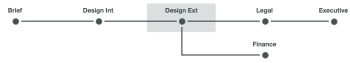
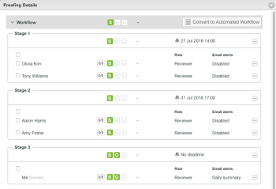

# Información general sobre las fases del flujo de trabajo automatizado

Las fases de prueba son segmentos de tiempo en los que diferentes usuarios revisan una prueba. A medida que la prueba pasa de un paso al siguiente, Adobe Workfront notifica a los revisores que les indiquen cuándo es el momento de trabajar en ella.

Las fases se producen en dos situaciones diferentes:

* [Crear una revisión con un flujo de trabajo automatizado](#create-a-proof-with-an-automated-workflow)
* [Asignar fechas límite para diferentes revisores en una prueba](#assign-deadlines-for-different-reviewers-on-a-proof)

## Creación de una prueba con un flujo de trabajo automatizado {#create-a-proof-with-an-automated-workflow}

Al añadir un flujo de trabajo automatizado a una prueba, se configuran las fases del trabajo de revisión que desea que se produzcan.

Al configurar fases para una prueba con un flujo de trabajo automático:

* Puede configurar las fases para que se ejecuten de forma consecutiva o simultánea.
* Puede configurar algunas fases para que se activen solo después de completar una fase anterior.
* Puede hacer que algunas etapas sean privadas. Esto resulta útil, por ejemplo, para una agencia que revisa una prueba antes de compartirla con un cliente y no desea que los comentarios resultantes sean visibles para el cliente.

Para obtener instrucciones sobre cómo crear fases para una prueba con un flujo de trabajo automatizado, consulte [Crear una prueba avanzada con un flujo de trabajo automatizado](../../../review-and-approve-work/proofing/creating-proofs-within-workfront/create-automated-proof-workflow.md).

>[!NOTE]
>
>Si un usuario no está incluido en ninguna fase pero tiene acceso al documento y abre la prueba, el sistema crea una fase llamada *Workfront*.
>
>Al usuario que abrió la prueba se le asigna la función especificada en Configuración > Revisión y aprobación > Funciones para los no destinatarios que abren una prueba de documento.

## Asignar fechas límite para diferentes revisores en una prueba {#assign-deadlines-for-different-reviewers-on-a-proof}

Al asignar diferentes fechas límites de revisión a los revisores en una prueba, el sistema crea una etapa para cada fecha límite y agrupa a los revisores para cada fecha límite en la etapa correspondiente. 

**Ejemplo:** Por ejemplo, si crea una prueba con cuatro revisores:

* Para los revisores Olivia y Tony, especifique un plazo para las 14:00 en unos días a partir de ahora.
* Para Aaron y Amy, especifique un plazo para las 17:00 unos días después.
* No especificas una fecha límite para ti mismo.

El sistema crea una fase para cada uno de estos tres &quot;grupos&quot; de revisores:

Si comparte la revisión con otro revisor y no especifica una fecha límite, Workfront añade el usuario a la fase 3, en la que no hay fecha límite. 
