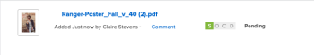

# Resumen del progreso y estado de la prueba

Puede ver información sobre cómo avanza una prueba a través del proceso de revisión y ver un resumen general del estado de decisión de la prueba desde el área Documentos.

## Resumen del progreso de la prueba

El progreso de la prueba indica el trabajo realizado en una prueba desde el momento en que se envía la prueba a los destinatarios hasta el momento en que toman una decisión sobre la prueba. Los iconos de progreso, S, O, C y D, aparecen junto al nombre de la prueba y proporcionan información sobre el progreso de la misma.

<table style="table-layout:auto"> 
 <col> 
 <col> 
 <thead> 
  <tr> 
   <td> 
<strong>Icono de progreso</strong> 
 </td> 
   <td> 
<strong>Descripción</strong> 
 </td> 
  </tr> 
 </thead> 
 <tbody> 
  <tr> 
   <td> 
  
 
<strong>Se envió</strong> 
 </td> 
   <td> 
La prueba se ha enviado a los destinatarios asignados.
 </td> 
  </tr> 
  <tr> 
   <td> 
<strong></strong> 
 
<strong>Se abrió</strong> 
 </td> 
   <td> 
Todos los destinatarios asignados abren la página de detalles de prueba o prueba .
 </td> 
  </tr> 
  <tr> 
   <td> 
<strong></strong> 
 
<strong>Observaciones</strong> 
 </td> 
   <td> 
Todos los destinatarios asignados realizan al menos un comentario en la prueba.
 
Si no hay revisores asignados a la prueba, la variable <strong>C</strong> no aparece en la barra de progreso.
 </td> 
  </tr> 
  <tr> 
   <td> 
  
 
<strong>Decisión</strong> 
 </td> 
   <td> 
Todos los aprobadores asignados toman una decisión sobre la prueba, Todos los aprobadores asignados toman una decisión sobre la prueba, a menos que el creador de la prueba especifique que solo se necesita una decisión.
 
Si no hay aprobadores (responsables de la toma de decisiones) designados para la prueba, la variable <strong>D</strong> no aparece en la barra de progreso. 
 </td> 
  </tr> 
 </tbody> 
</table>

Los iconos de progreso pueden aparecer en los colores siguientes para indicar cierta información sobre el progreso de la prueba:

* **Verde**: Completado.
* **Blanco**: No completado.
* **Naranja**: no completado y la fecha límite es inferior a 24 horas.
* **Rojo**: No está completo y ha pasado el plazo.

<!--
<h3 data-mc-conditions="QuicksilverOrClassic.Draft mode">Levels of proof progress</h3>
-->

<!--

Workfront Proof uses the progress icons to track a proof's progress at each of the following levels:

-->

<!--
  <li data-mc-conditions="QuicksilverOrClassic.Draft mode">For each reviewer, based on that person's activity on the proof.&nbsp;</li>
  -->

<!--
  <li data-mc-conditions="QuicksilverOrClassic.Draft mode">For each stage, based on the progress the reviewer on the stage who is most behind in the proofing process.&nbsp;To learn more about stages, see <a href="../../../review-and-approve-work/proofing/proofing-overview/stages.md" class="MCXref xref">Automated Workflow Stages overview</a>.</li>
  -->

<!--
  <li data-mc-conditions="QuicksilverOrClassic.Draft mode">For the proof, based on the progress of the stage (group of reviewers) who is the most behind in the proofing process.</li>
  -->

<!--

For an example of how Workfront Proof determines progress using the reviewer or stage that is most behind,&nbsp;suppose three reviewers on a proof need to make a&nbsp;decision. If two of them have made their&nbsp;decision&nbsp;but the third has not, the progress bar for the proof does not show&nbsp;the D in green because of the outstanding&nbsp;decision.

-->

<!--

If the Primary Decision Maker setting is selected on a proof and the primary decision maker submits a decision, the D in the proof progress bar turns&nbsp;green for all reviewers because no other decisions are required.

-->

<!--

Similarly, if the Only One Decision Required setting is selected on a proof and any reviewer submits a decision, the D in the proof progress bar turns&nbsp;green for all reviewers because no other decisions are required.

-->

## Resumen del estado de la prueba

El estado de la prueba muestra el estado de las decisiones necesarias para la prueba. El estado de la prueba está determinado por el participante &quot;en el peor de los casos&quot;. Por ejemplo, supongamos que hay tres decisiones sobre la prueba: dos tienen el estado de **Aceptado** y uno tiene el estado de **Rechazado**. La decisión del &quot;peor de los casos&quot; de **Rechazado** reglas adicionales de las demás decisiones y el estado general de la prueba se muestra como **Rechazado**. 

Las opciones de estado estándar son las siguientes:

* Pendiente
* Aprobado
* Aprobado con cambios
* Cambios necesarios
* No relevante

Si las decisiones personalizadas están configuradas en la cuenta, las opciones de estado reflejarán la configuración de decisión personalizada.

<!--
<h2 data-mc-conditions="QuicksilverOrClassic.Draft mode">Viewing proof progress and status</h2>
-->

<!--

 You can view the progress and status of proofs for individual documents. 

-->

<!--
  <li data-mc-conditions="QuicksilverOrClassic.Draft mode"><a href="#view-proof-progress-and-status-for-a-document" class="MCXref xref">View proof progress and status&nbsp;for a document</a> </li>
  -->

<!--
  <li data-mc-conditions="QuicksilverOrClassic.Draft mode"><a href="#view-proof-approval-information-in-home" class="MCXref xref">View proof approval information&nbsp;in Home</a> </li>
  -->

<!--
<h3 data-mc-conditions="QuicksilverOrClassic.Draft mode" id="view-proof-progress-and-status-for-a-document">View proof progress and status&nbsp;for a document</h3>
-->

<!--
   <li value="1" data-mc-conditions="QuicksilverOrClassic.Draft mode">If a proof has not already been generated for the document in Adobe Workfront, generate it, as described in the articles.</li>
   -->

<!--
   <li value="2" data-mc-conditions="QuicksilverOrClassic.Draft mode">In the Documents area, under the proof's name, click <strong>Proof Details</strong>.</li>
   -->

<!--
   <li value="3" data-mc-conditions="QuicksilverOrClassic.Draft mode">In the <strong>Proofing Details</strong> box that appears, the proof's progress for each stage, then click <strong>Done</strong>.</li>
   -->

<!--
   
Under the proof's name, click <strong>Proofing Workflow</strong>.

   -->

<!--
   
 
   
   -->
<!--
   <MadCap:conditionalText data-mc-conditions="QuicksilverOrClassic.Draft mode">
   These screenshots will need to change with new terminology ("Review Workflow" for this one?)
   </MadCap:conditionalText>
     

   -->

<!--
   
In the Workflow information that appears, scroll down to see the proof's progress for each stage:

   -->

<!--
   
  

   -->

<!--
<h3 data-mc-conditions="QuicksilverOrClassic.Draft mode" id="view-proof-approval-information-in-home">View proof approval information&nbsp;in Home</h3>
-->

<!--

You can view information about proofs that you have submitted for approval. Proof approval information is displayed in the Home area only while the proof is pending approval.&nbsp;For information about how to view information about proof approvals in the Home area, see&nbsp;<a href="../../../review-and-approve-work/manage-approvals/view-approvals.md" class="MCXref xref">View approvals </a>.

-->
