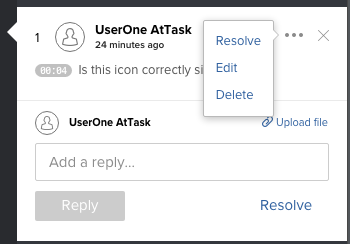

# Eliminar comentarios sobre una prueba

Puede eliminar un comentario o una respuesta a un comentario siempre que nadie le haya respondido ya. Por lo general, es mejor resolver un comentario en lugar de eliminarlo. Para obtener más información, consulte [Resolver comentarios de revisión](../../../../review-and-approve-work/proofing/reviewing-proofs-within-workfront/comment-on-a-proof/resolve-proof-comments.md).

## Requisitos de acceso

+++ Expanda para ver los requisitos de acceso para la funcionalidad en este artículo.

<table style="table-layout:auto"> 
 <col> 
 <col> 
 <tbody> 
  <tr> 
   <td role="rowheader">Paquete de Adobe Workfront</td> 
   <td> 
Cualquiera
 </td> 
  </tr> 
  <tr> 
   <td role="rowheader">Licencia de Adobe Workfront</td> 
   <td> 
   
Ligero o superior

   
Revisión o superior
</td> 
  </tr> 
  <tr> 
   <td role="rowheader">Perfil de permiso de prueba </td> 
   <td>Supervisor</td> 
  </tr> 
  <tr> 
   <td role="rowheader">Función de prueba</td> 
   <td>Moderador para eliminar cualquier comentario; revisor para eliminar sus propios comentarios</td> 
  </tr> 
  <tr> 
   <td role="rowheader">Configuraciones de nivel de acceso</td> 
   <td> 
Acceso de edición a documentos
</td> 
  </tr> 
 </tbody> 
</table>

Para obtener más información, consulte [Requisitos de acceso en la documentación de Workfront](/help/quicksilver/administration-and-setup/add-users/access-levels-and-object-permissions/access-level-requirements-in-documentation.md).

+++

## Eliminar comentarios sobre una prueba

1. Vaya al proyecto, tarea o problema que contiene el documento y, a continuación, seleccione **Documentos**.
1. Busque la revisión que necesita y haga clic en **Abrir revisión**.

1. (Condicional) Si el área de comentarios no está abierta, haga clic en **Ver comentarios** en la esquina superior derecha.
1. Seleccione el comentario o la respuesta y haga clic en el icono **Más**.

   

1. Haga clic en **Eliminar** >**Sí, eliminarlo**. Después de eliminar un comentario, el sistema registra una entrada en la sección de actividad de prueba que muestra que el comentario se ha eliminado.
