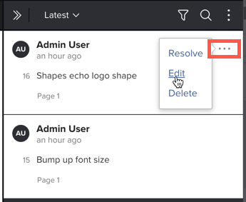

# Editar comentarios de revisión

Los comentarios no se pueden editar después de agregar una respuesta al comentario. Esta restricción mantiene la integridad del subproceso de comentarios. Cuando edita un comentario, el momento en que se realizó no se ve afectado.

## Requisitos de acceso

Debe tener el siguiente acceso para realizar los pasos de este artículo:

<table style="table-layout:auto"> 
 <col> 
 <col> 
 <tbody> 
  <tr> 
   <td role="rowheader">plan Adobe Workfront*</td> 
   <td> 
Plan actual: Pro o Superior
 
o
 
Plan heredado: Select o Premium
 
Para obtener más información sobre cómo revisar el acceso con los diferentes planes, consulte <a href="/help/quicksilver/administration-and-setup/manage-workfront/configure-proofing/access-to-proofing-functionality.md" class="MCXref xref">Acceso a la funcionalidad de revisión en Workfront</a>.
 </td> 
  </tr> 
  <tr> 
   <td role="rowheader">Licencia de Adobe Workfront*</td> 
   <td> 
Plan actual: Trabajo o Plan
 
Plan heredado: Cualquiera (debe tener la revisión habilitada para el usuario)
 </td> 
  </tr> 
  <tr> 
   <td role="rowheader">Perfil de permiso de revisión </td> 
   <td>Supervisor</td> 
  </tr> 
  <tr> 
   <td role="rowheader">Función de prueba</td> 
   <td>Autor o moderador</td> 
  </tr> 
  <tr> 
   <td role="rowheader">Configuraciones de nivel de acceso*</td> 
   <td> 
Editar acceso a documentos
 
Para obtener información sobre cómo solicitar acceso adicional, vea <a href="../../../../workfront-basics/grant-and-request-access-to-objects/request-access.md" class="MCXref xref">Solicitar acceso a los objetos </a>.
 </td> 
  </tr> 
 </tbody> 
</table>

&#42;Para saber qué plan, función o perfil de permiso de revisión tiene, póngase en contacto con su administrador de Workfront o de Workfront Proof.

## Editar comentarios de revisión

Puede editar cualquier comentario que haga en una prueba. Además, los siguientes usuarios pueden editar los comentarios realizados por otros usuarios:

* El propietario de la prueba
* El creador de pruebas
* Usuarios con permisos de perfil de Supervisor
* Usuarios con una función de autor o moderador como prueba

Para editar los comentarios de prueba:

1. Vaya al proyecto, tarea o problema que contiene el documento y, a continuación, seleccione **Documentos**.
1. Busque la revisión que necesita y haga clic en **Abrir revisión**.

1. (Condicional) Si el área de comentarios no está abierta, haga clic en **Ver comentarios** en la esquina superior derecha.
1. Pase el ratón sobre el comentario que quiera editar, haga clic en el icono **Más** que aparece y luego haga clic en **Editar**.

1. 

1. Realice cambios en el comentario y, a continuación, haga clic en **Post**.

   >[!NOTE]
   >
   >La etiqueta &quot;Editado&quot; aparece en el comentario. Cuando un revisor pasa el ratón sobre esto, aparece su nombre y la fecha y hora de los cambios. Si edita el comentario más de una vez, esta información sólo aparece para el cambio más reciente. Esta etiqueta también aparece encima del comentario cuando selecciona el documento en el área Documentos y ve la pestaña **Actualizaciones** en el Resumen.
