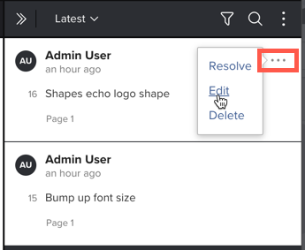

# Editar comentarios sobre una prueba

Los comentarios no se pueden editar después de agregar una respuesta al comentario. Esta restricción mantiene la integridad del subproceso de comentarios. Cuando edita un comentario, el momento en que se realizó no se ve afectado.

## Requisitos de acceso

+++ Expanda para ver los requisitos de acceso para la funcionalidad en este artículo.

<table style="table-layout:auto"> 
 <col> 
 <col> 
 <tbody> 
  <tr> 
   <td role="rowheader">Paquete de Adobe Workfront</td> 
   <td> 
Cualquiera
 </td> 
  </tr> 
  <tr> 
   <td role="rowheader">Licencia de Adobe Workfront*</td> 
   <td> 
Cualquiera
 </td> 
  </tr> 
  <tr> 
   <td role="rowheader">Perfil de permiso de prueba </td> 
   <td>Supervisor</td> 
  </tr> 
  <tr> 
   <td role="rowheader">Configuraciones de nivel de acceso*</td> 
   <td> 
Acceso de edición a documentos
</td> 
  </tr> 
 </tbody> 
</table>

Para obtener más información, consulte [Requisitos de acceso en la documentación de Workfront](/help/quicksilver/administration-and-setup/add-users/access-levels-and-object-permissions/access-level-requirements-in-documentation.md).

+++

## Editar comentarios sobre una prueba

Puede editar cualquier comentario que haga en una prueba. Además, los siguientes usuarios pueden editar los comentarios realizados por otros usuarios:

* El propietario de la prueba
* El creador de pruebas
* Usuarios con permisos de perfil de Supervisor
* Usuarios con una función de autor o moderador como prueba

Para editar los comentarios de prueba:

1. Vaya al proyecto, tarea o problema que contiene el documento y, a continuación, seleccione **Documentos**.
1. Busque la revisión que necesita y haga clic en **Abrir revisión**.

1. (Condicional) Si el área de comentarios no está abierta, haga clic en **Ver comentarios** en la esquina superior derecha.
1. Pase el ratón sobre el comentario que quiera editar, haga clic en el icono **Más** que aparece y luego haga clic en **Editar**.

1. 

1. Realice cualquier cambio en el comentario y, a continuación, haga clic en **Publicar**.

   >[!NOTE]
   >
   >La etiqueta &quot;Editado&quot; aparece en el comentario. Cuando un revisor pasa el ratón sobre esto, aparece su nombre y la fecha y hora de los cambios. Si edita el comentario más de una vez, esta información sólo aparece para el cambio más reciente. Esta etiqueta también aparece encima del comentario cuando selecciona el documento en el área Documentos y ve la pestaña **Actualizaciones** en el Resumen.
