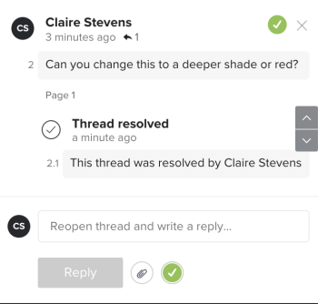

# Resolver comentarios de revisión

Puede marcar los comentarios resueltos después de haberlos enviado. Puede volver a abrir un comentario que usted u otro revisor hayan resuelto.

## Requisitos de acceso

Debe tener el siguiente acceso para realizar los pasos de este artículo:

<table style="table-layout:auto"> 
 <col> 
 <col> 
 <tbody> 
  <tr> 
   <td role="rowheader">plan Adobe Workfront*</td> 
   <td> 
Plan actual: Pro o Superior
 
o
 
Plan heredado: Select o Premium
 
Para obtener más información sobre cómo revisar el acceso con los diferentes planes, consulte <a href="/help/quicksilver/administration-and-setup/manage-workfront/configure-proofing/access-to-proofing-functionality.md" class="MCXref xref">Acceso a la funcionalidad de revisión en Workfront</a>.
 </td> 
  </tr> 
  <tr> 
   <td role="rowheader">Licencia de Adobe Workfront*</td> 
   <td> 
Plan actual: Trabajo o Plan
 
Plan heredado: Cualquiera (debe tener la revisión habilitada para el usuario)
 </td> 
  </tr> 
  <tr> 
   <td role="rowheader">Perfil de permiso de revisión </td> 
   <td>Responsable o superior</td> 
  </tr> 
  <tr> 
   <td role="rowheader">Función de prueba</td> 
   <td>Autor o moderador</td> 
  </tr> 
  <tr> 
   <td role="rowheader">Configuraciones de nivel de acceso*</td> 
   <td> 
Editar acceso a documentos
 
Para obtener información sobre cómo solicitar acceso adicional, vea <a href="../../../../workfront-basics/grant-and-request-access-to-objects/request-access.md" class="MCXref xref">Solicitar acceso a los objetos </a>.
 </td> 
  </tr> 
 </tbody> 
</table>

&#42;Para saber qué plan, función o perfil de permiso de revisión tiene, póngase en contacto con su administrador de Workfront o de Workfront Proof.

## Resolver un comentario

1. Vaya al proyecto, tarea o problema que contiene el documento y, a continuación, seleccione **Documentos**.
1. Busque la revisión que necesita y haga clic en **Abrir revisión**.

1. (Condicional) Si el área de comentarios no está abierta, haga clic en **Ver comentarios** en la esquina superior derecha.
1. Seleccione el comentario.
1. Haga clic en el icono de marca de verificación en la esquina inferior derecha del comentario. Aparece una marca de verificación verde en la esquina superior izquierda del comentario y una etiqueta y un mensaje &quot;Hilo resuelto&quot; debajo de él. El usuario que ha enviado el comentario recibe una notificación por correo electrónico de que el comentario se ha resuelto.

   

## Volver a abrir un comentario resuelto

1. Vaya al proyecto, tarea o problema que contiene el documento y, a continuación, seleccione **Documentos**.
1. Busque la revisión que necesita y haga clic en **Abrir revisión**.

1. (Condicional) Si el área de comentarios no está abierta, haga clic en **Ver comentarios** en la esquina superior derecha.
1. Seleccione el comentario.
1. Haga clic en el icono de marca de verificación verde en la esquina inferior derecha del comentario (a la derecha del botón **Responder**). La marca de verificación de la esquina superior izquierda del comentario desaparece y aparece una etiqueta y un mensaje &quot;Hilo reabierto&quot; debajo de él. El usuario que ha enviado el comentario recibe una notificación por correo electrónico de que el comentario se ha reabierto.

   
