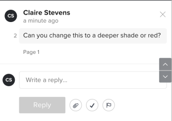
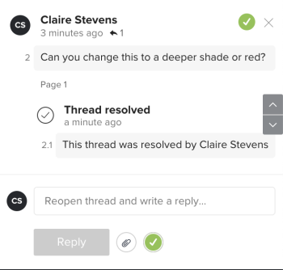

# Resolver comentarios de la prueba

Puede marcar los comentarios como resueltos después de haberlos tratado. Puede volver a abrir un comentario que haya resuelto u otro revisor haya resuelto.

## Requisitos de acceso

+++ Expanda para ver los requisitos de acceso para la funcionalidad en este artículo.

<table style="table-layout:auto"> 
 <col> 
 <col> 
 <tbody> 
  <tr> 
   <td role="rowheader">Paquete de Adobe Workfront</td> 
   <td> 
Cualquiera
 </td> 
  </tr> 
  <tr> 
   <td role="rowheader">Licencia de Adobe Workfront</td> 
   <td> 
Cualquiera
</td> 
  </tr> 
  <tr> 
   <td role="rowheader">Perfil de permiso de prueba</td> 
   <td>Administrador o superior</td> 
  </tr> 
  <tr> 
   <td role="rowheader">Función de prueba</td> 
   <td>Autor o moderador</td> 
  </tr> 
  <tr> 
   <td role="rowheader">Configuraciones de nivel de acceso</td> 
   <td> 
Acceso de edición a documentos
 </td> 
  </tr> 
 </tbody> 
</table>

Para obtener más información, consulte [Requisitos de acceso en la documentación de Workfront](/help/quicksilver/administration-and-setup/add-users/access-levels-and-object-permissions/access-level-requirements-in-documentation.md).

+++

## Resolver un comentario

1. Vaya al proyecto, tarea o problema que contiene el documento y, a continuación, seleccione **Documentos**.
1. Busque la revisión que necesita y haga clic en **Abrir revisión**.

1. (Condicional) Si el área de comentarios no está abierta, haga clic en **Ver comentarios** en la esquina superior derecha.
1. Seleccione el comentario.
1. Haga clic en el icono de marca de verificación en la esquina inferior derecha del comentario. Aparecerá una marca de verificación verde en la esquina superior izquierda del comentario, así como una etiqueta y mensaje “Hilo resuelto” debajo. El usuario que haya enviado el comentario recibirá una notificación por correo electrónico de que el comentario se ha resuelto.

   

## Volver a abrir un comentario resuelto

1. Vaya al proyecto, tarea o problema que contiene el documento y, a continuación, seleccione **Documentos**.
1. Busque la revisión que necesita y haga clic en **Abrir revisión**.

1. (Condicional) Si el área de comentarios no está abierta, haga clic en **Ver comentarios** en la esquina superior derecha.
1. Seleccione el comentario.
1. Haga clic en el icono de marca de verificación verde en la esquina inferior derecha del comentario (a la derecha del botón **Responder**). La marca de verificación de la esquina superior izquierda del comentario desaparecerá y aparecerá una etiqueta y mensaje “Hilo reabierto” debajo. El usuario que haya enviado el comentario recibirá una notificación por correo electrónico de que el comentario se ha reabierto.

   
