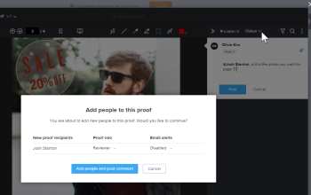

# Etiquetar usuarios para compartir una prueba

Al comentar una prueba en el visor de pruebas, puede etiquetar a otros usuarios para que dirijan su atención al comentario por correo electrónico y para añadirlos al flujo de trabajo de la prueba.

Al etiquetar usuarios en comentarios en una prueba, los usuarios que puede etiquetar pueden variar según varios factores, como los permisos de usuario individuales y la pertenencia a la organización:

* Si es el creador, propietario o tiene permisos específicos activados, puede etiquetar usuarios fuera del flujo de trabajo de prueba y compartir la prueba con ellos.
* Si se le agregó a la prueba como usuario externo y es miembro de otro entorno con una cuenta de prueba diferente, solo puede etiquetar a esos usuarios del entorno original. <!--For more information, see [Proofing collaboration limitations with people outside of your organization](../../../../review-and-approve-work/proofing/tips-tricks-and-troubleshooting/collaboration-with-members-outside-of-your-organization.md)-->

## Requisitos de acceso {#access-requirements}

Debe tener el siguiente acceso para realizar los pasos de este artículo:

<table style="table-layout:auto"> 
 <col> 
 <col> 
 <tbody> 
  <tr> 
   <td role="rowheader">plan de Adobe Workfront*</td> 
   <td> 
Plan actual: Pro o superior
 
o
 
Plan heredado: Premium
 
Para obtener más información sobre la prueba de acceso con los diferentes planes, consulte <a href="/help/quicksilver/administration-and-setup/manage-workfront/configure-proofing/access-to-proofing-functionality.md" class="MCXref xref">Acceso a la funcionalidad de pruebas en Workfront</a>.
 </td> 
  </tr> 
  <tr> 
   <td role="rowheader">Licencia de Adobe Workfront*</td> 
   <td> 
Plan actual: Trabajo o plan
 
Plan heredado: Cualquiera (debe tener las pruebas habilitadas para el usuario)
 </td> 
  </tr> 
  <tr data-mc-conditions=""> 
   <td role="rowheader">Función de prueba</td> 
   <td>Autor, moderador</td> 
  </tr> 
  <tr data-mc-conditions=""> 
   <td role="rowheader">Perfil de permiso de revisión </td> 
   <td>Supervisor o administrador</td> 
  </tr> 
  <tr data-mc-conditions=""> 
   <td role="rowheader">Configuraciones de nivel de acceso*</td> 
   <td> 
Editar acceso a documentos
 
Para obtener información sobre la solicitud de acceso adicional, consulte <a href="../../../../workfront-basics/grant-and-request-access-to-objects/request-access.md" class="MCXref xref">Solicitar acceso a objetos </a>.
 </td> 
  </tr> 
 </tbody> 
</table>

&#42;Para averiguar qué plan, función o perfil de permiso de prueba tiene, póngase en contacto con el administrador de Workfront o Workfront Proof.

## Etiquetar usuarios para compartir una prueba

Los usuarios con la función Perfil de permisos de prueba o Prueba descrita en la [Requisitos de acceso](#access-requirements) de forma predeterminada, puede etiquetar a los usuarios para que compartan una prueba. También puede etiquetar a los usuarios para que compartan una prueba independientemente de la función Perfil de permisos de prueba o Prueba si es el propietario de la prueba o el creador. Puede permitir que los usuarios con menos funciones de Perfil de permisos de prueba o Prueba compartan una prueba al crear una prueba. Para obtener más información, consulte la [Configuración del flujo de trabajo y adición de revisores](../../../../review-and-approve-work/proofing/creating-proofs-within-workfront/configure-basic-proof-workflow.md#configur) en la sección [Creación de una prueba avanzada con un flujo de trabajo Básico](../../../../review-and-approve-work/proofing/creating-proofs-within-workfront/configure-basic-proof-workflow.md) artículo.

>[!NOTE]
>
>Puede etiquetar a un colaborador externo con su dirección de correo electrónico solo si se cumple una de las siguientes condiciones:>
>* Un usuario de la cuenta de Workfront de su organización ha añadido la dirección de correo electrónico del colaborador a una prueba anteriormente.
>* El colaborador ha utilizado la dirección de correo electrónico para suscribirse a una prueba de la cuenta de Workfront de su organización anteriormente.
>

Para etiquetar a alguien y compartir una prueba en un comentario:

1. Al comentar una prueba, escriba un signo de arroba (@) seguido del nombre o la dirección de correo electrónico de la persona. Al empezar a escribir, los nombres disponibles aparecen en una lista desplegable.
1. Seleccione el nombre de la persona cuando lo vea en la lista desplegable.

   >[!TIP]
   >
   >Si desea cerrar la lista desplegable sin seleccionar a nadie, puede pulsar el botón **Esc** o haga clic en cualquier lugar fuera de la lista.

1. Repita los pasos del 1 al 2 para los demás usuarios que desee etiquetar en el comentario.
1. Termine el comentario y haga clic en **Publicación**.
1. (Condicional) Si ha etiquetado a alguien que no se haya agregado a la prueba, especifique un **Función de prueba** y **Alertas de correo electrónico** para cada usuario enumerado en el cuadro que aparece y, a continuación, haga clic en **Agregar personas y comentarios de anuncio**.

   

   Para obtener información sobre las funciones de prueba, consulte . Para obtener información sobre las alertas de correo electrónico de prueba, consulte la sección del artículo [Configuración de las notificaciones por correo electrónico en Workfront Proof](../../../../workfront-proof/wp-emailsntfctns/email-alerts/config-email-notification-settings-wp.md).

   Si la prueba tiene un flujo de trabajo automatizado, los usuarios que etiquete se añadirán al escenario en el que se encuentre. Para obtener más información, consulte [Resumen del flujo de trabajo automatizado](../../../../review-and-approve-work/proofing/proofing-overview/automated-workflow.md).

   Cualquier persona que etiquete recibe un correo electrónico de notificación sobre el comentario de prueba, independientemente de la configuración de alerta de correo electrónico de prueba que esté utilizando:

   * Si el usuario recibe un resumen diario o un correo electrónico de resumen por hora, Workfront envía la notificación por separado e incluye información sobre el comentario de prueba en el correo electrónico de resumen.
   * Si el usuario recibe alertas para toda la actividad o para las respuestas a sus comentarios, la notificación sustituye a las notificaciones sobre estos comentarios y respuestas.

Para obtener información sobre otras formas de agregar usuarios a una prueba, consulte [Compartir una prueba en Adobe Workfront](../../../../review-and-approve-work/proofing/managing-proofs-within-workfront/share-a-proof-in-workfront.md).
