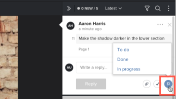

# Utilizar acciones en comentarios de revisión

Puede utilizar acciones para realizar un seguimiento de lo que debe suceder en cada hilo de comentarios de una revisión. Una acción es una palabra o frase como “Por hacer”, “Listo” o “En curso” que el administrador de Adobe Workfront configura en el sistema para su organización. Los revisores pueden añadir una acción a un comentario para proporcionar información sobre lo que se ha hecho o lo que aún debe hacerse en respuesta al comentario.

Para obtener información sobre cómo el administrador de Workfront habilita y configura acciones, consulte.

## Requisitos de acceso

+++ Expanda para ver los requisitos de acceso para la funcionalidad en este artículo.

Debe tener el siguiente acceso para realizar los pasos de este artículo:

<table style="table-layout:auto"> 
 <col> 
 <col> 
 <tbody> 
  <tr> 
   <td role="rowheader">Plan de Adobe Workfront*</td> 
   <td> 
Plan actual: pro o superior
 
o
 
Plan heredado: select o premium
 
Para obtener más información sobre el acceso de revisión con los diferentes planes, consulte <a href="/help/quicksilver/administration-and-setup/manage-workfront/configure-proofing/access-to-proofing-functionality.md" class="MCXref xref">Acceso a la funcionalidad de revisión en Workfront</a>.
 </td> 
  </tr> 
  <tr> 
   <td role="rowheader">Licencia de Adobe Workfront*</td> 
   <td> 
Plan actual: trabajo o plan
 
Plan heredado: cualquiera (debe tener la revisión habilitada para el usuario)
 </td> 
  </tr> 
  <tr> 
   <td role="rowheader">Perfil de permiso de prueba </td> 
   <td>Administrador o superior</td> 
  </tr> 
  <tr> 
   <td role="rowheader">Función de prueba</td> 
   <td>Autor o moderador</td> 
  </tr> 
  <tr> 
   <td role="rowheader">Configuraciones de nivel de acceso*</td> 
   <td> 
Acceso de edición a documentos
 
Para obtener información sobre cómo solicitar acceso adicional, consulte <a href="../../../../workfront-basics/grant-and-request-access-to-objects/request-access.md" class="MCXref xref">Solicitar acceso a los objetos </a>.
 </td> 
  </tr> 
 </tbody> 
</table>

&#42;Para saber qué plan, función o perfil de permiso de revisión tiene, póngase en contacto con su administrador de Workfront o de Workfront Proof.

+++

## Usar acciones en los comentarios

Para aplicar una acción a un comentario existente en el visor de corrección:

1. Vaya al proyecto, tarea o problema que contiene el documento y, a continuación, seleccione **Documentos**.
1. Busque la revisión que necesita y haga clic en **Abrir revisión**.

1. Realice una de las siguientes acciones:

   * Haga clic en el icono de marca en la esquina inferior derecha del comentario y, a continuación, haga clic en la acción que desee en el menú desplegable.

     

   * Haga clic en el icono **Más** (tres puntos horizontales en el comentario) y, a continuación, haga clic en la acción que desee en la sección inferior del menú desplegable que aparece.

     

1. (Opcional) Si cambia de opinión, puede realizar una de las siguientes acciones:

   * Vuelva a hacer clic en el icono de marca o en el icono **Más** y, a continuación, haga clic en **Eliminar acción**.

   * Repita el paso 1 para aplicar una acción diferente.

>[!TIP]
>
>Puede filtrar los comentarios por una acción determinada. Para obtener más información, consulte [Buscar, filtrar y ordenar comentarios de revisión](../../../../review-and-approve-work/proofing/reviewing-proofs-within-workfront/comment-on-a-proof/search-filter-sort-comments.md).
