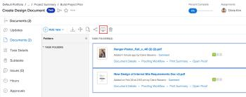

# Comparar pruebas

Puede utilizar el visualizador de revisiones para comparar dos revisiones diferentes o dos versiones de la misma revisión.

## Requisitos de acceso

+++ Expanda para ver los requisitos de acceso para la funcionalidad en este artículo.

<table style="table-layout:auto"> 
 <col> 
 <col> 
 <tbody> 
  <tr> 
   <td role="rowheader">Paquete de Adobe Workfront</td> 
   <td> 
Cualquiera
 </td> 
  </tr> 
  <tr> 
   <td role="rowheader">Licencia de Adobe Workfront</td> 
   <td> 
Cualquiera
 </td> 
  </tr> 
  <tr> 
   <td role="rowheader">Función de prueba </td> 
   <td>Revisor, Revisor y aprobador, Autor, Moderador</td> 
  </tr> 
  <tr> 
   <td role="rowheader">Perfil de permiso de prueba </td> 
   <td>Administrador o superior</td> 
  </tr> 
  <tr> 
   <td role="rowheader">Configuraciones de nivel de acceso</td> 
   <td> 
Acceso de edición a documentos
 </td> 
  </tr> 
 </tbody> 
</table>

Para obtener más información, consulte [Requisitos de acceso en la documentación de Workfront](/help/quicksilver/administration-and-setup/add-users/access-levels-and-object-permissions/access-level-requirements-in-documentation.md).

+++

## Comparar dos pruebas diferentes

Puede comparar dos pruebas dentro de una sola lista de documentos, por ejemplo, dentro de la pestaña Documentos de un proyecto, tarea, problema, portafolio o dentro del área principal Documentos.

1. Vaya a la lista de documentos que contiene los dos documentos revisados que desea comparar.
1. Seleccione el primer documento que desea comparar y, a continuación, mantenga pulsada la tecla Comando (en Mac) o Ctrl (en Windows) y seleccione el segundo documento que desea comparar.

   >[!NOTE]
   >
   >Ya debe generarse una prueba para cada documento que seleccione para la comparación.

1. Haga clic en **Comparar pruebas**.

   <!--
   
If this button is not visible, ensure that two proofed documents are selected.

   -->

   

   Ambas revisiones se muestran en el visor de revisiones en una vista en paralelo. Puede revisar cada documento mientras lo compara.

   Las rutas de exploración independientes encima de cada prueba le permiten ver y ir al elemento de trabajo asociado con la prueba:

   

   Para obtener información sobre las herramientas que puede usar para comparar las dos revisiones, consulte [Usar las herramientas de comparación](../../../../workfront-proof/wp-work-proofsfiles/review-proofs-wpv/compare-proofs.md#using-compare-tools) en [Comparar revisiones en el visor de revisiones](../../../../workfront-proof/wp-work-proofsfiles/review-proofs-wpv/compare-proofs.md).

## Comparar dos versiones de la misma prueba

Para obtener información sobre cómo comparar dos versiones de la misma revisión, consulte [Comparar versiones de revisión](../../../../workfront-proof/wp-work-proofsfiles/review-proofs-wpv/compare-proofs.md#comparing-proof-versions) en [Comparar pruebas en el visor de pruebas](../../../../workfront-proof/wp-work-proofsfiles/review-proofs-wpv/compare-proofs.md).
