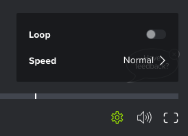
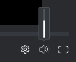

# Control de la reproducción en una prueba de vídeo

## Requisitos de acceso

+++ Expanda para ver los requisitos de acceso para la funcionalidad en este artículo.

<table style="table-layout:auto"> 
 <col> 
 <col> 
 <tbody> 
  <tr> 
   <td role="rowheader">Paquete de Adobe Workfront</td> 
   <td> 
Cualquiera
 </td> 
  </tr> 
  <tr> 
   <td role="rowheader">Licencia de Adobe Workfront</td> 
   <td> 
Cualquiera
 </td> 
  </tr> 
  <tr> 
   <td role="rowheader">Función de prueba </td> 
   <td>Revisor, Revisor y aprobador, Autor, Moderador</td> 
  </tr> 
  <tr> 
   <td role="rowheader">Perfil de permiso de prueba </td> 
   <td>Administrador o superior</td> 
  </tr> 
  <tr> 
   <td role="rowheader">Configuraciones de nivel de acceso</td> 
   <td> 
Acceso de edición a documentos
 </td> 
  </tr> 
 </tbody> 
</table>

Para obtener más información, consulte [Requisitos de acceso en la documentación de Workfront](/help/quicksilver/administration-and-setup/add-users/access-levels-and-object-permissions/access-level-requirements-in-documentation.md).

+++

## Ajuste de velocidad de reproducción de vídeo

Puede ajustar la velocidad de reproducción de la prueba de vídeo. Puede seleccionar para ver el vídeo entre un cuarto de velocidad y el doble de velocidad.

1. Vaya al proyecto, tarea o problema que contiene el documento y, a continuación, seleccione **Documentos**.
1. Busque la revisión que necesita y haga clic en **Abrir revisión**.

1. En la esquina inferior derecha del visualizador de corrección, haga clic en el icono **Configuración**.

   

1. Haga clic en la velocidad actual y seleccione una nueva velocidad de reproducción.
1. Haz clic en el botón **Reproducir** del vídeo para probar la nueva velocidad.

## Ver vídeo fotograma a fotograma

Para obtener una vista más detallada de la prueba de vídeo, puede revisar manualmente el vídeo fotograma a fotograma.

1. Vaya al proyecto, tarea o problema que contiene el documento y, a continuación, seleccione **Documentos**.
1. Busque la prueba que necesita y haga clic en **Abrir prueba**.

1. En la parte inferior del visualizador de revisión, haga clic en las flechas **Forward** y **Back** para revisar el vídeo fotograma a fotograma.

   

## Cambiar el volumen de reproducción

Puede controlar el volumen en la reproducción del vídeo.

1. Vaya al proyecto, tarea o problema que contiene el documento y, a continuación, seleccione **Documentos**.
1. Busque la prueba que necesita y haga clic en **Abrir prueba**.

1. En la esquina inferior derecha del visualizador de revisión, pase el ratón sobre el icono **Volumen** y, a continuación, arrastre el control deslizante para seleccionar un nuevo volumen.

   

   O

   Haga clic en el icono **Volumen** para silenciar y reactivar el volumen.
