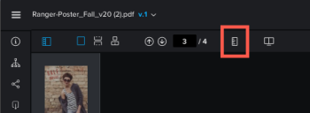

# Medir un área dentro de una prueba

Puede medir un área dentro de una prueba.

## Requisitos de acceso

Debe tener el siguiente acceso para realizar los pasos de este artículo:

<table style="table-layout:auto"> 
 <col> 
 <col> 
 <tbody> 
  <tr> 
   <td role="rowheader">plan de Adobe Workfront*</td> 
   <td> 
Plan actual: Pro o superior
 
o
 
Plan heredado: Select o Premium
 
Para obtener más información sobre la prueba de acceso con los diferentes planes, consulte <a href="/help/quicksilver/administration-and-setup/manage-workfront/configure-proofing/access-to-proofing-functionality.md" class="MCXref xref">Acceso a la funcionalidad de pruebas en Workfront</a>.
 </td> 
  </tr> 
  <tr> 
   <td role="rowheader">Licencia de Adobe Workfront*</td> 
   <td> 
Plan actual: Trabajo o plan
 
Plan heredado: Cualquiera (debe tener las pruebas habilitadas para el usuario)
 </td> 
  </tr> 
  <tr> 
   <td role="rowheader">Perfil de permiso de revisión </td> 
   <td>Administrador o superior</td> 
  </tr> 
  <tr> 
   <td role="rowheader">Configuraciones de nivel de acceso*</td> 
   <td> 
Editar acceso a documentos
 
Para obtener información sobre la solicitud de acceso adicional, consulte <a href="../../../../workfront-basics/grant-and-request-access-to-objects/request-access.md" class="MCXref xref">Solicitar acceso a objetos </a>.
 </td> 
  </tr> 
 </tbody> 
</table>

&#42;Para averiguar qué plan, función o perfil de permiso de prueba tiene, póngase en contacto con el administrador de Workfront o Workfront Proof.

## Medir un área dentro de una prueba

1. Vaya al proyecto, la tarea o el problema que contiene el documento y, a continuación, seleccione **Documentos**.
1. Busque la prueba que necesita y haga clic en **Abrir prueba**.

1. Haga clic en el **Medir un área** en la parte superior del visor de pruebas.

   

1. (Opcional) Haga clic en **Color de marcado de medición** para expandir las opciones de color, haga clic en un color y **Opacidad** eso es fácil de ver en tu prueba.\
   

   El color predeterminado de la herramienta de medición es el rojo.

   El visor de pruebas recuerda las selecciones de color y opacidad en todas las pruebas que abra hasta que borre la caché del explorador.

1. (Opcional) Seleccione otro **Unidad de medición.**

   >[!NOTE]
   >
   >Las opciones de Unidad de medición solo están disponibles para pruebas creadas a partir de un PDF.

1. Arrastre la ventana de medición al área de la prueba que debe medir.

   

1. Arrastre las esquinas o los bordes de la ventana de medición para cambiar su tamaño.
1. (Opcional) Si necesita que el área de medición sea de un tamaño exacto, escriba **Tamaño de la selección** valores.
1. (Opcional) Si necesita medir un determinado porcentaje dentro de un área, marque la casilla calcular porcentaje . Aparece un cuadro nuevo que le permite ajustarlo\
   
