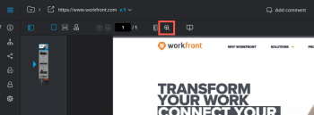
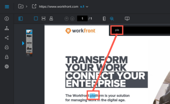

# Búsqueda de contenido dentro de una prueba

Puede localizar rápidamente texto en una prueba creada para los siguientes tipos de documentos:

* PDF
* Office (.doc, .docx, .odt)
* Página web estática

>[!NOTE]
>
>Es posible que no se puedan buscar las pruebas creadas antes del 26 de abril de 2017.

## Requisitos de acceso

+++ Expanda para ver los requisitos de acceso para la funcionalidad en este artículo.

<table style="table-layout:auto"> 
 <col> 
 <col> 
 <tbody> 
  <tr> 
   <td role="rowheader">Paquete de Adobe Workfront</td> 
   <td> 
Cualquiera
 </td> 
  </tr> 
  <tr> 
   <td role="rowheader">Licencia de Adobe Workfront</td> 
   <td> 
Cualquiera
 </td> 
  </tr> 
  <tr> 
   <td role="rowheader">Función de prueba </td> 
   <td>Revisor, Revisor y aprobador, Autor, Moderador</td> 
  </tr> 
  <tr> 
   <td role="rowheader">Perfil de permiso de prueba </td> 
   <td>Administrador o superior</td> 
  </tr> 
  <tr> 
   <td role="rowheader">Configuraciones de nivel de acceso</td> 
   <td> 
Acceso de edición a documentos
 </td> 
  </tr> 
 </tbody> 
</table>

Para obtener más información, consulte [Requisitos de acceso en la documentación de Workfront](/help/quicksilver/administration-and-setup/add-users/access-levels-and-object-permissions/access-level-requirements-in-documentation.md).

+++

## Búsqueda de contenido dentro de una prueba

1. Abra la prueba en la que desea buscar.
1. En la barra de herramientas situada encima de la prueba, haga clic en el icono **Buscar documento**.

   

1. Empiece a escribir el texto que desea buscar.

   La herramienta de búsqueda resalta el texto del documento mientras escribe.

   

1. Termine de escribir el texto que desea buscar y, a continuación, haga clic en las flechas **Arriba** y **Abajo** para explorar los resultados de la búsqueda dentro de la prueba.
