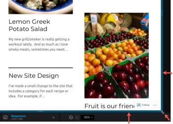

# Cambiar la resolución de prueba interactiva en el visor de pruebas

Puede obtener una vista previa del aspecto de una prueba interactiva en varios dispositivos, lo que le permite ver cómo se muestra el contenido y cómo responde en función de diferentes resoluciones.

## Requisitos de acceso

Debe tener el siguiente acceso para realizar los pasos de este artículo:

<table style="table-layout:auto"> 
 <col> 
 <col> 
 <tbody> 
  <tr> 
   <td role="rowheader">plan Adobe Workfront*</td> 
   <td> 
Plan actual: Pro o Superior
 
o
 
Plan heredado: Select o Premium
 
Para obtener más información sobre la revisión del acceso con los diferentes planes, consulte <a href="/help/quicksilver/administration-and-setup/manage-workfront/configure-proofing/access-to-proofing-functionality.md" class="MCXref xref">Acceso a la funcionalidad de revisión en Workfront</a>.
 </td> 
  </tr> 
  <tr> 
   <td role="rowheader">Licencia de Adobe Workfront*</td> 
   <td> 
Plan actual: Trabajo o Plan
 
Plan heredado: Cualquiera (debe tener la revisión habilitada para el usuario)
 </td> 
  </tr> 
  <tr> 
   <td role="rowheader">Perfil de permiso de revisión </td> 
   <td>Responsable o superior</td> 
  </tr> 
  <tr> 
   <td role="rowheader">Configuraciones de nivel de acceso*</td> 
   <td> 
Editar acceso a documentos
 
Para obtener información sobre cómo solicitar acceso adicional, consulte <a href="../../../../workfront-basics/grant-and-request-access-to-objects/request-access.md" class="MCXref xref">Solicitud de acceso a objetos </a>.
 </td> 
  </tr> 
 </tbody> 
</table>

&#42;Para saber qué plan, función o perfil de permiso de pruebas tiene, póngase en contacto con su administrador de Workfront o de Workfront Proof.

## Vistas de dispositivo y resolución en el Visor de pruebas de escritorio frente al Visor de pruebas web

El administrador de Adobe Workfront ha configurado el sistema para que revise el contenido interactivo en el Visor de pruebas de escritorio o, como contenido agrupado en un archivo ZIP, en el Visor de pruebas web:

* En el Visor de pruebas de escritorio, puede ver cómo aparece el contenido y cómo responde en varias resoluciones y en varios dispositivos. Cuando un revisor especifica un dispositivo determinado, el contenido aparece como lo haría en ese dispositivo, con las especificaciones de interfaz de usuario para el dispositivo. Por ejemplo, un botón rojo en una marca de smartphone puede ser azul en una marca diferente.

* En el Visor de revisión web, puede ver el contenido interactivo tal como aparece en las resoluciones de los distintos dispositivos. Sin embargo, el Visor de revisión web no emula el contenido mediante especificaciones de interfaz en estos dispositivos, como el color del botón.

  >[!NOTE]
  >
  >El administrador de Workfront puede configurar dispositivos personalizados para los usuarios de su organización, tal como se describe en [Configuración de dispositivos personalizados para pruebas](/help/quicksilver/administration-and-setup/manage-workfront/configure-proofing/configure-proofing-organization.md#configure-custom-devices-for-proofs) en el artículo [Configure las opciones de prueba para su organización](/help/quicksilver/administration-and-setup/manage-workfront/configure-proofing/configure-proofing-organization.md).

## Visualización de una prueba con un dispositivo preestablecido o un ajuste de resolución

1. Vaya a la lista de documentos que contiene la prueba que desea abrir.
1. Pase el ratón sobre el documento y haga clic en **Abrir revisión**.
1. Clic **Adaptable** en la parte inferior central del visor de pruebas.

   

1. En el Visor de corrección de escritorio, en la lista de dispositivos y resoluciones que aparece, haga clic en el que desee.

   O

   En el Visor de revisión Web, en la lista de resoluciones que aparece, haga clic en la que desee.

   Si necesita información sobre las diferencias entre estos dos visores, consulte [Diferencias entre el Visor de revisión web y el Visor de revisión de escritorio](../../../../review-and-approve-work/proofing/proofing-overview/understand-differences-between-web-viewer.md).

   La prueba interactiva se procesa en la resolución que seleccione.

## Visualización de una prueba con una configuración de resolución personalizada

1. Vaya a la lista de documentos que contiene la prueba que desea abrir.
1. Pase el ratón sobre el documento y haga clic en **Abrir revisión**.
1. Clic **Adaptable** en la parte inferior central del Visor de pruebas.
1. Escriba un personalizado **Adaptable** resolución.

   

   O

   Pase el ratón sobre el contenido interactivo y arrastre el borde azul de la esquina inferior derecha, o el borde derecho o inferior, a la resolución que desee.

   

   La resolución personalizada se muestra en las siguientes ubicaciones:

   * En el **Resolución** en la parte inferior central del visor.\
     

   * En cualquier comentario, los revisores añaden a la prueba. Cada comentario incluye la resolución de pantalla seleccionada cuando el revisor creó el comentario.
