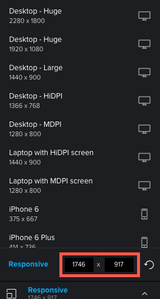

# Cambiar la resolución de revisión interactiva en el visor de corrección

Puede obtener una vista previa del aspecto de una revisión interactiva en varios dispositivos, lo que le permite ver cómo se muestra el contenido y cómo responde en función de diferentes resoluciones.

## Requisitos de acceso

+++ Expanda para ver los requisitos de acceso para la funcionalidad en este artículo.

<table style="table-layout:auto"> 
 <col> 
 <col> 
 <tbody> 
  <tr> 
   <td role="rowheader">paquete de Adobe Workfront</td> 
   <td> 
Cualquiera
 </td> 
  </tr> 
  <tr> 
   <td role="rowheader">Licencia de Adobe Workfront</td> 
   <td> 
Cualquiera
 </td> 
  </tr> 
  <tr> 
   <td role="rowheader">Función de prueba </td> 
   <td>Revisor, Revisor y aprobador, Autor, Moderador</td> 
  </tr> 
  <tr> 
   <td role="rowheader">Perfil de permiso de prueba </td> 
   <td>Administrador o superior</td> 
  </tr> 
  <tr> 
   <td role="rowheader">Configuraciones de nivel de acceso</td> 
   <td> 
Acceso de edición a documentos
 </td> 
  </tr> 
 </tbody> 
</table>

Para obtener más información, consulte [Requisitos de acceso en la documentación de Workfront](/help/quicksilver/administration-and-setup/add-users/access-levels-and-object-permissions/access-level-requirements-in-documentation.md).

+++

## Vistas de dispositivo y resolución en el Visor de corrección de escritorio frente al visor de corrección web

El administrador de Adobe Workfront ha configurado el sistema para que revise el contenido interactivo en el Visor de corrección de escritorio o, como contenido agrupado en un archivo ZIP, en el Visor de corrección web:

* En el visor de corrección de escritorio, puede ver cómo aparece el contenido y cómo responde en varias resoluciones y en varios dispositivos. Cuando un revisor especifica un determinado dispositivo, el contenido aparece como lo haría en ese dispositivo, con las especificaciones de interfaz de usuario para el dispositivo. Por ejemplo, un botón rojo en una marca de smartphone puede ser azul en otra marca.

* En el Visor de corrección web, puede ver el contenido interactivo tal como aparece en las resoluciones de los distintos dispositivos. Sin embargo, el Visor de corrección web no emula el contenido mediante especificaciones de interfaces en estos dispositivos, como el color del botón.

  >[!NOTE]
  >
  >El administrador de Workfront puede configurar dispositivos personalizados para los usuarios de su organización, tal como se describe en [Configuración de dispositivos personalizados para pruebas](/help/quicksilver/administration-and-setup/manage-workfront/configure-proofing/configure-proofing-organization.md#configure-custom-devices-for-proofs) en el artículo [Configurar la configuración de prueba para su organización](/help/quicksilver/administration-and-setup/manage-workfront/configure-proofing/configure-proofing-organization.md).

## Ver una revisión con un dispositivo o una resolución preestablecidos

1. Vaya a la lista de documentos que contiene la revisión que desea abrir.
1. Pase el puntero por encima del documento y luego haga clic en **Abrir revisión**.
1. Haga clic en **Adaptable** en la parte inferior central del visor de corrección.

   

1. En el visor de corrección de escritorio, en la lista de dispositivos y resoluciones que aparece, haga clic en el que desee.

   O

   En el visor de corrección web, en la lista de resoluciones que aparece, haga clic en la que desee.

   Si necesita información sobre cómo difieren estos dos visores, consulte [Información general sobre las diferencias entre el visor de corrección web y el visor de corrección de escritorio](../../../../review-and-approve-work/proofing/proofing-overview/understand-differences-between-web-viewer.md).

   La prueba interactiva se procesa en la resolución que seleccione.

## Ver una prueba con un ajuste de resolución personalizado

1. Vaya a la lista de documentos que contiene la revisión que desea abrir.
1. Pase el puntero por encima del documento y luego haga clic en **Abrir prueba**.
1. Haga clic en **Adaptable** en la parte inferior central del visor de corrección.
1. Escriba una resolución **adaptable** personalizada.

    

   O

   Pase el ratón sobre el contenido interactivo y arrastre el borde azul de la esquina inferior derecha, o el borde derecho o inferior, a la resolución que desee.

   

   La resolución personalizada se muestra en las siguientes ubicaciones:

   * En el panel **Resolución** en la parte inferior central del visor.\
     

   * En cualquier comentario que los revisores añadan a la revisión. Cada comentario incluye la resolución de pantalla seleccionada cuando el revisor creó el comentario.
