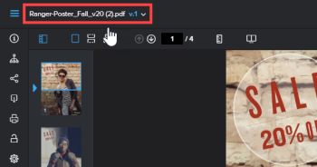

# Visualización de versiones de revisión anteriores en el visor de corrección

Puede ver una versión anterior de una revisión, si existe. Las versiones anteriores están bloqueadas de forma predeterminada. No puede añadir comentarios ni cambiar una decisión en una versión bloqueada.

>[!NOTE]
>
>La información que se describe en este artículo solo está disponible con el Visor de corrección web y solo cuando se revisan revisiones estáticas o de vídeo.

## Requisitos de acceso

+++ Expanda para ver los requisitos de acceso para la funcionalidad en este artículo.

<table style="table-layout:auto"> 
 <col> 
 <col> 
 <tbody> 
  <tr> 
   <td role="rowheader">Paquete de Adobe Workfront</td> 
   <td> 
Cualquiera
 </td> 
  </tr> 
  <tr> 
   <td role="rowheader">Licencia de Adobe Workfront</td> 
   <td> 
Cualquiera
 </td> 
  </tr> 
  <tr> 
   <td role="rowheader">Función de prueba </td> 
   <td>Revisor, Revisor y aprobador, Autor, Moderador</td> 
  </tr> 
  <tr> 
   <td role="rowheader">Perfil de permiso de prueba </td> 
   <td>Administrador o superior</td> 
  </tr> 
  <tr> 
   <td role="rowheader">Configuraciones de nivel de acceso</td> 
   <td> 
Acceso de edición a documentos
 </td> 
  </tr> 
 </tbody> 
</table>

Para obtener más información, consulte [Requisitos de acceso en la documentación de Workfront](/help/quicksilver/administration-and-setup/add-users/access-levels-and-object-permissions/access-level-requirements-in-documentation.md).

+++

## Visualización de versiones de revisión anteriores en el visor de corrección

1. Vaya al proyecto, tarea o problema que contiene el documento y, a continuación, seleccione **Documentos**.
1. Busque la revisión que necesita y haga clic en **Abrir revisión**.

1. En la esquina superior izquierda del visor de corrección, haga clic en el nombre de la revisión.

   

1. En la lista que aparece, haga clic en la versión que desee ver.
1. (Opcional) Para desbloquear la versión si desea que los usuarios puedan añadir comentarios o cambiar una decisión, si tiene derechos para hacerlo, haga clic en el icono de **Desbloquear** en el panel izquierdo y, a continuación, haga clic en **Sí, desbloquear**. Para obtener más información, consulte [Bloquear o desbloquear una prueba](../../../../review-and-approve-work/proofing/reviewing-proofs-within-workfront/review-a-proof/lock-or-unlock-proof.md).
