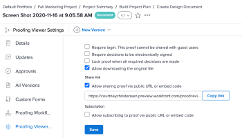
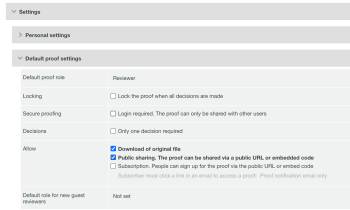

# Deshabilitar el uso compartido de la prueba mediante una dirección URL pública o código incrustado

Puede desactivar la capacidad de compartir una prueba con una URL pública o código incrustado para cada prueba o para usuarios individuales.

## Deshabilitar por prueba

Debe ser el propietario o creador de la prueba o tener la función de autor o moderador de la prueba.

1. En el proyecto que contiene la prueba, haga clic en **Documentos** en el panel izquierdo.
1. Pase el puntero por encima de la prueba y seleccione **Detalles del documento** .
1. En el panel izquierdo, haga clic en **Configuración del visualizador de revisión** y, a continuación, deshabilite la casilla de verificación **Permitir el uso compartido de la prueba mediante una dirección URL pública o un código incrustado**.

   

1. Haga clic en **Guardar**.

## Deshabilitar por usuario

Puede deshabilitar la configuración de prueba pública para usuarios individuales de la instancia de Workfront. Debe tener un perfil de permiso de prueba de administrador para realizar este cambio.

1. Haga clic en el icono **Menú principal**  en la esquina superior derecha de Adobe Workfront y, a continuación, haga clic en **Revisión**.
1. Haga clic en **Configuración de la cuenta** cerca de la esquina superior derecha.
1. Haga clic en la ficha **Usuarios** y luego haga clic en el nombre de un usuario.
1. En la sección **Configuración de prueba predeterminada**, deshabilite la casilla de verificación **Uso compartido público**.

   
