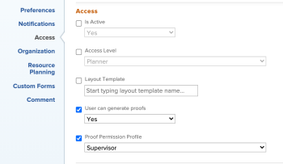

# Editar el campo Perfil de permiso de revisión de forma masiva

## Requisitos de acceso

+++ Expanda para ver los requisitos de acceso para la funcionalidad en este artículo.

<table style="table-layout:auto"> 
 <col> 
 <col> 
 <tbody> 
  <tr> 
   <td role="rowheader">Paquete de Adobe Workfront</td> 
   <td> 
Cualquiera
 </td> 
  </tr> 
  <tr> 
   <td role="rowheader">Licencia de Adobe Workfront</td> 
   <td> 
Debe ser administrador de Workfront o de un grupo.
 </td> 
  </tr> 
  <tr> 
   <td role="rowheader">Perfil de permiso de prueba </td> 
   <td>Administrador</td> 
  </tr> 
  <tr> 
   <td role="rowheader">Configuraciones de nivel de acceso</td> 
   <td> 
Acceso de edición a documentos
</td> 
  </tr> 
 </tbody> 
</table>

Para obtener más información, consulte [Requisitos de acceso en la documentación de Workfront](/help/quicksilver/administration-and-setup/add-users/access-levels-and-object-permissions/access-level-requirements-in-documentation.md).

+++

## Editar el campo Perfil de permiso de revisión de forma masiva

{{step-1-to-users}}

1. Ordene los usuarios por **Nivel de acceso**. Se recomienda la edición de forma masiva por nivel de acceso para garantizar que aparece el campo **Perfil de permiso de revisión**.

1. Haga clic en la casilla de verificación situada junto a los usuarios que desee seleccionar dentro del mismo nivel de acceso. El campo Perfil de permiso de revisión solo está disponible para los niveles de acceso de trabajador y superiores.
1. Haga clic en **Editar** en la parte superior de la lista.
1. En la sección **Acceso**, busque el menú desplegable **Perfil de permiso de revisión** y realice su selección.

   >[!NOTE]
   >
   >Según el plan de Workfront, es posible que tenga que habilitar la casilla de verificación **Es usuario de revisión** para que aparezca el menú **Perfil de permiso de revisión**.

   

1. Haga clic en **Guardar cambios**.
