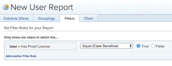

# Enumerar usuarios con una licencia de revisión en Adobe Workfront

Puede ver qué usuarios de Adobe Workfront tienen actualmente habilitada la opción &quot;El usuario puede generar pruebas&quot; de cualquiera de las siguientes maneras.

## Requisitos de acceso

+++ Expanda para ver los requisitos de acceso para la funcionalidad en este artículo.

Debe tener el siguiente acceso para realizar los pasos de este artículo:

<table style="table-layout:auto"> 
 <col> 
 <col> 
 <tbody> 
  <tr> 
   <td role="rowheader">Paquete de Adobe Workfront</td> 
   <td> 
Cualquiera
 </td> 
  </tr> 
  <tr> 
   <td role="rowheader">Licencia de Adobe Workfront*</td> 
   <td> 
   
Estándar
 
   
Plan
 </td> 
  </tr> 
  <tr> 
   <td role="rowheader">Permisos de objeto</td> 
   <td> 
Acceso de edición a:
 
    <ul> 
     <li> 
Creación de informes, paneles de control y calendarios
 </li> 
     <li> 
Creación de filtros, vistas y agrupaciones
 </li> 
    </ul> </td> 
  </tr> 
 </tbody> 
</table>

Para obtener más información, consulte [Requisitos de acceso en la documentación de Workfront](/help/quicksilver/administration-and-setup/add-users/access-levels-and-object-permissions/access-level-requirements-in-documentation.md).

+++

## Crear un informe de usuario

Puede crear un informe de usuario para ver qué usuarios pueden generar pruebas:

1. Vaya al área **Creación de informes**.
1. Haga clic en el menú desplegable **Nuevo informe** y seleccione **Informe de usuario**.

1. En la ficha **Filtros**, haga clic en **Añadir una regla de filtro**.

1. En el campo disponible, expanda **Usuario** y luego haga clic en **Tiene licencia de revisión**.

1. Seleccione **Igual** > **Verdadero**.

   

1. Haga clic en **Guardar + Cerrar**.

   El informe muestra todos los usuarios de Workfront que tienen asignada una licencia de revisión.

## Actualizar la vista Personas

Puede añadir una nueva columna en la vista Personas para ver qué usuarios pueden generar pruebas:

1. Vaya al área **Personas**.
1. Haga clic en la pestaña **Personas**.
1. En el menú desplegable **Ver**, realice una de las siguientes acciones:

   * Para añadir esta información a una vista existente, seleccione la vista que desee personalizar y, a continuación, haga clic en **Personalizar vista**.
   * Para añadir esta información a una nueva vista, haga clic en **Nueva vista**.

1. Haga clic en **Añadir columna**.
1. En el campo disponible, expanda **Usuario** y luego haga clic en **Tiene licencia de revisión**.

1. Haga clic en **Listo** y, a continuación, haga clic en **Guardar vista** o en **Guardar como nueva vista**.

   La vista muestra **Verdadero** o **Falso**, dependiendo de si el usuario tiene asignada una licencia de revisión.
