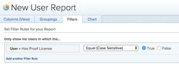

# Enumerar usuarios con una licencia de prueba en Adobe Workfront

Puede ver qué usuarios de Adobe Workfront tienen actualmente la opción &quot;El usuario puede generar pruebas&quot; activada de cualquiera de las formas siguientes:

## Requisitos de acceso

Debe tener el siguiente acceso para realizar los pasos de este artículo:

<table style="table-layout:auto"> 
 <col> 
 <col> 
 <tbody> 
  <tr> 
   <td role="rowheader">plan de Adobe Workfront*</td> 
   <td> 
Plan heredado: Select o Premium
 
Para obtener más información sobre la prueba de acceso con los diferentes planes, consulte <a href="/help/quicksilver/administration-and-setup/manage-workfront/configure-proofing/access-to-proofing-functionality.md" class="MCXref xref">Acceso a la funcionalidad de pruebas en Workfront</a>.
 </td> 
  </tr> 
  <tr> 
   <td role="rowheader">Licencia de Adobe Workfront*</td> 
   <td> 
Plan
 </td> 
  </tr> 
  <tr> 
   <td role="rowheader">Permisos de objeto</td> 
   <td> 
Editar acceso a:
 
    <ul> 
     <li> 
Creación de informes, tableros y calendarios
 </li> 
     <li> 
Crear filtros, vistas y grupos
 </li> 
    </ul> 
Nota: Si todavía no tiene acceso, pregunte a su administrador de Workfront si establece restricciones adicionales en su nivel de acceso. Para obtener información sobre cómo un administrador de Workfront puede cambiar su nivel de acceso, consulte <a href="../../../administration-and-setup/add-users/configure-and-grant-access/create-modify-access-levels.md" class="MCXref xref">Crear o modificar niveles de acceso personalizados</a>.
 </td> 
  </tr> 
 </tbody> 
</table>

&#42;Para averiguar qué plan, función o perfil de permiso de prueba tiene, póngase en contacto con el administrador de Workfront o Workfront Proof.

## Creación de un informe de usuario

Puede crear un informe de usuario para ver qué usuarios pueden generar pruebas:

1. Vaya a **Informes** .
1. Haga clic en el **Nuevo informe** menú desplegable y haga clic en **Informe de usuario**.

1. En el **Filtros** , haga clic en **Agregar una regla de filtro**.

1. En el campo disponible, expanda **Usuario** y haga clic en **Tiene licencia de prueba**.

1. Select **Igual** > **True**.

   

1. Haga clic en **Guardar y cerrar**.

   El informe muestra todos los usuarios de Workfront que tienen una licencia de prueba asignada.

## Actualizar la vista Personas

Puede agregar una nueva columna en la vista Personas para ver qué usuarios pueden generar pruebas:

1. Vaya a la **People** .
1. Haga clic en el **People** pestaña .
1. En el **Ver** menú desplegable, realice una de las acciones siguientes:

   * Para agregar esta información a una vista existente, seleccione la vista que desee personalizar y haga clic en **Personalizar vista**.
   * Para añadir esta información a una nueva vista, haga clic en **Nueva vista**.

1. Haga clic en **Agregar columna**.
1. En el campo disponible, expanda **Usuario** y haga clic en **Tiene licencia de prueba**.

1. Haga clic en **Listo** y haga clic en **Guardar vista** o **Guardar como vista nueva**.

   Se muestra la vista **True** o **False** dependiendo de si el usuario tiene una licencia de prueba asignada.
