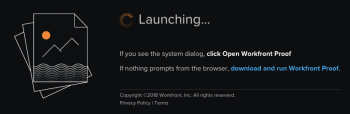

# Preguntas frecuentes: Visualizador de revisión de escritorio

## Mi organización no revisa el contenido interactivo. ¿Tengo que instalar el Visor de corrección de escritorio de todas formas?

No. El Visor de corrección de escritorio está diseñado específicamente para revisar sitios web en tiempo real y contenido web interactivo, como anuncios de banners.

Sin embargo, si su organización lo instala, tenga en cuenta que también puede utilizarlo para revisar cualquiera de los demás tipos de contenido estático y de vídeo admitidos. 

Para obtener más información, consulte [Información general sobre las diferencias entre el Visor de corrección web y el Visor de corrección de escritorio](../../../review-and-approve-work/proofing/proofing-overview/understand-differences-between-web-viewer.md)

## Mi organización no permite que los usuarios instalen aplicaciones. ¿Hay alguna manera de evitar esto con el Visor de corrección de escritorio?

Lamentablemente, no. Debe trabajar con su departamento de TI para instalar el Visor de corrección de escritorio localmente. Pregunte sobre el proceso de su organización para certificar software para uso interno. Podemos proporcionar información sobre cómo protegemos los productos de Adobe Workfront.

## ¿Hay alguna otra manera de revisar los sitios web?

Sí. Puede utilizar el nuevo Visor de corrección web para crear una captura web estática de un sitio web. Cada una de las páginas resultantes en la prueba es una captura de pantalla de una página del sitio. Los revisores pueden ver una o varias subpáginas dentro del contexto más amplio del sitio. El único requisito para esto es que nuestros servidores puedan acceder públicamente al sitio web.

Para obtener más información, consulte

## ¿Cómo instalo Visualizador de prueba de escritorio en mi sistema local?

Abra una prueba interactiva y descargue la aplicación directamente desde la pantalla de Launch.

 

## ¿Las nuevas versiones del Visualizador de prueba de escritorio requieren que vuelva a instalarlas?

No. Las actualizaciones del Visualizador de prueba de escritorio están automatizadas y no requieren que ni usted ni los usuarios finales hagan nada.

## ¿Se requiere el Visualizador de prueba de escritorio al enviar la prueba a una parte interesada externa?

Solo si envía una prueba interactiva o un sitio web en tiempo real a la parte interesada externa. Si necesita cargar el Visor de corrección de escritorio localmente para ver un fragmento de contenido, cualquier otro usuario (interno o externo) debe hacer lo mismo para poder verlo.

## ¿Cuál es el estado del visor de corrección heredado que mi organización ha utilizado para las revisiones interactivas?

Antes de la versión 2018.3, se admitía el visualizador de pruebas de Heredado. Con la versión 2018.3 (en noviembre de 2018), el visualizador de pruebas heredado y todas las demás aplicaciones que dependen de Flash se han eliminado y ya no están disponibles. 

Para las revisiones estáticas y de vídeo, el nuevo Visor de corrección web es el visor predeterminado. Para las revisiones interactivas, el visor de corrección de escritorio es el predeterminado.

<!--For more information, see [Legacy proofing viewer removed in 2018.3](../../../workfront-proof/wp-work-proofsfiles/review-proofs-lpv/lpv-removed-2018.md)-->
