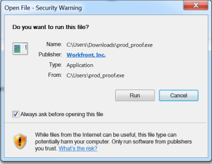

# Instalación del Visor de prueba de escritorio

El Visor de prueba de escritorio, que está diseñado principalmente para probar contenido interactivo, es una aplicación que debe instalarse en el equipo local.

## Requisitos del sistema

Esta aplicación es compatible con los siguientes sistemas operativos:

* Windows 7 y versiones posteriores, de 32 y 64 bits
* Mac OS X 10.9 y posteriores de 64 bits

## Requisitos de acceso

Debe tener el siguiente acceso para realizar los pasos de este artículo:

<table style="table-layout:auto"> 
 <col> 
 <col> 
 <tbody> 
  <tr> 
   <td role="rowheader">plan de Adobe Workfront*</td> 
   <td> 
Plan actual: Pro o superior
 
o
 
Plan heredado: Select o Premium
 
Para obtener más información sobre la prueba de acceso con los diferentes planes, consulte <a href="/help/quicksilver/administration-and-setup/manage-workfront/configure-proofing/access-to-proofing-functionality.md" class="MCXref xref">Acceso a la funcionalidad de pruebas en Workfront</a>.
 </td> 
  </tr> 
  <tr> 
   <td role="rowheader">Licencia de Adobe Workfront</td> 
   <td> 
Cualquiera
 
Plan heredado: Cualquiera (debe tener las pruebas habilitadas para el usuario)
 </td> 
  </tr> 
 </tbody> 
</table>

{{latest-version}}

## Instalación de Desktop Proofing Viewer en Mac

Si el administrador de Adobe Workfront o el administrador de Workfront Proof han descargado la aplicación en la estación de trabajo y han configurado Desktop Proofing Viewer como visor predeterminado para pruebas interactivas, puede finalizar la instalación simplemente abriendo una prueba interactiva en el área Documentos .

Si no es así, puede seguir los pasos que se indican a continuación.

1. Realice una de las siguientes acciones para descargar la aplicación:

   * Si está utilizando el entorno Producción, haga clic en  [Descarga de producción de Mac para el visualizador de pruebas de escritorio.](https://assets.proofhq.com/nativeviewer/desktop_viewer/Workfront+Proof-2.1.20.pkg)
   * Si está utilizando el entorno de vista previa, haga clic en  [Descarga de vista previa de Mac para el visualizador de pruebas de escritorio.](https://assets.preview.proofhq.com/nativeviewer/desktop_viewer/Workfront+Proof+Preview-2.1.20.pkg)

1. Abra el archivo que acaba de descargar para iniciar la instalación.
1. En el cuadro de instalación que aparece, haga clic en **Continuar** y haga clic en **Instalar**.

   

1. Abra una prueba interactiva en el área Documentos .

>[!NOTE]
>
>Si el Visor de prueba de escritorio no se inicia al abrir una prueba interactiva, probablemente esto significa que el administrador de pruebas de Workfront o Workfront debe configurar el Visor de prueba de escritorio como visor predeterminado para pruebas interactivas, tal como se describe en .

## Instalar el Visor de prueba de escritorio en Windows

Si el administrador de pruebas de Workfront o Workfront ha descargado la aplicación en la estación de trabajo y ha configurado Desktop Proofing Viewer como visor predeterminado para pruebas interactivas, puede finalizar la instalación simplemente abriendo una prueba interactiva del área Documentos .

>[!TIP]
Puede utilizar la línea de comandos para instalar el Visor de prueba de escritorio ejecutando `Workfront Proof Setup 2.1.20.exe" /S`

1. Realice una de las siguientes acciones para descargar la aplicación:

   * En el entorno Producción, haga clic en  [Descarga de producción de Windows para Desktop Proofing Viewer.](https://assets.proofhq.com/nativeviewer/desktop_viewer/Workfront+Proof+Setup+2.1.20.exe)
   * En el entorno de vista previa, haga clic en  [Descarga de Windows Preview para el Visor de pruebas de escritorio](https://assets.preview.proofhq.com/nativeviewer/desktop_viewer/Workfront+Proof+Preview+Setup+2.1.20.exe).

1. Abra el archivo que acaba de descargar para iniciar la instalación.
1. En el cuadro de instalación que aparece, abra el archivo que acaba de descargar para iniciar la instalación.

   

1. En el cuadro de advertencia de seguridad que aparece, haga clic en **Ejecutar.**Desktop Proofing Viewer se instala y ejecuta automáticamente. 
1. (Condicional) Si instala la aplicación mediante Internet Explorer, actualice la página de inicio en el explorador después de que la aplicación se instale.
1. Abra una prueba interactiva en el área Documentos .

Una vez instalado Desktop Proofing Viewer, todas las pruebas interactivas se abren en Desktop Proofing Viewer. Si el Visor de prueba de escritorio no se inicia al abrir una prueba interactiva, probablemente esto significa que el administrador de pruebas de Workfront o Workfront debe configurar el Visor de prueba de escritorio como visor predeterminado para pruebas interactivas, tal como se describe en .
