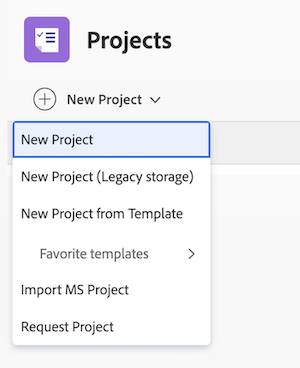

# Migración a Workfront en Adobe enterprise storage

El almacenamiento empresarial de Workfront en Adobe permite la experiencia completa de revisión y aprobación unificadas: revisiones en el visor Frame.io, potentes flujos de trabajo de aprobación, visibilidad de recursos entre productos y mucho más.

Los objetos existentes siguen funcionando como en la actualidad. El nuevo área Documentos, el visor Frame.io y otros comportamientos de almacenamiento empresarial de Adobe solo se aplican a objetos que utilizan el almacenamiento empresarial de Adobe.

Este artículo está dirigido a los administradores de Workfront que se preparan para implementar Workfront en el almacenamiento empresarial de Adobe. Abarca las principales diferencias en los objetos de almacenamiento empresarial de Adobe, cómo elegir el tipo de despliegue y qué pensar antes de habilitar el almacenamiento empresarial de Adobe para los usuarios.

>[!IMPORTANT]
>
>El contrato de Workfront debe incluir un SKU Workfront V2 para utilizar el visor Frame.io y el almacenamiento empresarial de Adobe. Para obtener más información, consulte las preguntas frecuentes en [Resumen unificado de revisión y aprobación](/help/quicksilver/review-and-approve-work/document-reviews-and-approvals/document-approvals-overview.md#getting-started-with-unified-review-and-approval).

## Comprender el almacenamiento Workfront heredado y el almacenamiento empresarial Adobe

Una vez actualizado el contrato para incluir la nueva experiencia de revisión y aprobación unificadas, el entorno puede contener dos tipos de objetos: objetos en el almacenamiento heredado de Workfront (los objetos que tiene hoy) y objetos creados con el almacenamiento empresarial de Adobe. En un nivel superior, los dos modelos de almacenamiento difieren en dónde se almacenan los datos, qué productos de Adobe pueden verlos y qué funcionalidad está disponible:

|  | Objeto en el almacenamiento heredado de Workfront | Objeto en el almacenamiento empresarial de Adobe |
|---|---|---|
| Servidor de almacenamiento | Solo Workfront | almacenamiento empresarial de Adobe |
| Visibilidad entre productos | Solo Workfront | Workfront, Frame.io y Creative Cloud |
| Funcionalidad | Funcionalidad heredada | Nueva funcionalidad |

Los objetos creados antes de habilitar el almacenamiento empresarial de Adobe en el área de Configuración permanecen en el almacenamiento heredado de Workfront. Los nuevos comportamientos que se describen en este artículo se aplican únicamente a los objetos de almacenamiento empresarial de Adobe que usted y los usuarios creen una vez habilitado el almacenamiento empresarial de Adobe.

## Diferencias con el almacenamiento empresarial de Adobe

El mayor cambio diario con el almacenamiento empresarial de Adobe es el nuevo área de Documentos y el visor Frame.io que permite la revisión y aprobación dentro de ella. Existen otras diferencias que afectan a la forma en que se administran los objetos, documentos y revisiones.

La siguiente tabla resume las principales diferencias al cambiar al almacenamiento empresarial de Adobe. Cada área de la tabla vincula a la sección detallada a continuación.

| Área | ¿Qué hay de diferente? | Qué se debe saber |
|---|---|---|
| [El área de documentos nuevos](#the-new-documents-area) | Un área de Documentos unificada y rediseñada reemplaza al área de Documentos heredada. | No hay área de documentos global. Acceder a documentos desde un programa, portafolio, proyecto, tarea o problema. |
| [Permisos de documentos](#document-permissions) | Los documentos heredan los permisos del proyecto, la tarea o el problema al que están vinculados. | No puede compartir ni establecer permisos en documentos individuales. Puede administrar todo el acceso a través del modal de uso compartido de objetos en Workfront, que se coloca en cascada en las carpetas de documentos generadas por el sistema. |
| [Asignación de permisos de objeto](#object-permissions-mapping) | Los permisos Administrar y Contribuir de Workfront se asignan a Editar y compartir en Frame.io. Ver asignaciones de Solo comentario. | Los permisos se administran en Workfront. Tanto los usuarios de Administrar como los de Contribute obtienen la capacidad de compartir contenido externo en Frame.io. |
| [Visor de revisión y aprobación](#review-and-approval-viewer) | El visor Frame.io reemplaza al visor de revisión de Workfront. | Incluido para todos los usuarios de Workfront con una licencia de pago. Admite marcado, comentarios con marca de tiempo, historial de versiones, móvil, más de 40 formatos, archivos de hasta 500 GB. |
| [Reglas de nomenclatura de objetos](#object-naming-rules) | Se aplican reglas de nomenclatura estrictas: nombres únicos dentro de un portafolio o proyecto, sin caracteres especiales, sin punto final ni espacio, límite de 255 caracteres. | Workfront cambia automáticamente el nombre de los objetos cuando surgen conflictos. Plantillas de auditoría que generan nuevos nombres y estructura de proyecto. |
| [Portabilidad del objeto](#object-portability) | Solo puede mover, copiar y convertir objetos entre modelos de almacenamiento similares. | Los objetos de almacenamiento empresarial de Adobe no se pueden mover a proyectos heredados o al revés. Al mover un proyecto de almacenamiento empresarial de Adobe a una cartera o programa heredado, el principal se convierte en almacenamiento empresarial de Adobe. |
| [Funciones no disponibles](#capabilities-not-available-on-adobe-enterprise-storage-objects) | Workfront Proof, el visualizador de documentos de Workfront, los documentos favoritos y los documentos de solicitud no forman parte de la experiencia. | Los objetos heredados conservan estas funciones. Workfront Proof no recibirá nuevas inversiones y se retirará en una versión futura. |
| [Cuota de almacenamiento](#storage-quota) | El almacenamiento se agrupa para proyectos de Workfront heredados y proyectos empresariales de Adobe. 60 GB por usuario con licencia. Sin tapa dura. | Los administradores del sistema pueden ver el uso del almacenamiento en la página Información del cliente en Configuración. |
| [Límite anual de revisión de vídeo](#annual-video-review-cap) | Límite de nivel organizativo en solicitudes de revisión de vídeo al 10% de las licencias de usuario pagadas de Workfront (estándar y básica). | Una vez alcanzado, no hay nuevas revisiones de vídeo hasta el siguiente período anual. Notificaciones en la aplicación al 80 % y al 100 %. No se aplica a los clientes de Frame.io Enterprise. |
| [Workfront Fusion](#workfront-fusion-on-adobe-enterprise-storage-projects) | Los escenarios de Fusion basados en pruebas existentes no funcionan automáticamente con los proyectos de almacenamiento empresarial de Adobe. | Los escenarios de los proyectos heredados siguen funcionando. Cada escenario afectado recibe una de las tres rutas: editar, reconstruir o retirar. Nuevos conectores previstos para el tercer trimestre de 2026. |

### La nueva área Documentos

La nueva área Documentos es una experiencia de documentos unificada diseñada para el almacenamiento empresarial de Adobe. Simplifica la navegación, consolida la actividad de revisión y aprobación y es el punto de entrada para el visor Frame.io.

El área de Documentos globales no forma parte de la nueva experiencia. En los proyectos de almacenamiento empresarial de Adobe, puede acceder a los documentos de un programa, portafolio, proyecto, tarea o problema.

Para obtener más información, vea [El área Documentos](/help/quicksilver/documents/managing-documents/documents-area.md).

### Permisos de documento

Los permisos de documento son fundamentalmente diferentes en los proyectos de almacenamiento empresarial de Adobe:

* No puede compartir ni establecer permisos en documentos individuales. En su lugar, los permisos se aplican a las carpetas de documentos generadas por el sistema que contienen los documentos.
* Las carpetas de documentos generadas por el sistema heredan los permisos de su proyecto, tarea o problema principal.
* Las subcarpetas heredan los permisos de la carpeta de documentos principal generada por el sistema.
* Las subtareas no heredan permisos de las tareas principales. Debe ser agregado directamente a una subtarea para acceder a su carpeta de documentos generada por el sistema.

Para obtener más información sobre cómo funcionan los permisos de documentos, consulte [Permisos de objetos e información general de nivel de acceso para el modelo de almacenamiento empresarial de Adobe](/help/quicksilver/review-and-approve-work/esm-access-permissions.md#how-document-permissions-work).

### Asignación de permisos de objeto

Los permisos se establecen en Workfront y fluyen en una dirección hasta Frame.io. No puede invitar a usuarios a un proyecto de almacenamiento empresarial de Adobe en Frame.io ni modificar los permisos de usuario en Frame.io.

>[!TIP]
>
>Capacite a los coordinadores de proyectos para que el acceso a Frame.io sea un reflejo descendente de los permisos de Workfront. Si una parte interesada informa de que no puede acceder a una revisión en un proyecto de almacenamiento empresarial de Adobe, la corrección se realiza en Workfront, no en Frame.io.

La siguiente tabla asigna los permisos de objetos de Workfront a los permisos de Frame.io:

| Permiso de Workfront | Permiso Frame.io |
|---|---|
| Administrar | Editar y compartir |
| Aportar | Editar y compartir |
| Ver | Solo comentario |

Tanto Administrar como Contribuir asignan a **Editar y compartir** en Frame.io. A medida que revise los patrones de uso compartido para proyectos de almacenamiento empresarial de Adobe, considere si se ajusta a su modelo de gobernanza para que los colaboradores tengan las mismas capacidades de revisión que los administradores, incluido el uso compartido externo.

Para obtener más información, consulte [Permisos de objeto e información general de nivel de acceso para el modelo de almacenamiento empresarial de Adobe](/help/quicksilver/review-and-approve-work/esm-access-permissions.md#permission-mapping-to-frameio).

### Visor de revisión y aprobación

En los objetos de almacenamiento empresarial de Adobe, el visor Frame.io es la superficie de revisión y aprobación en lugar de Workfront Proof. El visor Frame.io se incluye para todos los usuarios de Workfront con una licencia de pago.

El visor Frame.io proporciona lo siguiente:

* Herramientas de marcado y comentarios, incluido el dibujo a mano alzada y formas estándar como círculos, flechas y cuadrados
* Comentarios con marca de tiempo con precisión de cuadro para revisiones de vídeo
* Historial y comparación de versiones
* Acceso móvil para revisiones y aprobaciones sobre la marcha
* Compatibilidad con más de 40 formatos de archivo, incluidos todos los tipos comunes de vídeo, imagen, audio, PDF y Microsoft Office, con reproducción nativa para formatos de vídeo profesionales como ProRes, H.265 y DNxHD, y compatibilidad con archivos de hasta 500 GB

### Reglas de nomenclatura de objetos

El almacenamiento empresarial de Adobe aplica reglas estructurales y de nomenclatura estrictas para mantener la coherencia de la capa de almacenamiento en todos los productos de Adobe. Estas reglas se aplican a los objetos que crea en proyectos de almacenamiento empresarial de Adobe. Los proyectos heredados existentes mantienen sus nombres actuales.

Las siguientes reglas se aplican a los proyectos de almacenamiento empresarial de Adobe:

| Regla | Detalle |
|---|---|
| Nombres exclusivos de programas y proyectos | Los programas y proyectos no pueden tener el mismo nombre si pertenecen al mismo portafolio. |
| Nombres de documento únicos | Los documentos no pueden tener el mismo nombre si pertenecen al mismo proyecto. Los nombres de los documentos deben ser únicos dentro del mismo elemento principal en la jerarquía de carpetas. |
| Caracteres prohibidos | Los programas, portafolios, proyectos, plantillas, tareas, problemas, carpetas de documentos y documentos no pueden contener ninguno de los siguientes caracteres especiales: `\ / : * ? " \| < >` |
| Caracteres finales | Los programas, portafolios, proyectos, plantillas, tareas, problemas y carpetas de documentos no pueden tener nombres que terminen con un punto o un espacio. |
| Límite de longitud de nombre | Los nombres de objeto están limitados a 255 caracteres. |

Si un nombre entra en conflicto con estas reglas, Workfront cambia automáticamente el nombre del objeto para resolver el conflicto.

>[!TIP]
>
>Si crea proyectos de almacenamiento empresarial de Adobe a partir de plantillas, revise las plantillas existentes para que los nombres de proyecto y la estructura que generan se ajusten a las reglas anteriores.

### Portabilidad de objetos

Puede mover, copiar y convertir objetos de Workfront entre modelos de almacenamiento similares. Por ejemplo, puede mover una tarea de un proyecto de almacenamiento empresarial de Adobe a otro proyecto de almacenamiento empresarial de Adobe. No puede mover ni copiar una tarea o un problema de un proyecto de almacenamiento empresarial de Adobe en un proyecto heredado o al revés.

Hoy en día, cuando crea o mueve un proyecto de almacenamiento empresarial de Adobe a un portafolio o programa heredado, el portafolio o programa se convierte automáticamente en un objeto de almacenamiento empresarial de Adobe. Una versión futura proporcionará a los administradores del sistema más control sobre qué objetos se convierten automáticamente.

### Funciones no disponibles en objetos de almacenamiento empresarial de Adobe

Las siguientes funciones no forman parte de los objetos de almacenamiento empresarial de Adobe:

* Workfront Proof
* Visualizador de documentos de Workfront
* Documentos favoritos
* Solicitar documentos

Los proyectos heredados conservan el acceso a Workfront Proof y a las funciones de documentos heredadas enumeradas anteriormente. Workfront Proof no recibirá nuevas inversiones a partir de ahora y se retirará en una versión futura.

### Cuota de almacenamiento

El almacenamiento se agrupa para objetos de Workfront heredados y objetos de almacenamiento empresarial de Adobe. Cada usuario con licencia recibe 60 GB de almacenamiento. No hay un límite estricto en el uso del almacenamiento, pero los administradores de Workfront reciben notificaciones por correo electrónico cuando el uso alcanza el 75 %, el 90 % y el 100 % de la cuota.

Los administradores del sistema pueden ir a **Configuración** > **Sistema** > **Información del cliente** para ver el uso y la cuota de almacenamiento actuales.

Para obtener más información, consulte [Comprobar límites de almacenamiento de documentos](/help/quicksilver/documents/managing-documents/check-document-storage.md).

### Límite anual de revisión de vídeo

Hay un límite anual en las solicitudes de revisión de vídeo establecido en el 10% del total de licencias de usuario de Workfront pagadas de su organización (estándar y ligeras). Este límite se aplica en el nivel de organización.

* Los administradores de Workfront reciben notificaciones en la aplicación cuando el uso alcanza el 80 % y el 100 % del límite.
* Una vez alcanzado el límite, no puede crear nuevas solicitudes de revisión de vídeo hasta el siguiente periodo anual.
* Este límite no se aplica a los clientes de Frame.io Enterprise. Si su organización revisa regularmente grandes volúmenes de contenido de vídeo, póngase en contacto con el representante de su cuenta de Adobe para obtener más información sobre las licencias de Frame.io Enterprise.

Para obtener más información, consulte las Preguntas frecuentes sobre la revisión y aprobación de recursos y vídeos en [Resumen unificado de revisión y aprobación](/help/quicksilver/review-and-approve-work/document-reviews-and-approvals/document-approvals-overview.md).

### Workfront Fusion en proyectos de Adobe enterprise storage

Los escenarios de Workfront Fusion existentes basados en revisiones heredadas no funcionan automáticamente con los proyectos de almacenamiento empresarial de Adobe. Los módulos específicos de prueba, los ganchos web y los puntos de conexión de API tienen equivalentes directos en algunos casos y cambios significativos en otros. Los escenarios con ámbitos de proyectos heredados siguen funcionando como hoy en día.

Se espera que los conectores Fusion con compatibilidad nativa para la revisión y aprobación unificadas estén disponibles en el tercer trimestre de 2026.

Para obtener información detallada sobre el impacto en los tipos de escenarios comunes y cómo clasificar cada escenario como Editar, Reconstruir o Retirar según su funcionalidad, consulte [Actualizar escenarios de Workfront Fusion para una revisión y aprobación unificadas](/help/quicksilver/review-and-approve-work/tips-tricks-troubleshooting-approvals/fusion-remediation-for-unified-approvals.md).

## Elija cómo se despliega el almacenamiento empresarial de Adobe

Usted decide cómo se muestra el almacenamiento empresarial de Adobe a sus usuarios. Existen dos configuraciones, y cualquiera de ellas se puede aplicar a toda la organización o a grupos específicos de Workfront.

Para obtener instrucciones paso a paso, consulte [Habilitar el almacenamiento empresarial de Adobe para su organización](/help/quicksilver/administration-and-setup/set-up-workfront/configure-system-defaults/enable-esm.md).

* **Solo almacenamiento empresarial de Adobe**: los nuevos proyectos usan el almacenamiento empresarial de Adobe de forma predeterminada. Los usuarios no pueden crear proyectos heredados.
* **Almacenamiento empresarial de Adobe y almacenamiento Workfront heredado**: Cuando los usuarios crean un proyecto, eligen entre el almacenamiento empresarial de Adobe (con la etiqueta &quot;Nuevo proyecto&quot;) y el almacenamiento Workfront heredado (con la etiqueta &quot;Almacenamiento heredado&quot;).

  

>[!TIP]
>
>Para colocar primero el almacenamiento empresarial de Adobe delante de un equipo más pequeño, aplique cualquiera de las configuraciones a un solo grupo de Workfront. Esto permite ejecutar una prueba piloto de destino antes de desplegar de forma más amplia. Se recomienda comenzar con un despliegue a nivel de grupo para un ritmo controlado y luego expandirse a toda la organización una vez que el grupo piloto haya validado la experiencia.

Los objetos existentes mantienen el modelo de almacenamiento con el que se crearon. Al cambiar la preferencia de almacenamiento predeterminada, no se cambia ningún objeto existente.

## Planificación del despliegue

Cada entorno de Workfront es diferente. Antes de habilitar el almacenamiento empresarial de Adobe para los usuarios, dedique un tiempo a planificar el aspecto de un despliegue correcto para su organización. Las sugerencias a continuación no son una lista de comprobación, sino un punto de partida para su propio plan.

**1. Elija un grupo piloto.** Un despliegue con alcance de grupo le permite poner el almacenamiento empresarial de Adobe delante de un equipo más pequeño, recopilar comentarios y ajustar antes de un despliegue más amplio. Elija un grupo cuyos patrones de trabajo sean lo suficientemente representativos como para que aparezcan los problemas que desea conocer antes.

**2. Comunicar el cambio a los usuarios finales.** El mayor cambio visible para los revisores, aprobadores y propietarios de proyectos es el nuevo área de Documentos y el visor Frame.io, que permite la revisión y aprobación de proyectos de almacenamiento empresarial de Adobe. Planifique cómo los presentará para que los usuarios sepan qué esperar cuando se encuentren con su primer proyecto de almacenamiento empresarial de Adobe. El artículo [Introducción a la revisión y aprobación unificadas](/help/quicksilver/review-and-approve-work/get-started-with-unified-approvals.md) es un punto de partida útil para el material de cara al usuario final.

**3. Planifique la disponibilidad del conector de Workfront Fusion.** Se espera que los conectores Fusion con compatibilidad nativa para la revisión y aprobación unificadas estén disponibles en el tercer trimestre de 2026. Los escenarios de Fusion basados en pruebas existentes siguen funcionando en proyectos heredados. Antes de incluir equipos que dependan de esos escenarios en el programa piloto de almacenamiento empresarial de Adobe, decida si desea esperar los nuevos conectores, volver a compilar con la API actual o reemplazar esos escenarios con funciones nativas de revisión y aprobación unificadas.

Para obtener información detallada sobre el impacto en los tipos de escenarios comunes y cómo clasificar cada escenario como Editar, Reconstruir o Retirar según su funcionalidad, consulte [Actualizar escenarios de Workfront Fusion para una revisión y aprobación unificadas](/help/quicksilver/review-and-approve-work/tips-tricks-troubleshooting-approvals/fusion-remediation-for-unified-approvals.md).

## Artículos relacionados

* [Información general sobre el almacenamiento empresarial de Adobe](/help/quicksilver/review-and-approve-work/esm-overview.md)
* [Habilitar el almacenamiento empresarial de Adobe para su organización](/help/quicksilver/administration-and-setup/set-up-workfront/configure-system-defaults/enable-esm.md)
* [Resumen de revisión y aprobación unificadas](/help/quicksilver/review-and-approve-work/document-reviews-and-approvals/document-approvals-overview.md)
* [Introducción a la revisión y aprobación unificadas](/help/quicksilver/review-and-approve-work/get-started-with-unified-approvals.md)
* [El área Documentos](/help/quicksilver/documents/managing-documents/documents-area.md)
* [Permisos de objeto e información general del nivel de acceso para el modelo de almacenamiento empresarial de Adobe](/help/quicksilver/review-and-approve-work/esm-access-permissions.md)

