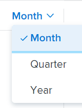
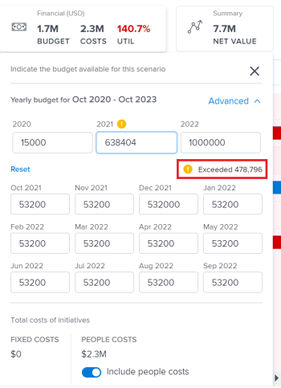

# Creación y edición de planes en [!DNL Scenario Planner]

Puede crear planes como parte del uso de [!DNL Workfront Scenario Planner] al priorizar la estrategia de nivel superior de su compañía. Para obtener más información sobre los planes, consulte [Información general sobre los planes en [!DNL Scenario Planner]](../scenario-planner/plans-overview.md).

<!--

(NOTE: talk about:

- Show people conflicts >> this impacts the conflicts calculation for initiatives>> link to the conflicts article

- explain what hovering over the green upward-pointing arrow does, with screen shot)

-->

## Requisitos de acceso

+++ Expanda para ver los requisitos de acceso para la funcionalidad en este artículo.

<table style="table-layout:auto"> 
 <col> 
 <col> 
 <tbody> 
  <tr> 
   <td> 
[!DNL Adobe Workfront] plan*
 </td> 
   <td> <ul></li>
   <li>
Nuevo: Ultimate 
</li>
   
El Scenario Planner no está disponible para los nuevos planes Workfront Select o Workfront Prime. 

   <li>
Actual: [!UICONTROL Business] o superior
</ul>
   </td> 
  </tr> 
  <tr> 
   <td> 
[!DNL Adobe Workfront] licencia*
 </td> 
   <td> 
Nuevo: Light o superior
 
   
Actual: [!UICONTROL Review] o superior
 </td> 
  </tr> 
  <tr> 
   <td>Producto* </td> 
   <td> <ul><li>
Para los nuevos planes de Workfront:

 Adobe Workfront</li>

   <li>
Para los planes actuales de Workfront: 

   
Adobe Workfront
 
Planificador de escenarios de Adobe Workfront
</li></ul>

Para obtener más información, consulte <a href="../scenario-planner/access-needed-to-use-sp.md" class="MCXref xref">Acceso necesario para utilizar [!DNL Scenario Planner]</a>. 
 </td> 
  </tr> 
  <tr data-mc-conditions=""> 
   <td>Nivel de acceso </td> 
   <td> 
Acceso de [!UICONTROL Edit] al [!DNL Scenario Planner]
 </td> 
  </tr> 
  <tr data-mc-conditions=""> 
   <td> 
Permisos de objeto 
 </td> 
   <td> 
Permisos de [!UICONTROL Manage] para un plan
 
Para obtener información sobre cómo solicitar acceso adicional a un plan, consulte <a href="../scenario-planner/request-access-to-plan.md" class="MCXref xref">Solicitar acceso a un plan en [!DNL Scenario Planner]</a>.
 </td> 
  </tr> 
 </tbody> 
</table>

*Para obtener más información, consulte [Requisitos de acceso a la documentación de Workfront](/help/quicksilver/administration-and-setup/add-users/access-levels-and-object-permissions/access-level-requirements-in-documentation.md).

+++

## Creación o edición de planes

Puede crear un plan desde cero o editar uno existente que se haya compartido con usted.

>[!NOTE]
>
>Después de crear un plan, se le considera el creador y propietario del plan. Cuando se desactiva un usuario, el plan no tiene propietario y nadie puede verlo a menos que se haya compartido previamente con un vínculo.

En este artículo se describe cómo crear un plan desde cero o cómo editar uno existente.

Para todas las consideraciones acerca de los planes, incluida la información disponible para un plan, vea [Información general sobre los planes en [!DNL Scenario Planner]](../scenario-planner/plans-overview.md).

Para obtener información sobre cómo eliminar planes, consulte [Eliminar planes en [!DNL Scenario Planner]](../scenario-planner/delete-plans.md).

Para crear o editar un plan:

{{step1-to-scenario-planner}}

Se muestra una lista de los planes existentes que ha creado en [!DNL Workfront Scenario Planner].

1. (Opcional) Haga clic en el icono **[!UICONTROL Filtro]** en la esquina superior derecha de la lista de planes y seleccione una de las siguientes opciones:

   | Filtro | Descripción |
   |---|---|
   | [!UICONTROL All] | Muestra todos los planes que ha creado o que se han compartido con usted. |
   | [!UICONTROL My plans] | Muestra los planes creados. |
   | [!UICONTROL Shared with me] | Muestra los planes compartidos con usted. |

   

1. (Opcional) Haga clic en el icono **[!UICONTROL Buscar]**  para escribir una palabra clave y localizar rápidamente un plan en la lista.

1. Haga clic en el nombre de un plan existente para editarlo y continuar con el paso 7.

   <!--
   
(NOTE: is the step still accurate) 

   -->

   O

   Haga clic en **[!UICONTROL Nuevo plan]** en la esquina superior izquierda para crear un plan y continuar con el paso 5.

   <!--
   
(NOTE: is the step still accurate)

   -->

   

   Se muestra el cuadro [!UICONTROL Nuevo plan].

   

1. (Condicional) Cuando cree un nuevo plan, especifique la siguiente información:

   <table style="table-layout:auto"> 
    <col> 
    <col> 
    <tbody> 
     <tr> 
      <td role="rowheader">[!UICONTROL Name]</td> 
      <td>Escriba un nombre diferente para el plan. Este campo es obligatorio.</td> 
     </tr> 
     <tr> 
      <td role="rowheader" colspan="2"> 
Importante: No puede modificar las siguientes selecciones después de crear y guardar el plan. 
 </td> 
     </tr> 
     <tr data-mc-conditions=""> 
      <td role="rowheader">FTE ([!UICONTROL Full Time Equivalent]) o [!UICONTROL Hours] </td> 
      <td> 
Seleccione una de las siguientes opciones para indicar cómo desea calcular la información de función para este plan: 
 
       <ul> 
      <li> 
<strong>FTE</strong>. Este es el valor predeterminado  
 
      
<b>IMPORTANTE</b>
  
      
Para todos los cálculos en [!DNL Scenario Planner], [!DNL Workfront] utilice el siguiente valor: 1 FTE = 8 Horas. 
 </li> 
      <li> 
<strong>[!UICONTROL Hours]</strong> 
 </li> 
       </ul> 
<b>IMPORTANTE</b>

   La opción que seleccione aquí determina cómo se muestra la información de funciones del plan, los escenarios del plan y las iniciativas
 </td>
   </tr> 
     <tr> 
      <td role="rowheader">[!UICONTROL Start date]</td> 
      <td> 
Seleccione el mes y el año en que desea que comience el plan. Solo puede seleccionar meses en este campo. [!DNL Workfront] supone que la fecha de inicio del plan es el primer día del mes seleccionado y que la fecha de finalización es el último día del fin de mes en su duración. 
 </td> 
     </tr> 
     <tr> 
      <td role="rowheader">[!UICONTROL Duration]</td> 
      <td> 
En el menú desplegable, seleccione una de las siguientes duraciones:
 
       <ul> 
        <li>1 año. Esta es la duración predeterminada. </li> 
        <li>3 años</li> 
        <li> 
5 años
 </li> 
       </ul> </td> 
     </tr> 
    </tbody> 
   </table>

<!--for table above - how FTE is calcualted: NOTE: snippet below: this is per Ani; it does NOT look at the system FTE.) 
-->

1. (Condicional) Haga Clic En **[!UICONTROL Next]**.

   La línea de tiempo del plan se muestra como el **[!UICONTROL Initial scenario]**.

   Para obtener información acerca de cómo crear escenarios adicionales, vea [Crear y comparar escenarios de plan en [!DNL Scenario Planner]](../scenario-planner/create-and-compare-scenarios-for-a-plan.md).

1. (Opcional) En el menú desplegable de la línea de tiempo, seleccione una de las opciones de la siguiente tabla para cambiar la forma en que ve la línea de tiempo del plan.

   

   | Opción de menú desplegable | Descripción |
   |---|---|
   | [!UICONTROL Mes] | Muestra la línea de tiempo por mes. Esta es la opción predeterminada y la única para un plan de un año. |
   | [!UICONTROL Trimestre] | Muestra la línea de tiempo por trimestre. Esta opción solo está disponible cuando la [!UICONTROL duración] del plan es de 3 o 5 años. Esta es la opción predeterminada para un plan de tres años. |
   | [!UICONTROL Año] | Muestra la línea de tiempo por año. Esta opción solo está disponible cuando la [!UICONTROL duración] del plan es de 5 años. Esta es la opción predeterminada para un plan de 5 años. |

1. (Opcional) Desplácese de izquierda a derecha para ver toda la duración del plan.
1. (Opcional) Haga clic en la línea del indicador **[!UICONTROL Hoy]** para regresar al día actual.

   

1. Haga clic en la casilla **[!UICONTROL Funciones del trabajo]** del encabezado del plan para añadir las funciones del trabajo que estarán disponibles para ejecutar el plan.

   Se muestran los detalles de la casilla [!UICONTROL Funciones del trabajo].

   >[!TIP]
   >
   >La unidad de asignación de roles (ETC u horas) que [!DNL Workfront] utiliza para este plan se muestra entre paréntesis en el título del cuadro.

   

1. Haga clic en el campo **[!UICONTROL empiece a escribir la función]** y seleccione una función de la lista o empiece a escribir el nombre de una función activa.

   Todas las funciones del trabajo activas en el sistema se muestran al hacer clic en este campo.

   Esto añade la función a la columna Funciones del trabajo.

1. Actualice o revise la siguiente información para la función:

   <table style="table-layout:auto"> 
    <col> 
    <col> 
    <tbody> 
     <tr> 
      <td role="rowheader"> 
[!UICONTROL Max available] (para FTE) 
 
o 
 
[!UICONTROL Total available] (para horas) 
 </td> 
      <td> 
Según si ha seleccionado el uso de horas o de jornadas completas (FTE) para el plan, escriba en los siguientes campos el número de jornadas completas u horas de la función que están disponibles para ejecutar trabajo en el plan: 
 
       <ul> 
        <li> 
<strong>[!UICONTROL Total available]</strong> (para horas): indique el número total de horas para todos los meses de duración del escenario. De manera predeterminada, [!DNL Workfront] dividirá equitativamente el número total disponible entre todos los meses de duración del escenario. 
 
Example: </b>"><b>Ejemplo: </b>Si introduce 1200 horas de diseñador, significa que el diseñador estará disponible 100 horas cada mes mientras dure el plan, cuando la [!UICONTROL Duration] del plan sea de 1 año. 
 </li> 
        <li> 
<b>[!UICONTROL Max available]</b> (para jornadas completas): indique el número de jornadas completas en que la función estará disponible cada mes mientras dure el plan. De manera predeterminada, <strong>Workfront</strong> asignará el número [!UICONTROL Max available] a cada mes mientras dure el escenario.
 
Example: </b>"><b>Ejemplo: </b>Si introduce 1 jornada completa de consultor, significa que el consultor estará disponible 1 FTE cada mes mientras dure el plan. 
 
Puede introducir un número inferior a 1 jornada completa. 
 
Example: </b>"><b>Ejemplo: </b>Una función de consultor de 0,5 significaría que el consultor dedicaría la mitad de su jornada completa (normalmente, 4 horas, ya que 8 horas es 1 FTE) a trabajar en este plan. Para todos los cálculos del planificador de escenarios, Workfront utiliza el siguiente valor: 1 FTE = 8 horas. 
 </li> 
       </ul> </td> 
     </tr> 
     <tr> 
      <td role="rowheader"> 
[!UICONTROL Max required] (para jornadas completas)
 
o 
 
[!UICONTROL Total required] (para horas) 
 </td> 
      <td> 
Según si ha seleccionado el uso de horas o de jornadas completas para su plan, revise el número de jornadas completas u horas de la función que son necesarias para completar las iniciativas del escenario. Revise los campos siguientes:
 
       <ul> 
        <li> 
<strong>[!UICONTROL Total required]</strong> (para horas): el número total de horas necesarias para todos los meses mientras dure el plan.
 </li> 
        <li> 
<strong>[!UICONTROL Max required]</strong> (para jornadas completas): el número máximo de jornadas completas necesarias para cualquiera de los meses mientras dure el plan. 
 </li> 
       </ul> 
Sugerencia: Se muestra el número máximo de jornadas completas o el número total de horas necesarias para esa función tras empezar a añadir iniciativas. Para obtener información acerca de cómo añadir iniciativas a un plan, consulte <a href="../scenario-planner/create-and-edit-initiatives.md" class="MCXref xref">Crear y editar iniciativas en el [!DNL Scenario Planner]</a>.
 </td> 
     </tr> <!--
      <tr data-mc-conditions="QuicksilverOrClassic.Draft mode"> 
       <td role="rowheader">[!UICONTROL Avg utilization]</td> 
       <td> 
(NOTE: this field was removed in 21.2 - May 2021) 
 
[!DNL Workfront] calculates the average utilization for each job role using the job role FTEs associated with initiatives (required) and the job role FTEs associated with the plan (available). 
 
 [!DNL Workfront] calculates the job role utilization percentage for a plan using the following formula: 
 
<code>Job role utilization percentage = Sum [(Required job roles for each month of the plan *100)/ (Available job roles for each month of the plan)] / Number of months in the Duration of the plan</code> 
 
        
Example: </b>"> <b>Example: </b> 
         
For example, if you have a plan with a duration of 12 months and an initiative with the duration of 2 months, where you use 1 Designer for your initiative (required job role) and there are 2 Designers available on the plan (available), the Utilization percentage for the Designer job role is calculated as follows:
 
         
<code>Designer utilization percentage = [(1/2 + 1/2) * 100] / 12 = 100 / 12 = 8.3%</code> 
 
        
 
As you add job roles to the plan and indicate the Available amount for each one, the [!UICONTROL Utilization] value for each role also updates and [!DNL Workfront] calculates a utilization percentage for the plan. For information about how [!DNL Workfront] calculates the Job Role Utilization for a plan, see <a href="../scenario-planner/plans-overview.md" class="MCXref xref">Plans overview in the [!DNL Scenario Planner]</a>. 
 
Tip: The Utilization percentage is rounded and has one decimal. 
 </td> 
      </tr>
     --> 
     <tr> 
      <td role="rowheader">[!UICONTROL Hourly rate]</td> 
      <td> 
Es la tarifa por [!UICONTROL Cost Hour] de la función. La tarifa por hora se muestra en la moneda del sistema. Para obtener información sobre la configuración de los tipos de cambio del sistema, consulte <a href="../administration-and-setup/manage-workfront/exchange-rates/set-up-exchange-rates.md" class="MCXref xref">Configurar tipos de cambio</a>.
 </td> 
     </tr> 
    </tbody> 
   </table>

1. (Opcional) Pase el ratón sobre el nombre de un rol o haga clic en la pestaña después de actualizar la información del rol y, a continuación, haga clic en el **[!UICONTROL icono de la papelera]**  para quitarlo del plan.
1. Haga clic en **[!UICONTROL Distribución de puestos de trabajo]**.

   El panel de distribución de funciones se muestra para todos los meses de duración del escenario.

   

1. Escriba el nombre de una función para añadirla al plan en el **[!UICONTROL Start typing job role field]** y, a continuación, haga clic en Intro cuando aparezca en la lista. Esta acción añadirá la función a la columna [!UICONTROL Funciones].
1. Actualice o revise la siguiente información para cada mes del escenario:

   <table style="table-layout:auto"> 
    <col> 
    <col> 
    <tbody> 
     <tr> 
      <td role="rowheader">[!UICONTROL Job Roles] (jornadas completas u horas)</td> 
      <td>Tanto la función disponible para el escenario como las necesarias para las iniciativas del escenario se muestran en el panel de distribución de funciones. En el encabezado de la columna, hay una indicación de si las estimaciones de funciones están en jornadas completas o en horas. </td> 
     </tr> 
     <tr> 
      <td role="rowheader"> 
[!UICONTROL Available] (máximo de &lt;number of FTEs&gt;) 
 
       
 
        
o
 
        
[!UICONTROL Available] (total de &lt;number of hours&gt;) 
 
       
 </td> 
      <td> 
Según si ha seleccionado el uso de horas o de jornadas completas para el plan, revise o actualice en los siguientes campos el número mensual de jornadas completas u horas de la función que están disponibles para el escenario:
 
       <ul> 
        <li> 
<strong>[!UICONTROL Available] (máximo de &lt;number of FTEs&gt;)</strong>: el número entre paréntesis muestra el número máximo de funciones disponibles para cualquiera de los meses del escenario. Revise o actualice el número de jornadas completas para cada mes del escenario. Si se cambia la asignación mensual, puede que se actualice el número de jornadas completas entre paréntesis. 
 </li> 
        <li> 
<strong>[!UICONTROL Available] (total de &lt;number of hours&gt;)</strong>: el número entre paréntesis muestra el número total de horas disponibles para todos los meses del escenario. Revise o actualice el número de horas para cada mes del escenario. Al cambiar la asignación mensual, se actualizará el número de horas entre paréntesis. 
 </li> 
       </ul> 
La actualización manual de las asignaciones mensuales de funciones es otra forma de resolver los conflictos de funciones entre iniciativas del escenario. 
 
Sugerencia:   
Para actualizar la disponibilidad mensual de funciones durante varios meses, escriba el número de horas o jornadas completas en el campo [!UICONTROL Available] de cualquier mes y, a continuación, arrastre la esquina del campo sobre los meses adyacentes para copiar el mismo valor en cada mes. Suéltelo para actualizar todos los meses. 
 
  
 
 </td> 
     </tr> 
     <tr> 
      <td role="rowheader"> 
[!UICONTROL Required] (máximo de &lt;number&gt;)
 
       
 
        
o
 
        
[!UICONTROL Required] (total de &lt;number&gt;)
 
       
 </td> 
      <td> 
Según si ha seleccionado el uso de horas o de jornadas completas para el plan, revise en los siguientes campos el número mensual de jornadas completas u horas de la función que serán necesarias para el escenario: 
 
       <ul> 
        <li> 
<strong>[!UICONTROL Required] (máximo &lt;número de EJC&gt;)</strong>: el número entre paréntesis muestra el número máximo de funciones requeridas para cualquiera de los meses del escenario. 
 </li> 
        <li> 
<strong>[!UICONTROL Required] (total &lt;número de horas&gt;)</strong>: el número entre paréntesis muestra el número total de horas requeridas para todos los meses del escenario. 
 </li> 
       </ul> 
Sugerencia: no puede modificar el número requerido de ECJ  u horas para la función. Este número se rellena para el escenario después de empezar a añadir iniciativas y sus requisitos de función. 
 </td> 
     </tr> 
     <tr> 
      <td role="rowheader">[!UICONTROL Difference]</td> 
      <td> 
       
 
        
La diferencia mensual entre las cantidades de funciones requeridas y las funciones disponibles para el escenario. [!DNL Workfront] calcula la diferencia para cada función de cada mes mediante la siguiente fórmula:
 
        
<code>Monthly role difference = Monthly required roles - Monthly available roles</code> (en ETC u horas) 
 
        
Sugerencia: cuando la diferencia muestra un número negativo, el escenario requiere más funciones de las que el plan tiene disponibles. Sus recursos están sobreasignados. 
 
       
 </td> 
     </tr> 
     <tr> 
      <td role="rowheader">% de [!UICONTROL Utilization]</td> 
      <td> 
       
 
        
El porcentaje de utilización muestra cuántas de las funciones disponibles se utilizan realmente (o se requieren) en las iniciativas del escenario. 
 
        
[!DNL Workfront] calcula la utilización por función y mes mediante la fórmula siguiente: 
 
        
<code>Monthly role utilization % = Monthly required roles / Monthly available roles * 100</code> 
 
        
El porcentaje de utilización puede mostrarse en los colores siguientes, según la asignación de los recursos:
 
        <ul> 
         <li> 
<b>Verde</b>: las cantidades de funciones disponibles y requeridas coinciden. Los recursos se asignan por completo y el porcentaje de utilización es del 100 %. 
 </li> 
         <li> 
<b>Rojo</b>: hay más funciones requeridas de los que el plan tiene disponibles. Los recursos están sobreasignados y el porcentaje de utilización es superior al 100 %.
 </li> 
         <li> 
<b>Azul</b>: hay más funciones disponibles de las que se requieren. Los recursos están infraasignados y el porcentaje de utilización es inferior al 100 %. 
 </li> 
        </ul> 
       
 
  
 </td> 
     </tr> 
    </tbody> 
   </table>

1. Haga clic en **[!UICONTROL Aplicar]** para guardar la distribución mensual de funciones

   O

   Haga clic en **[!UICONTROL Cancelar]** para cerrar la lista de distribución de funciones y volver al escenario.

1. Haga clic en el cuadro **[!UICONTROL Financiero]** del encabezado del plan para añadir el presupuesto para este plan.

   Se muestran los detalles del cuadro [!UICONTROL Financiero].

   >[!TIP]
   >
   >La moneda que [!DNL Workfront] usa para este plan se muestra entre paréntesis en el título del cuadro.

1. Especifique el **[!UICONTROL presupuesto anual]**.

   >[!NOTE]
   >
   >Si el plan abarca varios años, debe especificar una cantidad del presupuesto para cada año.

1. Presione Intro para guardar el presupuesto anual y después [!UICONTROL Tab] para pasar al año siguiente.

   El presupuesto anual se distribuye automáticamente de forma equitativa para cada mes del año seleccionado.

1. Haga clic en **[!UICONTROL Avanzado]** para ver la distribución de mensual del presupuesto. Los presupuestos anuales y mensuales son siempre números redondeados. Cuando el importe del presupuesto no puede distribuirse por igual entre todos los meses de un año debido a los decimales, aparece un indicador **[!UICONTROL Restante]** debajo de la distribución anual del presupuesto.

   

1. Ajuste manualmente los presupuestos mensuales para eliminar los importes excedentes.

   Cuando el total de todos los importes del presupuesto mensual es superior al presupuesto anual, aparece un indicador de advertencia **[!UICONTROL Supera]** debajo de la distribución del presupuesto anual. Ajuste manualmente los importes del presupuesto mensual hasta que sean iguales o inferiores al presupuesto disponible para el plan.

   

1. Deshabilite la configuración **[!UICONTROL Incluir costes de personal]** para excluir los costes asociados con las funciones del cómputo del coste total del plan. Los costos fijos siempre se contabilizan en el coste total del plan. Esta opción está habilitada de manera predeterminada y afecta a todos los escenarios del plan.
1. Haga clic en cualquier lugar fuera del cuadro [!UICONTROL Financiero] para cerrarlo. La información introducida se guarda automáticamente.

   Ahora puede empezar a crear las iniciativas en el plan y añadir escenarios.

1. (Recomendado) Haga clic en **[!UICONTROL Nueva iniciativa]** para añadir una nueva iniciativa.

   <!--
   
(NOTE: Should this include information on how to create scenarios - see also information about scenarios in Manage Plans?)

   -->

   Para obtener información acerca de cómo añadir iniciativas, consulte el artículo [Crear y editar iniciativas en el [!DNL Scenario Planner]](../scenario-planner/create-and-edit-initiatives.md).

1. (Opcional) Realice una copia del escenario existente para crear un nuevo escenario del mismo plan. Para obtener más información acerca de cómo crear y trabajar con varios escenarios, consulte [Crear y comparar escenarios de plan en  [!DNL Scenario Planner]](../scenario-planner/create-and-compare-scenarios-for-a-plan.md).
1. Haga clic en **[!UICONTROL Guardar plan]**.

   Se ha creado o actualizado su plan.

1. (Opcional) Haga clic en el icono **[!UICONTROL Favoritos]**  a la derecha del nombre del plan para agregar el plan a su lista de Favoritos.

1. (Opcional) Copie la dirección URL del plan y envíela a cualquier otro usuario que pueda necesitar revisarla o actualizarla. Deben tener al menos acceso de [!UICONTROL Vista] en su nivel de acceso para poder ver el plan. Deben tener acceso de [!UICONTROL Editar] para editarlo. Si debe revisar información financiera del plan, como presupuestos, costes e información sobre tarifas de funciones, también debe tener acceso a [!UICONTROL Datos financieros] en su nivel de acceso. Para obtener información acerca del acceso necesario para [!DNL Scenario Planner], vea [Acceso necesario para usar el  [!DNL Scenario Planner]](../scenario-planner/access-needed-to-use-sp.md).
