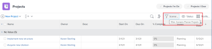

# Actualice o cree proyectos publicando iniciativas en el [!DNL Scenario Planner]

Publicación de un escenario desde el [!DNL Adobe Workfront Scenario Planner] logra lo siguiente:

* Crea proyectos a partir de las iniciativas del escenario y los vincula.
* Actualiza proyectos ya vinculados a iniciativas sobre el escenario con información de la iniciativa vinculada. Los proyectos también se pueden vincular a iniciativas cuando se importan en un plan. Para obtener más información, consulte [Importar proyectos a planes en el [!DNL Scenario Planner]](../scenario-planner/import-projects-to-plans.md)

## Requisitos de acceso

Debe tener lo siguiente:

<table style="table-layout:auto"> 
 <col> 
 <col> 
 <tbody> 
  <tr> 
   <td> 
[!DNL Adobe Workfront] plan*
 </td> 
   <td>[!UICONTROL Business] o superior</td> 
  </tr> 
  <tr> 
   <td> 
[!DNL Adobe Workfront] licencia*
 </td> 
   <td> 
[!UICONTROL Review] o superior
 </td> 
  </tr> 
  <tr> 
   <td>Product </td> 
   <td> 
Debe adquirir una licencia adicional para [!DNL Adobe Workfront Scenario Planner] para acceder a la funcionalidad descrita en este artículo.
 
Para obtener información sobre cómo obtener la variable [!DNL Workfront Scenario Planner], consulte <a href="../scenario-planner/access-needed-to-use-sp.md" class="MCXref xref">Acceso necesario para usar la variable [!DNL Scenario Planner]</a>. 
 </td> 
  </tr> 
  <tr data-mc-conditions=""> 
   <td> 

 
Nivel de acceso*
 </td> 
   <td> 
    <ul> 
    <li>Acceso de [!UICONTROL Edit] para [!DNL Scenario Planner] y proyectos</li></ul>

<b>NOTA</b>

Si todavía no tiene acceso, pregunte a su [!DNL Workfront] administrador si establecen restricciones adicionales en su nivel de acceso. Para obtener información sobre cómo se [!DNL Workfront] administrador puede cambiar el nivel de acceso, consulte <a href="../administration-and-setup/add-users/configure-and-grant-access/create-modify-access-levels.md" class="MCXref xref">Crear o modificar niveles de acceso personalizados</a>.
 </td>
</tr> 
  <tr data-mc-conditions=""> 
   <td> 
Permisos de objeto
 </td> 
   <td> 
    <ul> 
     <li>Permisos de [!UICONTROL Administrar] para el plan </li> 
     <li>Permisos de [!UICONTROL Administrar] para proyectos publicados</li> 
    </ul> 
Para obtener información sobre la solicitud de acceso adicional a los proyectos, consulte <a href="../workfront-basics/grant-and-request-access-to-objects/request-access.md" class="MCXref xref">Solicitar acceso a objetos </a>.
 
Para obtener información sobre la solicitud de acceso adicional a un plan, consulte <a href="../scenario-planner/request-access-to-plan.md" class="MCXref xref">Solicitar acceso a un plan en la [!DNL Scenario Planner]</a>.
 </td> 
  </tr> 
 </tbody> 
</table>

&#42;Para saber qué plan, tipo de licencia o acceso tiene, póngase en contacto con su [!DNL Workfront] administrador.

Para obtener información adicional sobre el acceso a la variable [!DNL Workfront Scenario Planner], consulte [Acceso necesario para usar la variable [!DNL Scenario Planner]](../scenario-planner/access-needed-to-use-sp.md).

## Requisitos previos

Antes de empezar:

* Debe crear y guardar un plan para poder publicar iniciativas a partir de él.

## Consideraciones sobre la publicación de iniciativas en proyectos

* Solo puede publicar un escenario desde un plan.
* Una iniciativa sólo puede vincularse a un proyecto.
* Un proyecto puede vincularse a más de una iniciativa cuando las iniciativas pertenecen a planes diferentes.

   >[!TIP]
   >
   >Cuando existe un proyecto en varios planes y se publica información en el proyecto desde todos los planes, la última publicación sobrescribe la existente [!DNL Scenario Planner] información sobre el proyecto.

* Si se crearon iniciativas sobre el plan mediante la importación de proyectos al plan, la publicación de la iniciativa también actualiza los proyectos vinculados con información de la iniciativa.

   >[!TIP]
   >
   >Puede importar el mismo proyecto en varios planes. La publicación puede sobrescribir la información de la iniciativa en un proyecto vinculado a varias iniciativas.

   Para obtener información sobre la creación de iniciativas mediante la importación de proyectos, consulte [Importar proyectos a planes en el [!DNL Scenario Planner]](../scenario-planner/import-projects-to-plans.md).

* Los cambios realizados en el proyecto no se transfieren a la iniciativa vinculada.

## Publicar iniciativas

>[!IMPORTANT]
>
>Si realiza cambios en las iniciativas del plan, incluida la resolución de conflictos, debe volver a publicar la iniciativa para que la nueva información sea visible en el proyecto. Esta información solo se muestra en los proyectos vinculados a iniciativas cuando publica la iniciativa correspondiente. Para obtener información sobre la resolución de conflictos entre iniciativas, consulte [Resolver conflictos de iniciativa en el [!DNL Scenario Planner]](../scenario-planner/resolve-conflicts-in-sp.md)

1. Haga clic en el **[!UICONTROL Menú principal]** icono  en la esquina superior derecha de Workfront, haga clic en **[!UICONTROL Situaciones]**
1. (Opcional y condicional) Si desea publicar desde un plan existente, haga clic en el **[!UICONTROL Filtro]** icono  en la esquina superior derecha del plan y seleccione una de las siguientes opciones:

   <table style="table-layout:auto"> 
    <col> 
    <col> 
    <tbody> 
     <tr> 
      <td role="rowheader">[!UICONTROL Todo]</td> 
      <td>Muestra todos los planes que posee o que ha compartido con usted. Este es el valor predeterminado. </td> 
     </tr> 
     <tr> 
      <td role="rowheader">[!UICONTROL Mis planes]</td> 
      <td>Muestra los planes que ha creado.</td> 
     </tr> 
     <tr> 
      <td role="rowheader">[!UICONTROL Compartido conmigo]</td> 
      <td> 
Muestra los planes que no ha creado pero que se han compartido con usted.
 
Importante: Debe tener permisos de [!UICONTROL Administrar] para planes compartidos con usted para poder publicarlos. 
 </td> 
     </tr> 
    </tbody> 
   </table>

   

1. (Opcional) Haga clic en el **[!UICONTROL Buscar]** icono  y empiece a escribir el nombre de un plan para encontrarlo rápidamente en la lista.
1. (Condicional) Para publicar desde un nuevo plan, cree un plan.

   Para obtener información sobre la creación de planes, consulte [Cree y edite planes en el [!DNL Scenario Planner]](../scenario-planner/create-and-edit-plans.md) .

1. (Opcional) Haga clic en el nombre de un plan existente y cree nuevos escenarios para el plan.

   Para obtener información sobre la creación de escenarios para un plan, consulte [Cree y compare escenarios de plan en la variable [!DNL Scenario Planner]](../scenario-planner/create-and-compare-scenarios-for-a-plan.md).

1. (Opcional) Actualice las iniciativas de un plan existente o nuevo o cree otros nuevos.

   Para obtener información sobre la creación de iniciativas, consulte [Cree y edite iniciativas en la [!DNL Scenario Planner]](../scenario-planner/create-and-edit-initiatives.md).

1. Haga clic en **[!UICONTROL Guardar plan]**.
1. Seleccione el escenario que desea publicar desde el **[!UICONTROL Situación inicial]** menú desplegable y haga clic en **[!UICONTROL Vaya a Publicar]**  en la esquina superior derecha.

   O

   Haga clic en **[!UICONTROL Comparar escenarios]**, pase el ratón sobre la tarjeta del escenario desde la que desea publicar y, a continuación, haga clic en **[!UICONTROL Vaya a Publicar]** .

   La variable [!UICONTROL Publicar iniciativas] se muestra una lista de todas las iniciativas del escenario. Si alguna de las iniciativas se publicó anteriormente, aparece el icono del proyecto  se muestra después de su nombre y **[!UICONTROL Última publicación]** date se rellena en la lista.

   >[!TIP]
   >
   >Las iniciativas que se han creado mediante la importación de proyectos también muestran el icono del proyecto  a la derecha de su nombre

   

1. (Opcional y condicional) Si desea publicar desde un plan existente, haga clic en el **[!UICONTROL Filtro]** icono  en la esquina superior derecha del plan y seleccione una de las siguientes opciones:

   <table style="table-layout:auto"> 
    <col> 
    <col> 
    <tbody> 
     <tr> 
      <td role="rowheader">[!UICONTROL Todo]</td> 
      <td>Muestra todas las iniciativas del escenario seleccionado. </td> 
     </tr> 
     <tr> 
      <td role="rowheader">[!UICONTROL Publicado]</td> 
      <td>Muestra las iniciativas que usted u otro usuario publicaron anteriormente. </td> 
     </tr> 
     <tr> 
      <td role="rowheader">[!UICONTROL No publicado]</td> 
      <td> 
Muestra las iniciativas no publicadas. 
 </td> 
     </tr> 
    </tbody> 
   </table>

   

1. (Opcional) Haga clic en el **[!UICONTROL Buscar]** icono  y empiece a escribir el nombre de una iniciativa para encontrarla rápidamente en la lista.
1. Seleccione una o varias iniciativas para publicarlas, crear o actualizar proyectos a partir de ellas y, a continuación, haga clic en **[!UICONTROL Publicar iniciativas]**.

   Esto crea un nuevo proyecto a partir de cada iniciativa seleccionada o actualiza los proyectos conectados existentes, si las iniciativas publicadas ya estaban vinculadas a un proyecto.

   >[!TIP]
   >
   >Los nuevos proyectos tienen el mismo nombre que las iniciativas publicadas.

1. (Condicional) Realice una de las siguientes acciones:

   * Si ha publicado una iniciativa, haga clic en **[!UICONTROL Ver proyecto asociado]** para abrir el proyecto creado o actualizado a partir de la iniciativa.
   * Si ha publicado más de una iniciativa, haga clic en **[!UICONTROL Ver proyectos asociados]** para abrir una lista de proyectos publicados a partir de iniciativas. [!DNL Workfront] aplica el [!DNL Scenario Planner] Los proyectos se filtran a la lista de proyectos de forma predeterminada. Los proyectos publicados más recientemente se muestran en la parte superior de la lista.

      

1. Vaya a las siguientes áreas para ver la información de la iniciativa sobre el proyecto:

   * **La variable [!UICONTROL Actualizaciones] sección**: Se publica una actualización para indicar que el proyecto se creó o actualizó a partir de la iniciativa. La actualización contiene el nombre de la iniciativa que creó o actualizó el proyecto y el nombre vinculado del plan que contiene la iniciativa. Puede hacer clic en el nombre del plan en la actualización para abrir el plan en la [!DNL Scenario Planner].

      

   * **La variable [!UICONTROL Información general] del [!UICONTROL Detalles del proyecto] sección**: Un nuevo [!DNL Scenario Planner] se crea en esta área que contiene información de la iniciativa vinculada.

      

      La siguiente información sobre la iniciativa se publica en la [!DNL Scenario Planner] del [!UICONTROL Detalles del proyecto] sección:

      <table style="table-layout:auto"> 
      <col> 
      <col> 
      <tbody> 
       <tr> 
        <td role="rowheader">[!UICONTROL Duración de la iniciativa] </td> 
        <td>Duración de la iniciativa correspondiente cuando el proyecto está vinculado a una iniciativa. Este campo no es editable. </td> 
       </tr> 
       <tr> 
        <td role="rowheader">[!UICONTROL Última fecha de publicación] </td> 
        <td>La fecha en la que se publicó el proyecto por última vez a partir de una iniciativa correspondiente. </td> 
       </tr> 
       <tr> 
        <td role="rowheader">[!UICONTROL Fecha de inicio de la iniciativa] </td> 
        <td>El primer día del mes de inicio de la iniciativa, cuando el proyecto está vinculado a una iniciativa. </td> 
       </tr> 
       <tr> 
        <td role="rowheader">[!UICONTROL Fecha de finalización de la iniciativa] </td> 
        <td>El último día del mes final de la iniciativa, cuando el proyecto está vinculado a una iniciativa.  </td> 
       </tr> 
       <tr> 
        <td role="rowheader">[!UICONTROL Funciones de trabajo de la Iniciativa en los Estados Unidos y las horas] </td> 
        <td> 
Información sobre las funciones de trabajo asociadas y sus asignaciones de tiempo para la iniciativa. Esto incluye:
 
         <ul> 
          <li>Nombre de la función del trabajo</li> 
          <li>Número de ETC</li> 
          <li> 
Número de horas para todos los ETC
 
Puede estimar la cantidad de funciones de trabajo necesarias para su plan o iniciativa mediante horas o FTE.
 
Para obtener más información, consulte <a href="../scenario-planner/create-and-edit-plans.md" class="MCXref xref">Crear y editar planes en el planificador de escenarios</a>. 
 </li> 
         </ul> 
      
<b>SUGERENCIA</b>

      Si el número de funciones es diferente para cada mes en la iniciativa, este campo muestra la cantidad máxima de funciones necesarias para la iniciativa. Por ejemplo, si necesita 1 consultor para enero y 2 para febrero, la columna muestra 2FTE y la cantidad correspondiente de horas para 2 FTE para todos los meses.
 </td>
      </tr> 
      </tbody> 
     </table>

      >[!NOTE]
      >
      >Todos los usuarios con [!UICONTROL Ver] el acceso al proyecto puede ver la [!DNL Scenario Planner] en la sección [!UICONTROL Información general] . Puede controlar si esta área se muestra en la variable [!UICONTROL Detalles] mediante una plantilla de diseño. Si los usuarios no tienen asociada una plantilla de diseño, esta área se muestra de forma predeterminada.
      >
      >   
      >   
      >   * Para obtener información sobre cómo agregar o quitar áreas en la variable [!UICONTROL Detalles] sección con una plantilla de diseño, consulte [Personalice el [!UICONTROL Detalles] visualización mediante una plantilla de diseño](../administration-and-setup/customize-workfront/use-layout-templates/customize-details-view-layout-template.md).
      >   * Para obtener más información sobre la visualización de información en la [!UICONTROL Información general] del [!UICONTROL Detalles del proyecto], consulte [[!UICONTROL Administrar] información del proyecto [!UICONTROL Información general] area](../manage-work/projects/manage-projects/understand-project-overview-area.md).

   * **La variable [!UICONTROL Asignación de funciones] del panel [!UICONTROL Equilibrador de carga de trabajo] o la lista de tareas del proyecto**: La información sobre la asignación de funciones en la iniciativa se rellena en esta área, además de las asignaciones de funciones en el proyecto.

      Para obtener más información, consulte [Visión general de la conciliación de las asignaciones de recursos entre proyectos e iniciativas](../scenario-planner/overview-reconcile-allocations-between-projects-initiatives.md).

      

      Cualquier cambio en las fechas o recursos del proyecto no afecta a la iniciativa correspondiente ni a ninguna de las áreas del proyecto que contengan información de la iniciativa.

   * **La variable [!UICONTROL Presupuestación de recursos] del [!UICONTROL Caso empresarial] del proyecto**: Una nueva opción para administrar los recursos del proyecto mediante [!DNL Scenario Planner] la información se agrega en la variable [!UICONTROL Presupuestación de recursos] del [!UICONTROL Caso empresarial] del proyecto.

      Para obtener más información, consulte [Los recursos presupuestarios de [!UICONTROL Caso empresarial] usando la variable [!DNL Scenario Planner]](../manage-work/projects/define-a-business-case/budget-resources-in-business-case-use-scenario-planner.md).

      

1. (Opcional) Revise la siguiente información en la sección [!DNL Scenario Planner] después de publicar un escenario:

   * El escenario publicado se convierte en el primer escenario después de publicar iniciativas desde él.
   * No puede publicar desde ningún otro escenario después de publicar un escenario al menos una vez.
   * La variable [!UICONTROL Vaya a Publicar] se elimina de todos los demás escenarios después de publicar al menos una iniciativa de un escenario.
   * Aparece un indicador verde junto a los iconos de proyecto de las iniciativas publicadas en el plan.

      

   * Se muestra un indicador verde &quot;Publicado&quot; en la parte superior del escenario y en la tarjeta del escenario y el campo Publicado se rellena en la tarjeta del escenario indicando el número de iniciativas en el escenario que se han publicado.

      

      >[!TIP]
      >
      >Si se eliminan todos los proyectos publicados a partir de las iniciativas del escenario, se elimina la indicación de que el escenario se ha publicado. Para obtener más información, consulte [Eliminar proyectos](../manage-work/projects/manage-projects/delete-projects.md).

1. (Opcional) Actualice la información sobre la iniciativa y repita el proceso descrito anteriormente para volver a publicar la iniciativa y actualizar la información de la iniciativa sobre el proyecto vinculado.

   Para obtener información sobre la edición de iniciativas, consulte [Cree y edite iniciativas en la [!DNL Scenario Planner]](../scenario-planner/create-and-edit-initiatives.md).

