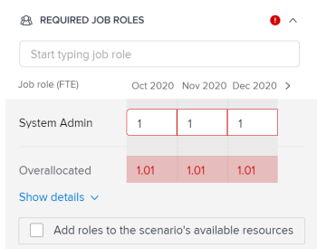

# Resolver conflictos de iniciativa en el [!DNL Scenario Planner]

Cuando las iniciativas entran en conflicto entre sí, compiten por los mismos recursos. Los recursos disponibles para un escenario no son suficientes para cubrir todos los recursos necesarios para todas las iniciativas del escenario.

Esto puede ocurrir en cualquiera de los siguientes casos:

* El número de funciones que se requieren para la iniciativa es mayor que el número de funciones presupuestadas para el plan.
* Los costos de la iniciativa son mayores que la cantidad del presupuesto disponible para el plan.

## Requisitos de acceso

Debe tener lo siguiente:

<table style="table-layout:auto"> 
 <col> 
 <col> 
 <tbody> 
  <tr> 
   <td> 
[!DNL Adobe Workfront]<b> plan*</b> 
 </td> 
   <td>[!UICONTROL Business] o superior</td> 
  </tr> 
  <tr> 
   <td> 
[!DNL Adobe Workfront]<b> licencia*</b> 
 </td> 
   <td> 
[!UICONTROL Review] o superior
 </td> 
  </tr> 
  <tr> 
   <td><b>Product</b> </td> 
   <td> 
Debe adquirir una licencia adicional para [!DNL Adobe Workfront Scenario Planner] para acceder a la funcionalidad descrita en este artículo.
 
Para obtener información sobre cómo obtener la variable [!DNL Workfront Scenario Planner], consulte <a href="../scenario-planner/access-needed-to-use-sp.md" class="MCXref xref">Acceso necesario para usar la variable [!DNL Scenario Planner]</a>. 
 </td> 
  </tr> 
  <tr data-mc-conditions=""> 
   <td><strong>Configuraciones de nivel de acceso*</strong> </td> 
   <td> 
[!UICONTROL Editar] o superior a la variable [!DNL Scenario Planner]
 
Nota: Si todavía no tiene acceso, pregunte a su [!DNL Workfront] administrador si establecen restricciones adicionales en su nivel de acceso. Para obtener información sobre cómo se [!DNL Workfront] administrador puede cambiar el nivel de acceso, consulte <a href="../administration-and-setup/add-users/configure-and-grant-access/create-modify-access-levels.md" class="MCXref xref">Crear o modificar niveles de acceso personalizados</a>.
 </td> 
  </tr> 
  <tr data-mc-conditions=""> 
   <td> 
<strong>Permisos de objeto</strong> 
 </td> 
   <td> 
Permisos de [!UICONTROL Administrar] para un plan
 
Para obtener información sobre la solicitud de acceso adicional a un plan, consulte <a href="../scenario-planner/request-access-to-plan.md" class="MCXref xref">Solicitar acceso a un plan en la [!DNL Scenario Planner]</a>.
 </td> 
  </tr> 
 </tbody> 
</table>

&#42;Para saber qué plan, tipo de licencia o acceso tiene, póngase en contacto con el administrador de Workfront.

## Información general sobre resolución de conflictos

* Un conflicto también se entiende como una sobreasignación de las funciones de trabajo o del presupuesto de un escenario.
* When [!DNL Workfront] detecta un conflicto; la barra correspondiente al mes conflictivo durante la duración de la iniciativa se muestra en rojo. Esto puede ocurrir en cualquiera de los siguientes casos:

   * El número de funciones que se requieren mensualmente para una iniciativa es mayor que el número de funciones presupuestadas para el plan después de que todas las iniciativas anteriores hayan utilizado los recursos presupuestados para el plan.
   * Los costos mensuales de la iniciativa son mayores que el presupuesto disponible para el plan después de que todas las iniciativas anteriores hayan utilizado el presupuesto del plan para cubrir sus costos.

>[!TIP]
>
>De forma predeterminada, la variable [!DNL Scenario Planner] supone que ha presupuestado 0 funciones de trabajo y 0 $ o el equivalente de 0 $ en la moneda del sistema para un escenario, a menos que haya especificado lo contrario. El número de funciones de trabajo indica el número de FTE (equivalentes a tiempo completo) u horas presupuestadas para la función de trabajo.
>
>Para todos los cálculos del Planificador de escenarios, Workfront utiliza el siguiente valor: 1 FTE = 8 horas.
>
>Para obtener información sobre la actualización de las funciones disponibles para un plan y un presupuesto, consulte [Cree y edite planes en el [!DNL Scenario Planner]](../scenario-planner/create-and-edit-plans.md).

* Puede resolver un conflicto realizando una de las siguientes acciones:

   * Añada automáticamente los recursos necesarios que faltan de las iniciativas del escenario. Este artículo describe cómo resolver conflictos usando esta opción.
   * Ajuste de la función de trabajo y los recursos presupuestarios para el escenario, editando el plan. Para obtener más información, consulte [Cree y edite planes en el [!DNL Scenario Planner]](../scenario-planner/create-and-edit-plans.md).

## Resolver conflictos entre iniciativas

1. Vaya a un plan para el que desee resolver conflictos.

   Para obtener información sobre la creación de planes, consulte [Cree y edite planes en el [!DNL Scenario Planner]](../scenario-planner/create-and-edit-plans.md).

   Para obtener información sobre la creación de iniciativas, consulte [Cree y edite iniciativas en la [!DNL Scenario Planner]](../scenario-planner/create-and-edit-initiatives.md).

1. (Opcional) Desde la **[!DNL Initial scenario]** menú desplegable, seleccione el escenario que desee revisar.

   >[!TIP]
   >
   >Un plan puede tener varios escenarios. Al examinar los conflictos del plan, [!DNL Workfront] se refiere a los recursos disponibles actualmente en el escenario seleccionado y a los que se requieren en las iniciativas de dicho escenario. Para obtener información sobre escenarios, consulte [Cree y compare escenarios de plan en la variable [!DNL Scenario Planner]](../scenario-planner/create-and-compare-scenarios-for-a-plan.md).

1. Asegúrese de que **[!UICONTROL Mostrar conflictos]** está activada. Está activada de forma predeterminada.

   

   La primera iniciativa en conflicto muestra los meses que tienen conflictos en rojo y aparece un icono de advertencia junto al nombre de la iniciativa.

   El fondo de todas las iniciativas que comienzan con la primera en conflicto aparece en rojo en el gráfico del plan.

   Cuando una iniciativa muestra un conflicto, significa que el número de funciones para al menos una función específica, los costes incurridos o ambos exceden el número de funciones o el presupuesto definido para el plan para un mes específico.

   

1. Realice una de las siguientes acciones para comprender mejor los conflictos que puedan existir:

   * Pase el ratón sobre el icono de advertencia situado junto al nombre de la iniciativa para saber si tiene una función de trabajo o un conflicto presupuestario.

      

      En función de si ha asignado funciones de trabajo de forma excesiva o si ha sobreestimado los costes de su iniciativa, puede que vea una de las siguientes opciones al pasar el ratón por encima del icono de advertencia:

      * Mostrar detalles de los conflictos de las funciones del puesto
      * Mostrar detalles de los conflictos del presupuesto
      * Mostrar la función del trabajo y los detalles del presupuesto
   * Cuando vea el plan por mes, pase el ratón sobre un mes en la cronología del plan para ver los recursos necesarios para ese mes y si los conflictos del mes son personas o están relacionados con los costos.

      

      Revise la siguiente información mensual a nivel de plan:

      * Número de funciones de trabajo disponibles, requeridas y sobreasignadas para el mes en todas las iniciativas planificadas para ese mes
      * Los costos disponibles, requeridos y sobreasignados para el mes para todas las iniciativas planificadas para ese mes

         >[!TIP]
         >
         >La variable [!UICONTROL Disponible] los costes son el presupuesto del escenario para ese mes.
   * Pase el ratón sobre la barra roja de una iniciativa durante un mes para mostrar el cuadro de información adicional sobre el conflicto que se produce ese mes.

      

      Revise los siguientes campos en el cuadro de información adicional a nivel de la iniciativa:

      <table style="table-layout:auto"> 
      <col> 
      <col> 
      <tbody> 
       <tr> 
        <td role="rowheader">Mes en el que se produce el conflicto</td> 
        <td>Se muestra en el título del cuadro de información adicional.</td> 
       </tr> 
       <tr> 
        <td role="rowheader">El nombre de la iniciativa</td> 
        <td>Se muestra en el título del cuadro de información adicional.</td> 
       </tr> 
       <tr> 
        <td role="rowheader">[!UICONTROL Funciones de trabajo]</td> 
        <td> 
Las funciones de trabajo asociadas con esta iniciativa que están sobreasignadas para el mes seleccionado. Las columnas siguientes muestran información sobre cada función de trabajo necesaria para el mes seleccionado y que entra en conflicto con el número de funciones de trabajo disponibles para ese mes:
 
         <ul> 
          <li> 
<strong>[!UICONTROL Disponible]</strong>: Número de cada rol de trabajo disponible en el escenario para el mes seleccionado.
 </li> 
          <li> 
<strong>[!UICONTROL Requerido]</strong>: Número de cada puesto de trabajo necesario para la iniciativa para el mes seleccionado.
 </li> 
          <li> 
<strong>[!UICONTROL Sobreasignado]:</strong> La diferencia entre el número necesario en la iniciativa y el número disponible en el escenario. 
 </li> 
         </ul> 
Sugerencia: A veces, el número de funciones [!UICONTROL Disponible] coincide o es mayor que el número de funciones [!UICONTROL Requerido], pero la variable [!DNL Scenario Planner] sigue mostrando una sobreasignación. Esto significa que hay iniciativas de mayor rango que ya usaron las funciones de trabajo disponibles en el plan para el mismo mes. 
 </td> 
       </tr> 
       <tr> 
        <td role="rowheader">Costes</td> 
        <td> 
Los costes de la iniciativa para el mes seleccionado. Las columnas siguientes muestran información sobre los costes necesarios y el presupuesto disponible del mes seleccionado:
 
         <ul> 
          <li> 
<strong>[!UICONTROL Disponible]</strong>: El presupuesto disponible en el plan para el mes seleccionado .
 </li> 
          <li> 
<strong>[!UICONTROL Requerido]</strong>: Los costes asociados a esta iniciativa para el mes seleccionado.
 </li> 
          <li> 
<strong>[!UICONTROL Sobreasignado]:</strong> La diferencia entre los costes de la iniciativa y el presupuesto disponible en el plan. 
 </li> 
         </ul> 
Sugerencia: A veces, los costes [!UICONTROL Disponible] coinciden o son superiores al coste [!UICONTROL Requerido] de la iniciativa para el mes seleccionado y la variable [!DNL Scenario Planner] sigue mostrando una sobreasignación de costes. Esto significa que hay iniciativas de mayor rango que ya utilizan el presupuesto disponible en el plan para el mismo mes. 
 </td> 
       </tr> 
      </tbody> 
     </table>

1. Realice una de las siguientes acciones para abrir el panel de detalles de la iniciativa y ver más información sobre dónde se producen los conflictos y resolverlos:

   * Haga clic en el icono de advertencia situado junto al nombre de la iniciativa.
   * Haga clic en la barra de una iniciativa.
   * Haga clic en el **[!UICONTROL Más]** icono  a la derecha del nombre de la iniciativa, haga clic en **[!UICONTROL Editar]**.

      El panel de detalles de la iniciativa se muestra a la derecha.

      Cuando no tiene suficientes personas o presupuesto disponibles para su iniciativa, aparece un icono de advertencia rojo junto a las siguientes secciones:

   * [!UICONTROL Funciones del puesto requeridas]
   * [!UICONTROL Costes]

1. (Condicional) Para las iniciativas que tienen conflictos de funciones de trabajo, vaya a la **[!UICONTROL Funciones de trabajo requeridas]** para ver todas las funciones de trabajo necesarias para su iniciativa. Identifique qué funciones de trabajo se pueden sobreasignar. Revise el número de FTE u horas necesarias para cada puesto de trabajo para cada mes de la iniciativa. La casilla con el número de horas o a tiempo completo de los meses que tienen sobreasignaciones se muestra en un contorno rojo.

   

1. (Opcional) Haga clic en la flecha que apunta a la derecha junto a los meses en la cronología de la iniciativa para ver qué meses adicionales muestran conflictos de funciones de trabajo.

   

1. (Opcional) Haga clic en **[!UICONTROL Mostrar detalles]** en la función de trabajo que muestra un conflicto para ver dónde aparecen los conflictos y para resaltar los meses conflictivos en el área de gráfico del plan. Se muestra información adicional para cada función de trabajo.

   Los campos siguientes se muestran para cada función de trabajo:

   <table style="table-layout:auto"> 
    <col> 
    <col> 
    <tbody> 
     <tr> 
      <td role="rowheader">[!UICONTROL Disponible]</td> 
      <td> 
Número de funciones de trabajo disponibles en el plan para cada mes. 
 </td> 
     </tr> 
     <tr> 
      <td role="rowheader">[!UICONTROL Asignado anteriormente]</td> 
      <td>Número de funciones de trabajo ya asignadas desde el presupuesto del plan a iniciativas de mayor rango para un mes específico. </td> 
     </tr> 
     <tr> 
      <td role="rowheader">[!UICONTROL sobreasignado]</td> 
      <td> 
La diferencia entre el número de puestos de trabajo requeridos en la iniciativa y el número disponible en el plan después de iniciativas de mayor rango también utilizaron algunas de las funciones. Workfront calcula el número de funciones de trabajo [!UICONTROL Sobreasignadas] mediante la fórmula siguiente:
 
<code>Overallocated roles = (Roles Previously Allocated to higher initiatives + Required roles for current initiative) - Monthly available roles from the plan</code> 
 </td> 
     </tr> 
    </tbody> 
   </table>

   >[!TIP]
   >
   >En el gráfico del plan, los meses en los que se asignan las funciones de trabajo muestran el nombre y el número de funciones necesarias para cada iniciativa donde se necesitan. Debe seleccionar el [!UICONTROL Mes] para ver el nombre de las funciones de trabajo

   

1. Realice una de las siguientes acciones para resolver conflictos de funciones de trabajo:

   * Ajuste manualmente el número de funciones de cada mes de la iniciativa a un número menor.
   * Pase el ratón sobre el nombre de la función de trabajo y haga clic en el botón **[!UICONTROL delete] icono**  para eliminar la función de trabajo de la iniciativa.
   * Select **[!UICONTROL Añadir funciones a los recursos disponibles del escenario]** y haga clic en **[!UICONTROL Aplicar]**.

      Esto agrega el número faltante de FTE o horas de función de trabajo al escenario [!UICONTROL Disponible] campo .

      >[!NOTE]
      >
      >Las funciones que agregue para resolver los conflictos modifican la variable [!UICONTROL Disponible] funciones de trabajo para el escenario seleccionado y no para todos los escenarios del plan.

      Una flecha verde que apunta hacia arriba  se muestra para el mes en la cronología del plan para indicar que se agregaron más recursos al plan ese mes. Debe seleccionar el [!UICONTROL Mes] para ver este indicador.

   * (Condicional) Cierre el panel de detalles y asigne a la iniciativa una prioridad mayor para recibir primero los recursos presupuestarios del plan, si es posible. Para obtener información sobre la actualización de la prioridad de la iniciativa, consulte [Actualizar las prioridades de la iniciativa en el planificador de escenarios](../scenario-planner/prioritize-initiatives.md).

1. (Opcional) Haga clic en **[!UICONTROL Ocultar detalles]** para cerrar el cuadro detalles adicionales, haga clic en **[!UICONTROL Aplicar]** para guardar los cambios realizados en las funciones de trabajo.

1. (Condicional) Para las iniciativas que tienen conflictos de costes, vaya a la **[!UICONTROL Costes]** en el panel de detalles de la iniciativa para examinar los costes de cada mes de duración de la iniciativa. Identifique qué meses pueden no tener suficiente dinero en el presupuesto del plan para cubrir los costos de la iniciativa seleccionada. La casilla con el presupuesto disponible insuficiente se muestra en un contorno rojo.
1. (Opcional) Haga clic en la flecha que apunta a la derecha junto a los meses en el cronograma de la iniciativa para ver los meses adicionales que no tienen presupuesto suficiente para cubrir los costos.

   

1. (Opcional) Haga clic en **[!UICONTROL Mostrar detalles]** bajo la información de costos para ver dónde aparece el conflicto y para resaltar los meses conflictivos en el gráfico del plan. Los campos adicionales siguientes se muestran para cada tipo de coste:

   <table style="table-layout:auto"> 
    <col> 
    <col> 
    <tbody> 
     <tr> 
      <td role="rowheader">[!UICONTROL Disponible]</td> 
      <td> 
Los costos disponibles en el presupuesto del plan para cada mes. 
 </td> 
     </tr> 
     <tr> 
      <td role="rowheader">[!UICONTROL Asignado anteriormente]</td> 
      <td>La cantidad de dinero ya asignado del presupuesto del plan a iniciativas de mayor rango. </td> 
     </tr> 
     <tr> 
      <td role="rowheader">[!UICONTROL sobreasignado]</td> 
      <td> 
La diferencia mensual entre los costos necesarios para la iniciativa y la cantidad de dinero disponible en el presupuesto del plan después de iniciativas de mayor rango también utilizó parte del presupuesto disponible. [!DNL Workfront] calcula el número de costes sobreasignados mediante la fórmula siguiente:
 
<code>Overallocated costs = (Costs Previously Allocated to higher initiatives + Required costs for the current initiative) - Monthly available budget from the plan</code> 
 
[!DNL Workfront] calcula los costes requeridos para la iniciativa actual para cada mes mediante la fórmula siguiente:
 
<code>Required initiative costs = Initiative Fixed Costs + Initiative People Costs</code> 
 </td> 
     </tr> 
    </tbody> 
   </table>

   >[!TIP]
   >
   >En el gráfico del plan, los meses en los que los costos son insuficientes muestran el nombre y el número de funciones que aún se necesitan para la iniciativa. Debe seleccionar la vista Mes para ver las cantidades de coste.

   

   >[!NOTE]
   >
   >Si ha desactivado la variable [!UICONTROL Incluir el coste de las personas] configuración para el [!UICONTROL Presupuesto] al crear el plan, se muestra la variable [!UICONTROL Costes de Personas] no se muestra para ninguna iniciativa en ningún escenario. En este caso, Workfront no tiene en cuenta los costes de personas en los cálculos para determinar los conflictos de costes. Para obtener información sobre cómo crear un plan, consulte [Cree y edite planes en el [!DNL Scenario Planner]](../scenario-planner/create-and-edit-plans.md).

1. Realice una de las siguientes acciones para resolver los conflictos de costes:

   * Ajuste manualmente el número de [!UICONTROL Costes fijos] para cada mes de la iniciativa a un número menor.
   * En el **[!UICONTROL Funciones de trabajo requeridas]** , ajuste manualmente el número de funciones de trabajo para el mes con un presupuesto de Costes de personal, si es posible. Esto reduce el número de costes de personas.

      >[!TIP]
      >
      >No puede ajustar manualmente los costes de personas.

   * Select **[!UICONTROL Agregar cantidad al presupuesto del escenario]** y haga clic en **[!UICONTROL Aplicar]**.

      Esto añade la cantidad insuficiente al presupuesto del escenario para los meses en los que faltaba, lo que también actualiza el presupuesto general del escenario.

      >[!NOTE]
      >
      >La cantidad que agregue para resolver los conflictos de costes modifique el presupuesto para el escenario seleccionado y no para todos los escenarios del plan.

   * (Condicional) Cierre el panel de detalles y asigne a la iniciativa una prioridad mayor para recibir primero los recursos presupuestarios del plan, si es posible. Para obtener información sobre la actualización de la prioridad de la iniciativa, consulte [Actualizar las prioridades de la iniciativa en el [!DNL Scenario Planner]](../scenario-planner/prioritize-initiatives.md).

1. Haga clic en **[!UICONTROL Aplicar]** cuando realice cambios en la sección Costes .
1. Haga clic en **[!UICONTROL Guardar plan]** para guardar los cambios.

