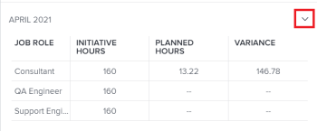

# Mostrar la asignación de funciones para proyectos e iniciativas en el [!DNL Workload Balancer]

>[!IMPORTANT]
>
>Su organización debe adquirir una licencia adicional para [!DNL Adobe Workfront Scenario Planner] para que pueda ver la información de la iniciativa de un proyecto. Para obtener información sobre cómo obtener la variable [!DNL Workfront Scenario Planner], consulte [Acceso necesario para usar la variable [!DNL Scenario Planner]](../scenario-planner/access-needed-to-use-sp.md).

Después de conectar proyectos e iniciativas, puede administrar la asignación de recursos en paralelo para asegurarse de que coinciden. Esto evita una asignación excesiva o una infrautilización de los mismos.

Este artículo describe cómo puede conciliar los recursos utilizando la variable [!UICONTROL Asignación de funciones] panel en [!UICONTROL Equilibrador de carga de trabajo] de un proyecto.

Para obtener información general sobre la conciliación de recursos entre proyectos e iniciativas, incluidos los requisitos previos, consulte [Visión general de la conciliación de las asignaciones de recursos entre proyectos e iniciativas](../scenario-planner/overview-reconcile-allocations-between-projects-initiatives.md).

## Requisitos de acceso

Debe:

<table style="table-layout:auto"> 
 <col> 
 <col> 
 <tbody> 
  <tr> 
   <td> 
[!DNL Adobe Workfront]<b> plan*</b> 
 </td> 
   <td>[!UICONTROL Business] o superior</td> 
  </tr> 
  <tr> 
   <td> 
[!DNL Adobe Workfront]<b> licencia*</b> 
 </td> 
   <td> 
[!UICONTROL Review] o superior
 </td> 
  </tr> 
  <tr> 
   <td><b>Product</b> </td> 
   <td> 
Debe adquirir una licencia adicional para [!DNL Adobe Workfront Scenario Planner] para acceder a la funcionalidad descrita en este artículo.
 
Para obtener información sobre cómo obtener la variable [!DNL Workfront Scenario Planner], consulte <a href="../scenario-planner/access-needed-to-use-sp.md">Acceso necesario para usar la variable [!DNL Scenario Planner]</a>. 
 </td> 
  </tr> 
  <tr data-mc-conditions=""> 
   <td><strong>Configuraciones de nivel de acceso*</strong> </td> 
   <td> 
[!UICONTROL View] o acceso superior a Proyectos 
 
Nota: Si todavía no tiene acceso, pregunte a su [!DNL Workfront] administrador si establecen restricciones adicionales en su nivel de acceso. Para obtener información sobre cómo se [!DNL Workfront] administrador puede cambiar el nivel de acceso, consulte <a href="../administration-and-setup/add-users/configure-and-grant-access/create-modify-access-levels.md" class="MCXref xref">Crear o modificar niveles de acceso personalizados</a>.
 </td> 
  </tr> 
  <tr data-mc-conditions=""> 
   <td> 
<strong>Permisos de objeto</strong> 
 </td> 
   <td> 
Permisos de [!UICONTROL View] o superior para el proyecto
 
Para obtener información sobre la solicitud de acceso adicional a un plan, consulte <a href="../scenario-planner/request-access-to-plan.md">Acceso a [!UICONTROL Request] a un plan en la variable [!DNL Workfront Scenario Planner]</a>.
 
Para obtener información sobre la solicitud de acceso adicional a un proyecto, consulte <a href="../workfront-basics/grant-and-request-access-to-objects/request-access.md" class="MCXref xref">Solicitar acceso a objetos </a>. 
 </td> 
  </tr> 
 </tbody> 
</table>

&#42;Para saber qué plan, tipo de licencia o acceso tiene, póngase en contacto con su [!DNL Workfront] administrador.

## Mostrar la asignación de funciones para proyectos e iniciativas en el [!DNL Workload Balancer]

Si su empresa ha adquirido un [!DNL Workfront Scenario Planner] licencia, puede conciliar las asignaciones de recursos entre la iniciativa y el proyecto vinculado a ella en el nivel de proyecto [!DNL Workload Balancer].

1. (Condicional) Conecte un proyecto con una iniciativa utilizando uno de los métodos descritos en los siguientes artículos:

   * [Importar proyectos a planes en el [!DNL Adobe Workfront Scenario Planner]](import-projects-to-plans.md).
   * [Actualice o cree proyectos publicando iniciativas en el [!DNL Adobe Workfront Scenario Planner]](publish-scenarios-update-projects.md).

   >[!IMPORTANT]
   >
   >Si realiza cambios en los recursos de la iniciativa, debe volver a publicar el escenario al que pertenece la iniciativa para que la información de recursos más reciente de la iniciativa se actualice sobre el proyecto.

1. Vaya al proyecto en el que desea revisar la asignación de funciones de trabajo para el proyecto, así como para la iniciativa asociada.
1. Haga clic en [!DNL Workload Balancer] en el panel izquierdo.

   Es posible que tenga que hacer clic en **[!UICONTROL Programación]**, luego **[!UICONTROL Cambiar a equilibrador de carga de trabajo]**.

1. Realice una de las siguientes acciones:

   * Haga clic en **[!UICONTROL Mes]** para ver el equilibrador de carga de trabajo por mes, haga clic en el menú desplegable situado al lado de un mes en la cronología y haga clic en **[!UICONTROL Más]**.
   * Haga clic en el **[!UICONTROL Mostrar asignación de funciones]** icono  en la esquina superior derecha de la barra de herramientas.

   La variable [!UICONTROL Asignación de funciones] en el panel.

   

   >[!CAUTION]
   >
   >Aunque puede ver la variable [!UICONTROL Asignación de funciones] incluso si su organización no ha adquirido un [!DNL Workfront Scenario Planner] licencia, no puede ver información sobre las funciones de trabajo de las iniciativas.

   <!--
   
(NOTE: ensure this step stays 5 to match the mention of it in the section below)

   -->

1. Revise la siguiente información en la sección **[!UICONTROL Totales de proyectos]** área del panel Asignación de funciones:

   <table style="table-layout:auto"> 
    <col> 
    <col> 
    <tbody> 
     <tr> 
      <td role="rowheader">[!UICONTROL Puesto de trabajo]</td> 
      <td> 
Los nombres de las funciones de trabajo asociadas con cualquiera de las siguientes opciones:
 
       <ul> 
        <li> 
tareas del proyecto
 </li> 
        <li> 
problemas en el proyecto
 </li> 
        <li> 
iniciativa vinculada al proyecto
 </li> 
       </ul> </td> 
     </tr> 
     <tr> 
      <td role="rowheader">[!UICONTROL Horario de la Iniciativa]</td> 
      <td>Número de horas necesarias asociadas con cada puesto de trabajo de la iniciativa durante toda la duración de la iniciativa. </td> 
     </tr> 
     <tr> 
      <td role="rowheader">[!UICONTROL Horario planificado]</td> 
      <td>Número de horas planificadas asociadas a cada puesto en las tareas o problemas del proyecto durante la duración total del proyecto. </td> 
     </tr> 
     <tr> 
      <td role="rowheader">[!UICONTROL Variance]</td> 
      <td> 
La diferencia entre las horas requeridas en la iniciativa y las horas programadas asociadas con el trabajo en el proyecto. [!DNL Workfront] calcula la [!UICONTROL Variance] mediante esta fórmula:
 
<code>Role Allocation Variance = Initiative Hours - Planned Hours</code> 
 
Cuando los recursos se planifican durante más horas de las necesarias en la iniciativa, la [!UICONTROL Variance] es negativa y se muestra en rojo. Esto significa que los recursos están sobreasignados. 
 </td> 
     </tr> 
    </tbody> 
   </table>

   >[!TIP]
   >
   >Las horas planificadas del proyecto no se muestran en los siguientes escenarios:
   >
   >   
   >   
   >   * Cuando las tareas o los problemas no están asignados a funciones de trabajo, o a usuarios con una función de trabajo asociada a ellas.
   >   * Cuando las tareas o los problemas tienen un [!UICONTROL Duración] de cero.

1. (Opcional) Si la variable [!UICONTROL Varianza] muestra que los recursos están sobreasignados y ajusta una de las siguientes opciones:

   * Reduzca el número de horas planificadas para una función de trabajo que muestre una asignación excesiva o agregue más recursos a las tareas y distribuya más horas planificadas a los nuevos recursos. Puede actualizar asignaciones o el número de horas planificadas sobre tareas o problemas al editarlas. Para obtener más información, consulte los siguientes artículos:

      * [Editar tareas](../manage-work/tasks/manage-tasks/edit-tasks.md)
      * [Editar problemas](../manage-work/issues/manage-issues/edit-issues.md)

      >[!NOTE]
      >
      >Debe tener acceso y permisos adicionales para editar tareas y problemas.

   * Aumente el número de horas requeridas para la función que muestra la sobreasignación en la iniciativa. Para obtener más información, consulte [Cree y edite iniciativas en la [!DNL Adobe Workfront Scenario Planner]](create-and-edit-initiatives.md).

      >[!NOTE]
      >
      >Debe tener acceso y permisos adicionales para editar planes.

1. (Opcional) Haga clic en el icono desplegable para expandir uno de los meses en la [!UICONTROL Asignación de funciones] o en la línea de tiempo del [!UICONTROL Equilibrador de carga de trabajo].

   

   El mismo tipo de información que se muestra en la variable [!UICONTROL Totales de proyectos] también se muestra para cada mes.

   >[!TIP]
   >
   >Los meses enumerados en la variable [!UICONTROL Asignación de funciones] son los meses de la línea de tiempo que se muestran en la pantalla de la [!UICONTROL Equilibrador de carga de trabajo]. Desplácese hacia atrás y hacia adelante en la cronología para ver los meses adicionales.

   <!--
   <li value="8" data-mc-conditions="QuicksilverOrClassic.Draft mode"> 
 
 </li>
   -->

