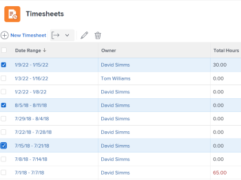

# Exportación de una lista de partes de horas

Como administrador de personas o aprobador de hojas de horas, es posible que tenga que descargar una lista de hojas de horas para ver rápidamente información sobre las hojas de horas de las personas de las que es responsable. Puede hacerlo exportando una lista de partes de horas.

## Requisitos de acceso

Debe tener el siguiente acceso para realizar los pasos de este artículo:

<table style="table-layout:auto"> 
 <col> 
 <col> 
 <tbody> 
  <tr> 
   <td role="rowheader">plan de Adobe Workfront*</td> 
   <td> 
Cualquiera
 </td> 
  </tr> 
  <tr> 
   <td role="rowheader">Licencia de Adobe Workfront*</td> 
   <td> 
Revisar o superior
 </td> 
  </tr> 
  <tr> 
   <td role="rowheader">Configuraciones de nivel de acceso*</td> 
   <td> 
Ver acceso o superior a Tareas y problemas
 
Si todavía no tiene acceso, pregunte a su administrador de Workfront si establece restricciones adicionales en su nivel de acceso. Para obtener información sobre cómo un administrador de Workfront puede modificar su nivel de acceso, consulte <a href="../../administration-and-setup/add-users/configure-and-grant-access/create-modify-access-levels.md" class="MCXref xref">Crear o modificar niveles de acceso personalizados</a>.
 </td> 
  </tr> 
  <tr> 
   <td role="rowheader">Permisos de objeto</td> 
   <td> 
Ver o permisos superiores en partes de horas
 
Para obtener información sobre la solicitud de acceso adicional, consulte <a href="../../workfront-basics/grant-and-request-access-to-objects/request-access.md" class="MCXref xref">Solicitar acceso a objetos </a>.
 </td> 
  </tr> 
 </tbody> 
</table>

*Para saber qué plan o tipo de licencia tiene, póngase en contacto con el administrador de Workfront.

## Exportación de una lista de partes de horas

1. Haga clic en el **Menú principal** icono  en la esquina superior derecha de Adobe Workfront.

1. Haga clic en **Hojas de tiempo**. La variable **Todo** está seleccionado de forma predeterminada.

   

1. (Opcional) Haga clic en el **búsqueda** icono  y escriba una palabra clave y busque un parte de horas específico. Por ejemplo, puede buscar un intervalo de tiempo definido o un nombre de propietario.

1. (Opcional) Realice una de las siguientes acciones para actualizar el filtro en la lista de partes de horas:

   * Select **Aprobaciones de Mi parte de horas** en la esquina superior derecha de la página para ver solo las partes de horas que aprueba

      O

      Select **Mis hojas de hora** para ver solo sus partes de horas.

      Esto aplica los filtros Mis aprobaciones de parte de horas o Mi parte de horas a la lista de partes de horas.

      

   * Haga clic en el icono Filtro  para aplicar un filtro diferente o crear uno nuevo. Para obtener información sobre cómo crear o actualizar filtros, consulte [Crear o editar filtros en Adobe Workfront](../../reports-and-dashboards/reports/reporting-elements/create-filters.md).
   >[!NOTE]
   >
   >Las opciones Mis aprobaciones de parte de horas y Mis hojas de horas no se muestran en la parte superior de la lista de hojas de horas ni en la lista de filtros si el administrador de Workfront o un administrador de grupo han eliminado los filtros Mis aprobaciones de parte de horas y Mis hojas de horas de los controles de lista del área Configuración o de la plantilla Diseño. Para obtener más información, consulte los siguientes artículos:
   * [Personalización de filtros, vistas y grupos mediante una plantilla de diseño](../../administration-and-setup/customize-workfront/use-layout-templates/customize-fvg-list-controls-layout-template.md)

1. (Opcional) Haga clic en el **Ver**  o **Agrupación**  para aplicar una vista o agrupación diferente o para crear una nueva.

   Para obtener información sobre la creación de filtros, vistas o agrupaciones, consulte los siguientes artículos:

   * [Crear o editar filtros en Adobe Workfront](../../reports-and-dashboards/reports/reporting-elements/create-filters.md)
   * [Crear o editar vistas en Adobe Workfront](../../reports-and-dashboards/reports/reporting-elements/create-edit-views.md)
   * [Crear agrupaciones en Adobe Workfront](../../reports-and-dashboards/reports/reporting-elements/create-groupings.md)

1. Seleccione las partes de horas que desea exportar y, a continuación, haga clic en el **Exportar**   icono.

   

1. Seleccione el tipo de archivo al que desea exportar la lista de partes de horas desde las siguientes opciones:

   * Ladscape del PDF
   * PDF vertical
   * PDF Otros tamaños
   * Excel
   * Excel (xlsx)
   * Delimitado por tabulaciones

   Se descarga una lista de partes de horas al equipo en el formato seleccionado e incluye la siguiente información del parte de horas:

   * Intervalo de fecha
   * Nombre del propietario
   * Total de horas
   * Cantidad de tiempo extra
   * Nombres de aprobadores
   * Estado
