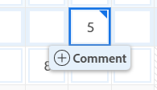

# Hora de registro

<!--Audited: 12/2023-->

<!--remove all preview and production references from this article with 23.3 release-->

<!--
The highlighted information on this page refers to functionality not yet generally available. It is available only in the Preview environment for all customers. After the monthly releases to Production, the same features are also available in the Production environment for customers who enabled fast releases.   
For information about fast releases, see [Enable or disable fast releases for your organization](../../administration-and-setup/set-up-workfront/configure-system-defaults/enable-fast-release-process.md). 

For information about the current release schedule, see [Fourth Quarter 2023 release overview](../../product-announcements/product-releases/23-q4-release-activity/23-q4-release-overview.md) 
-->

Puede registrar el tiempo de los elementos de trabajo en Adobe Workfront para indicar la cantidad de horas que dedica a trabajar en ellos. También puede registrar tiempo que no esté relacionado con el trabajo, como vacaciones, tiempo por enfermedad o tiempo que pasa en reuniones. La hora que registre se mostrará en la hoja de horas.

Para obtener más información sobre el tipo de horas que puede iniciar sesión en Workfront, consulte [Administrar tipos de horas](../../administration-and-setup/set-up-workfront/configure-timesheets-schedules/hour-types.md).

## Requisitos de acceso

+++ Expanda para ver los requisitos de acceso para la funcionalidad en este artículo.

Debe tener el siguiente acceso para realizar los pasos de este artículo y registrar las horas específicas del proyecto:

<table style="table-layout:auto"> 
 <col> 
 <col> 
 <tbody> 
  <tr> 
   <td role="rowheader">plan de Adobe Workfront</td> 
   <td> 
Cualquiera
 </td> 
  </tr> 
  <tr> 
   <td role="rowheader">Licencia de Adobe Workfront</td> 
   <td> 
Nuevo: 
   <ul><li>Normal o superior para registrar horas generales en una hoja de horas</li>
   <li>Estándar para registrar horas en un proyecto, tarea o problema</li></ul>

Actual: 
   <ul><li>Revise o superior para registrar horas generales en una hoja de horas</li>
   <li>Trabajar o más para registrar horas en un proyecto, tarea o problema</li></ul> </td> 
  </tr> 
  <tr> 
   <td role="rowheader">Configuraciones de nivel de acceso</td> 
   <td> 
Editar el acceso al tipo de elemento de trabajo para el que se registra el tiempo 
 
Por ejemplo, necesita acceso de edición en Problemas para registrar la hora de los problemas
 </td> 
  </tr> 
  <tr> 
   <td role="rowheader">Permisos de objeto</td> 
   <td> 
Permisos de contribución o superiores en el elemento de trabajo para el que registra tiempo, incluidos los permisos para Registrar horas
 </td> 
  </tr> 
 </tbody> 
</table>

Para obtener más información sobre esta tabla, consulte [Requisitos de acceso en la documentación de Workfront](/help/quicksilver/administration-and-setup/add-users/access-levels-and-object-permissions/access-level-requirements-in-documentation.md).

+++

## Consideraciones al registrar la hora en Workfront

* Puede registrar tiempo para proyectos, tareas o problemas, o bien puede registrar tiempo directamente en su hoja de horas.

  Para obtener información sobre la creación de plantillas de horas, consulte [Crear hoja de horas de un solo uso](../../timesheets/create-and-manage-timesheets/create-tmshts.md).

* Todas las herramientas que se registran a lo largo del tiempo y que no son la plantilla de horas aparecen en la plantilla correspondiente al período de tiempo correspondiente.
* Las tareas y los problemas de un proyecto que no es actual no se rellenan previamente en una plantilla de horas.
* El tiempo registrado en la hoja de horas se aplica inmediatamente a la tarea, problema o proyecto.
* Las hojas de horas incluyen el tiempo total para todas las fechas registradas. Los fines de semana siempre se incluyen, incluso cuando se han configurado cálculos de escala de tiempo para excluirlos (como se describe en [Configurar las preferencias de proyecto de todo el sistema](../../administration-and-setup/set-up-workfront/configure-system-defaults/set-project-preferences.md)).
* El número máximo de elementos mostrados en una plantilla de horas es 45. Si hay más de 45 elementos cuyas fechas coinciden con el lapso de tiempo de la hoja de horas, solo se mostrarán los elementos actualizados más recientemente.
* Las entradas de horas que se incluyen en los registros de facturación facturados aparecen atenuadas y no se pueden editar en la hoja de horas. Para obtener más información, consulte [Crear registros de facturación](../../manage-work/projects/project-finances/create-billing-records.md).
* Las tareas personales no se muestran en la plantilla de horas de forma predeterminada. Las tareas personales solo se muestran en la plantilla de horas cuando se ha registrado tiempo. Después de registrar el tiempo de una tarea personal, puede anclar la tarea a la plantilla de horas y permanecerá en ella si permanece anclada. Para obtener más información, consulte [Crear elementos de trabajo desde el área de Inicio](../../workfront-basics/using-home/using-the-home-area/create-work-items-in-home.md).

## Hora de registro {#log-time-section}

Puede registrar el tiempo en las siguientes áreas de Workfront:

* [Hoja de horas](#timesheet)
* [Inicio](#home)
* [Proyecto, tarea o problema](#project-task-or-issue)
* [Panel de resumen](#summary-panel)
* [Tableros](#boards)
* [aplicación móvil](#mobile-app)

### Hoja de horas {#timesheet}

#### Registrar tiempo en una hoja de horas {#log-time-on-a-timesheet}

Puede registrar el tiempo en los siguientes elementos de la plantilla de horas:

* Tareas, problemas y proyectos rellenados previamente que se muestran automáticamente según las preferencias del administrador de Workfront al establecer la plantilla de horas. Para obtener información sobre cómo se rellenan previamente las plantillas de horas, consulte [Configurar preferencias de horas y hojas de horas](../../administration-and-setup/set-up-workfront/configure-timesheets-schedules/timesheet-and-hour-preferences.md).

  En la plantilla de horas solo se rellenan previamente las tareas y problemas que se le hayan asignado. Las tareas y los problemas asignados a sus equipos o funciones no rellenan automáticamente su plantilla de horas.

  Al hacer clic en Trabajar en ello en un elemento asignado a sus equipos, se le asigna el elemento y este se muestra en la plantilla de horas.

* Tareas, problemas o proyectos que agregue manualmente.
* Tareas, problemas o proyectos para los que ya ha registrado tiempo en otra parte de Workfront.
* Tiempo general (vacaciones, formación, gastos generales).

>[!NOTE]
>
>Los usuarios revisores asignados a un perfil de plantilla de horas pueden ver el área Plantillas de horas y registrar horas generales. Sin embargo, no pueden registrar horas en ninguna tarea o problema asignado a ellos que aparezca en la hoja de horas.

Para registrar tiempo en una hoja de horas:

1. Haga clic en **[!UICONTROL Menú principal]** icono  en la esquina superior derecha de Adobe Workfront o (si está disponible), haga clic en el botón **[!UICONTROL Menú principal]** icono  en la esquina superior izquierda.

1. Clic [!UICONTROL **Plantillas de horas**]. La hoja de horas actual se muestra de forma predeterminada.
   

1. (Opcional) Haga clic en **pantalla completa** icono  para mostrar la plantilla de horas en modo de pantalla completa, haga clic en **exit-full-screen**  para volver a la plantilla de horas.

   <!-- drafted for the resize columns in timesheet story: 1. (optional) Click on the separator lines between weeks or between the time frame area and the work item area to resize the columns of the timesheet.-->

1. (Opcional) Para agregar un proyecto, tarea o problema a la plantilla de horas, haga clic en **Añadir elemento** , en la esquina superior izquierda de la plantilla de horas, y haga clic en **Agregar proyectos**, **Agregar tareas**, o **Agregar problemas**.

   Se muestra una lista de proyectos, tareas o problemas.

   <!--drafted for full screen mode for add projects story - align it with the rest of the steps when you enable this:: 1. (Optional) Click the **full-screen** icon  to display the list of objects in full-screen mode.-->

1. (Opcional) Haga clic en el icono de búsqueda  para buscar un elemento específico mediante una palabra clave para agregarla a la plantilla de horas.

1. (Opcional) Expanda los menús desplegables de filtro, vista o agrupación para aplicar o personalizar uno y ver la información del elemento que desee.

1. Seleccione uno o varios elementos de la lista y haga clic en **Añadir**.

   Si ha agregado menos de 50 elementos al mismo tiempo, los elementos se agregarán a la hoja de horas. Las tareas y los problemas se enumeran con el nombre del proyecto.

   >[!NOTE]
   >
   >Al agregar tareas o problemas a la plantilla de horas, también se agrega el proyecto.

1. (Condicional) Si agrega 50 o más elementos al mismo tiempo, se muestra un mensaje de confirmación con el número de elementos agregados a la hoja de horas.

   Clic **Añadir todo** para añadir todos los elementos O haga clic en **Cancelar** para detener la adición de los elementos seleccionados, haga lo siguiente **Cancelar** para cerrar la lista de elementos.

   Las tareas y los problemas se enumeran con el nombre del proyecto.

   >[!NOTE]
   >
   >Los elementos que agregue manualmente a la plantilla de horas están anclados y permanecerán en las plantillas de horas actuales y futuras hasta que los desancle manualmente para eliminarlos. Para obtener información sobre cómo desanclar elementos para eliminarlos de la plantilla de horas, continúe con el paso 10.

   <!--(ensure this stays accurate)-->

1. (Opcional) Haga clic en **Contraer**  o **Expandir**  iconos junto al nombre del proyecto para mostrar u ocultar la lista de tareas y problemas del proyecto.

   >[!TIP]
   >
   >   Cuando utilice un teclado QWERTY estándar y después de hacer clic en el nombre de un proyecto en la plantilla de horas, pulse el siguiente conjunto de teclas para contraer o expandir el proyecto:
   >   * Para expandir el proyecto y mostrar sus elementos de trabajo:
   >     * Mayús + Alt + flecha arriba para equipos con Windows
   >     * Mayús + Opción + flecha arriba para equipos Mac
   >   * Para contraer el proyecto y ocultar sus elementos de trabajo:
   >     * Mayús + Alt + flecha abajo para equipos Windows
   >     * Mayús + Opción + Flecha abajo para equipos Mac.

1. (Opcional) Para fijar manualmente un elemento que se muestra automáticamente en la plantilla de horas, pase el ratón sobre el nombre del elemento y haga clic en **clavija** icono .

   >[!TIP]
   >
   >   Cuando utilice un teclado QWERTY estándar después de hacer clic en un elemento de la plantilla de horas, pulse el siguiente conjunto de teclas para fijar un elemento:
   >   * Opción + P para equipos Windows y Mac.

1. (Opcional) Haga clic en el icono de búsqueda  y empiece a escribir una palabra clave para encontrar un proyecto, una tarea o un problema en la hoja de horas.

1. (Condicional) Si el administrador de su grupo o Workfront ha habilitado la variable **Asignar roles a entradas de horas manualmente** Para configurar, seleccione una función del menú desplegable. La función especificada cuando se le asigna al elemento de trabajo se muestra de forma predeterminada. Si no se le asigna una función en el objeto, la función principal se muestra como predeterminada. Para obtener más información sobre esta configuración, consulte el artículo [Configurar preferencias de horas y hojas de horas](../../administration-and-setup/set-up-workfront/configure-timesheets-schedules/timesheet-and-hour-preferences.md).

   

1. (Opcional) Haga clic en **+** icono para añadir otra fila y, a continuación, seleccione un nuevo tipo de hora en el menú desplegable de [!UICONTROL Tipo de hora] para registrar el tiempo de un tipo de hora diferente.

   

   >[!TIP]
   >
   >   Según el sistema operativo o el navegador y cuando utilice un teclado QWERTY estándar, pulse el siguiente conjunto de teclas para añadir otra fila:
   >   * Ctrl + Opción + + para equipos con Windows
   >   * Cmd + Opción + + para equipos Mac

   Los tipos de horas están disponibles según lo que se haya definido en los niveles de sistema, proyecto y usuario, tal como se describe en [Definir tipos de horas y disponibilidad para hojas de horas](define-hour-types-and-availability.md).

   El tipo de hora no se puede cambiar una vez cerrada la plantilla de horas.

   >[!TIP]
   >
   >Si ha registrado tiempo anteriormente y el tipo de hora seleccionado ahora está desactivado, toda la fila del tiempo registrado se atenúa. Al seleccionar otro tipo de hora y actualizar la página, se elimina la opción de tipo de hora desactivado de la lista desplegable, por lo que no se pueden añadir horas adicionales a ese tipo de hora.
   >
   >Considere la posibilidad de agregar una nueva línea para el elemento de trabajo para el que desee registrar tiempo adicional y seleccionar un nuevo tipo de hora, si desea mantener el tipo de hora desactivado asociado con el tiempo registrado anterior.

1. Haga clic en **eliminar** icono   junto a la función para eliminarla. También se elimina cualquier tiempo registrado para la función.

   >[!TIP]
   >
   >   Según el sistema operativo o el navegador y cuando utilice un teclado QWERTY estándar, pulse el siguiente conjunto de teclas para eliminar una fila:
   >   * Ctrl + Opción + - para equipos con Windows
   >   * Cmd + Opción + - para equipos Mac

1. Especifique la cantidad de tiempo que desea registrar en un día determinado en la sección de cronología de la plantilla de horas y, a continuación, haga clic fuera del cuadro de hora para guardar la entrada de hora. Las horas se guardan automáticamente. La fila para la que se registra el tiempo se resalta en azul claro y el cuadro de entrada de hora se resalta en azul oscuro.

   

   El tiempo se registra en horas o días. Este ajuste lo configuran los usuarios con licencia de planificación o el administrador del sistema, tal como se describe en [Configurar si se registran horas y días](../../timesheets/config-timesheet-prefs/config-time-logged-hrs-days.md).

   >[!IMPORTANT]
   >
   >Debe guardar la plantilla de horas manualmente en caso de que se produzca alguna de las siguientes situaciones:
   >
   >* La función de trabajo asociada con el tiempo que ha registrado anteriormente ha cambiado y la **Asignar roles a entradas de horas manualmente** se ha desactivado la configuración. Si se registra tiempo para nuevas fechas, se asociará con un rol diferente.
   >   
   >   Si la función ha cambiado y la variable **Asignar roles a entradas de horas manualmente** La configuración está habilitada, puede registrar tiempo o actualizar la función y los cambios se guardan automáticamente.
   >
   >* La función de trabajo asignada a una tarea o problema es diferente a la función de trabajo con la que el propietario de la plantilla de horas registra el tiempo <!--or assigned to them_ this last  piece came from a Support note but but sure what role it's referring to. Leaving it out for now.-->.
   >
   >La plantilla de horas volverá a ahorrar tiempo automáticamente cuando no haya entradas en conflicto entre las dos funciones.
   >

1. (Opcional) Especifique la cantidad de horas extra en el campo Horas extra del encabezado de la plantilla de horas.

   >[!TIP]
   >
   >No se puede registrar un número de horas extra mayor que el número total de horas actuales en la hoja de horas. Por ejemplo, si ha registrado 7 horas en la hoja de horas hasta el momento, no puede registrar 8 horas extra.

1. (Opcional) Haga clic en **Comentario** para agregar un comentario para la entrada de horas.

   

   >[!TIP]
   >
   >   Cuando utilice un teclado QWERTY estándar después de hacer clic en el cuadro de entrada de horas, pulse el siguiente conjunto de teclas para abrir el cuadro de comentarios:
   >   * Mayús + F2 para equipos Windows y Mac.

1. Clic **Listo** para guardar el comentario.

   >[!TIP]
   >
   >   Cuando utilice un teclado QWERTY estándar, desde dentro del cuadro de comentarios, pulse el siguiente conjunto de teclas para guardar el comentario:
   >   * Ctrl + Entrar para equipos con Windows.
   >   * Cmd + Devolución para equipos Mac.

1. (Opcional) Haga clic en **Mostrar comentarios** en la barra de herramientas para mostrar comentarios de entrada de horas en el elemento de trabajo.

   

   >[!TIP]
   >
   >   Todos los cambios que realice en la plantilla de horas se guardarán automáticamente.

1. (Opcional) Haga clic en la fila de una tarea o problema y, a continuación, haga clic en **Abrir resumen** en la esquina superior derecha de la plantilla de horas para agregar una actualización o actualizar información sobre la tarea o el problema. El panel Resumen se abre a la derecha.

   

   La actualización se mostrará en el área Actualizaciones del elemento de trabajo asociado a la hora registrada.

   >[!TIP]
   >
   >No puede realizar comentarios en proyectos ni entradas de horas de Tiempo general.

1. Clic [!UICONTROL **Cerrar resumen**] para cerrar el panel Resumen y volver a la plantilla de horas.

1. (Opcional) Haga clic en [!UICONTROL **Actualizaciones**] en el panel izquierdo y, a continuación, añada una actualización a la plantilla de horas. Para obtener más información sobre las actualizaciones de Workfront, consulte [Actualizar trabajo](../../workfront-basics/updating-work-items-and-viewing-updates/update-work.md).

   

1. (Opcional) Vuelva a la **Hoja de horas** para cerrar o enviar su hoja de horas.

   * **Cerrar**: cierre la plantilla de horas cuando haya terminado de actualizarla. Esta opción solo está disponible cuando la plantilla de horas no está asociada a un aprobador.

   * **Enviar para aprobación:** Esta opción solo está disponible si hay un aprobador en la plantilla de horas. Guarde los cambios y envíelos para su aprobación. Para abrir la plantilla de horas después de cerrarla, haga clic en **Recordar**, si todavía no se ha concedido ninguna aprobación. Para obtener más información, consulte [Enviar hoja de horas para su aprobación](../../timesheets/create-and-manage-timesheets/submit-timesheet-for-approval.md).

   * **Rechazar**: Esta opción se muestra cuando usted es un aprobador de hojas de horas y la hoja de horas se le ha enviado para su aprobación. Al hacer clic en él, se cambia el estado de la plantilla de horas a Rechazado y esta permanece abierta.

   * **Aprobar**: Esta opción se muestra cuando usted es un aprobador de hojas de horas y la hoja de horas se le ha enviado para su aprobación. Al hacer clic en él, se cambia el estado de la plantilla de horas a Aprobado y se cierra la plantilla.

   >[!TIP]
   >
   >Las opciones Rechazar y Aprobar también se muestran en la plantilla de horas cuando usted es administrador del sistema y la plantilla de horas está asociada a un aprobador.

1. (Condicional) Si ha cerrado o enviado la hoja de horas para su aprobación, haga clic en una de las siguientes opciones:

   * **Volver a abrir**: Esta opción está disponible para hojas de horas que ya ha cerrado y que no tienen aprobadores, o para hojas de horas que ya se han aprobado. Vuelva a abrir la hoja de horas para modificar las entradas de horas.
   * **Recordar**: esta opción está disponible para hojas de horas que se han enviado para su aprobación, pero que aún no se han aprobado ni rechazado. Clic **Recordar** para volver a abrir la plantilla de horas y modificar las entradas de horas.

#### Eliminar un elemento de la plantilla de horas

Puede quitar una entrada de horas o un elemento (proyecto, tarea o problema) de una plantilla de horas.

Para eliminar una entrada de hora de una plantilla de horas:

1. Vaya a la plantilla de horas y busque la entrada de horas que desea eliminar.
1. Sustituya las horas introducidas por 0 o elimine las horas y sustitúyalas por 0 y, a continuación, pulse Intro.

   Las horas se eliminan y la plantilla de horas se guarda automáticamente.

Puede quitar un elemento (proyecto, tarea o problema) de la plantilla de horas desanclándolo, si aún no ha registrado tiempo para él y si lo agregó manualmente (como se describe en los pasos 4-8 de la [Registrar tiempo en una hoja de horas](#log-time-on-a-timesheet) en este artículo). <!--ensure this stays accurate-->

No puede eliminar automáticamente los elementos que se incluyen en la plantilla de horas según las preferencias de plantilla de horas del sistema o grupo de Workfront configurado para rellenar previamente las plantillas de horas (como se describe en [Configurar preferencias de horas y hojas de horas](../../administration-and-setup/set-up-workfront/configure-timesheets-schedules/timesheet-and-hour-preferences.md)). Los elementos dejan de rellenar previamente la plantilla de horas cuando las fechas de los elementos están fuera del lapso de tiempo de la plantilla de horas.

Para eliminar un elemento de la plantilla de horas que se añadió manualmente:

1. Asegúrese de que no se registra ninguna hora en el elemento.
1. Haga clic en **abrir** icono  situado junto al elemento para desanclar el elemento de la plantilla de horas.

   >[!TIP]
   >
   >   Cuando utilice un teclado QWERTY estándar después de hacer clic en un elemento de la plantilla de horas, pulse el siguiente conjunto de teclas para desanclar un elemento:
   > * Opción + P para equipos Windows y Mac.

   El elemento se quita de la plantilla de horas después de actualizar la página.

### Inicio {#home}

Puede registrar la hora específica del proyecto en Inicio.

Para obtener información general sobre el uso del área de Inicio, consulte las secciones siguientes:

* Para obtener información sobre el uso del área de Inicio heredada, consulte [Uso del área de Inicio](../../workfront-basics/using-home/using-the-home-area/use-the-home-area.md).
* Para obtener información sobre el uso de la nueva área de Inicio, consulte [Introducción a la nueva página de inicio](../../workfront-basics/using-home/new-home/get-started-with-new-home.md).

#### Registrar tiempo en un elemento de trabajo desde la nueva área de Inicio

Puede registrar el tiempo de las tareas y los problemas en cualquiera de los widgets mediante el Panel de resumen del área de inicio. Para obtener más información, consulte [Panel de resumen](#summary-panel) de este artículo.

Además, para registrar el tiempo de un elemento en el widget Mi trabajo:

1. Llegué a la **Inicio** área.
1. Añada el **Mi trabajo** a su página de inicio.
1. (Opcional) Seleccione una tarea, problema o solicitud en una lista y, a continuación, haga clic en **Trabajar en ello**
1. Pase el ratón sobre la tarea o el problema para el que quiera registrar tiempo y luego haga clic en **Hora de registro** icono  a la derecha de la información de la tarea.

   

1. Clic **Registrar tiempo**.

   El tiempo registrado se muestra en la sección Horas del objeto y en la hoja de horas.

#### Registrar tiempo en un elemento de trabajo desde el área de inicio heredada

1. En el **Lista de trabajos** , seleccione el elemento en el que desea registrar el tiempo.
1. En el panel derecho, haga clic en **Hora de registro**.

   

1. En el **Ingresar horas** menú desplegable, seleccione el tipo de hora adecuado.\
   Los tipos de horas están disponibles según lo que se haya definido en los niveles de sistema, proyecto y usuario, tal como se describe en [Definir tipos de horas y disponibilidad para hojas de horas](../../timesheets/create-and-manage-timesheets/define-hour-types-and-availability.md).
1. (Condicional) Si el administrador de su grupo o Workfront ha habilitado la variable **Asignar roles a entradas de horas manualmente** Para configurar, seleccione una función del menú desplegable. La función especificada cuando se le asigna al elemento de trabajo se muestra de forma predeterminada. Si no se le asigna una función en el objeto, la función principal se muestra como predeterminada. Para obtener más información sobre esta configuración, consulte el artículo [Configurar preferencias de horas y hojas de horas](../../administration-and-setup/set-up-workfront/configure-timesheets-schedules/timesheet-and-hour-preferences.md).
1. Especifique la hora a la que desea iniciar sesión y haga clic en **Hora de registro**.

   El tiempo registrado se muestra en la sección Horas del objeto y en la hoja de horas.

### Proyecto, tarea o problema {#project-task-or-issue}

Puede registrar el tiempo específico de un proyecto, tarea o problema en las siguientes secciones:

* [Actualiza la sección](#updates-section)
* [Sección Horas](#hours-section)

#### Actualiza la sección{#updates-section}

Para registrar el tiempo en la sección Actualizaciones de un proyecto, tarea o problema, debe tener lo siguiente:

* El acceso y los permisos correctos, tal como se describe en la sección [Requisitos de acceso](#access-requirements) de este artículo.

* El administrador de Workfront debe habilitar la configuración Registrar tiempo directamente en proyectos en [!UICONTROL **Hoja de horas y horas**]> [!UICONTROL **Preferencias**] en el área Sistema, si desea registrar tiempo directamente en un proyecto.

  Para obtener más información sobre cómo permitir que los usuarios registren horas directamente en los proyectos, consulte [Configurar preferencias de horas y hojas de horas](../../administration-and-setup/set-up-workfront/configure-timesheets-schedules/timesheet-and-hour-preferences.md).

Para registrar el tiempo en la sección Actualizaciones de un proyecto, tarea o problema:

1. Vaya a un proyecto, tarea o problema.
1. En el panel izquierdo, seleccione **Actualizaciones**.
1. Clic **Hora de registro**. <!-- did Anna B change the casing for this button? If yes and if she changed it for the other areas, update screen shot too-->

   Aparece el cuadro de diálogo Registrar tiempo.

   >[!TIP]
   >
   >   Si la preferencia del perfil está configurada para registrar el tiempo en días, se muestra el cuadro Escribir días.
   >   
   >   Hay una indicación en la esquina superior derecha del cuadro Escribir días de cuántas horas se incluyen en un día.

   

1. Especifique la siguiente información:

   * **Tipo de hora**: seleccione un Tipo de hora en el menú desplegable, si es diferente del que se muestra de forma predeterminada.

     Según los tipos de horas que estén configurados en el sistema, las opciones aquí pueden variar. Para obtener más información sobre la configuración de tipos de horas, consulte [Definir tipos de horas y disponibilidad para hojas de horas](../../timesheets/create-and-manage-timesheets/define-hour-types-and-availability.md).

   * **Rol**: (Condicional) Si el administrador del grupo o de Workfront ha habilitado la variable **Asignar roles a entradas de horas manualmente** configuración, seleccione una **Rol** en el menú desplegable. La Función especificada cuando se le asigna al objeto se muestra de forma predeterminada. Si no se le ha asignado una Función en el objeto, la Función principal se muestra como predeterminada. Para obtener más información sobre esta configuración, consulte el artículo [Configurar preferencias de horas y hojas de horas](../../administration-and-setup/set-up-workfront/configure-timesheets-schedules/timesheet-and-hour-preferences.md).

   * **Horas**: introduzca el número de horas para el proyecto, la tarea o el problema.

1. Clic **Registrar tiempo**.

   El tiempo registrado se muestra en la sección Horas del objeto y en la hoja de horas.

#### Sección Horas{#hours-section}

Debe ser administrador de Workfront para registrar tiempo para proyectos, tareas y problemas en la sección Horas,

O

Debe tener todo lo siguiente:

* Una licencia de planificación con acceso administrativo a hojas de horas y horas. Para obtener más información sobre la concesión de acceso administrativo a las plantillas de horas y horas, consulte [Conceder a los usuarios acceso administrativo a determinadas áreas](../../administration-and-setup/add-users/configure-and-grant-access/grant-users-admin-access-certain-areas.md).
* Aportar o permisos superiores al proyecto con acceso a Registrar horas. Para obtener más información sobre la concesión de permisos en proyectos, consulte [Uso compartido de un proyecto en Adobe Workfront](../../workfront-basics/grant-and-request-access-to-objects/share-a-project.md).
* El administrador de Workfront debe habilitar la configuración Registrar tiempo directamente en los proyectos en **Hoja de horas y horas > Preferencias** de la sección Configuración, si desea registrar el tiempo directamente en un proyecto. Para obtener más información sobre cómo permitir que los usuarios registren horas directamente en los proyectos, consulte [Configurar preferencias de horas y hojas de horas](../../administration-and-setup/set-up-workfront/configure-timesheets-schedules/timesheet-and-hour-preferences.md).

Para registrar el tiempo en la sección Horas de un proyecto, tarea o problema:

1. Vaya a un proyecto, tarea o problema.
1. En el panel izquierdo, haga clic en **Horas**.
1. Clic **Hora de registro**.

   Aparece el cuadro de diálogo Registrar horas.

1. Especifique la siguiente información:

   * **Propietario:** Su nombre se muestra en este campo de forma predeterminada.\
     Si registra las horas de otro usuario, especifique su nombre.

   * **Tipo de hora**: seleccione un Tipo de hora en el menú desplegable, si es diferente del que se muestra de forma predeterminada.

     Según los tipos de horas que estén configurados en el sistema, las opciones aquí pueden variar. Para obtener más información sobre la configuración de tipos de horas, consulte [Definir tipos de horas y disponibilidad para hojas de horas](../../timesheets/create-and-manage-timesheets/define-hour-types-and-availability.md).

   * **Rol**: (Condicional) Si el administrador del grupo o de Workfront ha habilitado la variable **Asignar roles a entradas de horas manualmente** configuración, seleccione una **Rol** en el menú desplegable. La Función especificada cuando se le asigna al objeto se muestra de forma predeterminada. Si no se le ha asignado una Función en el objeto, la Función principal se muestra como predeterminada. Para obtener más información sobre esta configuración, consulte el artículo [Configurar preferencias de horas y hojas de horas](../../administration-and-setup/set-up-workfront/configure-timesheets-schedules/timesheet-and-hour-preferences.md).

     
   * **Horas**: introduzca el número de horas para el proyecto, la tarea o el problema.

1. Clic **Hora de registro**.

### Panel de resumen

Puede registrar tiempo para tareas y problemas en el Panel de resumen.
Para obtener más información, consulte [Resumen, descripción general](../../workfront-basics/the-new-workfront-experience/summary-overview.md).

### Tableros {#boards}

Puede registrar el tiempo en las tarjetas conectadas en un tablero de Workfront. Este es el mismo proceso que registrar el tiempo de una tarea o un problema, y las horas registradas en la tarjeta se guardan en la tarea o el problema conectado.
Para obtener más información, consulte [Usar tarjetas conectadas en tableros](/help/quicksilver/agile/get-started-with-boards/connected-cards.md).

### aplicación móvil {#mobile-app}

Puede registrar tiempo desde la aplicación móvil de Workfront.
Para obtener más información, consulte [Adobe Workfront para Android](/help/quicksilver/workfront-basics/mobile-apps/using-the-workfront-mobile-app/workfront-for-android.md) o [Adobe Workfront para iOS](/help/quicksilver/workfront-basics/mobile-apps/using-the-workfront-mobile-app/workfront-for-ios.md).
