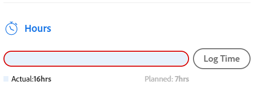
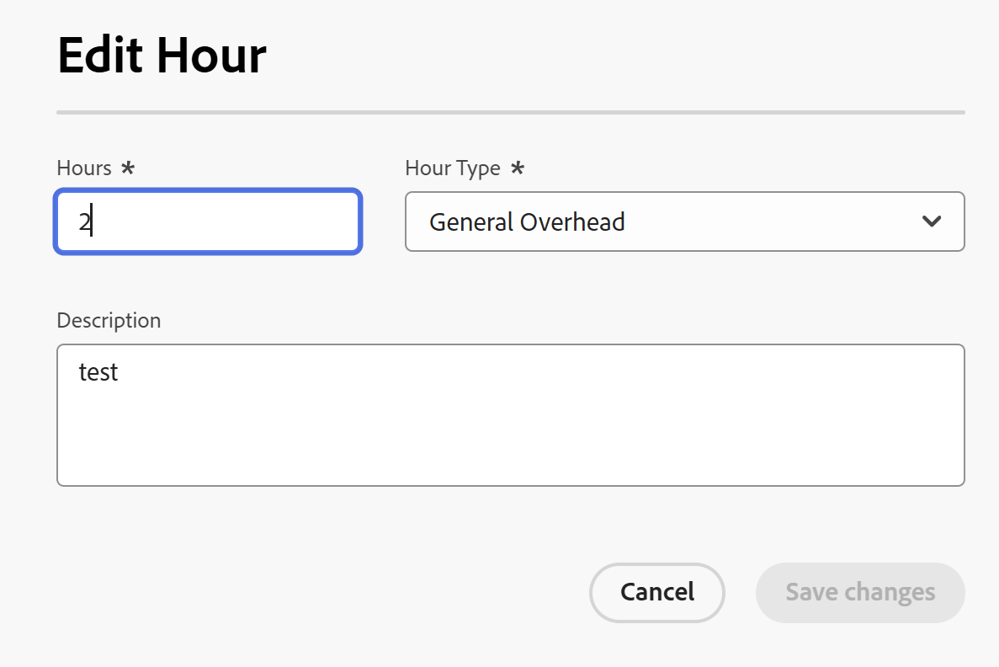

# Hora de registro

<!--Audited: 5/2025-->

<!--remove all preview and production references if any-->
<!--update screen shots for the general hour entries and the mixed selection of hours at production, if they fixed the bugs -->

Puede registrar el tiempo de los elementos de trabajo en Adobe Workfront para indicar la cantidad de horas que dedica a trabajar en ellos. También puede registrar el tiempo que no esté relacionado con el trabajo, como vacaciones, tiempo por enfermedad o tiempo que pasa en reuniones. El tiempo que registre se mostrará en la plantilla de horas.

Para obtener más información sobre el tipo de horas que puede iniciar sesión en Workfront, consulte [Administrar tipos de horas](../../administration-and-setup/set-up-workfront/configure-timesheets-schedules/hour-types.md).

## Requisitos de acceso

+++ Expanda para ver los requisitos de acceso para la funcionalidad en este artículo.

<table style="table-layout:auto"> 
 <col> 
 <col> 
 <tbody> 
  <tr> 
   <td>Paquete de Adobe Workfront</td> 
   <td> 
Cualquiera
 </td> 
  </tr> 
  <tr> 
   <td role="rowheader">Licencia de Adobe Workfront</td> 
   <td> 
   
Ligero o superior para registrar las horas en un proyecto, tarea, problema u horas generales en una plantilla de horas

O 

<ul><li>
Revisión o superior para registrar las horas generales en una plantilla de horas
</li>
   <li>
Trabajo o superior para registrar las horas en un proyecto, tarea o problema
</li></ul> </td> 
  </tr> 
  <tr> 
   <td>Configuraciones de nivel de acceso</td> 
   <td> 
Acceso de edición al tipo de elemento de trabajo para el que registra el tiempo 
 
Por ejemplo, necesita acceso de edición a problemas para registrar el tiempo de los problemas
 </td>
  </tr> 
  <tr> 
   <td>Permisos de objeto</td>
   <td> 
Permisos de aportación o superiores en el elemento de trabajo para el que registra el tiempo, incluidos los permisos para registrar horas
 </td>
  </tr> 
 </tbody> 
</table>

Para obtener más información, consulte [Requisitos de acceso en la documentación de Workfront](/help/quicksilver/administration-and-setup/add-users/access-levels-and-object-permissions/access-level-requirements-in-documentation.md).

+++

## Consideraciones al registrar tiempo en Workfront

* Puede registrar tiempo de proyectos, tareas o problemas, o bien puede registrar tiempo directamente en su plantilla de horas.

  Para obtener información sobre cómo crear plantillas de horas, consulte [Crear una plantilla de horas de un solo uso](../../timesheets/create-and-manage-timesheets/create-tmshts.md).

* Todas las herramientas que se registran a lo largo del tiempo y que no sean la plantilla de horas aparecen en la plantilla correspondiente al período de tiempo correspondiente.
* Las tareas y los problemas de un proyecto que no es actual no se rellenan previamente en una plantilla de horas.
* El tiempo registrado en la plantilla de horas se aplica inmediatamente a la tarea, problema o proyecto.
* Las plantillas de horas incluyen el tiempo total de todas las fechas registradas. Los fines de semana siempre se incluyen, incluso cuando los cálculos de cronología se han configurado para excluirlos (tal como se describe en [Configurar las preferencias de proyecto en todo el sistema](../../administration-and-setup/set-up-workfront/configure-system-defaults/set-project-preferences.md)).
* El número máximo de elementos mostrados en una plantilla de horas es 45. Si hay más de 45 elementos cuyas fechas coinciden con el lapso de tiempo de la plantilla de horas, solo se mostrarán los elementos actualizados más recientemente.
* Las entradas de horas que se incluyen en los registros de facturación facturados aparecen atenuadas y no se pueden editar en la plantilla de horas. Para obtener más información, consulte [Crear registros de facturación](../../manage-work/projects/project-finances/create-billing-records.md).
* Las tareas personales no se muestran en la plantilla de horas de forma predeterminada. Las tareas personales solo se muestran en la plantilla de horas cuando tienen tiempo registrado. Después de registrar el tiempo de una tarea personal, puede anclar la tarea a la plantilla de horas y permanecerá en ella si permanece anclada. Para obtener más información, vea [Crear elementos de trabajo y proyectos desde el área de inicio](../../workfront-basics/using-home/using-the-home-area/create-work-items-in-home.md).

## Hora de registro {#log-time-section}

Puede registrar el tiempo en las siguientes áreas de Workfront:

* [Plantilla de horas](#timesheet)
* [Inicio](#home)
* [Proyecto, tarea o problema](#project-task-or-issue)
* [Panel de resumen](#summary-panel)
* [Tableros](#boards)
* [Aplicación móvil](#mobile-app)

### Plantilla de horas {#timesheet}

#### Registrar el tiempo en una plantilla de horas {#log-time-on-a-timesheet}

Puede registrar el tiempo en los siguientes elementos de la plantilla de horas:

* Tareas, problemas y proyectos rellenados previamente que se muestran automáticamente según las preferencias del administrador de Workfront al establecer la plantilla de horas. Para obtener información sobre cómo se rellenan previamente las plantillas de horas, consulte [Configurar la plantilla de horas y las preferencias de hora](../../administration-and-setup/set-up-workfront/configure-timesheets-schedules/timesheet-and-hour-preferences.md).

  En la plantilla de horas solo se rellenan previamente las tareas y problemas que se le hayan asignado. Las tareas y los problemas asignados a sus equipos o funciones no rellenan automáticamente su plantilla de horas.

  Al hacer clic en Trabajar en ello en un elemento asignado a sus equipos, se le asigna el elemento y este se muestra en la plantilla de horas.

* Tareas, problemas o proyectos que añade manualmente.
* Tareas, problemas o proyectos para los que ya ha registrado tiempo en otra parte de Workfront.
* Tiempo en general (vacaciones, formación, tiempo de gestión).

>[!NOTE]
>
>Los usuarios revisores asignados a un perfil de plantilla de horas pueden ver el área Plantillas de horas y registrar horas generales. Sin embargo, no pueden registrar horas en ninguna tarea o problema asignado a ellos que aparezca en la plantilla de horas.

Para registrar el tiempo en una plantilla de horas:

{{step1-click-main-menu}}

1. Haga clic en [!UICONTROL **Plantillas de horas**]. La plantilla de horas actual se muestra de forma predeterminada.
   

1. (Opcional) Haga clic en el icono de **pantalla completa**  para mostrar la plantilla de horas en modo de pantalla completa y, a continuación, haga clic en el icono de **salir de pantalla completa**  para volver a la plantilla de horas.

   <!-- drafted for the resize columns in timesheet story: 1. (optional) Click on the separator lines between weeks or between the time frame area and the work item area to resize the columns of the timesheet.-->

1. (Opcional) Para añadir un proyecto, tarea o problema a la plantilla de horas, haga clic en el menú desplegable **Añadir elemento** en la esquina superior izquierda de la plantilla de horas y luego haga clic en **Añadir proyectos**, **Añadir tareas** o **Añadir problemas**.

   Se muestra una lista de proyectos, tareas o problemas.

   <!--drafted for full screen mode for add projects story - align it with the rest of the steps when you enable this:: 1. (Optional) Click the **full-screen** icon  to display the list of objects in full-screen mode.-->

1. (Opcional) Haga clic en el icono de búsqueda  para buscar un elemento específico mediante una palabra clave que se añadirá a la plantilla de horas.

1. (Opcional) Expanda los menús desplegables de filtro, vista o agrupación para aplicar o personalizar uno y ver la información del elemento que desee.

1. Seleccione uno o varios elementos de la lista y, a continuación, haga clic en **Añadir**.

   Si ha añadido menos de 50 elementos al mismo tiempo, los elementos se añadirán a la plantilla de horas. Las tareas y los problemas se enumeran con el nombre del proyecto.

   >[!NOTE]
   >
   >Al añadir tareas o problemas a la plantilla de horas, también se añadirá el proyecto.

1. (Condicional) Si añade 50 elementos o más al mismo tiempo, se mostrará un mensaje de confirmación con el número de elementos añadidos a la plantilla de horas.

   Haga clic en **Añadir todo** para añadir todos los elementos
o
haga clic en **Cancelar** para detener la adición de los elementos seleccionados y, a continuación, en **Cancelar** para cerrar la lista de elementos.

   Las tareas y los problemas se enumeran con el nombre del proyecto.

   >[!NOTE]
   >
   >Los elementos que añada manualmente a la plantilla de horas están anclados y permanecerán en las plantillas de horas actuales y futuras hasta que los desancle manualmente para eliminarlos. Para obtener información sobre cómo desanclar elementos para quitarlos de la plantilla de horas, continúe con el paso 10.

   <!--(ensure this stays accurate)-->

1. (Opcional) Haga clic en los iconos de **Contraer**  o **Expandir**  que aparecen junto al nombre del proyecto para mostrar u ocultar la lista de tareas y problemas del proyecto.

   >[!TIP]
   >
   >   Cuando utilice un teclado QWERTY estándar y después de hacer clic en el nombre de un proyecto en la plantilla de horas, pulse el siguiente conjunto de teclas para contraer o expandir el proyecto:
   >   * Para expandir el proyecto y mostrar sus elementos de trabajo:
   >     * Mayús + Alt + Flecha arriba para equipos con Windows
   >     * Mayús + Opción + Flecha arriba para equipos Mac
   >   * Para contraer el proyecto y ocultar sus elementos de trabajo:
   >     * Mayús + Alt + Flecha abajo para equipos Windows
   >     * Mayús + Opción + Flecha abajo para equipos Mac.

1. (Opcional) Para fijar manualmente un elemento que se muestra automáticamente en la plantilla de horas, pase el puntero por encima del elemento y, a continuación, haga clic en el icono **fijar**.

   >[!TIP]
   >
   >   Cuando utilice un teclado QWERTY estándar después de hacer clic en un elemento de la plantilla de horas, pulse el siguiente conjunto de teclas para fijar un elemento:
   >   * Opción + P para equipos Windows y Mac.

1. (Opcional) Haga clic en el icono de búsqueda  y empiece a escribir una palabra clave para encontrar un proyecto, tarea o problema en la plantilla de horas.

1. (Condicional) Si el administrador de Workfront o de grupos ha habilitado la opción **Asignar funciones a las entradas de horas manualmente**, seleccione una función en el menú desplegable. La función especificada cuando se le asigna al elemento de trabajo se muestra de forma predeterminada. Si no se le asigna una función en el objeto, la función principal se muestra como predeterminada. Para obtener más información sobre esta configuración, consulte el artículo [Configurar las preferencias de plantilla de horas y horas](../../administration-and-setup/set-up-workfront/configure-timesheets-schedules/timesheet-and-hour-preferences.md).

   

1. (Opcional) Haga clic en el icono **+** para añadir otra fila y, a continuación, seleccione un nuevo tipo de hora en el menú desplegable de la columna [!UICONTROL Tipo de hora] para registrar el tiempo para un tipo de hora diferente.

   

   >[!TIP]
   >
   >   Según el sistema operativo o el explorador y cuando utilice un teclado QWERTY estándar, pulse el siguiente conjunto de teclas para añadir otra fila:
   >   * Ctrl + Opción + + para equipos Windows
   >   * Cmd + Opción + + para equipos Mac

   Los tipos de horas están disponibles dependiendo de lo que se haya definido en los niveles de sistema, proyecto y usuario, tal como se describe en [Definir tipos de horas y disponibilidad](define-hour-types-and-availability.md).

   El tipo de hora no se puede cambiar una vez cerrada la plantilla de horas.

   >[!TIP]
   >
   >Si ha registrado tiempo anteriormente y el tipo de hora seleccionado ahora está desactivado, toda la fila del tiempo registrado se atenúa. Al seleccionar otro tipo de hora y actualizar la página, se elimina la opción de tipo de hora desactivada de la lista desplegable, por lo que no se pueden añadir horas adicionales a ese tipo de hora.
   >
   >Considere la posibilidad de añadir una nueva línea para el elemento de trabajo para el que desea registrar tiempo adicional y seleccionar un nuevo tipo de hora, si desea mantener el tipo de hora desactivado asociado con el tiempo registrado anterior.

1. Haga clic en el icono **eliminar**  que se encuentra junto a la función para quitarlo. También se elimina cualquier tiempo registrado para la función.

   >[!TIP]
   >
   >   Según el sistema operativo o el explorador y cuando utilice un teclado QWERTY estándar, pulse el siguiente conjunto de teclas para eliminar una fila:
   >   * Ctrl + Opción + - para equipos Windows
   >   * Cmd + Opción + - para equipos Mac

1. Especifique la cantidad de tiempo que desea registrar en un día determinado en la sección de cronología de la plantilla de horas y, a continuación, haga clic fuera del cuadro de hora para guardar la entrada de hora. Las horas se guardan automáticamente. La fila para la que se registra el tiempo se resalta en azul claro y el cuadro de entrada de hora se resalta en azul oscuro.

   

   El tiempo se registra en horas o días. Esta opción la configuran los usuarios con una licencia de plan o el administrador del sistema, tal como se describe en [Configurar si el tiempo se registra en horas o días](../../timesheets/config-timesheet-prefs/config-time-logged-hrs-days.md).

   >[!IMPORTANT]
   >
   >Debe guardar la plantilla de horas manualmente en caso de que se produzca alguna de las siguientes situaciones:
   >
   >* La función asociada con el tiempo que ha registrado anteriormente ha cambiado y el ajuste **Asignar funciones de trabajo a las entradas de hora manualmente** se ha deshabilitado. Si se registra tiempo para nuevas fechas, se asociará con una función diferente.
   >   
   >   Si la función ha cambiado y la opción **Asignar funciones a entradas de hora manualmente** está habilitada, puede registrar el tiempo o actualizar la función y los cambios se guardarán automáticamente.
   >
   >* La función asignada a una tarea o problema es diferente a la función con la que el propietario de la plantilla de horas registra el tiempo con <!--or assigned to them_ this last  piece came from a Support note but but sure what role it's referring to. Leaving it out for now.-->.
   >
   >La plantilla de horas volverá a ahorrar tiempo automáticamente cuando no haya entradas en conflicto entre las dos funciones.
   >

1. (Opcional) Especifique la cantidad de tiempo extra en el campo Tiempo extra del encabezado de la plantilla de horas.

   >[!TIP]
   >
   >No se puede registrar un número de horas extra mayor que el número total de horas actuales en la plantilla de horas. Por ejemplo, si ha registrado 7 horas en la plantilla de horas hasta el momento, no puede registrar 8 horas extra.

1. (Opcional) Haga clic en **Comentario** para añadir un comentario a su entrada de horas.

   

   >[!TIP]
   >
   >   Cuando utilice un teclado QWERTY estándar después de hacer clic en el cuadro de entrada de horas, pulse el siguiente conjunto de teclas para abrir el cuadro de comentarios:
   >   * Mayús + F2 para equipos Windows y Mac.

1. Haga clic en **Listo** para guardar el comentario.

   >[!TIP]
   >
   >   Cuando utilice un teclado QWERTY estándar, desde dentro del cuadro de comentarios, pulse el siguiente conjunto de teclas para guardar el comentario:
   >   * Ctrl + Entrar para equipos Windows.
   >   * Cmd + Retorno para equipos Mac.

1. (Opcional) Haga clic en **Mostrar comentarios** en la barra de herramientas para mostrar los comentarios de entrada de horas debajo del elemento de trabajo.

   

   >[!TIP]
   >
   >   Todos los cambios que realice en la plantilla de horas se guardarán automáticamente.

1. (Opcional) Haga clic en la fila de una tarea o problema y, a continuación, haga clic en **Abrir resumen** en la esquina superior derecha de la plantilla de horas para añadir una actualización o actualizar información sobre la tarea o el problema. Se abre a la derecha el panel Resumen.

   

   La actualización se mostrará en el área Actualizaciones del elemento de trabajo asociado a la hora registrada.

   >[!TIP]
   >
   >No puede realizar comentarios en proyectos ni entradas de horas de Tiempo general.

1. Haga clic en [!UICONTROL **Cerrar resumen**] para cerrar el panel de resumen y volver a la plantilla de horas.

1. (Opcional) Haga clic en [!UICONTROL **Actualizaciones**] en el panel izquierdo y, a continuación, añada una actualización a la plantilla de horas. Para obtener más información sobre las actualizaciones de Workfront, consulte [Trabajo de actualización](../../workfront-basics/updating-work-items-and-viewing-updates/update-work.md).

   

1. (Opcional) Vuelva al área **Plantilla de horas** para cerrar o enviar la plantilla de horas.

   * **Cerrar**: cierra la plantilla de horas cuando termine de actualizarla. Esta opción solo está disponible cuando la plantilla de horas no está asociada a un aprobador.

   * **Enviar para aprobación:** esta opción solo está disponible si hay un aprobador en la plantilla de horas. Guarde los cambios y envíelos para su aprobación. Puede abrir la plantilla de horas después de cerrarla haciendo clic en **Recuperar**, si todavía no se ha concedido la aprobación. Para obtener más información, consulte [Enviar una hoja de horas para su aprobación](../../timesheets/create-and-manage-timesheets/submit-timesheet-for-approval.md).

   * **Rechazar**: esta opción se muestra cuando es un aprobador de la plantilla de horas y le han enviado la plantilla de horas para su aprobación. Al hacer clic en dicha opción, el estado de la plantilla de horas cambia a Rechazado y la plantilla de horas permanece abierta.

   * **Aprobar**: esta opción se muestra cuando es un un aprobador de la plantilla de horas y le han enviado la plantilla de horas para su aprobación. Al hacer clic en dicha opción, el estado de la plantilla de horas cambia a Aprobado y se cierra la plantilla de horas.

   >[!TIP]
   >
   >Las opciones Rechazar y Aprobar también se muestran en la plantilla de horas cuando es administrador del sistema y la plantilla de horas está asociada a un aprobador.

1. (Condicional) Si ha cerrado o enviado la plantilla de horas para su aprobación, haga clic en una de las siguientes opciones:

   * **Volver a abrir**: esta opción está disponible para las plantillas de horas que ya ha cerrado y que no tienen aprobadores, o para las plantillas de horas que ya se han aprobado. Vuelva a abrir la plantilla de horas para modificar las entradas de horas.
   * **Recuperar**: esta opción está disponible para las plantillas de horas que se han enviado para la aprobación, pero que aún no se han aprobado ni rechazado. Haga clic en **Recuperar** para volver a abrir la hoja de horas y modificar las entradas de horas.

#### Quitar un elemento de la plantilla de horas

Puede quitar una entrada de horas o un elemento (proyecto, tarea o problema) de una plantilla de horas.

Para quitar una entrada de horas de una plantilla de horas:

1. Vaya a la plantilla de horas y busque la entrada de horas que desea quitar.
1. Reemplace las horas entradas por 0
O
Quite las horas y sustitúyalas por 0; a continuación, pulse Entrar.

   Se quitarán las horas y la plantilla de horas se guardará automáticamente.

Puede quitar un elemento (proyecto, tarea o problema) de la plantilla de horas desanclándola, si aún no ha registrado las horas en ella y si ha añadido manualmente el elemento (como se describe en los pasos 4-8 de la sección [Registrar el tiempo en una plantilla de horas](#log-time-on-a-timesheet) en este artículo). <!--ensure this stays accurate-->

No puede quitar automáticamente los elementos que se incluyen en la plantilla de horas según las preferencias de la plantilla de horas de su sistema o grupo de Workfront configurado para rellenar previamente las plantillas de horas (tal como se describe en [Configurar preferencias de plantilla de horas y de horas](../../administration-and-setup/set-up-workfront/configure-timesheets-schedules/timesheet-and-hour-preferences.md)). Los elementos dejan de rellenar previamente la plantilla de horas cuando las fechas de los elementos están fuera del lapso de tiempo de la plantilla de horas.

Para quitar un elemento de la plantilla de horas que se ha añadido manualmente:

1. Asegúrese de que no se ha registrado ninguna hora en el elemento.
1. Haga clic en el icono de **desanclar**  junto al elemento para desanclar el elemento de la plantilla de horas.

   >[!TIP]
   >
   >   Cuando utilice un teclado QWERTY estándar después de hacer clic en un elemento de la plantilla de horas, pulse el siguiente conjunto de teclas para desanclar un elemento:
   > * Opción + P para equipos Windows y Mac.

   El elemento se quita de la plantilla de horas después de actualizar la página.

### Inicio {#home}

Puede registrar el tiempo específico del proyecto en Inicio.

Para obtener información general acerca del uso del área de Inicio, vea [Usar el área de Inicio](../../workfront-basics/using-home/using-the-home-area/use-the-home-area.md).

<!--#### Log time on a work item from the new Home area-->

Puede registrar el tiempo de las tareas y los problemas en cualquiera de los widgets mediante el panel de resumen del área de inicio. Para obtener más información, consulte la sección [Panel de resumen](#summary-panel) en este artículo.

Además, para registrar el tiempo de un elemento en el widget Mi trabajo:

1. Vaya al área de **Inicio**.
1. Añada el widget **Mi trabajo** a su área de Inicio.
1. (Opcional) Seleccione una tarea, un problema o una solicitud en una lista y, a continuación, haga clic en **Trabajar en ello**.
1. Pase el puntero por encima de la tarea o el problema para el que quiera registrar tiempo y luego haga clic en el icono de **Registrar el tiempo**, a la derecha de la información de la tarea.

   Se muestra el cuadro **Registrar tiempo**.

   

1. Especifique la siguiente información:

   * **Tipo de hora**: seleccione un Tipo de hora en el menú desplegable, si es diferente del que se muestra de forma predeterminada.

     Según los tipos de horas que estén configurados en el sistema, las opciones aquí pueden variar. Para obtener más información acerca de cómo configurar los tipos de horas, consulte [Definir tipos de horas y disponibilidad](../../timesheets/create-and-manage-timesheets/define-hour-types-and-availability.md).

   * **Función**: (condicional) si el administrador de su Workfront o de su grupo ha habilitado la opción **Asignar funciones a las entradas de horas manualmente**, seleccione una **Función** en el menú desplegable. La Función especificada cuando se le asigna al objeto se muestra de forma predeterminada. Si no se le asigna una función en el objeto, la función principal se muestra como predeterminada. Para obtener más información sobre esta configuración, consulte el artículo [Configurar la plantilla de horas y las preferencias de horas](../../administration-and-setup/set-up-workfront/configure-timesheets-schedules/timesheet-and-hour-preferences.md).

   * En el calendario semanal, escriba el número de horas del proyecto, tarea o problema.

1. Haga clic en **Registrar el tiempo**.

   El tiempo registrado se muestra en la sección Horas del objeto y en la hoja de horas.

   El campo **Horas totales** del cuadro Tiempo de registro muestra todas las horas registradas para el proyecto, tarea o problema por todos los usuarios.

<!--#### Log time on a work item from the legacy Home area

1. In the **Work List** area, select the item where you want to log time.
1. In the right panel, click **Log Time**.  
  
     

1. In the **Enter Hours** drop-down menu, select the appropriate hour type.  
   Hour types are available depending on what has been defined at the system, project, and user levels, as described in [Define hour types and availability](../../timesheets/create-and-manage-timesheets/define-hour-types-and-availability.md).
1. (Conditional) If your Workfront or group administrator has enabled the **Assign job roles to hour entries manually** setting, select a job role from the drop-down menu. The role specified when you are assigned to the work item displays by default. If you are not assigned a role on the object, your Primary Role displays as the default. For more information on this setting, see the article [Configure timesheet and hour preferences](../../administration-and-setup/set-up-workfront/configure-timesheets-schedules/timesheet-and-hour-preferences.md).
1. Specify the time you want to log, then click **Log Time**.

   The logged time displays in the object's Hours section, nad in your timesheet. -->

### Proyecto, tarea o problema {#project-task-or-issue}

Puede registrar el tiempo específico de un proyecto, tarea o problema en las siguientes secciones:

* [Sección Actualizaciones](#updates-section)
* [Sección Horas](#hours-section)

#### Actualiza la sección{#updates-section}

Para registrar el tiempo en la sección Actualizaciones de un proyecto, tarea o problema, debe tener lo siguiente:

* El acceso y los permisos correctos, tal como se describe en la sección [Requisitos de acceso](#access-requirements) de este artículo. Si su nivel de acceso es Ligero y está registrando tiempo en un proyecto, también debe tener permisos de Contribución o superiores en el proyecto con acceso a Registrar horas. Para obtener más información sobre la concesión de permisos en proyectos, vea [Compartir un proyecto](/help/quicksilver/workfront-basics/grant-and-request-access-to-objects/share-a-project.md).

* El administrador de Workfront debe habilitar la configuración Tiempo de registro directamente en los proyectos en [!UICONTROL **Plantilla de horas y horas**]> [!UICONTROL **Preferencias**] en el área del sistema si desea registrar el tiempo directamente en un proyecto.

  Para obtener más información sobre cómo permitir que los usuarios registren horas directamente en los proyectos, consulte [Configurar preferencias de plantilla de horas y de horas](../../administration-and-setup/set-up-workfront/configure-timesheets-schedules/timesheet-and-hour-preferences.md).

Para registrar el tiempo en la sección Actualizaciones de un proyecto, tarea o problema:

1. Buscar un proyecto, tarea o problema.
1. En el panel izquierdo, seleccione **Actualizaciones**.
1. Haga clic en **Tiempo de registro**. <!-- did Anna B change the casing for this button? If yes and if she changed it for the other areas, update screen shot too-->

   Aparece el cuadro de diálogo Tiempo de registro.

   >[!TIP]
   >
   >   Si la preferencia del perfil está configurada para registrar el tiempo en días, se muestra el cuadro Escribir días.
   >   
   >   Hay una indicación en la esquina superior derecha del cuadro Escribir días de cuántas horas se incluyen en un día.

   

1. Especifique la siguiente información:

   * **Tipo de hora**: seleccione un Tipo de hora en el menú desplegable, si es diferente del que se muestra de forma predeterminada.

     Según los tipos de horas que estén configurados en el sistema, las opciones aquí pueden variar. Para obtener más información acerca de cómo configurar los tipos de horas, consulte [Definir tipos de horas y disponibilidad](../../timesheets/create-and-manage-timesheets/define-hour-types-and-availability.md).

   * **Función**: (condicional) si el administrador de su Workfront o de su grupo ha habilitado la opción **Asignar funciones a las entradas de horas manualmente**, seleccione una **Función** en el menú desplegable. La Función especificada cuando se le asigna al objeto se muestra de forma predeterminada. Si no se le asigna una función en el objeto, la función principal se muestra como predeterminada. Para obtener más información sobre esta configuración, consulte el artículo [Configurar la plantilla de horas y las preferencias de horas](../../administration-and-setup/set-up-workfront/configure-timesheets-schedules/timesheet-and-hour-preferences.md).

   * En el calendario semanal, escriba el número de horas del proyecto, tarea o problema.

1. Haga clic en **Registrar el tiempo**.

   El tiempo registrado se muestra en la sección Horas del objeto y en la hoja de horas.

   El campo **Horas totales** del cuadro Tiempo de registro muestra todas las horas registradas para el proyecto, tarea o problema por todos los usuarios.

#### Sección Horas{#hours-section}

Debe ser administrador de Workfront para registrar el tiempo de los proyectos, las tareas y los problemas de la sección Horas.

O

Debe tener todo lo siguiente:

* Licencia estándar o planificada con acceso administrativo a hojas de horas y horas, o licencia básica con acceso de edición para proyectos. Para obtener más información sobre la concesión de acceso administrativo a las hojas de horas y horas, consulte [Conceder acceso administrativo a los usuarios a ciertas áreas](../../administration-and-setup/add-users/configure-and-grant-access/grant-users-admin-access-certain-areas.md). El acceso administrativo a las hojas de horas y horas no está disponible para licencias ligeras.
* Permisos de contribución o superiores para el proyecto con acceso a registrar horas. Para obtener más información sobre la concesión de permisos en proyectos, consulte [Compartir un proyecto en Adobe Workfront](../../workfront-basics/grant-and-request-access-to-objects/share-a-project.md).
* El administrador de Workfront debe habilitar la opción Tiempo de registro directamente en los proyectos en la sección **Plantilla de horas y horas > Preferencias** del área de configuración, si desea registrar el tiempo directamente en un proyecto. Para obtener más información sobre cómo permitir que los usuarios registren horas directamente en los proyectos, consulte [Configurar la plantilla de horas y las preferencias de horas](../../administration-and-setup/set-up-workfront/configure-timesheets-schedules/timesheet-and-hour-preferences.md).

Para registrar el tiempo en la sección Horas de un proyecto, tarea o problema:

1. Buscar un proyecto, tarea o problema.
1. En el panel izquierdo, haga clic en **Horas**.
1. Haga clic en **Tiempo de registro**.

   Se muestra el cuadro **Registrar tiempo**.

   

1. Especifique la siguiente información:

   * **Propietario:** su nombre se muestra en este campo de forma predeterminada.\
     Si registra las horas de otro usuario, especifique su nombre.

   * **Tipo de hora**: seleccione un Tipo de hora en el menú desplegable, si es diferente del que se muestra de forma predeterminada.

     Según los tipos de horas que estén configurados en el sistema, las opciones aquí pueden variar.

     Para obtener más información acerca de cómo configurar los tipos de horas, consulte [Definir tipos de horas y disponibilidad](../../timesheets/create-and-manage-timesheets/define-hour-types-and-availability.md).

   * **Función**: (condicional) si el administrador de su Workfront o de su grupo ha habilitado la opción **Asignar funciones a las entradas de horas manualmente**, seleccione una **Función** en el menú desplegable. La Función especificada cuando se le asigna al objeto se muestra de forma predeterminada. Si no se le asigna una función en el objeto, la función principal se muestra como predeterminada. Para obtener más información sobre esta configuración, consulte el artículo [Configurar la plantilla de horas y las preferencias de horas](../../administration-and-setup/set-up-workfront/configure-timesheets-schedules/timesheet-and-hour-preferences.md).
   * **Calendario semanal**: escriba el número de horas del proyecto, tarea o problema.
   * **Nota**: agrega una nota para explicar para qué sirven las horas. Se guardó como **nota de hora** o como **descripción de hora**.

1. Haga clic en **Registrar el tiempo**.

   El tiempo registrado se muestra en la sección Horas del objeto y en la hoja de horas.

   El campo **Horas totales** del cuadro Tiempo de registro muestra todas las horas registradas para el proyecto, tarea o problema por todos los usuarios.

### Panel de resumen

Puede registrar tiempo para tareas y problemas en el Panel de resumen.
Para más información, consulte [Información general del resumen](../../workfront-basics/the-new-workfront-experience/summary-overview.md).

### Tableros {#boards}

Puede registrar el tiempo en las tarjetas conectadas en un tablero de Workfront. Este es el mismo proceso que registrar el tiempo de una tarea o un problema, y las horas registradas en la tarjeta se guardan en la tarea o el problema conectado.
Para obtener más información, consulte [Usar tarjetas conectadas en tableros](/help/quicksilver/agile/get-started-with-boards/connected-cards.md).

### Aplicación móvil {#mobile-app}

Puede registrar tiempo desde la aplicación móvil de Workfront.
Para obtener más información, consulte [Adobe Workfront para Android](/help/quicksilver/workfront-basics/mobile-apps/using-the-workfront-mobile-app/workfront-for-android.md) o [Adobe Workfront para iOS](/help/quicksilver/workfront-basics/mobile-apps/using-the-workfront-mobile-app/workfront-for-ios.md).

## Editar horas registradas en listas e informes

>[!CAUTION]
>
>* No se pueden modificar las entradas de horas que pertenecen a una plantilla de horas cerrada. Primero debe volver a abrir la plantilla de horas y, a continuación, cambiar la información de la entrada de horas.
>* Cuando cambia el Tipo de hora de un tipo que no cuenta como ingresos a otro tipo que cuenta como ingresos, también se producen cambios en las finanzas del proyecto. Cambiar los tipos de horas de un tipo que cuenta como ingresos a un tipo que no cuenta como ingresos actualiza también las finanzas del proyecto.
>
>Para obtener más información, consulte [Administrar tipos de horas](/help/quicksilver/administration-and-setup/set-up-workfront/configure-timesheets-schedules/hour-types.md).
>

Puede editar las horas registradas en las siguientes áreas:

* Todas las áreas donde añadió las horas, incluidas las plantillas de horas abiertas
* Listas de horas e informes.

Puede editar los siguientes elementos de una entrada de hora cuando edita una entrada de hora en una lista o informe:

* Número de horas
* Tipo de hora
* Función asociada con la entrada de horas
* Descripción de la entrada de horas

Según el tipo de entradas de hora que edite, los siguientes campos están disponibles para su edición en una lista de horas o un informe:

* Cuando edita las horas específicas del proyecto:

   * El número de horas
   * El Tipo De Hora. Solo puede cambiar el Tipo de hora a tipos específicos del proyecto.
   * Asignación de rol. Puede cambiar la asignación de rol sólo si estaba habilitada en Configuración. Para obtener más información, consulte [Configurar la plantilla de horas y las preferencias de horas](/help/quicksilver/administration-and-setup/set-up-workfront/configure-timesheets-schedules/timesheet-and-hour-preferences.md)
   * La descripción de la entrada de horas.

  

* Cuando edita las horas generales:

   * Número de horas.
   * El Tipo De Hora. Solo puede cambiar el Tipo de hora a tipos generales.
   * La descripción de la entrada de horas.

>[!TIP]
>
> No puede cambiar la asignación de Función de hora porque las horas generales no se pueden asociar a las funciones.

<!--update the screen shot at production - we should not see the job role field for general hours-->

* Cuando edita una combinación de horas generales y específicas del proyecto, de forma masiva:

   * Número de horas.
   * La descripción de la entrada de horas.

>[!TIP]
>
>* No puede cambiar el tipo de hora, ya que los tipos de horas generales no se pueden cambiar a tipos específicos de proyecto y los tipos de horas específicos de proyecto no se pueden cambiar a tipos generales.
>* No puede cambiar la asignación de función, ya que las horas generales no se pueden asociar a las funciones.

<!--update the screen shot at production - we should not see the job role and the hour type fields for mixed hour types-->

Para editar los tipos de horas en un informe o una lista de horas:

1. Ir a una lista o informe de horas.
1. Haga clic en el cuadro situado a la izquierda de una o varias entradas de hora para seleccionarlas.
1. Haga clic en el **icono Editar**  en la parte superior de la lista.

   Se abre el cuadro **Editar hora** o **Editar horas**.
1. Actualice cualquiera de los siguientes campos disponibles:

   * Horas. Este campo es obligatorio.
   * Tipo de hora. Este campo es obligatorio.
   * Función
   * Descripción

   >[!TIP]
   >
   >   No todos los campos están disponibles, dependiendo del tipo de hora asociado con las entradas de horas seleccionadas.

1. Haga clic en **Guardar cambios**.

   Se actualiza la información de la entrada de horas.
Si seleccionó más de una entrada de horas y modificó el campo Horas, se asigna la misma cantidad de horas a todas las entradas de horas seleccionadas. Las horas originales se reemplazan con el nuevo valor para todas las entradas de horas seleccionadas.

