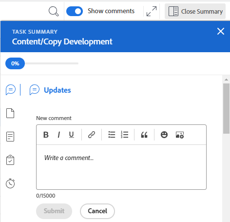

# Información general sobre el diseño de la plantilla de horas

<!-- Audited: 12/2023 -->

<!--The highlighted information on this page refers to functionality not yet generally available. It is available only in the Preview environment for all customers or in Production for customers who enabled fast releases. 

For information about fast releases, see [Enable or disable fast releases for your organization](/help/quicksilver/administration-and-setup/set-up-workfront/configure-system-defaults/enable-fast-release-process.md).

For information about the current release schedule, see [Second Quarter 2024 release overview](/help/quicksilver/product-announcements/product-releases/24-q2-release-activity/24-q2-release-overview.md).-->

Este artículo describe la presentación de las plantillas de horas en Adobe Workfront, lo que le permite comprender mejor cómo personalizar y utilizar las plantillas de horas para registrar el tiempo.

Las preferencias de las plantillas de horas y las horas controlan lo que aparece en una plantilla de horas. Este artículo proporciona una descripción general de todas las opciones disponibles. Para obtener información sobre cómo seleccionar las opciones, consulte [Configuración de preferencias de plantilla de horas y horas](../../administration-and-setup/set-up-workfront/configure-timesheets-schedules/timesheet-and-hour-preferences.md).

Para obtener información acerca de cómo registrar tiempo en una plantilla de horas, consulte [Registrar el tiempo](../../timesheets/create-and-manage-timesheets/log-time.md).

Las siguientes son las áreas de una plantilla de horas:

* [Encabezado de la plantilla de horas](#timesheet-header)
* [Panel izquierdo](#the-left-panel)
* [Elementos de trabajo](#work-items)
* [Barra de herramientas](#toolbar)
* [Pie de la plantilla de horas](#timesheet-footer)
* [Función](#job-role)
* [Tipo de hora](#hour-type)
* [Área de actualizaciones en el panel izquierdo](#updates-area-in-the-left-panel)
* [Panel de resumen](#summary-panel)
* [Lapso de tiempo y área de entrada de horas](#time-frame-and-hour-entry-area)
* [Comentarios sobre la entrada de horas](#hour-entry-comments)
* [Horas](#hours)
* [Totales](#totals)

## Encabezado de la plantilla de horas

El encabezado de la plantilla de horas incluye la siguiente información:

* El lapso de tiempo de la plantilla de horas.
* El área de Acciones que incluye lo siguiente:
   * Un icono de estrella para añadir las plantillas de horas a su lista de Favoritos.
   * El icono Más con la opción Eliminar que le permite eliminar la plantilla de horas.
* Nombre del propietario de la plantilla de horas.
* Número total de horas registradas para los elementos mostrados en la plantilla de horas.
* El número de horas extra. Esta es una entrada manual y solo está visible cuando la configuración **Horas extra** está habilitada en una plantilla de horas. Para obtener más información, consulte [Edición de la información de plantilla de horas](../create-and-manage-timesheets/edit-timesheets.md).

>[!TIP]
>
>No se puede registrar un número de horas extra mayor que el número total de horas actuales en la plantilla de horas. Por ejemplo, si ha registrado 7 horas en la plantilla de horas hasta el momento, no puede registrar 8 horas extra.

* El estado de la plantilla de horas.

## Panel izquierdo

Puede acceder a las siguientes secciones en el panel izquierdo:

* **Plantilla de horas**: muestra la plantilla de horas real.
* **Actualizaciones**: muestra comentarios y actualizaciones del sistema para la plantilla de horas. Para obtener más información, consulte el área de [Área de actualizaciones en el panel izquierdo](#updates-area-in-the-left-panel) de este artículo.

## Elementos de trabajo

Los elementos de trabajo son los proyectos, tareas y problemas para los que desea registrar tiempo. Al hacer clic en la flecha hacia abajo, en la fila de encabezado, se contraen los proyectos y las tareas y problemas enumerados debajo. Al hacer clic en la flecha hacia abajo situada junto al nombre de un proyecto, se contraen los elementos de trabajo de ese proyecto.

Las tareas, los problemas y los proyectos en los que el tiempo se registra fuera de la plantilla de horas o de los elementos planificados durante el período de tiempo de la plantilla de horas aparecen aquí automáticamente.

## Barra de herramientas

La barra de herramientas incluye las siguientes opciones:

* El botón **Añadir elemento** que le permite añadir proyectos, tareas o problemas.
* El icono de filtro rápido para buscar tareas o problemas en la plantilla de horas.
* La configuración de **Mostrar comentarios** que le permite ver u ocultar comentarios de horas registrados para entradas de horas de proyectos, tareas o problemas.
* El icono de pantalla completa para mostrar la plantilla de horas en modo de pantalla completa.
* El botón **Abrir resumen** (o **Cerrar resumen**) para abrir o cerrar el Panel de resumen y ver información adicional sobre tareas o problemas. Este botón no está disponible para proyectos.

Para obtener más información, consulte [Registrar el tiempo](../create-and-manage-timesheets/log-time.md).

## Pie de la plantilla de horas

Puede hacer clic en los botones **Enviar para aprobación**, **Cerrar**, **Aprobar** y **Rechazar** de esta área para cerrar o rechazar la aprobación de una plantilla de horas.

Esta área también contiene información sobre la última vez que se guardó la plantilla de horas. Todos los cambios que realice en la información de la plantilla de horas se guardarán automáticamente.

## Función

Puede seleccionar otra función para asociarla a las entradas de horas. El administrador de Workfront debe habilitar la configuración **Asignar funciones a las entradas de horas** manualmente. La función especificada para usted cuando se le asigna la tarea o el problema se muestra de forma predeterminada. Si no se le asigna una función en la tarea o el problema, la función principal se muestra como predeterminada. Para obtener más información, consulte [Configuración de preferencias de plantilla de horas y horas](../../administration-and-setup/set-up-workfront/configure-timesheets-schedules/timesheet-and-hour-preferences.md).

Puede registrar varias entradas de horas para el mismo elemento de trabajo para diferentes funciones. Para obtener más información, consulte [Registrar el tiempo](../create-and-manage-timesheets/log-time.md).

## Tipo de hora

Puede seleccionar diferentes tipos de horas para asociarlos con las entradas de horas de cada elemento. Este campo solo se muestra cuando el administrador de Workfront lo habilita para su entorno. Para obtener más información, consulte [Configuración de preferencias de plantillas de horas y horas](../../administration-and-setup/set-up-workfront/configure-timesheets-schedules/timesheet-and-hour-preferences.md).

Puede registrar varias entradas de horas para el mismo elemento de trabajo para distintos tipos de horas. Para obtener más información, consulte [Registrar el tiempo](../create-and-manage-timesheets/log-time.md).

## Área de actualizaciones en el panel izquierdo

Puede realizar comentarios en una plantilla de horas para comunicarse con los aprobadores de la plantilla u otros usuarios en la sección Actualizaciones del panel izquierdo de la plantilla de horas.

Cualquier comentario realizado en la plantilla de horas se mostrará en esta área.

## Panel de resumen

Puede acceder al Panel de resumen para tareas o problemas que se muestran en una plantilla de horas. Desde aquí puede realizar comentarios sobre tareas y problemas o actualizar su información. Para más información, consulte [Información general sobre el resumen](../../workfront-basics/the-new-workfront-experience/summary-overview.md)

Los comentarios introducidos para los elementos de trabajo en el panel Resumen de plantilla de horas se muestran en el área Actualizaciones de la tarea o del problema. El panel Resumen no está disponible para proyectos.

## Lapso de tiempo y área de entrada de horas

El lapso de tiempo de la plantilla de horas se muestra a la derecha de los elementos de trabajo.

Puede crear plantillas de horas para una, dos o cuatro semanas.

El lapso de tiempo se muestra en incrementos de una semana completa. Los días fuera del lapso de tiempo especificado para la plantilla de horas aparecen atenuados. No se puede registrar el tiempo de los días que están fuera del lapso de tiempo de la plantilla de horas.

Para obtener más información, consulte [Crear una plantilla de horas de un solo uso](../create-and-manage-timesheets/create-tmshts.md) o [Crear, editar y asignar perfiles de plantillas de horas](../create-and-manage-timesheets/create-timesheet-profiles.md).

<!--drafted for the resize columns in timesheets story - make this blurb a TIP when the story is released: 
You can resize the columns that display different weeks, the time frame, or the work item areas by dragging and dropping the vertical lines that separate them.-->

## Comentarios sobre la entrada de horas

Puede añadir un comentario por cada entrada de hora que añada a su plantilla de horas.

Los comentarios que escriba en el cuadro de comentarios de entrada de horas se mostrarán en la plantilla de horas, debajo de cada elemento de trabajo en el que haya registrado el tiempo cuando la opción **Mostrar comentarios** esté habilitada en la barra de herramientas.

## Horas

La plantilla de horas proporciona campos de entrada para cada elemento de trabajo y día del intervalo de la plantilla de horas para registrar el tiempo dedicado a trabajar en el elemento. A medida que se registra el tiempo, el elemento en el que se registra aparece en azul claro y el cuadro de hora aparece delineado en azul oscuro.

## Totales

Revise la suma de todas las horas introducidas en la plantilla de horas, resumidas por día (en el encabezado de la plantilla de horas) y por objeto (en la última columna).
