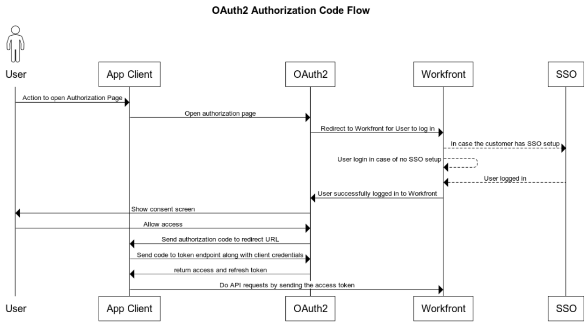

# Configure y utilice las aplicaciones OAuth 2 personalizadas de su organización mediante el flujo del código de autorización

Para integrarse con Workfront y permitir que la aplicación cliente se comunique con Workfront en nombre del usuario, debe:

* Creación de una aplicación OAuth2
* Configuración de la aplicación de terceros
* Vínculo a la página Autorizar para los usuarios
* Configurar flujo de código de autorización: los usuarios inician sesión en la instancia de Workfront y aceptan permitir que la aplicación cliente se conecte a Workfront en su nombre. Como resultado, se obtiene un código de autorización que se intercambia con tokens de acceso y actualización.
* Configurar flujo de token de actualización: en este flujo se utiliza el token de actualización para obtener un nuevo token de acceso cuando el anterior ha caducado.

## Crear una aplicación OAuth2

Para obtener instrucciones sobre cómo crear la aplicación OAuth2, consulte [Crear una aplicación OAuth2 con credenciales de usuario (Flujo de código de autorización)](../../administration-and-setup/configure-integrations/create-oauth-application.md#create3) en [Crear aplicaciones OAuth2 para integraciones de Workfront](../../administration-and-setup/configure-integrations/create-oauth-application.md)

>[!NOTE]
>
>Puede tener hasta un total de diez aplicaciones OAuth2 a la vez.

## Vínculo a la página Autorizar para los usuarios

Los usuarios deben iniciar sesión para autorizar esta integración en su propia cuenta. La página para que autoricen tiene un formato específico, que se describe aquí. Utilice esta información para determinar la dirección de la página de autorización de la aplicación y proporcione a los usuarios esta dirección o un vínculo a ella.

* Dirección URL completa del dominio de la organización. Ejemplo:

  ```
  https://myorganization.my.workfront.com
  ```


* `client_id`: Este es el ID de cliente generado al crear la aplicación OAuth2 en Workfront.

* `redirect_uri`: Esta es la URL de redireccionamiento que ingresó al crear la aplicación. Los usuarios serán dirigidos a esta página una vez que hayan autorizado la aplicación para su cuenta.

* `response_type`: debe tener el valor `code`.

Por lo tanto, la URL de la página de autorización es:

```
https://<URL of your organization's domain>/integrations/oauth2/authorize?client_id=<Your ClientID>&redirect_uri=<Your redirect URL>&response_type=code
```

>[!NOTE]
>
>Se recomienda crear un botón u otro vínculo en el que los usuarios puedan hacer clic para que se les dirija a esta página.

## Configuración de la aplicación de terceros

La aplicación de terceros puede requerir configuración. La siguiente tabla contiene información sobre los campos que pueden ser necesarios al configurar la aplicación de terceros.

<table style="table-layout:auto"> 
 <col> 
 <col> 
 <tbody> 
  <tr> 
   <td role="rowheader">URI de autorización</td> 
   <td> <p><code>https://&lt;the full URL of your organization's domain&gt;/integrations/oauth2/authorize</code> </p> <p class="example" data-mc-autonum="<b>Example: </b>"><span class="autonumber"><span><b>Ejemplo: </b></span></span><code> https://myorganization.my.workfront.com/integrations/oauth2/authorize</code> </p> </td> 
  </tr> 
  <tr> 
   <td role="rowheader">URL de token</td> 
   <td> <p><code>https://&lt;the full URL of your organization's domain&gt;/integrations/oauth2/api/v1/token</code> </p> <p class="example" data-mc-autonum="<b>Example: </b>"><span class="autonumber"><span><b>Ejemplo: </b></span></span><code>https://myorganization.my.workfront.com/integrations/oauth2/api/v1/token</code> </p> </td> 
  </tr> 
  <tr> 
   <td role="rowheader">Ámbitos</td> 
   <td>No es necesario especificar ámbitos. </td> 
  </tr> 
 </tbody> 
</table>

## Configurar flujo de código de autorización



Para iniciar sesión con OAuth2, siga este proceso:

1. Cuando el usuario abre la página de autorización, redirige a la página de inicio de sesión de Workfront para que pueda iniciar sesión en Workfront. Si el usuario tiene una configuración de SSO, se abrirá la página de inicio de sesión del proveedor de identidad.

   Si el usuario ya ha iniciado sesión en Workfront en el mismo explorador, o si inicia sesión correctamente en Workfront, se redirige al usuario a la pantalla de consentimiento:

   

1. Si el usuario permite el acceso, la página se redirigirá a `redirect_url`. El redireccionamiento debe incluir los siguientes parámetros de consulta:

* `code`: el código de autorización necesario para obtener el token de acceso/actualización.
* `domain`: dominio de su organización. Ejemplo: en `myorganization.my.workfront.com`, el dominio es `myorganization`.
* `lane`: el carril de la solicitud. Ejemplo: en `myorganization.preview.workfront.com`, el carril es `preview`.

  >[!IMPORTANT]
  >
  >`code` solo es válido por 2 minutos. Por lo tanto, debe obtener los tokens de actualización y acceso en ese plazo de tiempo.

1. Cuando tenga un código, puede solicitar tokens de actualización y acceso enviando el código junto con las credenciales de la aplicación cliente al extremo `/integrations/oauth2/api/v1/token`.

   La URL completa de la solicitud de token es

   ```
   https://<URL of your organization's domain></span>/integrations/oauth2/api/v1/token
   ```

   **Ejemplos:** Ejemplo de llamada CURL al extremo de token:

   Ejemplo 1

   ```
      curl --location --request POST '**<workfront host>**/integrations/oauth2/api/v1/token' \
      --header 'Authorization: Basic **<base64(client_id:client_secret)>**' \
      --header 'Content-Type: application/json' \
      --data-raw '{
      "code": "**<code>**",
      "grant_type": "**authorization_code**",
      "redirect_uri": "**<redirect_url>**"
      }'
   ```

   Ejemplo 2

   ```
      curl --location --request POST '**<workfront host>**/integrations/oauth2/api/v1/token' \
      --header 'Content-Type: application/x-www-form-urlencoded' \
      --data-urlencode 'grant_type=**authorization_code**' \
      --data-urlencode 'redirect_uri=**<redirect_url>**' \
      --data-urlencode 'code=**<code>**' \
      --data-urlencode 'client_id=**<client_id>**' \
      --data-urlencode 'client_secret=**<client_secret>**'  
   ```


   >[!IMPORTANT]
   >
   > El secreto de cliente se generó al registrar la aplicación en Workfront. Debe almacenarlo en un lugar seguro, ya que no se puede recuperar si se pierde.

   Cuando todos los parámetros pasados son correctos, el extremo del token devuelve la siguiente carga útil:

   ```
   {
      "token_type": "sessionID",
      "access_token": "string", // the value of sessionID
      "refresh_token": "string",
      "expires_in": 0,
      "wid": "string"
   }
   ```

   El token de acceso es el mismo que ```sessionID``` y caduca de la misma manera que el ```sessionID``` normal

   >[!IMPORTANT]
   >
   > Almacene el token de actualización en un lugar seguro. Lo necesitará para obtener un nuevo token de actualización cuando el anterior haya caducado. Workfront no almacena el token de actualización.

1. Ahora, cuando tenga un token de acceso, podrá realizar llamadas de API a Workfront

   ```
   curl --request GET 'https://<workfront host>/attask/api/v14.0/proj/search \
   --header 'sessionID: <access_token>'
   ```

## Configuración del token de acceso de actualización


Para actualizar el access_token de nuevo necesitamos hacer una llamada de &quot;POST&quot; al punto final del token. Esta vez, se envía un formulario de datos diferente de la siguiente manera:

```
curl --location --request POST '<workfront host>/integrations/oauth2/api/v1/token' \
--header 'Authorization: Basic <base64(client_id:client_secret)>' \
--header 'Content-Type: application/json' \
--data-raw '{
   "grant_type": "refresh_token",
   "refresh_token": "<refresh_token>"
}'

###### OR

curl --location --request POST '<workfront host>/integrations/oauth2/api/v1/token' \
--header 'Content-Type: application/x-www-form-urlencoded' \
--data-urlencode 'grant_type=refresh_token' \
--data-urlencode 'redirect_uri=<redirect_url>' \
--data-urlencode 'refresh_token=<refresh_token>' \
--data-urlencode 'client_id=<client_id>' \
--data-urlencode 'client_secret=<client_secret>'
```

Devolverá el siguiente resultado:

```
{
  "token_type": "sessionID",
  "access_token": "string", // the value of sessionID
  "refresh_token": "string",
  "expires_in": 0,
  "wid": "string"
}
```

Y de nuevo el token de acceso es `sessionID`, que se puede usar para realizar una solicitud de API a Workfront.
