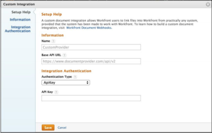

# Registrar una integración de webhook

{{highlighted-preview}}

Los administradores de Adobe Workfront pueden añadir una integración de webhook para su empresa navegando hasta Configuración > Documentos > Integraciones personalizadas en Workfront. Desde la página Integración personalizada dentro de Configuración, los administradores pueden ver una lista de las integraciones de webhook de documentos existentes. Desde esta página, las integraciones se pueden añadir, editar, habilitar y deshabilitar.

Para agregar una integración, haga clic en **Agregar integración personalizada**.

## Campos disponibles

Al añadir una integración, el administrador introduce valores en los campos siguientes.

<table style="table-layout:auto"> 
 <col> 
 <col> 
 <thead> 
  <tr> 
   <th>Nombre de campo</th> 
   <th>Descripción</th> 
  </tr> 
 </thead> 
 <tbody> 
  <tr> 
   <td>Nombre</td> 
   <td>Nombre de esta integración.</td> 
  </tr> 
  <tr> 
   <td>URL de API básica</td> 
   <td> 
La ubicación de la API de devolución de llamada. Al realizar llamadas al sistema externo, Workfront simplemente anexará el nombre del punto final a esta dirección. Por ejemplo, si el administrador introduce la URL de API básica, https://www.mycompany.com/api/v1, Workfront utiliza la siguiente URL para obtener los metadatos de un documento: https://www.mycompany.com/api/v1/metadata?id=1234.
 </td> 
  </tr> 
  <tr> 
   <td>Parámetros de solicitud</td> 
   <td> 
Valores opcionales que se anexan a la cadena de consulta de cada llamada API. Por ejemplo, access_type=offline. 
 </td> 
  </tr> 
  <tr> 
   <td>Tipo de autenticación</td> 
   <td>OAuth2 o ApiKey</td> 
  </tr> 
  <tr> 
   <td>URL de autenticación</td> 
   <td> 
(Solo OAuth2) Dirección URL completa utilizada para la autenticación de usuarios. Workfront llevará a los usuarios a esta dirección como parte del proceso de aprovisionamiento de OAuth. Nota: Workfront anexará un parámetro “state” a la cadena de consulta. El proveedor debe devolverlo a Workfront anexándolo al URI de redireccionamiento de Workfront.
 </td> 
  </tr> 
  <tr> 
   <td>URL de punto final de token</td> 
   <td> 
(Solo para OAuth2) URL de API completa que sirve para recuperar tókenes de OAuth2. Esto lo aloja el proveedor de webhooks o el proveedor de documentos externo
 </td> 
  </tr> 
  <tr> 
   <td>Id. de cliente</td> 
   <td>(Solo para OAuth2) ID de cliente OAuth2 para esta integración.</td> 
  </tr> 
  <tr> 
   <td>Secreto de cliente</td> 
   <td> 
(Solo para OAuth2) Secreto de cliente Oauth2 para esta integración.
 </td> 
  </tr> 
  <tr> 
   <td>URI de redireccionamiento de Workfront</td> 
   <td>(Solo OAuth2) Se trata de un campo de solo lectura que genera Workfront. Este valor se utiliza para registrar esta integración con el proveedor de documentos externo. Nota: Como se ha descrito anteriormente para la URL de autenticación, el proveedor debe anexar el parámetro “state” y su valor a la cadena de consulta al realizar la redirección.</td> 
  </tr> 
  <tr> 
   <td>ApiKey</td> 
   <td> 
(Solo ApiKey) Se utiliza para realizar llamadas de API autorizadas al proveedor de webhooks. Se trata de la clave API emitida por el proveedor de webhooks.
 </td> 
  </tr> 
  <tr class="preview"> 
   <td>Habilitar la carga interrumpida para archivos grandes</td> 
   <td> 
Seleccione esta casilla de verificación para habilitar las cargas de varias partes (fragmentadas) para archivos de más de 25 MB. Cuando no se selecciona, los archivos se cargan en una sola solicitud independientemente de su tamaño.
 </td> 
  </tr> 
  <tr class="preview"> 
   <td>Umbral de carga interrumpida (MB)</td> 
   <td> 
El tamaño máximo, en MB, de cada fragmento cuando se divide un archivo grande para la carga. Acepta valores de hasta 100 MB.
 </td> 
  </tr> 
 </tbody> 
</table>
