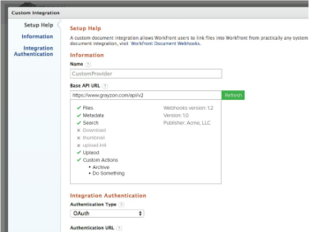

# Información general sobre webhooks

Adobe Workfront Document Webhooks define un conjunto de puntos finales de API a través de los cuales Workfront realiza llamadas de API autorizadas a un proveedor de documentos externo. Esto permite a cualquier usuario crear un complemento de middleware para cualquier proveedor de almacenamiento de documentos.

La experiencia del usuario para integraciones basadas en webhooks será similar a la de integraciones de documentos existentes, como Google Drive, Box y Dropbox. Por ejemplo, un usuario de Workfront podrá realizar las siguientes acciones:

* Navegar por la estructura de carpetas del proveedor de documentos externo
* Buscar archivos
* Vincular archivos a Workfront
* Cargar archivos al proveedor de documentos externo
* Ver una miniatura del documento

**Implementación de referencia**

Para ayudar a impulsar el desarrollo de una nueva implementación de webhooks, Workfront proporciona ejemplos de una implementación de referencia. Estos ejemplos se encuentran en [https://github.com/Workfront/webhooks-app](https://github.com/Workfront/webhooks-app). Los ejemplos están basados en Java y permiten a Workfront conectar documentos en un sistema de archivos de red. 

>[!NOTE]
>
>Los recursos de GitHub son solo ejemplos y no pueden ejecutar una implementación.

## Versiones

* Versión 1.0 (Fecha de lanzamiento: mayo de 2015): Especificación inicial

* Versión 1.1 (Fecha de lanzamiento: junio de 2015). Se ha actualizado /uploadInit: se han añadido el ID de documento y el ID de versión de documento

* Versión 1.2 (Fecha de lanzamiento: octubre de 2015): se ha añadido /createFolder

* Próximas versiones (fecha de lanzamiento: por determinar):

   * Añadido/Eliminar
   * Añadido/nombre
   * Añadido/serviceInfo
   * Añadido/customAction
   * Añadir paginación y parentId a /search
