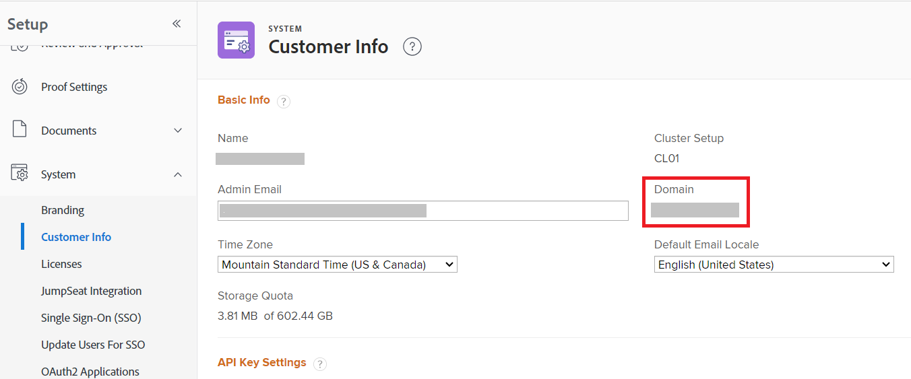

# Formato de dominio para llamadas a la API de Adobe Workfront

Cuando realiza una llamada de API a la API de Workfront, utiliza el dominio de su organización en la llamada. El formato de esta URL de dominio difiere según si la organización se ha incorporado al Unified Shell de Adobe.

Para saber si su organización está en el Unified Shell de Adobe, examine la dirección URL que se muestra cuando está viendo una página de Workfront.

| La URL de Workfront comienza con: | URL para llamadas API: |
|---|---|
| `experience.adobe.com` | `<yourdomain>.my.workfront.adobe.com` |

## Requisitos de acceso

+++ Expanda para ver los requisitos de acceso para la funcionalidad en este artículo.

<table style="table-layout:auto"> 
 <col> 
 <col> 
 <tbody> 
  <tr> 
   <td role="rowheader">paquete de Adobe Workfront</td> 
   <td> 
Cualquiera 
 </td> 
  </tr> 
  <tr> 
   <td role="rowheader">Licencia de Adobe Workfront</td> 
   <td>
Estándar

   
Plan
</td> 
  </tr> 
  <tr> 
   <td role="rowheader">Configuraciones de nivel de acceso</td> 
   <td> 
Debe ser administrador de Workfront
 </td> 
  </tr> 
 </tbody> 
</table>

Para obtener más información, consulte [Requisitos de acceso en la documentación de Workfront](/help/quicksilver/administration-and-setup/add-users/access-levels-and-object-permissions/access-level-requirements-in-documentation.md).

+++

Para localizar el dominio:

1. Haga clic en el icono **[!UICONTROL Menú principal]**  en la esquina superior derecha de Adobe Workfront o (si está disponible), haga clic en el icono **[!UICONTROL Menú principal]**  en la esquina superior izquierda y, a continuación, haga clic en **[!UICONTROL Configurar]** .
1. Seleccione **Sistema** y, a continuación, seleccione **Información del cliente**.

   Su dominio se muestra a la derecha de la pantalla.

   

