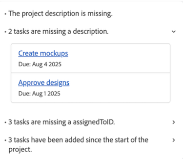

# Resumen de estado del proyecto

>[!IMPORTANT]
>
>Actualmente, la función Estado del proyecto solo está disponible para los usuarios que participan en la fase beta.

La función Project Health de Adobe Workfront utiliza la potencia de AI Assistant para ofrecerle instantáneamente una evaluación del rendimiento de sus proyectos, qué áreas necesitan su atención y cómo evitar problemas que pueden costarle tiempo y dinero.

El Asistente de inteligencia artificial puede generar una evaluación del estado del proyecto para los siguientes objetos:

* Un solo proyecto
* Un solo programa
* Varios proyectos

Para obtener más información sobre el Asistente de IA, consulte [Descripción general del Asistente de IA](/help/quicksilver/workfront-basics/ai-assistant/ai-assistant-overview.md).

+++ Amplíe para ver los requisitos de acceso. 
<table style="table-layout:auto"> 
<col> 
</col> 
<col> 
</col> 
<tbody> 
<tr> 
   <td role="rowheader">
Plan de Adobe Workfront
</td> 
   <td> 

Seleccionar, Prime o Ultimate 
 
   </td> 
<tr> 
 <tr> 
   <td role="rowheader">
Licencia de Adobe Workfront
</td> 
   <td> 

Estándar
 
   </td> 
   </tr> 
  </tr> 
  <tr> 
   <td role="rowheader">
Configuraciones de nivel de acceso
</td> 
   <td>
Administrador para administrar las configuraciones de estado del proyecto 

   
Editar para aplicar configuraciones de estado del proyecto 

     
Ver para ver las configuraciones de estado del proyecto 

  </td> 
  </tr>  
    </tr>  
</tbody> 
</table>

Para obtener más información sobre el contenido de esta tabla, consulte [Requisitos de acceso en la documentación de Workfront](/help/quicksilver/administration-and-setup/add-users/access-levels-and-object-permissions/access-level-requirements-in-documentation.md).
+++

## Inscríbase en la versión beta de Project Health

Para utilizar Project Health, su organización debe tener habilitado el Asistente para IA.

Para habilitar el Asistente de IA y el Estado del proyecto para su organización, deben aplicarse todas las siguientes condiciones:

* Su organización debe haber migrado a Adobe IMS (sistema Identity Management).
* Su organización debe tener un plan Select, Prime o Ultimate Workfront
* La experiencia unificada de Adobe debe estar habilitada.
* Adobe debe tener registrado un acuerdo de Adobe Gen AI.
* El administrador de Workfront debe habilitar el Asistente de IA para los usuarios de su organización. El asistente de IA se habilita mediante niveles de acceso.
* Las opciones Habilitar IA y Estado del proyecto deben estar seleccionadas en la sección Preferencias de IA en Configuración > Sistema > Preferencias.

  

Para obtener más información, consulte [Descripción general del asistente de IA](/help/quicksilver/workfront-basics/ai-assistant/ai-assistant-overview.md) y [Configurar las preferencias del sistema](/help/quicksilver/administration-and-setup/manage-workfront/security/configure-security-preferences.md).

## Lista de peticiones del Asistente de IA

A continuación se muestra una lista de preguntas que puede utilizar para solicitar a la evaluación de IA que genere una evaluación de estado del proyecto para un proyecto, programa o todos los proyectos de su cuenta.

<table>
    <tr>
        <td><b>Ubicación</b></td>
        <td><b>Solicitud</b></td>
    </tr>
    <tr>
        <td>Página de detalles de un proyecto específico</td>
        <td><em>¿Cuál es la salud de este proyecto?</em></td>
    </tr>
    <tr>
        <td>Cualquier página de Workfront </td>
        <td><em>¿Cuál es el estado del proyecto [NOMBRE DEL PROYECTO]?</em></td>
    </tr>
    <tr>
        <td>Cualquier página de Workfront </td>
        <td><em>¿Cuál es la salud de mis proyectos?</em></td>
    </tr>
       <tr>
        <td>Página de detalles de un programa específico</td>
        <td><em>¿Cuál es la salud de este programa?</em></td>
    </tr>
       <tr>
        <td>Cualquier página de Workfront </td>
        <td><em>¿Cuál es el estado del programa [NOMBRE DEL PROGRAMA]?</em></td>
    </tr>
   </table>

## Lista de condiciones de proyecto y programa

A continuación se muestran las condiciones disponibles que el Asistente de inteligencia artificial asignará a su proyecto o programa al generar una evaluación de estado del proyecto.

<table>
    <tr>
        <td><b>Condición del proyecto</b></td>
        <td><b>Estado de progreso del proyecto</b></td>
        <td><b>Factores de condición del proyecto</b></td>
    </tr>
    <tr>
        <td>Bien encaminado</td>
        <td>Este análisis se asigna cuando el nivel de riesgo medio de los siguientes factores se encuentra dentro del umbral adecuado.
        </td>
        <td> 
        <ul><li>Desviación del alcance</li>
        <li>Faltan campos</li>
        <li>Cambios en la programación</li>
        <li>Trabajo subestimado</li>
        <li>Progreso del proyecto</li>
        <li>Tareas vencidas</li>
        <li>Presupuesto</li>
        </ul></td>
    </tr>
    <tr>
        <td>En riesgo</td>
        <td>Este análisis se asigna cuando el nivel de riesgo medio de los siguientes factores cae justo por debajo del umbral adecuado.</td>
        <td>
        <ul><li>Desviación del alcance</li>
        <li>Faltan campos</li>
        <li>Cambios en la programación</li>
        <li>Trabajo subestimado</li>
        <li>Progreso del proyecto</li>
        <li>Tareas vencidas</li>
        <li>Presupuesto</li>
        </ul></td>
    </tr>
    <tr>
        <td>Con problemas</td>
        <td>Este análisis se asigna cuando el nivel de riesgo medio de los factores siguientes cae por debajo del umbral adecuado.</td>
        <td>
        <ul><li>Desviación del alcance</li>
        <li>Faltan campos</li>
        <li>Cambios en la programación</li>
        <li>Trabajo subestimado</li>
        <li>Progreso del proyecto</li>
        <li>Tareas vencidas</li>
        <li>Presupuesto</li>
        </ul></td>
    </tr>
    </tr>
   </table>

## Administrar configuraciones de estado del proyecto

Una configuración de mantenimiento del proyecto contiene criterios específicos que determinan cómo se calcula el estado del proyecto. Después de crear una configuración, puede aplicarla a un proyecto.

>[!NOTE]
>
>Debe ser administrador del sistema para administrar las configuraciones de estado del proyecto.

{{step-1-to-setup}}

1. Haga clic en **Preferencias del proyecto** en el panel izquierdo y, a continuación, seleccione **Estado del proyecto** en la lista desplegable que aparece.

1. En la esquina superior derecha de la página, seleccione **Nueva configuración**.

1. (Opcional) En la página de detalles de las configuraciones, reemplace *Configuración sin título* por una nueva configuración **Nombre**.

1. En la sección **Qué factores desea incluir en el estado del proyecto**, anule la selección de cualquier factor que no desee incluir al determinar los criterios de estado del proyecto:
   * **Cambio de ámbito**: Cuánto se ha ampliado el ámbito del proyecto desde que se inició.

   * **Campos obligatorios**: Si faltan campos obligatorios (por ejemplo, descripción del proyecto). Estos campos obligatorios determinan la finalización del proyecto y se especifican en el **¿Qué campos desea comprobar para ver si están completos?** sección de configuración a continuación.

   * **Cambios de horario**: Cuántos cambios de horario se han producido desde que se inició el proyecto.

   * **Estimación de tareas**: La precisión con que se ha calculado el trabajo de la tarea (por ejemplo, no hay tareas vencidas actualmente en el proyecto).

   * **Evolución de tareas**: Cómo progresa el trabajo del proyecto en comparación con la cronología del proyecto.

   * **Tareas vencidas**: Cuántas tareas están actualmente vencidas.

   * **Costo**: Si el proyecto está actualmente por encima del presupuesto.

1. En **¿Cuándo comienza oficialmente su proyecto?**, seleccione el evento que indica el comienzo del proyecto en la lista desplegable.

1. En **¿Cómo calcula el ámbito de trabajo de un proyecto?**, seleccione qué factor de proyecto aumentará a medida que aumente el ámbito del proyecto.

1. En el **¿Qué campos desea comprobar para ver si están completos?**, seleccione uno o más campos que se verificarán para determinar la integridad del proyecto.

   

1. Haz clic en **Guardar** en la esquina superior derecha.

## Aplicar configuraciones de estado del proyecto

Una vez que un administrador ha creado una configuración de estado del proyecto, los usuarios con acceso de edición pueden aplicarla a un proyecto.

{{step1-to-projects}}

1. En la página **Proyectos**, seleccione un proyecto.

1. Haga clic en el icono **Más**  a la derecha del nombre del proyecto y, a continuación, seleccione **Editar**. Se abre el panel lateral **Editar proyecto**.

1. En el panel izquierdo, seleccione **Configuración del proyecto**.

1. En el campo **Configuración de mantenimiento del proyecto**, seleccione la configuración que desee aplicar a este proyecto.

   

1. Haga clic en **Guardar** en la esquina inferior izquierda del panel.

## Generar una evaluación de estado del proyecto para un proyecto o programa

Si tiene acceso de visualización para un proyecto o programa, puede generar su evaluación del estado del proyecto con el asistente de IA.

Si está generando una evaluación para un proyecto, puede hacerlo desde la página del proyecto o haciendo referencia al nombre del proyecto cuando pregunte al asistente el rendimiento del proyecto.

Si está generando una evaluación para un programa, puede hacerlo desde la página de detalles del programa.

>[!NOTE]
>
>No se puede generar una evaluación de estado del proyecto para un proyecto hasta que se haya iniciado el proyecto. Puede configurar los déclencheur de evento de un proyecto para que comiencen en la configuración del proyecto.

Para obtener más información, vea la siguiente sección de este artículo: [Administrar configuraciones de estado del proyecto](#manage-project-health-configurations).

1. Desplácese hasta el proyecto o programa para el que desee generar una evaluación de estado del proyecto.

1. En la página de detalles del proyecto o programa, haga clic en el icono **Asistente de IA**  en la esquina superior derecha de la pantalla. Se abre el Ayudante de IA.

1. Escriba lo siguiente en el campo **Preguntarme acerca de Workfront**: *¿Cuál es el estado de este proyecto?*

   O

   Escriba lo siguiente en el campo **Preguntarme acerca de Workfront**: *¿Cuál es el estado de este programa?*

   >[!NOTE]
   >
   >Si accede al Asistente de IA desde una página diferente en Workfront, escriba *¿Cuál es el estado del proyecto [NOMBRE DEL PROYECTO]?* o *Cuál es el estado del programa [NOMBRE DEL PROGRAMA]?*  
   >Para obtener una lista completa de los mensajes actuales que puede especificar, consulte la siguiente sección en este artículo: [Lista de mensajes del Asistente de IA](#ai-assistant-prompts-list).

1. Pulse el icono **Enviar** . La evaluación del estado del proyecto genera y aparece en el panel. Aparece una insignia en la parte superior de cada evaluación de estado del proyecto, que refleja la condición actual del proyecto.

   

   Si está generando una evaluación para un portafolio, se enumerarán varias insignias que mostrarán la condición de cada proyecto en el programa. Para obtener más información sobre las etiquetas de distintivo, consulte la siguiente sección en este artículo: [Lista de condiciones del proyecto y del programa](#project-and-program-conditions-list).

1. (Opcional) Haga clic en uno de los puntos de evaluación para ampliar sus detalles.

1. (Opcional) En el modo de detalles expandidos, haga clic en el vínculo de la tarea para abrir los detalles de la tarea.

   

1. Después de revisar los detalles del estado del proyecto, haz clic en el icono **Cerrar**  en la esquina superior derecha del Ayudante de IA.

## Generar una evaluación de estado del proyecto para varios proyectos

Puede generar una evaluación combinada del estado del proyecto para todos los proyectos para los que actualmente tiene acceso de visualización (o superior).

Un proyecto solo se incluirá en la evaluación combinada del estado del proyecto si el proyecto ha comenzado. Puede configurar los déclencheur de evento de un proyecto para que comiencen en la configuración del proyecto. Para obtener más información, vea la siguiente sección de este artículo: [Administrar configuraciones de estado del proyecto](#manage-project-health-configurations).

1. Haga clic en el icono **Asistente de IA**  en la esquina superior derecha de la pantalla. Se abre el Ayudante de IA.

1. Escriba lo siguiente en el campo **Preguntarme acerca de Workfront**: *¿Cuál es el estado de mis proyectos?*

   Para obtener una lista completa de los mensajes actuales que puede especificar, consulte la siguiente sección en este artículo: [Lista de mensajes del Asistente de IA](#ai-assistant-prompts-list).

1. Pulse el icono **Enviar** . La evaluación del estado del proyecto genera y aparece en el panel.

   

   Al generar una evaluación para varios proyectos, el Asistente de IA agrupa los resultados en función del rendimiento actual de los proyectos.

1. (Opcional) Haga clic en uno de los distintivos de estado del proyecto para expandir la lista de proyectos y, a continuación, seleccione un vínculo para que un proyecto específico vaya a la página de detalles de ese proyecto.

1. Después de revisar los detalles de estado de los proyectos, haga clic en el icono **Cerrar**  en la esquina superior derecha del Ayudante de IA para cerrarlo.

<!--

## Build a Project Health table report in a Canvas Dashboard

>[!IMPORTANT]
>
>The Canvas Dashboards feature is currently only available for users participating in the beta stage. For more information, see [Canvas Dashboards beta information](/help/quicksilver/product-announcements/betas/canvas-dashboards-beta/canvas-dashboards-beta-information.md). 

You can add a table report to a Canvas Dashboard in order to easily visualize your Project Health data in a table format.  

### Prerequisites 

You must create a dashboard before you can build a table report. 

For more, see [Create a Canvas Dashboard](/help/quicksilver/reports-and-dashboards/canvas-dashboards/create-dashboards/create-dashboards.md).

### Build a Project Health table report 

There are many configuration options available for building a Project Health table report. In this section, we'll walk you through the process of creating one that displays the following columns: 

* **Name**: Contains the project name. 
* **Project Health Analysis**: Contains a summary of the Project Health assessment. 
* **Project Health Created At**: Contains the date/time when the Project Health assessment was last generated. 
* **Project Health Label**: Contains the project's label (e.g. On Target, At Risk, or In Trouble).

{{step1-to-dashboards}}

1. In the left panel, click **Canvas Dashboards**. 
1. In the upper-right corner, click **New Dashboard**. 
1. In the **Create dashboard** box, enter the dashboard's **Name** and **Description**. 
1. Click **Create**. 
1. In the **Add report** box, select **Create report**. 
1. On the left side, select **Table**. 
1. In the upper-right corner, click **Create report**. 
1. (Optional) Follow the steps below to configure the **Details**  section: 
    1. Enter a report **Name**. 
    1. Enter a report **Description**. 
1. Follow the steps below to configure the **Build table**  section: 
    1. In the left panel, click the **Table columns** icon. 
    1. Click **Add column**, then select **Project** > **Name**. 
    1. Click **Add column**, then select **Project** > **Project Health** > **Health Analysis**. 
    1. Click **Add column**, then select **Project** > **Project Health** > **Created At**. 
    1. Click **Add column**, then select **Project** > **Project Health** > **Health Label**. 

1. Follow the steps below to configure the **Filter**  section: 
    1. In the left panel, click the **Filter** icon. 
    1. Select **Edit filter**. 
    1. Click **Add condition** and then specify the field you want to filter by and the modifier that defines what kind of condition the field must meet. The column appears in the preview section on the right.
    1. (Optional) Click **Add filter group** to add another set of filtering criteria. The default operator between the sets is AND. Click the operator to change it to OR. 

1. Follow the steps below to configure the **Drilldown Group Settings**  section: 
    1. In the left panel, click the **Group Settings** icon. 
    1. Click the **Add grouping** button and then select the field you want to create as a grouping. The grouping column appears in the preview section on the right. 

1. Click **Save** to create the report.

-->
