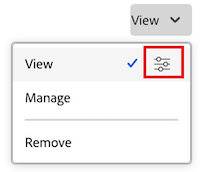

# Compartir un documento

El administrador de Workfront controla quién puede vista o editar documentos en el área Niveles de acceso en Configuración. Para obtener más información, consulte [Conceder acceso a documentos](../../administration-and-setup/add-users/configure-and-grant-access/grant-access-documents.md).

Los usuarios también pueden compartir documentos que han cargado o a los que tienen acceso, lo que otorga a otros permisos para verlos o administrarlos.

* Los permisos se aplican a elementos individuales y definen qué acciones puede realizar una persona.
* La persona que carga un documento obtiene automáticamente control total (permisos de administración).
* Para compartir una carpeta completa, vea [Compartir una carpeta de documentos](../../workfront-basics/grant-and-request-access-to-objects/share-a-document-folder.md).

>[!NOTE]
>
>Si la instancia de Workfront utiliza el almacenamiento empresarial de Adobe, no puede compartir documentos individuales. En su lugar, puede conceder acceso en el nivel de proyecto. Tenga en cuenta que compartir el proyecto puede conceder acceso a información confidencial del proyecto, como datos financieros, en función del nivel de permiso elegido.

## Requisitos de acceso

+++ Expanda para ver los requisitos de acceso para la funcionalidad en este artículo. 

<table style="table-layout:auto"> 
 <col> 
 <col> 
 <tbody> 
  <tr> 
   <td role="rowheader">Paquete de Adobe Workfront</td> 
   <td> 
Cualquiera 
 </td> 
  </tr> 
  <tr> 
   <td role="rowheader">Licencia de Adobe Workfront</td> 
   <td> 
Estándar
 
   
Trabajo o superior

   </td> 
  </tr> 
  <tr> 
   <td role="rowheader">Configuraciones de nivel de acceso</td> 
   <td> 
Acceso de visualización o superior sobre los objetos que desea compartir
 </td> 
  </tr> 
  <tr> 
   <td role="rowheader">Permisos de objeto</td> 
   <td> 
Permisos de visualización o superiores sobre los objetos que desea compartir
</td> 
  </tr> 
 </tbody> 
</table>

Para obtener más información sobre el contenido de esta tabla, consulte [Requisitos de acceso en la documentación de Workfront](/help/quicksilver/administration-and-setup/add-users/access-levels-and-object-permissions/access-level-requirements-in-documentation.md).

+++

## Compartir un documento

El usuario que carga un documento en Workfront tiene permisos de administración en él, de forma predeterminada.

{{step1-to-documents}}

1. En el **Página Documentos**, coloca el cursor sobre la documento que quieras compartir y haz clic en el vincular Detalles **del** documento que aparece. Se abre la **Página de detalles** del documento.

   

1. Haga clic en el icono **Más**  a la derecha del nombre del documento y, a continuación, haga clic en **Compartir**. Se abre el cuadro de diálogo **Compartir [nombre de documento]**.

   

1. En el campo **Conceder acceso al documento a**, empiece a escribir el nombre del usuario, equipo, función, grupo o compañía con el que desea compartir el documento y, a continuación, haga clic en el nombre cuando aparezca en la lista desplegable.

   >[!TIP]
   >
   >Solo puede compartir un documento con usuarios, equipos, funciones o empresas activos.

1. (Opcional) Seleccione la lista desplegable **Quién tiene acceso** y seleccione el nivel de acceso del documento:

   * **Solo las personas invitadas pueden tener acceso a:** Solo los usuarios invitados al documento pueden tener acceso a él (predeterminado).
   * **Todos los usuarios del sistema pueden vista**: todos los usuarios del sistema pueden vista el documento sin invitación.

1. (Opcional) Para que la documento sea pública, haga clic en el icono  de engranaje y, a continuación, haga clic en la casilla en línea con **Hacer público para usuarios** externos. La **botón Copiar vincular** pública aparece en la parte inferior del cuadro de diálogo.

1. Haga clic en el menú desplegable a la derecha del nombre del usuario y seleccione su nivel de permiso para esta documento:

   * **Ver**: el usuario puede revisar y compartir el documento.
   * **Administrar**: el usuario tiene acceso completo al documento sin derechos administrativos, que se conceden en el nivel de acceso (también incluye todos los permisos de Vista).

1. (Opcional) Haga clic en el icono de opciones avanzadas junto al nivel de permisos que ha concedido para configurar permisos específicos en el documento.

   

1. (Opcional) Para desactivar los permisos heredados de los objetos secundarios del documento, haga clic en **Desactivar** en línea con **Permisos heredados**.

1. (Condicional) Para copiar el vínculo público que le permite compartir el documento con usuarios externos, haga clic en **Copiar vínculo público**.

   >[!CAUTION]
   >
   >Se recomienda tener cuidado al compartir un documento que contenga información confidencial con usuarios externos. Esto les permite ver información sin ser usuarios de Workfront ni parte de su organización.

1. Haga clic en **Guardar**.

## Compartir documentos de forma masiva

{{step1-to-documents}}

1. En la **pestaña Todos los** documentos **del Página Documentos**, mantén pulsada la tecla **Comando** (Mac) o **Ctrl** (Windows) del teclado y, a continuación, haz clic en cada documento quieras compartir.

1. En la parte superior de la Página, haga clic en el **icono** Compartir. Se abre el modal compartido.

   

1. En el **campo Conceder acceso a** documento, comience a escribir el nombre del usuario, equipo, función grupo o compañía con el que desea compartir el documentos y, a continuación, haga clic en el nombre cuando aparezca en el lista desplegable.

   >[!TIP]
   >
   >Solo puede compartir documentos con usuarios, equipos, roles o empresas activos.

1. (Opcional) Seleccione el **menú desplegable Quién tiene acceso** y seleccione el nivel de acceso del documentos:

   * **Solo pueden acceder las personas invitadas:** solo los usuarios invitados a la documentos pueden acceder a ella (predeterminado).
   * **Todos los usuarios del sistema pueden ver**: todos los usuarios del sistema pueden ver los documentos sin invitación.

1. Haga clic en la lista desplegable a la derecha del nombre del usuario y seleccione su nivel de permisos para los documentos:

   * **Ver**: el usuario puede revisar y compartir los documentos.
   * **Administrar**: el usuario tiene acceso completo a los documentos sin derechos administrativos, que se conceden en el nivel de acceso (también incluye todos los permisos de Vista).

1. (Opcional) Haga clic en el icono de opciones avanzadas junto al nivel de permisos que ha concedido para configurar permisos específicos en los documentos.

   

1. Haga clic en **Guardar**.

## Uso compartido de documentos con Adobe Systems almacenamiento empresarial

Workfront está haciendo la transición a la solución de almacenamiento empresarial Adobe Systems para proporcionar una mayor conectividad con Adobe Creative Cloud productos. Los clientes existentes se moverán al nuevo modelo en fases. Para obtener más información sobre las ventajas de Adobe Systems almacenamiento empresarial, visita [Adobe Systems descripción general](/help/quicksilver/review-and-approve-work/esm-overview.md) de almacenamiento empresarial.

Si su instancia Workfront utiliza Adobe Systems almacenamiento empresarial, no puede compartir documentos individuales directamente. En su lugar, debe conceder acceso en el nivel de proyecto.

>[!IMPORTANT]
>
>Compartir un proyecto también puede dar a los usuarios acceso a información confidencial del proyecto, como datos financieros, según el nivel de permiso que elija.
>
>Asegúrese de revisar detenidamente la configuración de permisos antes de compartirlos.

## Permisos de documento

Los permisos son específicos de un elemento en Workfront y definen qué acciones se pueden realizar sobre ese elemento. Para obtener información acerca de los permisos de objetos, vea [Información general sobre los permisos de uso compartido en objetos](../../workfront-basics/grant-and-request-access-to-objects/sharing-permissions-on-objects-overview.md).

La siguiente tabla muestra qué permisos puede conceder a los usuarios cuando les permite ver o administrar documentos:

<table border="2" cellspacing="15" cellpadding="1"> 
 <col> 
 <col> 
 <col> 
 <thead> 
  <tr> 
   <th> 
<strong>Accion</strong> 
 </th> 
   <th> 
<strong>Administrar</strong> 
 </th> 
   <th> 
<strong>Vista</strong> 
 </th> 
  </tr> 
 </thead> 
 <tbody> 
  <tr> 
   <td scope="row">Crear</td> 
   <td>✓</td> 
   <td> </td> 
  </tr> 
  <tr> 
   <td scope="row">Editar detalles del documento</td> 
   <td>✓</td> 
   <td> </td> 
  </tr> 
  <tr> 
   <td scope="row">Eliminar*</td> 
   <td>✓</td> 
   <td> </td> 
  </tr> 
  <tr> 
   <td scope="row">Descargar</td> 
   <td>✓</td> 
   <td>✓</td> 
  </tr> 
  <tr> 
   <td scope="row">Cierre de compra</td> 
   <td>✓</td> 
   <td> </td> 
  </tr> 
  <tr> 
   <td scope="row">Aprobadores añadir</td> 
   <td>✓</td> 
   <td> </td> 
  </tr> 
  <tr> 
   <td scope="row">Aprobar documento</td> 
   <td>✓</td> 
   <td>✓</td> 
  </tr> 
  <tr> 
   <td scope="row">Adjuntar formulario personalizado</td> 
   <td>✓</td> 
   <td> </td> 
  </tr> 
  <tr> 
   <td scope="row">Editar campos personalizados</td> 
   <td>✓</td> 
   <td> </td> 
  </tr> 
  <tr> 
   <td scope="row">Mover a (objeto)</td> 
   <td>✓</td> 
   <td> </td> 
  </tr> 
  <tr> 
   <td scope="row">Enviar a (integración)</td> 
   <td>✓</td> 
   <td> </td> 
  </tr> 
  <tr> 
   <td scope="row">Actualizaciones/ Comentarios</td> 
   <td>✓</td> 
   <td>✓</td> 
  </tr> 
  <tr> 
   <td scope="row">Cargar nueva versión</td> 
   <td>✓</td> 
   <td> </td> 
  </tr> 
  <tr> 
   <td scope="row">Eliminar versión</td> 
   <td>✓</td> 
   <td> </td> 
  </tr> 
  <tr> 
   <td scope="row">Ver documentos</td> 
   <td>✓</td> 
   <td>✓</td> 
  </tr> 
  <tr> 
   <td scope="row">Vista previa</td> 
   <td>✓</td> 
   <td>✓</td> 
  </tr> 
  <tr> 
   <td scope="row">Prueba**</td> 
   <td>✓</td> 
   <td>✓</td> 
  </tr> 
  <tr> 
   <td scope="row">Generar prueba**</td> 
   <td>✓</td> 
   <td> </td> 
  </tr> 
  <tr> 
   <td scope="row">Eliminar revisión**</td> 
   <td>✓</td> 
   <td> </td> 
  </tr> 
  <tr> 
   <td scope="row">Compartir*</td> 
   <td>✓</td> 
   <td>✓</td> 
  </tr> 
  <tr> 
   <td scope="row">Compartir en todo el sistema*</td> 
   <td>✓</td> 
   <td> </td> 
  </tr> 
  <tr> 
   <td scope="row">Compartir documentos públicamente*</td> 
   <td>✓</td> 
   <td> </td> 
  </tr> 
  <tr> 
   <td scope="row">Compartir con una dirección correo electrónico externa</td> 
   <td> </td> 
   <td>✓</td> 
  </tr> 
  <tr> 
   <td scope="row">Agregar/ quitar</td> 
   <td>✓</td> 
   <td>✓</td> 
  </tr> 
  <tr> 
   <td scope="row">Cambiar nombre</td> 
   <td>✓</td> 
   <td> </td> 
  </tr> 
  <tr> 
   <td scope="row">Vincular (con integración)</td> 
   <td>✓</td> 
   <td>✓</td> 
  </tr> 
  <tr> 
   <td scope="row">Desvincular (con integración)</td> 
   <td>✓</td> 
   <td> </td> 
  </tr> 
 </tbody> 
</table>

&#42; La acción es compartida por Documentos y Carpetas de documentos.

&#42;&#42; Para poder revisar documentos, debe tener asociada una licencia de revisión independiente con su cuenta de Workfront. Póngase en contacto con su administrador de cuentas para obtener una licencia de revisión. Para obtener más información sobre la revisión en Workfront, consulte [Revisión](../../review-and-approve-work/proofing/proofing.md).

## Consideraciones sobre el uso compartido de documentos

Además de las consideraciones siguientes, consulte [Información general sobre los permisos de uso compartido en objetos](../../workfront-basics/grant-and-request-access-to-objects/sharing-permissions-on-objects-overview.md).

>[!NOTE]
>
>Un administrador de Workfront puede añadir o quitar permisos a cualquier elemento del sistema, para todos los usuarios, sin que tengan que ser el propietario de esos elementos.

* Compartir una documento es similar a compartir cualquier otro objeto en Workfront. Para obtener información sobre cómo compartir documentos en Workfront, consulte [Compartir un objeto](../../workfront-basics/grant-and-request-access-to-objects/share-an-object.md).
* Puede conceder los siguientes permisos a documentos:

   * Ver
   * Administrar

* También puede compartir un documento de forma pública o en todo el sistema.

  >[!CAUTION]
  >
  >Se recomienda tener precaución al compartir con usuarios externos un objeto que contenga información confidencial. Esto les permite ver información sin ser usuarios de Workfront ni parte de su organización.

* Puede compartir una documento con alguien que no tenga un cuenta de Workfront, agregando su dirección correo electrónico en el campo Dar acceso a documento a.
* Cuando comparte una documento, los usuarios tienen el mismo acceso a todas las versiones documento y a todas las pruebas documento.\
  Para obtener más información sobre las pruebas en Workfront, consulte la [sección Pruebas](../../review-and-approve-work/proofing/proofing.md) .

* Puede heredar permisos para documentos de los objetos con los que están asociados. El administrador de Workfront puede restringir la herencia de permisos para documentos de su nivel de acceso.

  Para obtener más información sobre la restricción de permisos heredados en documentos, consulte [Crear o modificar niveles de acceso personalizados](../../administration-and-setup/add-users/configure-and-grant-access/create-modify-access-levels.md).

  Puede quitar manualmente los permisos heredados en los documentos. Para obtener más información, vea [Quitar permisos de objetos](../../workfront-basics/grant-and-request-access-to-objects/remove-permissions-from-objects.md)

* Un documento adjunto hereda permisos únicamente del objeto en el que se adjuntó. Si crea una carpeta en el objeto y mueve el documento a la carpeta, heredará los permisos de la carpeta. Sin embargo, si crea una carpeta en un objeto principal o abuelo y mueve el documento a esa carpeta, no heredará los permisos de esa carpeta.