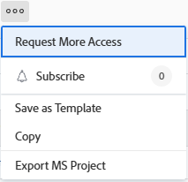

# Solicitar acceso a objetos

{{preview-fast-release-general}}

La visibilidad de los objetos en Adobe Workfront depende del acceso a ese tipo de objeto, así como de los permisos sobre un objeto individual.

>[!NOTE]
>
>Este artículo describe cómo se pueden solicitar permisos a todos los objetos, excepto a los siguientes:
>
>* Planes de Scenario Planner en Adobe Workfront Scenario Planner. Para obtener más información, consulte [Solicitar acceso a un plan en el Scenario Planner](../../scenario-planner/request-access-to-plan.md). Se requiere una licencia adicional.
>
>* Vistas y espacios de trabajo en Workfront Planning. Para obtener más información, consulte [Información general sobre los permisos de uso compartido en Adobe Workfront Planning](/help/quicksilver/planning/access/sharing-permissions-overview.md). Se requiere una licencia adicional.

El administrador de Workfront configura el acceso a un tipo de objeto en su nivel de acceso. Para obtener más información, consulte [Funcionamiento conjunto de los niveles de acceso y los permisos](../../administration-and-setup/add-users/access-levels-and-object-permissions/how-access-levels-permissions-work-together.md).

Si necesita permisos de objetos específicos dentro de Workfront, puede solicitar acceso a ellos. En lugar de enviar un correo electrónico al administrador de Workfront o al propietario del objeto para explicarle sus necesidades, puede solicitar acceso adicional (o permisos) en Workfront.

Puede solicitar acceso inicial a los objetos si alguien comparte con usted un vínculo al objeto o puede solicitar acceso adicional a los objetos que al menos puede ver.

Por ejemplo, puede tener permisos de visualización en un proyecto, pero debe añadir tareas a ese proyecto. En este caso, puede solicitar permisos de aportación al proyecto.

## Requisitos de acceso

+++ Expanda para ver los requisitos de acceso para la funcionalidad en este artículo.

Se necesita tener lo siguiente para compartir objetos:

<table style="table-layout:auto"> 
 <col> 
 <col> 
 <tbody> 
  <tr> 
   <td role="rowheader">Plan de Adobe Workfront</td> 
   <td> 
Cualquiera 
 </td> 
  </tr> 
  <tr> 
   <td role="rowheader">Licencia de Adobe Workfront*</td> 
   <td> 
Nuevo: estándar
 
   
Actual: Trabajo o superior
 
   </td> 
  </tr> 
  <tr> 
   <td role="rowheader">Configuraciones de nivel de acceso</td> 
   <td> 
Acceso de visualización o superiores a los objetos para los que solicita permisos
 </td> 
  </tr> 
 </tbody> 
</table>

*Para obtener más información, consulte [Requisitos de acceso en la documentación de Workfront](/help/quicksilver/administration-and-setup/add-users/access-levels-and-object-permissions/access-level-requirements-in-documentation.md).

+++

## Descripción de las reglas de uso compartido estándar

Las siguientes reglas estándar de uso compartido se aplican automáticamente, ya que se establecen como opciones predeterminadas en el sistema de Workfront.

* Los usuarios asignados a una tarea o a un problema tienen acceso de aportación en ella.
* Los gerentes de proyectos, portafolios y programas tienen acceso de administración sobre los objetos que son de su propiedad.
* Los usuarios incluidos en una conversación tienen acceso de visualización sobre el objeto en el que se produce la conversación.
* Los usuarios asignados como aprobadores tienen acceso de visualización sobre el objeto que permanece a la espera de ser aprobado.
* Al compartir un panel de control, todos los informes del panel de control se comparten también con el mismo acceso a los mismos usuarios.
* Los propietarios de objetos no pueden ampliar el acceso a un objeto más allá de su acceso en ese objeto, tal como lo ha definido el administrador.

## Solicitar acceso

Puede solicitar acceso inicial a los objetos sobre los que actualmente no tiene acceso, o puede solicitar acceso adicional a los objetos a los que solo tiene acceso limitado.

* [Solicitar acceso inicial](#request-initial-access)
* [Solicitar acceso adicional](#request-additional-access)

### Solicitar acceso inicial  {#request-initial-access}

Si todavía no tiene acceso a un objeto y accede a ese objeto desde un vínculo, aparecerá una pantalla informándole de que no tiene acceso para ver la información.

Para solicitar acceso inicial a un objeto:

1. Haga clic en **Solicitar acceso**.\
   Se muestra el cuadro de diálogo **Solicitar acceso**.

1. (Condicional) Si más de un usuario tiene el acceso adecuado para otorgarle acceso adicional, se muestra una flecha desplegable junto al nombre del usuario. Seleccione el usuario de la lista desplegable que debe recibir la solicitud de acceso.

   En la lista desplegable solo se muestran 10 usuarios. La lista está ordenada alfabéticamente.\
   Para obtener más información sobre el orden de los usuarios enumerados en este menú desplegable, consulte [Jerarquía de los menús desplegables “Solicitar acceso” y “Solicitar más acceso”](#hierarchy-of-the-request-access-and-request-more-access-drop-down-menus).

1. En la lista desplegable, seleccione el tipo de acceso que solicita.
1. (Opcional) En el campo **P.S.**, especifique una nota para el usuario sobre por qué necesita acceso adicional.

   Imagen de muestra en el entorno de vista previa:
   

   Imagen de muestra en el entorno de producción:
   

<!--
If you do not have access level rights to an object and you try to access that object from a link, a screen is displayed informing you to contact the Workfront administrator.

For example, if you do not have portfolio access, but you were given a link to a portfolio, you would see the following message:  

-->

### Solicitar acceso adicional {#request-additional-access}

Para solicitar acceso adicional a un objeto al que ya tiene acceso limitado:

1. Vaya al objeto para el que desea solicitar acceso adicional.

1. Haga clic en el menú **Más** a la derecha del nombre del proyecto y, a continuación, haga clic en **Solicitar más acceso**.

   

1. (Condicional) Si más de un usuario tiene el acceso adecuado para otorgarle acceso adicional, aparecerá una flecha desplegable junto al nombre del usuario.
1. Seleccione el usuario de la lista desplegable que desee que reciba su solicitud de acceso.\
   En la lista desplegable solo se muestran 10 usuarios. La lista está ordenada alfabéticamente.\
   Para obtener más información sobre el orden de los usuarios incluidos en este menú desplegable, consulte [Jerarquía de los menús desplegables “Solicitar acceso” y “Solicitar más acceso”](#hierarchy-of-the-request-access-and-request-more-access-drop-down-menus).

1. En la lista desplegable, seleccione el nivel de acceso que desee solicitar.
1. (Opcional) En el campo **P.S.**, especifique una nota con respecto a por qué necesita acceso adicional.
1. Haga clic en **Solicitar acceso**.

   Imagen de muestra en el entorno de vista previa:
   

   Imagen de muestra en el entorno de producción:
   

## Jerarquía de los menús desplegables &quot;Solicitar acceso&quot; y &quot;Solicitar más acceso&quot; {#hierarchy-of-the-request-access-and-request-more-access-drop-down-menus}

* [Comprenda la jerarquía de usuarios incluidos en los menús desplegables Solicitar acceso y Solicitar más acceso](#understand-the-hierarchy-of-users-listed-in-the-request-access-and-request-more-access-drop-down-menus)
* [Explicación del propietario de un objeto](#understand-the-owner-of-an-object)

### Comprenda la jerarquía de usuarios incluidos en los menús desplegables Solicitar acceso y Solicitar más acceso {#understand-the-hierarchy-of-users-listed-in-the-request-access-and-request-more-access-drop-down-menus}

Al rellenar las listas &quot;Solicitar acceso&quot; o &quot;Solicitar más acceso&quot; en los objetos, Workfront selecciona una lista de hasta diez usuarios que cumplen diversas funciones en el uso compartido del objeto, como se describe a continuación. Estos usuarios pueden conceder acceso al objeto al usuario que lo solicita.\
La lista resultante se ordenará por su nombre en orden alfabético ascendente.\
Workfront muestra hasta diez usuarios en las listas &quot;Solicitar acceso&quot; y &quot;Solicitar más acceso&quot;.

El orden de los usuarios en los menús desplegables &quot;Solicitar acceso&quot; o &quot;Solicitar más acceso&quot; viene determinado por las siguientes reglas:

* El primer usuario de la lista es el &quot;propietario&quot; del objeto, tal como se describe en [Comprenda el propietario de un objeto](#understand-the-owner-of-an-object).
* A continuación, la lista se rellena con los usuarios con los que se comparte el objeto de forma individual. Se muestran en orden alfabético.
* A continuación, la lista se rellena con los usuarios que obtienen el acceso necesario compartiendo con sus equipos, grupos o empresas. Se muestran en orden alfabético.
* Si la lista está vacía, se añaden los administradores de Workfront para que siempre haya alguien a quien solicitar acceso. Se muestran en orden alfabético.
* Cada uno de los usuarios de la lista debe tener el acceso solicitado al objeto y el acceso para compartir el objeto.

### Explicación del propietario de un objeto {#understand-the-owner-of-an-object}

El propietario de un objeto se define de la siguiente manera:

<table style="table-layout:auto"> 
 <col> 
 <col> 
 <thead> 
  <tr> 
   <th><strong>Objecto</strong> </th> 
   <th><strong>Definición del propietario del objeto</strong> </th> 
  </tr> 
 </thead> 
 <tbody> 
  <tr> 
   <td>Proyectos</td> 
   <td>El propietario es el Propietario del proyecto o, si falta o no tiene el acceso necesario, el propietario del portafolio principal. 
Es posible que no sea la misma persona que el creador del proyecto. 
</td> 
  </tr> 
  <tr> 
   <td>Tareas</td> 
   <td>El propietario es el Usuario asignado principal o, si no existe o no tiene el acceso necesario, el propietario del proyecto en el que reside la tarea, según se ha definido anteriormente. 
Es posible que no sea la misma persona que el creador de la tarea. 
</td> 
  </tr> 
  <tr> 
   <td>Problemas</td> 
   <td> 
El propietario es el contacto principal del problema o, si no existe o no tiene el acceso necesario, el propietario del proyecto en el que reside el problema, según se ha definido anteriormente. 
 
Es posible que no sea la misma persona que el creador del problema. 
 </td> 
  </tr> 
  <tr> 
   <td>Portafolios</td> 
   <td>El propietario es el Propietario del portafolio. 
Es posible que no sea la misma persona que el creador del portafolio. 
</td> 
  </tr> 
  <tr> 
   <td>Documentos</td> 
   <td>El propietario es el Propietario del documento (el usuario que lo ha cargado) o, si falta o no tiene el acceso necesario, el propietario del objeto en el que reside el documento.</td> 
  </tr> 
  <tr> 
   <td>Informes y paneles</td> 
   <td>El propietario es el creador, el informe o el panel de control. </td> 
  </tr> 
  <tr> 
   <td>Calendarios</td> 
   <td>El propietario es el creador del calendario. Todos los usuarios tienen un calendario asignado de forma predeterminada. Se les considera propietarios de ese calendario. </td> 
  </tr> 
  <tr> 
   <td>Filtros, vistas y agrupaciones</td> 
   <td>El propietario de un filtro, vista o agrupación es el creador. </td> 
  </tr> 
  <tr data-mc-conditions="QuicksilverOrClassic.Quicksilver"> 
   <td>Planes </td> 
   <td> 
El propietario es el creador del plan. 
 
Se requiere una licencia adicional. 
 
Para obtener información sobre el Planificador de escenarios de Workfront, consulte  <a href="../../scenario-planner/scenario-planner-overview.md" class="MCXref xref">Información general sobre el Planificador de escenarios</a>.
 </td> 
  </tr> 
  <tr data-mc-conditions="QuicksilverOrClassic.Quicksilver"> 
   <td>Metas</td> 
   <td> 
El propietario es el usuario designado como Propietario. Es posible que no sea la misma persona que el creador de la meta. 
 
Se requiere una licencia adicional. 
 
Para obtener información sobre Workfront Goals, consulte <a href="../../workfront-goals/goal-management/wf-goals-overview.md" class="MCXref xref">Información general sobre Adobe Workfront Goals</a>. 
 </td> 
  </tr> 
 </tbody> 
</table>

