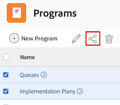

# Compartir un programa

El administrador de Adobe Workfront puede otorgarle acceso para ver o editar programas al asignar su nivel de acceso. Debe tener una licencia de Planificación para tener acceso a la edición de un programa. Para obtener más información, consulte [Conceder acceso a los programas](../../administration-and-setup/add-users/configure-and-grant-access/grant-access-programs.md).

Junto con el nivel de acceso que se le ha otorgado, también puede recibir permisos para ver o administrar programas específicos de usuarios que pueden compartirlos con usted. Para obtener más información sobre los niveles de acceso y los permisos, consulte [Cómo funcionan juntos los niveles de acceso y los permisos](../../administration-and-setup/add-users/access-levels-and-object-permissions/how-access-levels-permissions-work-together.md).

Los permisos son específicos para cada elemento de Workfront y definen qué acciones pueden realizar los usuarios sobre ese elemento.

## Requisitos de acceso

+++ Expanda para ver los requisitos de acceso para la funcionalidad en este artículo.

Se necesita tener lo siguiente para compartir objetos:

<table style="table-layout:auto"> 
 <col> 
 <col> 
 <tbody> 
  <tr> 
   <td role="rowheader">Plan de Adobe Workfront</td> 
   <td> 
Cualquiera 
 </td> 
  </tr> 
  <tr> 
   <td role="rowheader">Licencia de Adobe Workfront</td> 
   <td> 
Nuevo: estándar
 
   O
   
Actual: Trabajo o superior

   </td> 
  </tr> 
  <tr> 
   <td role="rowheader">Configuraciones de nivel de acceso</td> 
   <td> 
Acceso de visualización o superior sobre los objetos que desea compartir
 </td> 
  </tr> 
  <tr> 
   <td role="rowheader">Permisos de objeto</td> 
   <td> 
Permisos de visualización o superiores sobre los objetos que desea compartir
</td> 
  </tr> 
 </tbody> 
</table>

Para obtener más información, consulte [Requisitos de acceso en la documentación de Workfront](/help/quicksilver/administration-and-setup/add-users/access-levels-and-object-permissions/access-level-requirements-in-documentation.md).

+++

## Consideraciones acerca de compartir un programa

Además de las consideraciones siguientes, consulte [Información general sobre los permisos de uso compartido en objetos](../../workfront-basics/grant-and-request-access-to-objects/sharing-permissions-on-objects-overview.md).

>[!NOTE]
>
>Un administrador de Workfront puede añadir o quitar permisos a cualquier elemento del sistema, para todos los usuarios, sin que tengan que ser el propietario de esos elementos.

* El creador de un programa tiene permisos de administración de forma predeterminada.

* Puede compartir programas individualmente o puede compartir varios de ellos a la vez.

  Para obtener más información sobre cómo compartir elementos en Workfront, consulte [Buscar un objeto](../../workfront-basics/grant-and-request-access-to-objects/share-an-object.md).

* Solo puede conceder permisos de Ver o Administrar en programas:

* Cuando comparte un programa, los usuarios heredan los mismos permisos para todos los objetos secundarios asociados con el programa, de forma predeterminada.

  Para obtener más información sobre la jerarquía de objetos en Workfront, consulte [Comprender los objetos en Adobe Workfront](../../workfront-basics/navigate-workfront/workfront-navigation/understand-objects.md).

* Puede quitar los permisos heredados del programa. Para obtener más información sobre cómo quitar permisos a los objetos, consulte [Eliminación de permisos de objetos](../../workfront-basics/grant-and-request-access-to-objects/remove-permissions-from-objects.md).

## Compartir un programa

{{step1-to-programs}}

1. En la página **Programas**, seleccione el programa que desee compartir. Se abre la página del programa.

1. A la derecha del nombre del programa, haga clic en **Compartir**. Se abre el cuadro de diálogo **Compartir [Nombre de programa]**.

   

1. En el campo **Conceder acceso al programa a**, empiece a escribir el nombre del usuario, equipo, rol, grupo o compañía con el que desea compartir el programa y, a continuación, haga clic en el nombre cuando aparezca en la lista desplegable.

   >[!TIP]
   >
   >Solo puede compartir un programa con usuarios, equipos, funciones o empresas activos.

1. (Opcional) Seleccione la lista desplegable **Quién tiene acceso** y seleccione el nivel de acceso del programa:

   * **Solo las personas invitadas pueden tener acceso a:** Solo los usuarios invitados al programa pueden tener acceso a él (predeterminado).
   * **Todos los usuarios del sistema pueden ver**: todos los usuarios del sistema pueden ver el programa sin invitación.

1. Haga clic en la lista desplegable a la derecha del nombre del usuario y seleccione su nivel de permisos para este programa:

   * **Ver**: el usuario puede revisar y compartir el programa.
   * **Administrar**: el usuario tiene acceso completo al programa sin derechos administrativos, que se conceden en el nivel de acceso (también incluye todos los permisos de Vista).

1. (Opcional) Haga clic en el icono de opciones avanzadas junto al nivel de permisos que ha concedido para configurar permisos específicos del programa.

   

1. (Opcional) Para desactivar los permisos heredados de los objetos secundarios del programa, haga clic en **Desactivar** en línea con **Permisos heredados**.

1. (Opcional) Para compartir rápidamente el programa mediante un vínculo, haga clic en **Copiar vínculo** y reenvíelo al destinatario.

1. Haga clic en **Guardar**.

## Uso compartido de programas por lotes

{{step1-to-programs}}

1. En la página **Programas**, seleccione el cuadro situado a la izquierda de cada programa que desee compartir y, a continuación, haga clic en el icono **Compartir**  en la parte superior de la página. Se abre el modal de uso compartido.

   

1. En el campo **Conceder acceso al programa a**, empiece a escribir el nombre del usuario, equipo, rol, grupo o compañía con el que desea compartir los programas y, a continuación, haga clic en el nombre cuando aparezca en la lista desplegable.

   >[!TIP]
   >
   >Solo puede compartir programas con usuarios, equipos, funciones o empresas activos.

1. (Opcional) Seleccione la lista desplegable **Quién tiene acceso** y seleccione el nivel de acceso de los programas:

   * **Solo las personas invitadas pueden acceder a:** Solo los usuarios invitados a los programas pueden acceder a ellos (predeterminado).
   * **Todos los usuarios del sistema pueden ver**: todos los usuarios del sistema pueden ver los programas sin invitación.

1. Haga clic en la lista desplegable a la derecha del nombre del usuario y seleccione su nivel de permisos para los programas:

   * **Ver**: el usuario puede revisar y compartir los programas.
   * **Administrar**: el usuario tiene acceso completo a los programas sin derechos administrativos, que se conceden en el nivel de acceso (también incluye todos los permisos de Vista).

1. (Opcional) Haga clic en el icono de opciones avanzadas situado junto al nivel de permisos que ha concedido para configurar permisos específicos en los programas.

   

1. Haga clic en **Guardar**.

## Permisos del programa

La siguiente tabla muestra qué permisos puede conceder a los usuarios cuando les permite ver o administrar un programa:

| **Acciones** | **Administrar** | **Vista** |
|---|---|---|
| Editar detalles del programa | ✓ |   |
| Ver un programa | ✓ | ✓ |
| Eliminación de un programa | ✓ |   |
| Adjuntar un formulario personalizado | ✓ |   |
| Editar un formulario personalizado | ✓ |   |
| Añadir o quitar un proyecto&#42; | ✓ |   |
| Aprobar un proyecto | ✓ |   |
| Añadir una carpeta de documentos&#42; | ✓ | ✓ |
| Añadir un documento | ✓ | ✓ |
| Añadir actualizaciones/ comentarios | ✓ | ✓ |
| Compartir | ✓ | ✓ |
| Compartir en todo el sistema |   | ✓ |

*Estos permisos están controlados por el nivel de acceso y los permisos en otros objetos, como proyectos.

