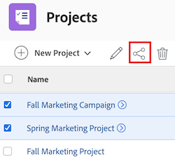

# Compartir un proyecto

<!-- Audited: 1/2024 -->

El administrador de Adobe Workfront puede otorgarle acceso para ver o editar proyectos al asignarle su nivel de acceso. Para obtener más información, consulte [Conceder acceso a proyectos](../../administration-and-setup/add-users/configure-and-grant-access/grant-access-projects.md).

Junto con el nivel de acceso que concede a los usuarios, también puede concederles permisos para Ver, Aportar o Administrar proyectos específicos a los que tenga acceso para compartir. 

Los permisos son específicos de un elemento de Workfront y definen qué acciones se pueden realizar sobre ese elemento.

## Requisitos de acceso

+++ Expanda para ver los requisitos de acceso para la funcionalidad en este artículo. 

<table style="table-layout:auto"> 
 <col> 
 <col> 
 <tbody> 
  <tr> 
   <td role="rowheader">Paquete de Adobe Workfront</td> 
   <td> 
Cualquiera
 </td> 
  </tr> 
  <tr> 
   <td role="rowheader">Licencia de Adobe Workfront</td> 
   <td> 
Estándar
 
   
Trabajo o superior
 
   </td> 
  </tr> 
  <tr> 
   <td role="rowheader">Configuraciones de nivel de acceso</td> 
   <td> 
Acceso de visualización o superior sobre los objetos que desea compartir
 </td> 
  </tr> 
  <tr> 
   <td role="rowheader">Permisos de objeto</td> 
   <td> 
Permisos de visualización o superiores sobre los objetos que desea compartir
</td> 
  </tr> 
 </tbody> 
</table>

Para obtener más información sobre el contenido de esta tabla, consulte [Requisitos de acceso en la documentación de Workfront](/help/quicksilver/administration-and-setup/add-users/access-levels-and-object-permissions/access-level-requirements-in-documentation.md).

+++

## Consideraciones sobre el uso compartido de proyectos

Además de las consideraciones siguientes, consulte [Información general sobre los permisos de uso compartido en objetos](../../workfront-basics/grant-and-request-access-to-objects/sharing-permissions-on-objects-overview.md).

* De forma predeterminada, el creador de un proyecto tiene permisos para administrar el proyecto y también se designa como Propietario del proyecto. Si el proyecto se asigna a otro propietario, ese usuario también tiene permisos para administrar el proyecto. Cuando el creador (o propietario) del proyecto comparte el proyecto con otros usuarios, les concede determinados permisos para controlar lo que pueden hacer mientras trabajan en el proyecto.

  Sin embargo, si el propietario de un proyecto no tiene una licencia estándar o de planificación, no tiene acceso completo para administrar el proyecto. Solo los usuarios con licencia de planificación o estándar pueden tener permisos para administrar un proyecto. Para obtener más información, consulte [Funcionamiento conjunto de los niveles de acceso y los permisos](../../administration-and-setup/add-users/access-levels-and-object-permissions/how-access-levels-permissions-work-together.md).

* Puede compartir proyectos individualmente o puede compartir varios a la vez. Compartir proyectos es idéntico a compartir otros objetos. Para obtener más información sobre cómo compartir elementos en Workfront, consulte [Buscar un objeto](../../workfront-basics/grant-and-request-access-to-objects/share-an-object.md).
* Puede conceder los siguientes permisos a un proyecto:

   * Ver
   * Administrar
   * Aportar

* Al compartir un proyecto, todas las tareas, problemas y documentos heredan los mismos permisos, a menos que se especifique lo contrario.

  Para obtener información sobre la administración del acceso a las tareas y problemas del proyecto en función de los permisos de un usuario para el proyecto, consulte la sección [&#128279;](../../manage-work/projects/manage-projects/edit-projects.md#access) en el artículo [Editar proyectos](../../manage-work/projects/manage-projects/edit-projects.md).

  El administrador de Workfront puede especificar si los documentos deben heredar permisos de objetos superiores en el nivel de acceso del usuario. Para obtener más información sobre la restricción de permisos heredados en documentos, consulte [Crear o modificar niveles de acceso personalizados](../../administration-and-setup/add-users/configure-and-grant-access/create-modify-access-levels.md).

* Puede quitar los permisos heredados de un proyecto para que los objetos secundarios no los hereden. Para obtener más información sobre la eliminación de permisos heredados de objetos, consulte [Quitar permisos de objetos](../../workfront-basics/grant-and-request-access-to-objects/remove-permissions-from-objects.md).

## Limitaciones para diferentes tipos de licencias

* Los usuarios con una licencia de trabajo no tienen permisos para administrar proyectos. Para los trabajadores, el permiso de uso compartido más alto es de aportación.
* Los usuarios con una licencia Request pueden ver la información del proyecto, pero tienen acceso limitado al mismo.
* Se produce una excepción respecto al cambio de estado de un proyecto cuando un usuario con permisos de visualización o aportación también está incluido en un proceso de aprobación. Pueden aprobar el proyecto, que cambia su estado, pero el estado es el predefinido para su aprobación o rechazo.
* Para poder copiar un proyecto, un usuario también debe tener acceso para crear proyectos en su nivel de acceso.

## Formas de compartir un proyecto {#ways-to-share-a-project}

Puede compartir un proyecto de las siguientes maneras:

* Manualmente, mediante uno de los procedimientos siguientes:

   * Añadiendo usuarios al equipo del proyecto. Cuando añade usuarios al equipo del proyecto, obtienen automáticamente permisos de visualización en el proyecto.\
     Para obtener más información sobre cómo agregar usuarios a un equipo del proyecto, vea la sección Agregar usuarios a un equipo del proyecto en [Información general del equipo del proyecto](../../manage-work/projects/planning-a-project/project-team-overview.md).
   * Compartiendo los proyectos de forma individual o de forma masiva mediante la opción **Compartir**.

* Automáticamente, mediante uno de los procedimientos siguientes:

   * Coloque un proyecto en un **Portafolio** o **Programa** que ya se haya compartido con otros. Los usuarios obtienen los mismos permisos en el proyecto que tienen para el portafolio o programa.\
     Para obtener información sobre cómo añadir un proyecto a un **Portafolio**, consulte [Añadir proyectos a un portafolio](../../manage-work/portfolios/create-and-manage-portfolios/add-projects-to-portfolios.md).\
     Para obtener información sobre cómo agregar un proyecto a un **programa**, consulte [Agregar un proyecto a un programa](../../manage-work/portfolios/create-and-manage-programs/add-project-to-program.md).
Para obtener información sobre la visualización de los permisos heredados en un objeto, consulte [Ver permisos heredados en objetos](../../workfront-basics/grant-and-request-access-to-objects/view-inherited-permissions-on-objects.md).

   * Añada entidades al uso compartido de proyectos en una plantilla que se utiliza para crear el proyecto. Para obtener información sobre cómo compartir proyectos desde plantillas, consulte [Compartir una plantilla](../../workfront-basics/grant-and-request-access-to-objects/share-a-template.md).
   * Defina la plantilla de acceso al proyecto.

     >[!TIP]
     >
     >Al adjuntar o guardar una plantilla, puede borrar las reglas de uso compartido de proyectos de la plantilla.

   * Edite un proyecto y defina la configuración **Cuando alguien recibe acceso a este proyecto**.  Para obtener más información, consulte [Editar proyectos](../../manage-work/projects/manage-projects/edit-projects.md).

<!--

(NOTE: drafted because I created new article and linked it above) 

To view what users have inherited the access on the project from a portfolio or a program, do the following:

<ol style="list-style-type: lower-alpha;">
<li value="1">Go to a project whose sharing permissions you want to view. </li>
<li value="2"> Click the <strong>More</strong> menu , then click <strong>Sharing</strong>. </li>
<li value="3"> 
Expand the <strong>Inherited Permissions</strong> list. 
 
This list displays the names of users that have access to either the portfolio or the program that the project belongs to and also have permissions to the project. 
  </li>
</ol>

-->

<!--
<ol data-mc-conditions="QuicksilverOrClassic.Draft mode">
<li value="1">Go to a project whose sharing permissions you want for all projects you create from scratch. (NOTE: drafted because linked above)  </li>
<li value="2"> Click the More menu, then click <strong>Sharing</strong>. </li>
<li value="3"> 
In the Project Access box that displays, near the upper-right corner, click the gear icon , then click <strong>Set as my project access template</strong>.
 
The entities that are granted permissions on the selected project have the same permissions for all the projects you create from scratch in the future.
 
 The project access template overrides the sharing defaults granted to you by the Workfront administrator in your Access Level. For more information about specifying sharing defaults for projects in the Access Level, see <a href="../../administration-and-setup/add-users/configure-and-grant-access/grant-access-projects.md" class="MCXref xref">Grant access to projects</a>.
 </li>
<li value="4">Click <strong>Save</strong>.</li>
</ol>
-->

## Compartir un proyecto

{{step1-to-projects}}

1. En la página **Proyectos**, seleccione el proyecto que desee compartir en la lista. Se abre la página del proyecto.

1. A la derecha del nombre del proyecto, haga clic en **Compartir**. Se abre el cuadro de diálogo **Compartir [nombre del proyecto]**.

   

1. En el campo **Conceder acceso al proyecto a**, empiece a escribir el nombre del usuario, equipo, función, grupo o compañía con el que desea compartir el proyecto y, a continuación, haga clic en el nombre cuando aparezca en la lista desplegable.

   >[!TIP]
   >
   >Solo puede compartir un proyecto con usuarios, equipos, funciones o empresas activos.

1. (Opcional) Seleccione la lista desplegable **Que tiene acceso** y seleccione el nivel de acceso del proyecto:

   * **Solo las personas invitadas pueden acceder:** Solo los usuarios invitados al proyecto pueden acceder a él (Predeterminado).
   * **Todos los usuarios del sistema pueden ver**: todos los usuarios del sistema pueden ver el proyecto sin invitación.

1. (Opcional) Para aplicar automáticamente la configuración de acceso al proyecto que seleccionó a todos los proyectos nuevos, haga clic en el icono de **engranaje**  y, a continuación, marque la casilla en línea con **Establecer como mi plantilla de acceso al proyecto**.

   >[!NOTE]
   >
   >La plantilla de acceso al proyecto anula los valores predeterminados para compartir que el administrador de Workfront le ha concedido en su nivel de acceso.\
   >Para obtener más información acerca de cómo especificar valores predeterminados para compartir proyectos en el nivel de acceso, vea [Conceder acceso a proyectos](../../administration-and-setup/add-users/configure-and-grant-access/grant-access-projects.md)

   <!--
   >this note also appears in Understanding Project Permissions-->

1. Haga clic en la lista desplegable a la derecha del nombre del usuario y seleccione su nivel de permisos para este proyecto:

   * **Ver**: el usuario puede revisar y compartir el proyecto.
   * **Contribute**: el usuario puede realizar actualizaciones, registrar información, realizar pequeñas ediciones y compartir el proyecto (también incluye todos los permisos de Vista).
   * **Administrar**: el usuario tiene acceso completo al proyecto sin derechos administrativos, que se conceden en el nivel de acceso (también incluye todos los permisos de Ver y Contribuir).

1. (Opcional) Haga clic en el icono de opciones avanzadas junto al nivel de permisos que ha concedido para configurar permisos específicos en el proyecto.

   

1. (Opcional) Para compartir rápidamente el proyecto mediante un vínculo, haga clic en **Copiar vínculo** y reenvíelo al destinatario.

1. Haga clic en **Guardar**.

## Compartir proyectos de forma masiva

{{step1-to-projects}}

1. En la página **Proyectos**, seleccione el cuadro de la izquierda de cada proyecto que desee compartir y, a continuación, haga clic en el icono **Compartir**  en la parte superior de la página. Se abre el modal de uso compartido.

   

1. En el campo **Conceder acceso al proyecto a**, empiece a escribir el nombre del usuario, equipo, función, grupo o compañía con el que desea compartir los proyectos y, a continuación, haga clic en el nombre cuando aparezca en la lista desplegable.

   >[!TIP]
   >
   >Solo puede compartir proyectos con usuarios, equipos, funciones o empresas activos.

1. (Opcional) Seleccione la lista desplegable **Que tiene acceso** y seleccione el nivel de acceso de los proyectos:

   * **Solo las personas invitadas pueden acceder a:** Solo los usuarios invitados a los proyectos pueden acceder a ellos (predeterminado).
   * **Todos los usuarios del sistema pueden ver**: todos los usuarios del sistema pueden ver los proyectos sin invitación.

1. Haga clic en la lista desplegable a la derecha del nombre del usuario y seleccione su nivel de permisos para los proyectos:

   * **Ver**: el usuario puede revisar y compartir los proyectos.
   * **Contribute**: el usuario puede realizar actualizaciones, registrar información, realizar pequeñas ediciones y compartir los proyectos (también incluye todos los permisos de Vista).
   * **Administrar**: el usuario tiene acceso completo a los proyectos sin derechos administrativos, que se conceden en el nivel de acceso (también incluye todos los permisos de Ver y Contribuir).

1. (Opcional) Haga clic en el icono de opciones avanzadas junto al nivel de permisos que ha concedido para configurar permisos específicos en los proyectos.

   

1. Haga clic en **Guardar**.

<!--

<h2>Configure default permissions for a project</h2>

(NOTE: drafted because I added one more way to automatically share the project above in the bullet list and linked it to Edit Projects) 

As a project owner, you can configure the default permissions for View, Manage, and Contribute access that are used when sharing  the project with others. When users share a project, the default permissions are used. Users can then adjust the default permissions when sharing the project, as described in <a title="Project Permissions" href="#ways-to-share-a-project" class="MCXref xref">Ways to share a project</a>. 

To configure the default permissions that are included with each access level:

<ol>
<li value="1">Go to the project where you want to set the default permissions.</li>
<li value="2"> 
Click the More menu , then click <strong>Edit</strong>. 
 
 
 </li>
<li value="3">Click <strong>Access</strong> in the list on the left.</li>
<li value="4"> 
In the <strong>When someone is given access to this PROJECT</strong> section, select permissions that you want to be available when users are given access to the project via sharing.
 
Ensure that any permissions that you want to include in the selected access level are selected and deselect any permissions that you do not want to include in the selected permissions level.
 
To view which permissions are available for each level, see  <a title="Project Permissions" href="#Understanding_Project_Permissions" class="MCXref xref">Share a project in Adobe Workfront</a>.
 <note type="note">
The
<strong>Delete</strong> access in the
<strong>Manage</strong> permission level determines whether users can  delete the project itself. Users with
<strong>Manage</strong> access to the project can delete tasks and issues within the project regardless of whether this option is selected, if they have
<strong>Manage</strong> permissions to the tasks and issues.  
</note> </li>
<li value="5">Click <strong>Save Changes</strong>.</li>
</ol>

-->

## Opciones de permisos del proyecto

En la tabla siguiente se enumeran los permisos que los usuarios pueden conceder al compartir un proyecto. Para obtener más información sobre el acceso que obtienen los usuarios según su licencia, consulte [Conceder acceso a los proyectos](../../administration-and-setup/add-users/configure-and-grant-access/grant-access-projects.md).

<table border="1" cellspacing="15" cellpadding="1"> 
 <col> 
 <col> 
 <col> 
 <col> 
 <thead> 
  <tr> 
   <th> 
<strong>Acciones</strong> 
 </th> 
   <th> 
<strong>Administrar</strong> 
 </th> 
   <th> 
<strong>Aportar</strong> 
 </th> 
   <th> 
<strong>Vista</strong> 
 </th> 
  </tr> 
 </thead> 
 <tbody> 
  <tr> 
   <td> 
Añadir formulario personalizado
 </td> 
   <td> 
✓
 </td> 
   <td> 
  
 </td> 
   <td> 
  
 </td> 
  </tr> 
  <tr> 
   <td> 
Actualizar campos personalizados
 </td> 
   <td> 
✓
 </td> 
   <td> 
✓
 </td> 
   <td> 
  
 </td> 
  </tr> 
  <tr> 
   <td> 
Añadir un proceso de aprobación
 </td> 
   <td> 
✓
 </td> 
   <td> 
  
 </td> 
   <td> 
  
 </td> 
  </tr> 
  <tr> 
   <td> 
Aprobar un proyecto
 </td> 
   <td> 
✓
 </td> 
   <td> 
✓
 </td> 
   <td> 
✓
 </td> 
  </tr> 
  <tr> 
   <td> 
Aprobar horas
 </td> 
   <td> 
✓
 </td> 
   <td> 
✓  
 </td> 
   <td> 
  
 </td> 
  </tr> 
  <tr> 
   <td> 
Crear un proyecto
 </td> 
   <td> 
✓
 </td> 
   <td> 
  
 </td> 
   <td> 
  
 </td> 
  </tr> 
  <tr> 
   <td> 
Añadir documentos
 </td> 
   <td> 
✓
 </td> 
   <td> 
✓
 </td> 
   <td> 
✓
 </td> 
  </tr> 
  <tr> 
   <td> 
Añadir problemas
 </td> 
   <td> 
✓
 </td> 
   <td> 
✓
 </td> 
   <td> 
✓
 </td> 
  </tr> 
  <tr> 
   <td> 
Añadir tareas
 </td> 
   <td> 
✓
 </td> 
   <td> 
✓
 </td> 
   <td> 
  
 </td> 
  </tr> 
  <tr> 
   <td> 
Copiar proyecto
 </td> 
   <td> 
  
 </td> 
   <td> 
✓
 </td> 
   <td> 
  
 </td> 
  </tr> 
  <tr> 
   <td> 
Eliminar proyecto
 </td> 
   <td> 
✓
 </td> 
   <td> 
  
 </td> 
   <td> 
  
 </td> 
  </tr> 
  <tr> 
   <td> 
Modificar fechas planificadas del proyecto
 </td> 
   <td> 
✓
 </td> 
   <td> 
  
 </td> 
   <td> 
  
 </td> 
  </tr> 
  <tr> 
   <td> 
Compartir proyecto
 </td> 
   <td> 
✓
 </td> 
   <td> 
✓
 </td> 
   <td> 
✓
 </td> 
  </tr> 
  <tr> 
   <td> 
Compartir en todo el sistema
 </td> 
   <td> 
  
 </td> 
   <td> 
  
 </td> 
   <td> 
✓
 </td> 
  </tr> 
  <tr> 
   <td> 
Ver proyecto
 </td> 
   <td> 
✓
 </td> 
   <td> 
✓
 </td> 
   <td> 
✓
 </td> 
  </tr> 
  <tr> 
   <td> 
Actualizaciones/comentarios
 </td> 
   <td> 
✓
 </td> 
   <td> 
✓
 </td> 
   <td> 
✓
 </td> 
  </tr> 
  <tr> 
   <td> 
Cambiar estado
 </td> 
   <td> 
✓
 </td> 
   <td> 
  
 </td> 
   <td> 
  
 </td> 
  </tr> 
  <tr> 
   <td> 
Registrar horas
 </td> 
   <td> 
✓
 </td> 
   <td> 
✓
 </td> 
   <td> 
  
 </td> 
  </tr> 
  <tr> 
   <td> 
Editar asignaciones
 </td> 
   <td> 
✓
 </td> 
   <td> 
✓
 </td> 
   <td> 
  
 </td> 
  </tr> 
  <tr> 
   <td> 
Administrar línea de base
 </td> 
   <td> 
✓
 </td> 
   <td> 
  
 </td> 
   <td> 
  
 </td> 
  </tr> 
  <tr> 
   <td> 
Administrar riesgos*
 </td> 
   <td> 
✓
 </td> 
   <td> 
  
 </td> 
   <td> 
  
 </td> 
  </tr> 
  <tr> 
   <td> 
Administrar finanzas*
 </td> 
   <td> 
✓
 </td> 
   <td> 
  
 </td> 
   <td> 
  
 </td> 
  </tr> 
  <tr> 
   <td> 
Añadir o editar gastos*
 </td> 
   <td> 
✓
 </td> 
   <td> 
✓
 </td> 
   <td> 
  
 </td> 
  </tr> 
  <tr> 
   <td> 
Ver finanzas*
 </td> 
   <td> 
✓
 </td> 
   <td> 
✓
 </td> 
   <td> 
✓
 </td> 
  </tr> 
  <tr> 
   <td> 
Adjuntar plantilla
 </td> 
   <td> 
✓
 </td> 
   <td> 
  
 </td> 
   <td> 
  
 </td> 
  </tr> 
  <tr> 
   <td> 
Guardar como plantilla
 </td> 
   <td> 
✓
 </td> 
   <td> 
✓
 </td> 
   <td> 
✓
 </td> 
  </tr> 
  <tr> 
   <td> 
Añadir o editar caso comercial
 </td> 
   <td> 
✓
 </td> 
   <td> 
  
 </td> 
   <td> 
  
 </td> 
  </tr> 
  <tr> 
   <td> 
Editar detalles del proyecto
 </td> 
   <td> 
✓
 </td> 
   <td> 
  
 </td> 
   <td> 
  
 </td> 
  </tr> 
  <tr> 
   <td> 
Editar personal
 </td> 
   <td> 
✓
 </td> 
   <td> 
  
 </td> 
   <td> 
  
 </td> 
  </tr> 
  <tr> 
   <td> 
Exportar a MS Project
 </td> 
   <td> 
✓
 </td> 
   <td> 
✓
 </td> 
   <td> 
✓
 </td> 
  </tr> 
  <tr> 
   <td> 
Recalcular finanzas/ cronologías*
 </td> 
   <td> 
✓
 </td> 
   <td> 
  
 </td> 
   <td> 
  
 </td> 
  </tr> 
  <tr> 
   <td> 
Establecer propiedades de cola
 </td> 
   <td> 
✓
 </td> 
   <td> 
  
 </td> 
   <td> 
    
 </td> 
  </tr> 
  <tr> 
   <td> 
Editar un proyecto por lotes en una lista
 </td> 
   <td> 
✓
 </td> 
   <td>  </td> 
   <td>  </td> 
  </tr> 
 </tbody> 
</table>

&#42;Los usuarios sin acceso a los datos financieros no pueden administrar los riesgos y las finanzas de los proyectos, aunque tengan acceso de edición en los proyectos. Para obtener información sobre el acceso a los datos financieros, consulte [Conceder acceso a los datos financieros](../../administration-and-setup/add-users/configure-and-grant-access/grant-access-financial.md).
