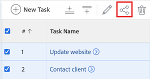

# Compartir una tarea

El administrador de Adobe Workfront puede otorgarle acceso para ver o editar tareas cuando asignen niveles de acceso. Para obtener más información acerca de cómo conceder acceso a las tareas, vea [Conceder acceso a las tareas](../../administration-and-setup/add-users/configure-and-grant-access/grant-access-tasks.md).

Junto con el nivel de acceso que se concede a los usuarios, también puede concederles permisos para Ver, Aportar o Administrar tareas específicas a las que tiene acceso para compartir.

Los permisos son específicos de un elemento de Workfront y definen qué acciones se pueden realizar sobre ese elemento.

## Requisitos de acceso

+++ Expanda para ver los requisitos de acceso para la funcionalidad en este artículo.

Se necesita tener lo siguiente para compartir objetos:

<table style="table-layout:auto"> 
 <col> 
 <col> 
 <tbody> 
  <tr> 
   <td role="rowheader">Plan de Adobe Workfront</td> 
   <td> 
Cualquiera 
 </td> 
  </tr> 
  <tr> 
   <td role="rowheader">Licencia de Adobe Workfront</td> 
   <td> 
Nuevo: estándar
 
   O
   
Actual: Trabajo o superior

   </td> 
  </tr> 
  <tr> 
   <td role="rowheader">Configuraciones de nivel de acceso</td> 
   <td> 
Acceso de visualización o superior sobre los objetos que desea compartir
 </td> 
  </tr> 
  <tr> 
   <td role="rowheader">Permisos de objeto</td> 
   <td> 
Permisos de visualización o superiores sobre los objetos que desea compartir
</td> 
  </tr> 
 </tbody> 
</table>

Para obtener más información, consulte [Requisitos de acceso en la documentación de Workfront](/help/quicksilver/administration-and-setup/add-users/access-levels-and-object-permissions/access-level-requirements-in-documentation.md).

+++

## Consideraciones al compartir una tarea

Además de las consideraciones siguientes, consulte [Información general sobre los permisos de uso compartido en objetos](../../workfront-basics/grant-and-request-access-to-objects/sharing-permissions-on-objects-overview.md).

* El creador de una tarea tiene permisos de administración de forma predeterminada.
* Puede compartir tareas individualmente o puede compartir varias de ellas a la vez, de forma masiva.\
  Compartir tareas es idéntico a compartir otros objetos. Para obtener más información sobre cómo compartir elementos en Workfront, vea [Compartir un objeto](../../workfront-basics/grant-and-request-access-to-objects/share-an-object.md).

* Puede conceder los siguientes permisos a una tarea:

   * Ver
   * Administrar
   * Aportar
* Cuando comparte una tarea, los usuarios heredan los mismos permisos en todos los objetos secundarios asociados a la tarea de forma predeterminada. Por ejemplo, heredan los mismos permisos en las tareas, problemas y documentos secundarios adjuntos a la tarea.\
  Para obtener más información sobre la jerarquía de objetos en Workfront, consulte [Comprender los objetos en Adobe Workfront](../../workfront-basics/navigate-workfront/workfront-navigation/understand-objects.md).

  El administrador de Workfront puede especificar si los documentos deben heredar permisos de objetos superiores en el nivel de acceso del usuario. Para obtener más información acerca de cómo restringir permisos heredados en documentos, vea [Crear o modificar niveles de acceso personalizados](../../administration-and-setup/add-users/configure-and-grant-access/create-modify-access-levels.md).

* Puede quitar los permisos heredados de una tarea.\
  Para obtener más información sobre cómo quitar permisos heredados de objetos, consulte [Quitar permisos de objetos](../../workfront-basics/grant-and-request-access-to-objects/remove-permissions-from-objects.md).

## Formas de compartir una tarea

Puede compartir una tarea de las siguientes maneras:

* Manualmente, ya sea de forma individual o en lote.

* Automáticamente, haciendo lo siguiente:

   * Especifique los permisos en cualquiera de los objetos principales de la tarea: proyecto, programa o portafolio. Las tareas heredan los permisos de sus objetos principales. Para obtener información acerca de cómo ver permisos heredados en objetos, vea [Ver permisos heredados en objetos](../../workfront-basics/grant-and-request-access-to-objects/view-inherited-permissions-on-objects.md).
   * Añada entidades a Uso compartido de proyectos en una plantilla utilizada para crear el proyecto en el que se encuentra la tarea. Para obtener información sobre cómo compartir proyectos desde plantillas, vea [Compartir una plantilla](../../workfront-basics/grant-and-request-access-to-objects/share-a-template.md).

   * Especifique los permisos en todas las tareas de un proyecto cuando edite el proyecto.Para obtener información sobre cómo administrar el acceso a las tareas del proyecto en función de los permisos de un usuario para el proyecto, consulte la sección [&#128279;](../../manage-work/projects/manage-projects/edit-projects.md#access) en el artículo [Editar proyectos](../../manage-work/projects/manage-projects/edit-projects.md).

  >[!TIP]
  >
  >Si no especifica los permisos de tareas que desea que tengan los usuarios cuando se les asignen tareas en el proyecto, recibirán los mismos permisos que tienen en el proyecto de forma predeterminada.

## Compartir una tarea

1. Vaya a la tarea que desee compartir.

1. A la derecha del nombre de tarea, haga clic en **Compartir**. Se abre el cuadro de diálogo **Compartir [Nombre de tarea]**.

   

1. En el campo **Conceder acceso a la tarea a**, empiece a escribir el nombre del usuario, equipo, rol, grupo o compañía con el que desea compartir la tarea y, a continuación, haga clic en el nombre cuando aparezca en la lista desplegable.

   >[!TIP]
   >
   >Solo puede compartir una tarea con usuarios, equipos, funciones o empresas activos.

1. (Opcional) Seleccione la lista desplegable **Quién tiene acceso** y seleccione el nivel de acceso de la tarea:

   * **Solo las personas invitadas pueden acceder a:** Solo los usuarios invitados a la tarea pueden acceder a ella (predeterminado).
   * **Todos los usuarios del sistema pueden ver**: todos los usuarios del sistema pueden ver la tarea sin invitación.

1. Haga clic en la lista desplegable a la derecha del nombre del usuario y seleccione su nivel de permisos para esta tarea:

   * **Ver**: el usuario puede revisar y compartir la tarea.
   * **Contribute**: el usuario puede realizar actualizaciones, registrar información, realizar pequeñas ediciones y compartir la tarea (también incluye todos los permisos de vista).
   * **Administrar**: el usuario tiene acceso completo a la tarea sin derechos administrativos, que se conceden en el nivel de acceso (también incluye todos los permisos de Ver y Contribuir).

1. (Opcional) Haga clic en el icono de opciones avanzadas junto al nivel de permisos que ha concedido para configurar permisos específicos sobre la tarea.

   

1. (Opcional) Para desactivar los permisos heredados de los objetos secundarios de la tarea, haga clic en **Desactivar** en línea con **Permisos heredados**.

1. (Opcional) Para compartir rápidamente la tarea mediante un vínculo, haga clic en **Copiar vínculo** y reenvíela al destinatario.

1. Haga clic en **Guardar**.

## Compartir tareas de forma masiva

1. Desplácese hasta el proyecto que contenga las tareas que desee compartir.

1. En la ficha **Tareas** de la página del proyecto, seleccione la casilla situada a la izquierda de cada tarea que desee compartir y, a continuación, haga clic en el icono **Compartir**  en la parte superior de la página. Se abre el modal de uso compartido.

   

1. En el campo **Conceder acceso a la tarea a**, empiece a escribir el nombre del usuario, equipo, rol, grupo o compañía con el que desea compartir las tareas y, a continuación, haga clic en el nombre cuando aparezca en la lista desplegable.

   >[!TIP]
   >
   >Solo puede compartir tareas con usuarios, equipos, funciones o empresas activos.

1. (Opcional) Seleccione la lista desplegable **Quién tiene acceso** y seleccione el nivel de acceso de las tareas:

   * **Solo las personas invitadas pueden acceder a:** Solo los usuarios invitados a las tareas pueden acceder a ellas (predeterminado).
   * **Todos los usuarios del sistema pueden ver**: todos los usuarios del sistema pueden ver las tareas sin invitación.

1. Haga clic en la lista desplegable a la derecha del nombre del usuario y seleccione su nivel de permisos para las tareas:

   * **Ver**: el usuario puede revisar y compartir las tareas.
   * **Contribute**: el usuario puede realizar actualizaciones, registrar información, realizar pequeñas ediciones y compartir las tareas (también incluye todos los permisos de Vista).
   * **Administrar**: el usuario tiene acceso completo a las tareas sin derechos administrativos, que se conceden en el nivel de acceso (también incluye todos los permisos de Ver y Contribuir).

1. (Opcional) Haga clic en el icono de opciones avanzadas junto al nivel de permisos que ha concedido para configurar permisos específicos en las tareas.

   

1. Haga clic en **Guardar**.

## Permisos de tarea

La siguiente tabla muestra qué permisos puede conceder a los usuarios cuando se les permite Ver, Aportar o Administrar una tarea:

<table border="2" cellspacing="15" cellpadding="1"> 
 <col> 
 <col> 
 <col> 
 <col> 
 <thead> 
  <tr> 
   <th><strong>Accion</strong> </th> 
   <th><strong>Administrar</strong> </th> 
   <th><strong>Aportar</strong> </th> 
   <th><strong>Vista</strong> </th> 
  </tr> 
 </thead> 
 <tbody> 
  <tr> 
   <td scope="row">Añadir tareas</td> 
   <td>✓</td> 
   <td>✓</td> 
   <td> </td> 
  </tr> 
  <tr> 
   <td scope="row">Añadir predecesoras</td> 
   <td>✓</td> 
   <td> </td> 
   <td> </td> 
  </tr> 
  <tr> 
   <td scope="row">Añadir problemas</td> 
   <td>✓</td> 
   <td>✓</td> 
   <td>✓</td> 
  </tr> 
  <tr> 
   <td scope="row">Eliminar tarea</td> 
   <td>✓</td> 
   <td> </td> 
   <td> </td> 
  </tr> 
  <tr> 
   <td scope="row"> 
Editar tarea general 
 </td> 
   <td>✓</td> 
   <td>✓</td> 
   <td> </td> 
  </tr> 
  <tr> 
   <td scope="row">Cambiar el estado de una tarea</td> 
   <td>✓</td> 
   <td>✓</td> 
   <td> </td> 
  </tr> 
  <tr> 
   <td scope="row">Editar restricción de tarea</td> 
   <td>✓</td> 
   <td> </td> 
   <td> </td> 
  </tr> 
  <tr> 
   <td scope="row">Ver tarea</td> 
   <td>✓</td> 
   <td>✓</td> 
   <td>✓</td> 
  </tr> 
  <tr> 
   <td scope="row">Añadir documentos</td> 
   <td>✓</td> 
   <td>✓</td> 
   <td>✓</td> 
  </tr> 
  <tr> 
   <td scope="row">Copiar tarea*</td> 
   <td>✓</td> 
   <td>✓</td> 
   <td>✓</td> 
  </tr> 
  <tr> 
   <td scope="row">Mover tarea*</td> 
   <td>✓</td> 
   <td> </td> 
   <td> </td> 
  </tr> 
  <tr> 
   <td scope="row">Registrar horas</td> 
   <td>✓</td> 
   <td>✓</td> 
   <td> </td> 
  </tr> 
  <tr> 
   <td scope="row">Modificar fechas planificadas del proyecto</td> 
   <td>✓</td> 
   <td> </td> 
   <td> </td> 
  </tr> 
  <tr> 
   <td scope="row">Aceptar asignación</td> 
   <td>✓</td> 
   <td>✓</td> 
   <td> </td> 
  </tr> 
  <tr> 
   <td scope="row">Realización de una asignación</td> 
   <td>✓</td> 
   <td>✓</td> 
   <td> </td> 
  </tr> 
  <tr> 
   <td scope="row">Adjuntar formulario personalizado</td> 
   <td>✓</td> 
   <td> </td> 
   <td> </td> 
  </tr> 
  <tr> 
   <td scope="row">Editar campos personalizados</td> 
   <td>✓</td> 
   <td>✓</td> 
   <td> </td> 
  </tr> 
  <tr> 
   <td scope="row">Crear un proceso de aprobación</td> 
   <td>✓</td> 
   <td> </td> 
   <td> </td> 
  </tr> 
  <tr> 
   <td scope="row">Aprobar una tarea</td> 
   <td>✓</td> 
   <td>✓</td> 
   <td>✓</td> 
  </tr> 
  <tr> 
   <td scope="row">Editar finanzas*</td> 
   <td>✓</td> 
   <td> </td> 
   <td> </td> 
  </tr> 
  <tr> 
   <td scope="row">Añadir o editar gastos</td> 
   <td>✓</td> 
   <td>✓</td> 
   <td> </td> 
  </tr> 
  <tr> 
   <td scope="row">Ver finanzas</td> 
   <td>✓</td> 
   <td>✓</td> 
   <td>✓</td> 
  </tr> 
  <tr> 
   <td scope="row">Actualizaciones/comentarios</td> 
   <td>✓</td> 
   <td>✓</td> 
   <td>✓</td> 
  </tr> 
  <tr> 
   <td scope="row">Compartir</td> 
   <td>✓</td> 
   <td>✓</td> 
   <td>✓</td> 
  </tr> 
  <tr> 
   <td scope="row">Compartir en todo el sistema</td> 
   <td> </td> 
   <td> </td> 
   <td>✓</td> 
  </tr> 
 </tbody> 
</table>

&#42;Controlado por el nivel de acceso y los permisos en el proyecto.
