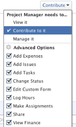

# Compartir una tarea

La información resaltada en esta página hace referencia a una funcionalidad que aún no está disponible de forma general. Solo está disponible en el entorno de vista previa de espacio aislado.

El administrador de Adobe Workfront puede otorgarle acceso para ver o editar tareas cuando asignen niveles de acceso. Para obtener más información acerca de cómo conceder acceso a las tareas, vea [Conceder acceso a las tareas](../../administration-and-setup/add-users/configure-and-grant-access/grant-access-tasks.md).

Junto con el nivel de acceso que se concede a los usuarios, también puede concederles permisos para Ver, Aportar o Administrar tareas específicas a las que tiene acceso para compartir.

Los permisos son específicos de un elemento de Workfront y definen qué acciones se pueden realizar sobre ese elemento.

## Consideraciones al compartir una tarea

Además de las consideraciones siguientes, consulte [Información general sobre los permisos de uso compartido en objetos](../../workfront-basics/grant-and-request-access-to-objects/sharing-permissions-on-objects-overview.md).

* El creador de una tarea tiene permisos de administración de forma predeterminada.
* Puede compartir tareas individualmente o puede compartir varias de ellas a la vez, de forma masiva.\
  Compartir tareas es idéntico a compartir otros objetos. Para obtener más información sobre cómo compartir elementos en Workfront, vea [Compartir un objeto](../../workfront-basics/grant-and-request-access-to-objects/share-an-object.md).

* Puede conceder los siguientes permisos a una tarea:

   * Ver
   * Administrar
   * Aportar\
       

     En vista previa:
     
  

* Cuando comparte una tarea, los usuarios heredan de forma predeterminada los mismos permisos en todos los objetos secundarios asociados a la tarea. Por ejemplo, heredan los mismos permisos en las tareas, problemas y documentos secundarios adjuntos a la tarea.\
  Para obtener más información sobre la jerarquía de objetos en Workfront, consulte [Comprender los objetos en Adobe Workfront](../../workfront-basics/navigate-workfront/workfront-navigation/understand-objects.md).

  El administrador de Workfront puede especificar si los documentos deben heredar permisos de objetos superiores en el nivel de acceso del usuario. Para obtener más información acerca de cómo restringir permisos heredados en documentos, vea [Crear o modificar niveles de acceso personalizados](../../administration-and-setup/add-users/configure-and-grant-access/create-modify-access-levels.md).

* Puede quitar los permisos heredados de una tarea.\
  Para obtener más información sobre cómo quitar permisos heredados de objetos, consulte [Quitar permisos de objetos](../../workfront-basics/grant-and-request-access-to-objects/remove-permissions-from-objects.md).

## Formas de compartir una tarea

Puede compartir una tarea de las siguientes maneras:

* Manualmente, ya sea de forma individual o masiva. Compartir manualmente tareas es parecido a compartir cualquier otro objeto en Workfront.

  Para obtener más información sobre cómo compartir objetos en Workfront, consulte [Compartir un objeto](../../workfront-basics/grant-and-request-access-to-objects/share-an-object.md).

* Automáticamente, haciendo lo siguiente:

   * Especifique los permisos en cualquiera de los objetos principales de la tarea: proyecto, programa o portafolio. Las tareas heredan los permisos de sus objetos principales. Para obtener información acerca de cómo ver permisos heredados en objetos, vea [Ver permisos heredados en objetos](../../workfront-basics/grant-and-request-access-to-objects/view-inherited-permissions-on-objects.md).
   * Añada entidades a Uso compartido de proyectos en una plantilla utilizada para crear el proyecto en el que se encuentra la tarea. Para obtener información sobre cómo compartir proyectos desde plantillas, vea [Compartir una plantilla](../../workfront-basics/grant-and-request-access-to-objects/share-a-template.md).

   * Especifique los permisos en todas las tareas de un proyecto cuando edite el proyecto.Para obtener información sobre cómo administrar el acceso a las tareas del proyecto en función de los permisos de un usuario para el proyecto, consulte la sección  en el artículo [Editar proyectos](../../manage-work/projects/manage-projects/edit-projects.md).

  >[!TIP]
  >
  >Si no especifica los permisos de tareas que desea que tengan los usuarios cuando se les asigne una tarea en el proyecto, estos recibirán de forma predeterminada los mismos permisos que tienen en el proyecto.

## Permisos de tarea

La siguiente tabla muestra qué permisos puede conceder a los usuarios cuando se les permite Ver, Aportar o Administrar una tarea:

<table border="2" cellspacing="15" cellpadding="1"> 
 <col> 
 <col> 
 <col> 
 <col> 
 <thead> 
  <tr> 
   <th><strong>Accion</strong> </th> 
   <th><strong>Administrar</strong> </th> 
   <th><strong>Aportar</strong> </th> 
   <th><strong>Vista</strong> </th> 
  </tr> 
 </thead> 
 <tbody> 
  <tr> 
   <td scope="row">Añadir tareas</td> 
   <td>✓</td> 
   <td>✓</td> 
   <td> </td> 
  </tr> 
  <tr> 
   <td scope="row">Añadir predecesoras</td> 
   <td>✓</td> 
   <td> </td> 
   <td> </td> 
  </tr> 
  <tr> 
   <td scope="row">Añadir problemas</td> 
   <td>✓</td> 
   <td>✓</td> 
   <td>✓</td> 
  </tr> 
  <tr> 
   <td scope="row">Eliminar tarea</td> 
   <td>✓</td> 
   <td> </td> 
   <td> </td> 
  </tr> 
  <tr> 
   <td scope="row"> 
Editar tarea general 
 </td> 
   <td>✓</td> 
   <td>✓</td> 
   <td> </td> 
  </tr> 
  <tr> 
   <td scope="row">Cambiar el estado de una tarea</td> 
   <td>✓</td> 
   <td>✓</td> 
   <td> </td> 
  </tr> 
  <tr> 
   <td scope="row">Editar restricción de tarea</td> 
   <td>✓</td> 
   <td> </td> 
   <td> </td> 
  </tr> 
  <tr> 
   <td scope="row">Ver tarea</td> 
   <td>✓</td> 
   <td>✓</td> 
   <td>✓</td> 
  </tr> 
  <tr> 
   <td scope="row">Añadir documentos</td> 
   <td>✓</td> 
   <td>✓</td> 
   <td>✓</td> 
  </tr> 
  <tr> 
   <td scope="row">Copiar tarea*</td> 
   <td>✓</td> 
   <td>✓</td> 
   <td>✓</td> 
  </tr> 
  <tr> 
   <td scope="row">Mover tarea*</td> 
   <td>✓</td> 
   <td> </td> 
   <td> </td> 
  </tr> 
  <tr> 
   <td scope="row">Registrar horas</td> 
   <td>✓</td> 
   <td>✓</td> 
   <td> </td> 
  </tr> 
  <tr> 
   <td scope="row">Modificar fechas planificadas del proyecto</td> 
   <td>✓</td> 
   <td> </td> 
   <td> </td> 
  </tr> 
  <tr> 
   <td scope="row">Aceptar asignación</td> 
   <td>✓</td> 
   <td>✓</td> 
   <td> </td> 
  </tr> 
  <tr> 
   <td scope="row">Realización de una asignación</td> 
   <td>✓</td> 
   <td>✓</td> 
   <td> </td> 
  </tr> 
  <tr> 
   <td scope="row">Adjuntar formulario personalizado</td> 
   <td>✓</td> 
   <td> </td> 
   <td> </td> 
  </tr> 
  <tr> 
   <td scope="row">Editar campos personalizados</td> 
   <td>✓</td> 
   <td>✓</td> 
   <td> </td> 
  </tr> 
  <tr> 
   <td scope="row">Crear un proceso de aprobación</td> 
   <td>✓</td> 
   <td> </td> 
   <td> </td> 
  </tr> 
  <tr> 
   <td scope="row">Aprobar una tarea</td> 
   <td>✓</td> 
   <td>✓</td> 
   <td>✓</td> 
  </tr> 
  <tr> 
   <td scope="row">Editar finanzas*</td> 
   <td>✓</td> 
   <td> </td> 
   <td> </td> 
  </tr> 
  <tr> 
   <td scope="row">Añadir o editar gastos</td> 
   <td>✓</td> 
   <td>✓</td> 
   <td> </td> 
  </tr> 
  <tr> 
   <td scope="row">Ver finanzas</td> 
   <td>✓</td> 
   <td>✓</td> 
   <td>✓</td> 
  </tr> 
  <tr> 
   <td scope="row">Actualizaciones/comentarios</td> 
   <td>✓</td> 
   <td>✓</td> 
   <td>✓</td> 
  </tr> 
  <tr> 
   <td scope="row">Compartir</td> 
   <td>✓</td> 
   <td>✓</td> 
   <td>✓</td> 
  </tr> 
  <tr> 
   <td scope="row">Compartir en todo el sistema</td> 
   <td> </td> 
   <td> </td> 
   <td>✓</td> 
  </tr> 
 </tbody> 
</table>

&#42;Controlado por el nivel de acceso y los permisos en el proyecto.
