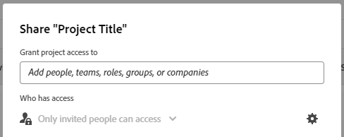

# Compartir un objeto

<!--Audited: 01/2024-->

El administrador de Adobe Workfront concede a los usuarios acceso para ver o editar objetos cuando asignan niveles de acceso. Para obtener más información sobre la concesión de acceso a objetos, consulte [Crear o modificar niveles de acceso personalizados](../../administration-and-setup/add-users/configure-and-grant-access/create-modify-access-levels.md).

Junto con el nivel de acceso que se concede a los usuarios, también puede concederles permisos para ver o editar objetos específicos que ha creado o tiene acceso para compartir. Para obtener más información sobre los niveles de acceso y los permisos, consulte [Cómo funcionan juntos los niveles de acceso y los permisos](../../administration-and-setup/add-users/access-levels-and-object-permissions/how-access-levels-permissions-work-together.md).

Los permisos son específicos de un elemento en Workfront y definen qué acciones se pueden realizar sobre ese elemento.

Para obtener información sobre los permisos de uso compartido en objetos, consulte [Información general sobre los permisos de uso compartido en objetos](../../workfront-basics/grant-and-request-access-to-objects/sharing-permissions-on-objects-overview.md).

>[!NOTE]
>
>Un administrador de Workfront puede agregar o quitar permisos a cualquier elemento del sistema, para todos los usuarios, sin ser el propietario de esos elementos.

Este artículo describe cómo compartir los siguientes objetos:

* Proyectos, tareas y problemas
* Portfolio, programas
* Documentos

Para obtener información sobre cómo compartir todos los demás objetos de Workfront, consulte también los siguientes artículos:

* Para plantillas, consulte [Compartir plantillas de proyecto](../../manage-work/projects/create-and-manage-templates/share-project-template.md).
* Para ver las pruebas, consulte [Compartir una revisión en Workfront Proof](../../workfront-proof/wp-work-proofsfiles/share-proofs-and-files/share-proof.md).
* Para obtener informes, tableros y calendarios, consulte los siguientes artículos:

   * [Uso compartido de informes en Adobe Workfront](../../reports-and-dashboards/reports/creating-and-managing-reports/share-report.md)
   * [Compartir un tablero](../../reports-and-dashboards/dashboards/creating-and-managing-dashboards/share-dashboard.md)
   * [Compartir un informe de calendario](../../reports-and-dashboards/reports/calendars/share-a-calendar-report.md)

  Además, consulte [Uso compartido de informes, tableros y calendarios](../../workfront-basics/grant-and-request-access-to-objects/permissions-reports-dashboards-calendars.md) para obtener información general sobre cómo compartir informes, tableros y calendarios.

* Para ver los filtros, vistas y agrupaciones, consulte [Compartir un filtro, una vista o una agrupación](../../reports-and-dashboards/reports/reporting-elements/share-filter-view-grouping.md).
* Para carpetas de documentos, consulte [Compartir una carpeta de documentos](../../workfront-basics/grant-and-request-access-to-objects/share-a-document-folder.md).
* Para ver los planes, consulte [Compartir un plan en el Scenario Planner](../../scenario-planner/share-a-plan.md).

  Esto requiere una licencia adicional.

* Para ver los objetivos, consulte [Compartir una meta en Workfront Goals](../../workfront-goals/workfront-goals-settings/share-a-goal.md). Esto requiere una licencia adicional.

## Requisitos de acceso

Debe tener lo siguiente para compartir objetos:

<table style="table-layout:auto"> 
 <col> 
 <col> 
 <tbody> 
  <tr> 
   <td role="rowheader">plan de Adobe Workfront</td> 
   <td> 
Cualquiera 
 </td> 
  </tr> 
  <tr> 
   <td role="rowheader">Licencia de Adobe Workfront*</td> 
   <td> 
Nueva licencia: Standard
 
   O
   
Licencia actual: Trabajo o superior

   </td> 
  </tr> 
  <tr> 
   <td role="rowheader">Configuraciones de nivel de acceso</td> 
   <td> 
Ver el acceso o superior a los objetos que desea compartir
 </td> 
  </tr> 
  <tr> 
   <td role="rowheader">Permisos de objeto</td> 
   <td> 
Permite ver los permisos o superior de los objetos que desea compartir
</td> 
  </tr> 
 </tbody> 
</table>

*Para saber qué plan, tipo de licencia o acceso tiene, póngase en contacto con su administrador de Workfront. Para obtener más información, consulte [Requisitos de acceso en la documentación de Workfront](/help/quicksilver/administration-and-setup/add-users/access-levels-and-object-permissions/access-level-requirements-in-documentation.md).

## Compartir un proyecto, una tarea o un problema desde su página

1. Vaya a la página del proyecto, tarea o problema que desee compartir.

   Para obtener información sobre los objetos que se pueden compartir, consulte [Información general sobre los permisos de uso compartido en objetos](../../workfront-basics/grant-and-request-access-to-objects/sharing-permissions-on-objects-overview.md).

1. Haga clic en **Compartir** junto al nombre del objeto.

   

1. En el **Conceder acceso a &lt; nombre de objeto > a** , empiece a escribir el nombre del usuario, equipo, función, grupo o compañía con el que desea compartir el objeto y, a continuación, haga clic en el nombre cuando aparezca en la lista desplegable.

    {width=&quot;350&quot; }

   >[!TIP]
   >
   >Solo puede compartir un objeto con usuarios, equipos, funciones o empresas activos.

   >[!TIP]
   >
   >Si tiene varias entidades con nombres similares, todas se muestran bajo su tipo. Los nombres de las entidades aparecen en orden alfabético. Sin embargo, el orden en que aparecen los tipos de entidad es aleatorio.
   >

1. (Opcional) Repita el paso 3 para cada usuario, equipo, función o grupo al que desee conceder acceso al objeto.

1. Especifique los permisos para cada usuario, equipo, función, grupo o compañía que agregó en el paso 3 haciendo clic en el menú desplegable a la derecha de su nombre y, a continuación, seleccionando el nivel de permiso que desea conceder.

   

   Para eliminar permisos de un objeto, consulte [Eliminación de permisos de objetos](/help/quicksilver/workfront-basics/grant-and-request-access-to-objects/remove-permissions-from-objects.md).

   Estas son las opciones disponibles:

   * **Ver:** Los usuarios pueden revisar y compartir el elemento.
   * **Contribute**: los usuarios pueden realizar actualizaciones, registrar información, realizar ediciones menores y compartir, además de todos los permisos de visualización.
   * **Administrar:** Los usuarios tienen acceso completo al objeto sin derechos administrativos (que se conceden en el nivel de acceso). Además, también tienen todos los permisos de Ver y Contribuir.

     >[!NOTE]
     >
     >El administrador de Workfront o el creador de objetos tienen la capacidad de quitar permisos de estas entidades.

1. (Opcional) Haga clic en el icono de opciones avanzadas junto al nivel de permisos que ha concedido para configurar permisos específicos sobre el objeto.

   

   Ver, Administrar y Contribute disponen de diferentes opciones avanzadas según el objeto seleccionado.\
   Para obtener más información sobre los niveles de permisos, consulte [Información general sobre los permisos de uso compartido en objetos](../../workfront-basics/grant-and-request-access-to-objects/sharing-permissions-on-objects-overview.md).

1. (Opcional) Para que este objeto esté disponible para todos los usuarios del sistema, haga clic en el menú desplegable situado debajo de **Quién tiene acceso**, luego, en el menú desplegable, haga clic en **Todos los usuarios del sistema pueden ver**.

   

   Todos los usuarios pueden ver el objeto en función de los permisos que establezca.

1. (Opcional y condicional) Al compartir un proyecto, haga clic en el botón **Engranaje** icono , luego marque la casilla junto a **Establecer como mi plantilla de acceso al proyecto** para establecer los permisos como plantilla.

   Después de definir los permisos en un proyecto, estos mismos permisos se aplican automáticamente la próxima vez que cree un proyecto desde cero.

   >[!NOTE]
   >
   >La plantilla de acceso al proyecto anula los valores predeterminados que el administrador de Workfront le ha concedido en su nivel de acceso.\
   >Para obtener más información sobre cómo especificar valores predeterminados para compartir proyectos en el nivel de acceso, consulte [Concesión de acceso a proyectos](../../administration-and-setup/add-users/configure-and-grant-access/grant-access-projects.md)

   <!--
   >this note also appears in Understanding Project Permissions-->

   Puede especificar permisos en los proyectos que se crearán a partir de una plantilla cuando comparta la plantilla. Para obtener más información, consulte [Compartir plantillas de proyecto](../../manage-work/projects/create-and-manage-templates/share-project-template.md).

1. (Condicional) Para compartir el objeto con usuarios externos, haga clic en **Copiar vínculo**, luego distribuya el vínculo a los usuarios externos.

   Los usuarios que tengan el vínculo podrán ver el objeto.

   >[!CAUTION]
   >
   >Se recomienda precaución al compartir un objeto que contenga información confidencial con usuarios externos. Esto les permite ver información sin ser usuarios de Workfront ni parte de su organización.

1. Haga clic en **Guardar**.

## Compartir un documento, portafolio o programa desde su página

1. Vaya al documento, portafolio o página del programa que desee compartir.

   Para obtener información sobre los objetos que se pueden compartir, consulte [Información general sobre los permisos de uso compartido en objetos](../../workfront-basics/grant-and-request-access-to-objects/sharing-permissions-on-objects-overview.md).

1. Para carteras y programas:

   Haga clic en **Compartir** junto al nombre del objeto.

   

   O

   Para documentos:

   Haga clic en **Más** icono  junto al nombre del objeto y haga clic en **Compartir**.

   

1. En el **Conceder acceso a &lt; Nombre de objeto > a** , empiece a escribir el nombre del usuario, equipo, función, grupo o compañía con el que desea compartir el objeto y, a continuación, haga clic en el nombre cuando aparezca en la lista desplegable.

    {width=&quot;350&quot; }

   >[!TIP]
   >
   >Solo puede compartir un objeto con usuarios, equipos, funciones o empresas activos.

   >[!TIP]
   >
   >Si tiene varias entidades con nombres similares, todas se muestran bajo su tipo. Los nombres de las entidades aparecen en orden alfabético. Sin embargo, el orden en que aparecen los tipos de entidad es aleatorio.
   >

1. (Opcional) Repita el paso 3 para cada usuario, equipo, función o grupo al que desee conceder acceso al objeto.

1. Especifique los permisos para cada usuario, equipo, función, grupo o compañía que agregó en el paso 3 haciendo clic en el menú desplegable y, a continuación, seleccionando el nivel de permiso que desea conceder.

   Para eliminar permisos de un objeto, consulte [Eliminación de permisos de objetos](/help/quicksilver/workfront-basics/grant-and-request-access-to-objects/remove-permissions-from-objects.md).

   Estas son las opciones disponibles:

   * **Ver:** Los usuarios pueden revisar y compartir el elemento.
   * **Administrar:** Los usuarios tienen acceso completo al objeto sin derechos administrativos (que se conceden en el nivel de acceso). Además, también tienen todos los permisos de Ver y Contribuir.

     >[!NOTE]
     >
     >El administrador de Workfront o el creador de objetos tienen la capacidad de quitar permisos de estas entidades.

     

1. (Opcional) Haga clic en **Configuración avanzada** para configurar permisos específicos sobre el objeto.

   Ver, Administrar y Contribute disponen de diferentes opciones avanzadas según el objeto seleccionado.\
   Para obtener más información sobre los niveles de permisos, consulte [Información general sobre los permisos de uso compartido en objetos](../../workfront-basics/grant-and-request-access-to-objects/sharing-permissions-on-objects-overview.md).

   

1. (Opcional) Para que este objeto esté disponible para todos los usuarios del sistema, haga clic en **Engranaje** icono , luego, en el menú desplegable, haga clic en **Hacer esto visible en todo el sistema**.

   Todos los usuarios pueden ver el objeto en función de los permisos que establezca.

1. (Opcional) Para que el objeto sea público, haga clic en **Convertir esto en público para los usuarios externos**.

   >[!TIP]
   >
   >Esta opción no está disponible para todos los objetos.

    {width=&quot;350&quot; }

1. (Condicional) Si ha hecho que el objeto sea público para usuarios externos, haga clic en **copiar vínculo**, luego distribuya el vínculo a los usuarios externos.

   Los usuarios que tengan el vínculo podrán ver el objeto.

   >[!CAUTION]
   >
   >Se recomienda precaución al compartir un objeto que contenga información confidencial con usuarios externos. Esto les permite ver información sin ser usuarios de Workfront ni parte de su organización.

1. Haga clic en **Guardar**.

## Uso compartido de objetos individuales o masivos de una lista

1. Vaya a la lista que contiene los objetos que desea compartir.

   Para obtener información sobre los objetos que se pueden compartir, consulte [Información general sobre los permisos de uso compartido en objetos](../../workfront-basics/grant-and-request-access-to-objects/sharing-permissions-on-objects-overview.md).

1. Haga clic en la casilla de verificación situada junto a los objetos que desee compartir y, a continuación, haga clic en **Icono Compartir**  en la parte superior de la página.

    {width=&quot;350&quot; }

1. En el **&lt; Objeto > Acceso** aparece la ventana, empiece a escribir en el **Editar acceso de &lt; Nombre de objeto > para** seleccione el nombre del usuario, equipo, función, grupo o compañía con el que desea compartir los objetos y, a continuación, haga clic en el nombre cuando aparezca en la lista desplegable.

    {width=&quot;350&quot; }

   >[!TIP]
   >
   >Solo puede compartir un objeto con usuarios, equipos, funciones o empresas activos.

   >[!TIP]
   >
   >Si tiene varias entidades con nombres similares, todas se muestran bajo su tipo. Los nombres de las entidades aparecen en orden alfabético. Sin embargo, el orden en que aparecen los tipos de entidad es aleatorio.
   >

1. (Opcional) Repita el paso 3 para cada usuario, equipo, función o grupo al que desee conceder acceso a los objetos.

1. Especifique los permisos para cada usuario, equipo, función, grupo o compañía que agregó en el paso 3 haciendo clic en el menú desplegable a la derecha de su nombre y, a continuación, seleccionando el nivel de permiso que desea conceder.

   Para eliminar permisos de un objeto, consulte [Eliminación de permisos de objetos](/help/quicksilver/workfront-basics/grant-and-request-access-to-objects/remove-permissions-from-objects.md).

   

   Estas son las opciones disponibles:

   * **Ver:** Los usuarios pueden revisar y compartir el elemento.
   * **Contribute**: los usuarios pueden realizar actualizaciones, registrar información, realizar ediciones menores y compartir, además de todos los permisos de visualización.

     >[!TIP]
     >
     >Sólo puede conceder permisos de contribución a los objetos siguientes:
     >
     >   * Proyectos
     >   * Tareas
     >   * Problemas
     >  

   * **Administrar:** Los usuarios tienen acceso completo al objeto sin derechos administrativos (que se conceden en el nivel de acceso). Además, también tienen todos los permisos de Ver y Contribuir.

     >[!NOTE]
     >
     >El administrador de Workfront o el creador de objetos tienen la capacidad de quitar permisos de estas entidades.

1. (Opcional) Haga clic en **Configuración avanzada** para configurar permisos específicos sobre el objeto.

   Ver, Administrar y Contribute disponen de diferentes opciones avanzadas según el objeto seleccionado.\
   Para obtener más información sobre los niveles de permisos, consulte [Información general sobre los permisos de uso compartido en objetos](../../workfront-basics/grant-and-request-access-to-objects/sharing-permissions-on-objects-overview.md).

   

1. (Opcional) Para que este objeto esté disponible para todos los usuarios del sistema, haga clic en **Engranaje** icono  , luego, en el menú desplegable, haga clic en **Hacer esto visible en todo el sistema**.

   Todos los usuarios pueden ver los objetos en función de los permisos que haya establecido.

1. (Opcional y condicional) Al compartir un proyecto, haga clic en el botón **Engranaje** icono , luego, en el menú desplegable, haga clic en **Establecer como mi plantilla de acceso al proyecto** para establecer los permisos como plantilla.

   Después de definir los permisos en un proyecto, estos mismos permisos se aplican automáticamente la próxima vez que cree un proyecto desde cero.

   >[!NOTE]
   >
   >La plantilla de acceso al proyecto anula los valores predeterminados que el administrador de Workfront le ha concedido en su nivel de acceso.\
   >Para obtener más información sobre cómo especificar valores predeterminados para compartir proyectos en el nivel de acceso, consulte [Concesión de acceso a proyectos](../../administration-and-setup/add-users/configure-and-grant-access/grant-access-projects.md)

   <!--
   >this note also appears in Understanding Project Permissions-->

   Puede especificar permisos en los proyectos que se crearán a partir de una plantilla cuando comparta la plantilla. Para obtener más información, consulte [Compartir plantillas de proyecto](../../manage-work/projects/create-and-manage-templates/share-project-template.md).

1. (Opcional) Para que los objetos sean públicos, haga clic en **Convertir esto en público para los usuarios externos**.

   >[!TIP]
   >
   >Esta opción no está disponible para todos los objetos.

    {width=&quot;350&quot; }

1. (Condicional) Si ha hecho que los objetos sean públicos para usuarios externos, haga clic en **copiar vínculo**, luego distribuya el vínculo a los usuarios externos.

   Los usuarios que tengan el vínculo podrán ver el objeto.

   >[!CAUTION]
   >
   >Se recomienda precaución al compartir un objeto que contenga información confidencial con usuarios externos. Esto les permite ver información sin ser usuarios de Workfront ni parte de su organización.

1. Haga clic en **Guardar**.
