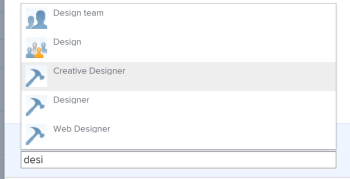

# Compartir un objeto

El administrador de Adobe Workfront concede a los usuarios acceso para ver o editar objetos cuando asignan niveles de acceso. Para obtener más información sobre la concesión de acceso a objetos, consulte [Crear o modificar niveles de acceso personalizados](../../administration-and-setup/add-users/configure-and-grant-access/create-modify-access-levels.md).

Junto con el nivel de acceso que se concede a los usuarios, también puede concederles permisos para ver o editar objetos específicos que ha creado o tiene acceso para compartir. Para obtener más información sobre los niveles de acceso y los permisos, consulte [Cómo funcionan juntos los niveles de acceso y los permisos](../../administration-and-setup/add-users/access-levels-and-object-permissions/how-access-levels-permissions-work-together.md).

Los permisos son específicos de un elemento en Workfront y definen qué acciones se pueden realizar sobre ese elemento.

Para obtener información sobre los permisos de uso compartido en objetos, consulte [Información general sobre los permisos de uso compartido en objetos](../../workfront-basics/grant-and-request-access-to-objects/sharing-permissions-on-objects-overview.md).

>[!NOTE]
>
>Un administrador de Workfront puede agregar o quitar permisos a cualquier elemento del sistema, para todos los usuarios, sin ser el propietario de esos elementos.

Este artículo describe cómo compartir los siguientes objetos: 

* Proyectos, tareas y problemas
* Portfolio, programas
* Documentos

Para obtener información sobre cómo compartir todos los demás objetos de Workfront, consulte también los siguientes artículos:

* Para plantillas, consulte [Compartir plantillas de proyecto](../../manage-work/projects/create-and-manage-templates/share-project-template.md).
* Para ver las pruebas, consulte [Compartir una revisión en Workfront Proof](../../workfront-proof/wp-work-proofsfiles/share-proofs-and-files/share-proof.md).
* Para obtener informes, tableros y calendarios, consulte los siguientes artículos:

   * [Uso compartido de informes en Adobe Workfront](../../reports-and-dashboards/reports/creating-and-managing-reports/share-report.md)
   * [Compartir un tablero](../../reports-and-dashboards/dashboards/creating-and-managing-dashboards/share-dashboard.md)
   * [Compartir un informe de calendario](../../reports-and-dashboards/reports/calendars/share-a-calendar-report.md)

  Además, consulte [Uso compartido de informes, tableros y calendarios](../../workfront-basics/grant-and-request-access-to-objects/permissions-reports-dashboards-calendars.md) para obtener información general sobre cómo compartir informes, tableros y calendarios. 

* Para ver los filtros, vistas y agrupaciones, consulte [Compartir un filtro, una vista o una agrupación](../../reports-and-dashboards/reports/reporting-elements/share-filter-view-grouping.md).
* Para carpetas de documentos, consulte [Compartir una carpeta de documentos](../../workfront-basics/grant-and-request-access-to-objects/share-a-document-folder.md).
* Para ver los planes, consulte [Compartir un plan en el Scenario Planner](../../scenario-planner/share-a-plan.md).

  Esto requiere una licencia adicional.

* Para ver los objetivos, consulte [Compartir una meta en Workfront Goals](../../workfront-goals/workfront-goals-settings/share-a-goal.md). Esto requiere una licencia adicional.

## Requisitos de acceso

<!--drafted for P&P:

<table style="table-layout:auto"> 
 <col> 
 <col> 
 <tbody> 
  <tr> 
   <td role="rowheader">Adobe Workfront plan*</td> 
   <td> 
Any 
 </td> 
  </tr> 
  <tr> 
   <td role="rowheader">Adobe Workfront license*</td> 
   <td> 
Current license: Standard
 
   Or
   
Legacy license: Work or higher

   </td> 
  </tr> 
  <tr> 
   <td role="rowheader">Access level configurations*</td> 
   <td> 
View access or higher to the objects you want to share
 
<b>NOTE</b>
   
   If you still don't have access, ask your Workfront administrator if they set additional restrictions in your access level. For information on how a Workfront administrator can modify your access level, see <a href="../../administration-and-setup/add-users/configure-and-grant-access/create-modify-access-levels.md" class="MCXref xref">Create or modify custom access levels</a>.
 </td> 
  </tr> 
  <tr> 
   <td role="rowheader">Object permissions</td> 
   <td> 
View permissions or higher to the objects you want to share
 
For information on requesting additional access, see <a href="../../workfront-basics/grant-and-request-access-to-objects/request-access.md" class="MCXref xref">Request access to objects </a>.
 </td> 
  </tr> 
 </tbody> 
</table>
-->

Debe tener lo siguiente para compartir objetos:

<table style="table-layout:auto"> 
 <col> 
 <col> 
 <tbody> 
  <tr> 
   <td role="rowheader">plan Adobe Workfront*</td> 
   <td> 
Cualquiera 
 </td> 
  </tr> 
  <tr> 
   <td role="rowheader">Licencia de Adobe Workfront*</td> 
   <td> 
Trabajo o superior
 </td> 
  </tr> 
  <tr> 
   <td role="rowheader">Configuraciones de nivel de acceso*</td> 
   <td> 
Ver el acceso o superior a los objetos que desea compartir
 
<b>NOTA</b>

Si sigue sin tener acceso, pregunte al administrador de Workfront si ha establecido restricciones adicionales en su nivel de acceso. Para obtener información sobre cómo un administrador de Workfront puede modificar su nivel de acceso, consulte <a href="../../administration-and-setup/add-users/configure-and-grant-access/create-modify-access-levels.md" class="MCXref xref">Crear o modificar niveles de acceso personalizados</a>.
 </td>
</tr> 
  <tr> 
   <td role="rowheader">Permisos de objeto</td> 
   <td> 
Permite ver los permisos o superior de los objetos que desea compartir
 
Para obtener información sobre cómo solicitar acceso adicional, consulte <a href="../../workfront-basics/grant-and-request-access-to-objects/request-access.md" class="MCXref xref">Solicitud de acceso a objetos </a>.
 </td> 
  </tr> 
 </tbody> 
</table>

&#42;Para saber qué plan, tipo de licencia o acceso tiene, póngase en contacto con su administrador de Workfront.

## Compartir un solo objeto {#share-a-single-object}

1. Vaya al objeto que desee compartir.

   Para obtener información sobre los objetos que se pueden compartir, consulte [Información general sobre los permisos de uso compartido en objetos](../../workfront-basics/grant-and-request-access-to-objects/sharing-permissions-on-objects-overview.md).
1. Para proyectos, tareas y problemas:

   Haga clic en **Compartir** junto al nombre del objeto.

   

   O

   Para documentos, portafolios y programas:

   Haga clic en **Más** icono junto al nombre del objeto y haga clic en **Uso compartido** o **Compartir.**

   

1. En el **Dar `<Object Name>` acceso a** , empiece a escribir el nombre del usuario, equipo, función, grupo o empresa con el que desea compartir el objeto y, a continuación, haga clic en el nombre cuando aparezca en la lista desplegable.

   Por ejemplo, si comparte un proyecto, utilice la variable **Conceder acceso al proyecto a** field.

   >[!TIP]
   >
   >Solo puede compartir un objeto con usuarios, equipos, funciones o empresas activos.

   

   >[!TIP]
   >
   >Si tiene varias entidades con nombres similares, todas se muestran bajo su tipo. Los nombres de las entidades aparecen en orden alfabético. Sin embargo, el orden en que aparecen los tipos de entidad es aleatorio.
   >
   >
   >   >
   >

1. (Opcional) Repita el paso 3 para cada usuario, equipo, función o grupo al que desee conceder acceso al objeto.

   <!--
   <MadCap:conditionalText data-mc-conditions="QuicksilverOrClassic.Draft mode">
   (NOTE: esnure this stays accurate; in the editor it looks like step 4 but one step is conditioned entirely for one version or another)
   </MadCap:conditionalText>
   -->

1. Especifique los permisos para cada usuario, equipo, función, grupo o compañía que agregó en el paso 3 haciendo clic en el menú desplegable y, a continuación, seleccionando el nivel de permiso que desea conceder.

   Estas son las opciones disponibles:

   * **Ver:** Los usuarios pueden revisar y compartir el elemento. 
   * **Contribute****:** Los usuarios pueden realizar actualizaciones, registrar información, realizar ediciones menores y compartir, además de todos los permisos de visualización.

     >[!TIP]
     >
     >Sólo puede conceder permisos de contribución a los objetos siguientes: 
     >
     >   
     >   
     * Proyectos
     * Tareas
     * Problemas
     >   
     >

   * **Administrar:**Los usuarios tienen acceso completo al objeto sin derechos administrativos, que se conceden en el nivel de acceso, además de todos los permisos de Ver y Contribuir.

     >[!NOTE]
     >
      El administrador de Workfront o el creador de objetos tienen la capacidad de quitar permisos de estas entidades.

      

     

1. (Opcional) Haga clic en **Opciones avanzadas** para configurar permisos específicos sobre el objeto.

   Ver, Administrar y Contribute disponen de diferentes opciones avanzadas según el objeto seleccionado.\
   Para obtener más información sobre los niveles de permisos, consulte [Información general sobre los permisos de uso compartido en objetos](../../workfront-basics/grant-and-request-access-to-objects/sharing-permissions-on-objects-overview.md).

   

1. (Opcional) Para que este objeto esté disponible para todos los usuarios del sistema, haga clic en **Engranaje** icono  , luego, en el menú desplegable, haga clic en **Hacer esto visible en todo el sistema**.

   Todos los usuarios pueden ver el objeto en función de los permisos que establezca.

1. (Opcional y condicional) Al compartir un proyecto, haga clic en el botón **Engranaje** icono , luego, en el menú desplegable, haga clic en **Establecer como mi plantilla de acceso al proyecto** para establecer los permisos como plantilla.\
   Después de definir los permisos en un proyecto, estos mismos permisos se aplican automáticamente la próxima vez que cree un proyecto desde cero.

   >[!NOTE]
   >
   La plantilla de acceso al proyecto anula los valores predeterminados que el administrador de Workfront le ha concedido en su nivel de acceso.\
   Para obtener más información sobre cómo especificar valores predeterminados para compartir proyectos en el nivel de acceso, consulte [Concesión de acceso a proyectos](../../administration-and-setup/add-users/configure-and-grant-access/grant-access-projects.md) . >
   >
   <!--   >
   ><MadCap:conditionalText data-mc-conditions="QuicksilverOrClassic.Draft mode">   >
   >(NOTE: (this note also appears in Understanding Project Permissions.))   >
   ></MadCap:conditionalText>   >
   >-->   >
   >

   Puede especificar permisos en los proyectos que se crearán a partir de una plantilla cuando comparta la plantilla. Para obtener más información, consulte [Compartir plantillas de proyecto](../../manage-work/projects/create-and-manage-templates/share-project-template.md).

1. (Opcional) Para que el objeto sea público, haga clic en **Convertir esto en público para los usuarios externos**.

   >[!TIP]
   >
   Esta opción no está disponible para todos los objetos.

   

1. (Condicional) Si ha hecho que el objeto sea público para usuarios externos, haga clic en **copiar vínculo,** a continuación, distribuya el vínculo a los usuarios externos.\
   Los usuarios que tengan el vínculo podrán ver el objeto.

   >[!CAUTION]
   >
   Se recomienda precaución al compartir un objeto que contenga información confidencial con usuarios externos. Esto les permite ver información sin ser usuarios de Workfront ni parte de su organización.

1. Haga clic en **Guardar**.

## Compartir objetos de forma masiva

Desde una lista de objetos, puede compartir varios objetos a la vez con otros usuarios, equipos, grupos, funciones del puesto o empresas.

>[!IMPORTANT]
>
Cuando se comparten objetos de forma masiva, no se muestran los nombres de las entidades que tienen permisos para los objetos individuales. Cuando se comparten objetos de forma masiva, las entidades que se añaden a la lista de uso compartido se añaden a los objetos seleccionados. No anulan las entidades asociadas con los objetos individuales. 

Para compartir objetos de forma masiva:

1. Navegue hasta una lista de objetos.
1. Seleccione dos o más objetos de la lista.
1. Haga clic en **Compartir** icono .\
   Los usuarios que ya tienen acceso al objeto no aparecen como disponibles cuando se comparte de forma masiva.

   >[!NOTE]
   >
   Si no tiene permisos para compartir un objeto seleccionado, la variable **Compartir** El botón no está visible.

1. En el **Editar `<Object Name>` acceso para** , empiece a escribir el nombre de un usuario, equipo, grupo, función del puesto o empresa a la que desee conceder permisos.

   Por ejemplo, si comparte un proyecto, utilice la variable **Conceder acceso al proyecto para** field.

   

1. Siga compartiendo los objetos seleccionados como se describe en los pasos 4-9 de la sección [Compartir un solo objeto](#share-a-single-object) en este artículo.

   <!--
   <MadCap:conditionalText data-mc-conditions="QuicksilverOrClassic.Draft mode">
   (NOTE: ensure these steps stay accurate; always look at them in the viewer; because of condiitoning, the steps numbers in the editor are different!!!!!!*****)
   </MadCap:conditionalText>
   -->

1. Haga clic en **Guardar**.
